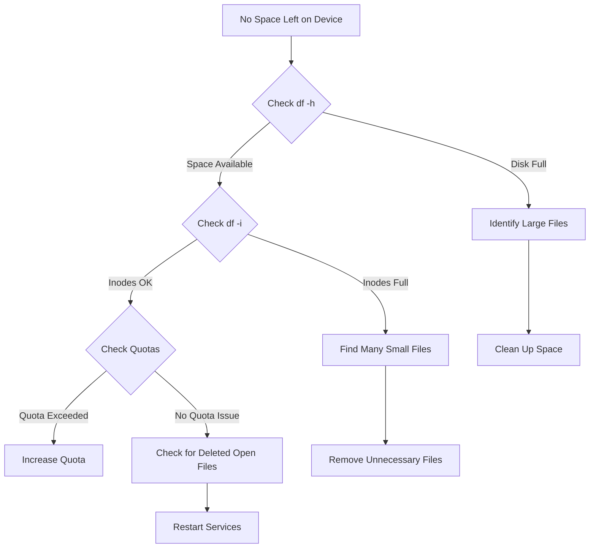
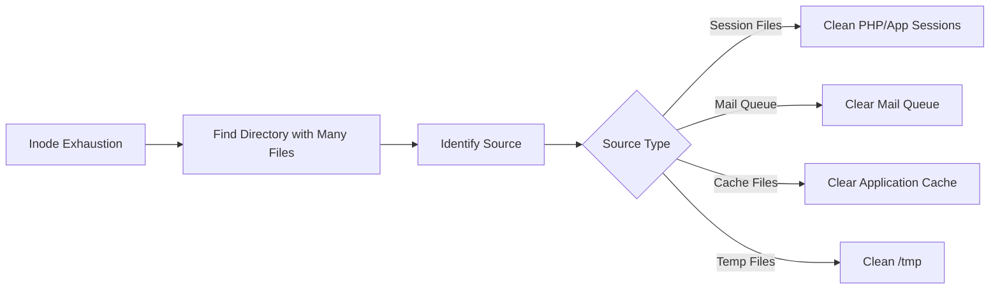
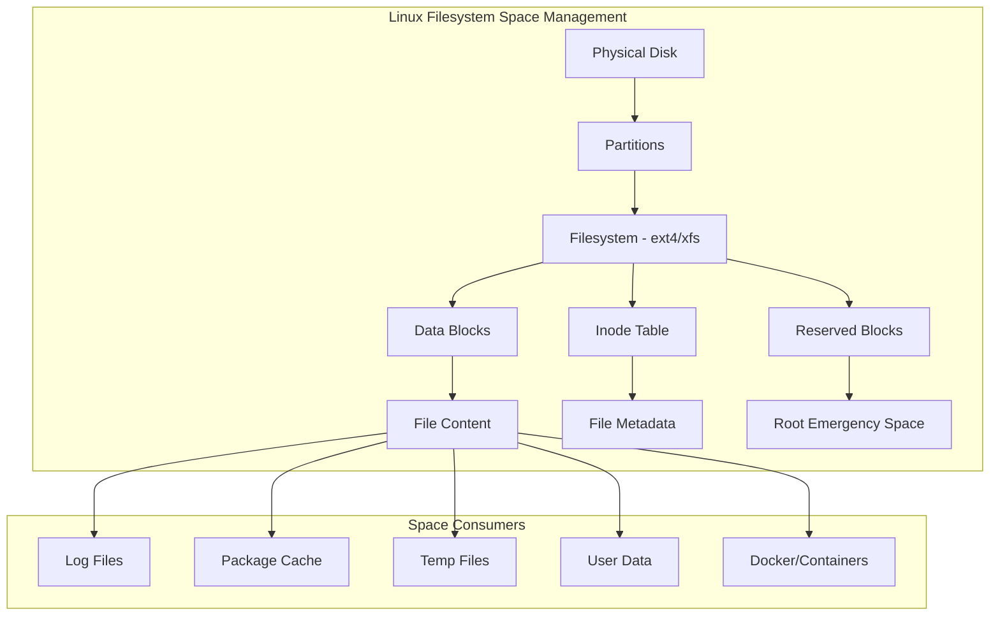

# How to Fix "No Space Left on Device" Errors

Author: [nawazdhandala](https://github.com/nawazdhandala)

Tags: Linux, System Administration, Troubleshooting, Disk Management, DevOps

Description: Learn how to diagnose and fix "No space left on device" errors in Linux, including identifying space hogs, cleaning up disk space, and preventing future issues.

---

The dreaded "No space left on device" error can bring your Linux system to its knees. Services fail to start, logs stop writing, databases crash, and deployments fail. Understanding what causes this error and how to quickly resolve it is essential for any system administrator.

## Understanding the Error

The "No space left on device" error (ENOSPC) occurs when:

1. The filesystem has no more available blocks for data
2. The filesystem has run out of inodes (even with free space)
3. A disk quota has been exceeded
4. The /boot partition is full (common with kernel updates)



## Quick Diagnosis

### Step 1: Check Disk Space Usage

```bash
# Show disk space usage for all mounted filesystems
# -h flag makes output human-readable (KB, MB, GB)
df -h

# Example output:
# Filesystem      Size  Used Avail Use% Mounted on
# /dev/sda1       100G   95G  5.0G  95% /
# /dev/sda2       500G  450G   50G  90% /data
```

### Step 2: Check Inode Usage

```bash
# Show inode usage for all filesystems
# Inodes track file metadata - you can run out even with free space
df -i

# Example output:
# Filesystem      Inodes   IUsed   IFree IUse% Mounted on
# /dev/sda1      6553600 6553600       0  100% /
```

### Step 3: Check for Deleted but Open Files

```bash
# List deleted files still held open by processes
# These files consume space but don't appear in du/find
lsof +L1 2>/dev/null | head -20

# Show total space held by deleted files
lsof +L1 2>/dev/null | awk '{sum += $7} END {print sum/1024/1024 " MB"}'
```

## Finding What's Using Space

### Using du to Find Large Directories

```bash
# Find the largest directories in root filesystem
# Sort by size and show top 20
du -h --max-depth=1 / 2>/dev/null | sort -hr | head -20

# Find largest directories in /var (common culprit)
du -h --max-depth=2 /var 2>/dev/null | sort -hr | head -20

# Find large files over 100MB
find / -type f -size +100M -exec ls -lh {} \; 2>/dev/null | sort -k5 -hr | head -20
```

### Interactive Disk Usage with ncdu

```bash
# Install ncdu for interactive disk analysis
# Debian/Ubuntu
apt-get install ncdu

# RHEL/CentOS
yum install ncdu

# Run ncdu on root filesystem
ncdu /

# ncdu provides an interactive interface to browse directories
# and delete files directly
```

## Common Space Hogs and Solutions

### 1. Log Files

```bash
# Check log directory size
du -sh /var/log

# Find largest log files
find /var/log -type f -name "*.log" -exec ls -lh {} \; | sort -k5 -hr | head -10

# Truncate large log files without stopping services
# This preserves the file handle for running processes
truncate -s 0 /var/log/large-application.log

# Or use the safer method with cat
cat /dev/null > /var/log/large-application.log

# Remove old rotated logs
find /var/log -name "*.gz" -mtime +30 -delete
find /var/log -name "*.log.[0-9]*" -mtime +7 -delete
```

### 2. Package Manager Cache

```bash
# Debian/Ubuntu - Clean apt cache
apt-get clean
apt-get autoclean
apt-get autoremove

# Check cache size before cleaning
du -sh /var/cache/apt/archives

# RHEL/CentOS - Clean yum cache
yum clean all
rm -rf /var/cache/yum/*

# Check yum cache size
du -sh /var/cache/yum
```

### 3. Old Kernel Images

```bash
# List installed kernels (Debian/Ubuntu)
dpkg --list | grep linux-image

# Remove old kernels, keeping current and one previous
# First, check current kernel
uname -r

# Remove specific old kernel
apt-get remove --purge linux-image-5.4.0-old-version

# Automatic cleanup of old kernels
apt-get autoremove --purge

# RHEL/CentOS - List and remove old kernels
rpm -q kernel
package-cleanup --oldkernels --count=2
```

### 4. Docker Images and Containers

```bash
# Check Docker disk usage
docker system df

# Remove unused containers, networks, images, and build cache
docker system prune -a

# Remove dangling images only
docker image prune

# Remove stopped containers
docker container prune

# Remove unused volumes (be careful - this deletes data)
docker volume prune

# Remove everything including volumes
docker system prune -a --volumes
```

### 5. Journal Logs (systemd)

```bash
# Check journal size
journalctl --disk-usage

# Retain only last 7 days of logs
journalctl --vacuum-time=7d

# Retain only 500MB of logs
journalctl --vacuum-size=500M

# Configure permanent size limit in /etc/systemd/journald.conf
# Add or modify:
# SystemMaxUse=500M
# SystemKeepFree=1G

# Restart journald to apply changes
systemctl restart systemd-journald
```

## Handling Inode Exhaustion

When you have free space but cannot create files, you likely have an inode problem.



### Find Directories with Many Files

```bash
# Count files per directory, sorted by count
# This helps identify directories with millions of small files
find / -xdev -type d -exec sh -c 'echo "$(find "$1" -maxdepth 1 -type f | wc -l) $1"' _ {} \; 2>/dev/null | sort -rn | head -20

# Faster alternative using for loop
for dir in /var /tmp /home; do
    echo "=== $dir ==="
    find "$dir" -xdev -type f 2>/dev/null | wc -l
done
```

### Common Inode Hogs

```bash
# PHP session files
find /var/lib/php/sessions -type f -mtime +1 -delete

# Mail queue (Postfix)
postsuper -d ALL

# Systemd service files (if using containers)
find /run/systemd/transient -type f -delete

# Temporary files
find /tmp -type f -mtime +7 -delete
find /var/tmp -type f -mtime +30 -delete
```

## Emergency Space Recovery

When your system is completely out of space and you cannot even log in properly:

### Method 1: Boot into Single User Mode

```bash
# Reboot and edit GRUB
# Add 'single' or 'init=/bin/bash' to kernel parameters

# Once in single user mode, clean up
rm -rf /var/log/*.gz
rm -rf /tmp/*
journalctl --vacuum-size=100M
```

### Method 2: Use Reserved Blocks

```bash
# ext4 reserves 5% of space for root by default
# Reduce to 1% to free space (use cautiously)
tune2fs -m 1 /dev/sda1

# Check current reserved percentage
tune2fs -l /dev/sda1 | grep "Reserved block count"
```

### Method 3: Mount Filesystem from Another System

```bash
# Boot from live USB or rescue mode
# Mount the full filesystem
mount /dev/sda1 /mnt

# Clean up from outside
rm -rf /mnt/var/log/*.gz
rm -rf /mnt/tmp/*
```

## Preventing Future Issues

### 1. Set Up Monitoring Alerts

```bash
# Simple disk space check script
# Save as /usr/local/bin/check-disk-space.sh

#!/bin/bash
THRESHOLD=80
ALERT_EMAIL="admin@example.com"

df -H | grep -vE '^Filesystem|tmpfs|cdrom' | awk '{ print $5 " " $1 }' | while read output; do
    usage=$(echo "$output" | awk '{ print $1}' | cut -d'%' -f1)
    partition=$(echo "$output" | awk '{ print $2 }')

    if [ "$usage" -ge "$THRESHOLD" ]; then
        echo "WARNING: $partition is ${usage}% full" | mail -s "Disk Space Alert" "$ALERT_EMAIL"
    fi
done

# Add to crontab to run every hour
# 0 * * * * /usr/local/bin/check-disk-space.sh
```

### 2. Configure Log Rotation

```bash
# Create custom logrotate configuration
# Save as /etc/logrotate.d/custom-app

/var/log/myapp/*.log {
    daily
    rotate 7
    compress
    delaycompress
    missingok
    notifempty
    create 0640 www-data www-data
    sharedscripts
    postrotate
        systemctl reload myapp > /dev/null 2>&1 || true
    endscript
}

# Test configuration
logrotate -d /etc/logrotate.d/custom-app

# Force rotation
logrotate -f /etc/logrotate.d/custom-app
```

### 3. Set Up Automatic Cleanup

```bash
# Create systemd timer for cleanup
# Save as /etc/systemd/system/disk-cleanup.service

[Unit]
Description=Disk Cleanup Service

[Service]
Type=oneshot
ExecStart=/usr/local/bin/disk-cleanup.sh

# Create timer
# Save as /etc/systemd/system/disk-cleanup.timer

[Unit]
Description=Run disk cleanup daily

[Timer]
OnCalendar=daily
Persistent=true

[Install]
WantedBy=timers.target

# Enable timer
systemctl enable --now disk-cleanup.timer
```

### 4. Cleanup Script

```bash
#!/bin/bash
# Save as /usr/local/bin/disk-cleanup.sh

# Clean package cache
apt-get clean 2>/dev/null || yum clean all 2>/dev/null

# Clean old logs
find /var/log -name "*.gz" -mtime +30 -delete
find /var/log -name "*.log.[0-9]*" -mtime +14 -delete

# Clean temporary files
find /tmp -type f -mtime +7 -delete
find /var/tmp -type f -mtime +30 -delete

# Clean old journal logs
journalctl --vacuum-time=14d

# Clean Docker (if installed)
if command -v docker &> /dev/null; then
    docker system prune -f --filter "until=168h"
fi

# Report current usage
echo "Disk cleanup completed at $(date)"
df -h
```

## Disk Space Architecture



## Quick Reference Commands

| Task | Command |
|------|---------|
| Check disk space | `df -h` |
| Check inodes | `df -i` |
| Find large files | `find / -size +100M -type f` |
| Find large directories | `du -h --max-depth=1 / \| sort -hr` |
| Check deleted open files | `lsof +L1` |
| Truncate log file | `truncate -s 0 /path/to/file.log` |
| Clean apt cache | `apt-get clean` |
| Clean journal | `journalctl --vacuum-time=7d` |
| Docker cleanup | `docker system prune -a` |

## Conclusion

The "No space left on device" error is common but manageable. The key is to quickly identify whether you are dealing with actual disk space exhaustion, inode exhaustion, or deleted files held open by processes. Regular monitoring, automated cleanup, and proper log rotation will prevent most occurrences. When the error does occur, having a systematic approach to diagnosis and recovery will minimize downtime and data loss.
