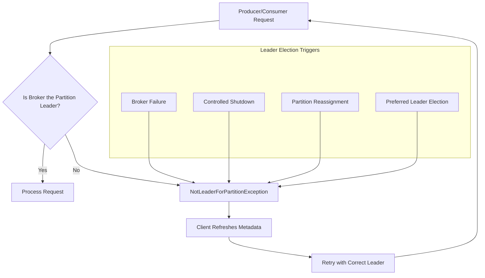

# How to Fix 'NotLeaderForPartitionException' in Kafka

Author: [nawazdhandala](https://www.github.com/nawazdhandala)

Tags: Kafka, Apache Kafka, Troubleshooting, Distributed Systems, Message Queue, Java, Producer, Consumer

Description: A comprehensive guide to diagnosing and fixing NotLeaderForPartitionException in Apache Kafka, including causes, solutions, and best practices for robust producer and consumer configurations.

---

> The `NotLeaderForPartitionException` is one of the most common errors encountered when working with Apache Kafka. This exception occurs when a producer or consumer tries to communicate with a broker that is no longer the leader for a specific partition. Understanding why this happens and how to handle it properly is essential for building resilient Kafka applications.

This guide covers the root causes of this exception, immediate fixes, and long-term strategies to prevent it from disrupting your applications.

---

## Understanding the Exception



The `NotLeaderForPartitionException` indicates that:
1. The client sent a request to a broker
2. That broker is not the current leader for the target partition
3. Leadership has moved to a different broker

---

## Common Causes

### 1. Broker Failover

When a broker goes down, Kafka elects a new leader for affected partitions.

### 2. Stale Metadata Cache

Clients cache partition leader information. When this cache becomes stale, requests go to the wrong broker.

### 3. Network Partitions

Temporary network issues can cause the client to lose connectivity with the actual leader.

### 4. Rolling Restarts

During rolling broker restarts for maintenance or upgrades, partition leadership moves between brokers.

---

## Solution: Configure Proper Retries in Producer

```java
import org.apache.kafka.clients.producer.KafkaProducer;
import org.apache.kafka.clients.producer.ProducerConfig;
import org.apache.kafka.clients.producer.ProducerRecord;
import org.apache.kafka.common.serialization.StringSerializer;

import java.util.Properties;

public class ResilientKafkaProducer {

    public static KafkaProducer<String, String> createProducer() {
        Properties props = new Properties();

        // Bootstrap servers for initial connection
        props.put(ProducerConfig.BOOTSTRAP_SERVERS_CONFIG,
                  "kafka1:9092,kafka2:9092,kafka3:9092");

        // Serializers
        props.put(ProducerConfig.KEY_SERIALIZER_CLASS_CONFIG,
                  StringSerializer.class.getName());
        props.put(ProducerConfig.VALUE_SERIALIZER_CLASS_CONFIG,
                  StringSerializer.class.getName());

        // CRITICAL: Retry configuration for handling NotLeaderForPartitionException
        // Number of retries before giving up
        props.put(ProducerConfig.RETRIES_CONFIG, 3);

        // Time to wait before retrying (allows metadata refresh)
        props.put(ProducerConfig.RETRY_BACKOFF_MS_CONFIG, 100);

        // Maximum time to block waiting for metadata
        props.put(ProducerConfig.MAX_BLOCK_MS_CONFIG, 60000);

        // How long to wait before refreshing metadata
        props.put(ProducerConfig.METADATA_MAX_AGE_CONFIG, 30000);

        // Delivery timeout must be greater than request timeout + linger time
        props.put(ProducerConfig.DELIVERY_TIMEOUT_MS_CONFIG, 120000);

        // Request timeout for individual requests
        props.put(ProducerConfig.REQUEST_TIMEOUT_MS_CONFIG, 30000);

        return new KafkaProducer<>(props);
    }
}
```

---

## Solution: Configure Consumer with Proper Error Handling

```java
import org.apache.kafka.clients.consumer.ConsumerConfig;
import org.apache.kafka.clients.consumer.ConsumerRecords;
import org.apache.kafka.clients.consumer.KafkaConsumer;
import org.apache.kafka.common.serialization.StringDeserializer;

import java.time.Duration;
import java.util.Collections;
import java.util.Properties;

public class ResilientKafkaConsumer {

    public static KafkaConsumer<String, String> createConsumer() {
        Properties props = new Properties();

        // Bootstrap servers
        props.put(ConsumerConfig.BOOTSTRAP_SERVERS_CONFIG,
                  "kafka1:9092,kafka2:9092,kafka3:9092");

        // Consumer group
        props.put(ConsumerConfig.GROUP_ID_CONFIG, "my-consumer-group");

        // Deserializers
        props.put(ConsumerConfig.KEY_DESERIALIZER_CLASS_CONFIG,
                  StringDeserializer.class.getName());
        props.put(ConsumerConfig.VALUE_DESERIALIZER_CLASS_CONFIG,
                  StringDeserializer.class.getName());

        // CRITICAL: Metadata refresh configuration
        props.put(ConsumerConfig.METADATA_MAX_AGE_CONFIG, 30000);

        // Session timeout for consumer group membership
        props.put(ConsumerConfig.SESSION_TIMEOUT_MS_CONFIG, 45000);

        // Heartbeat interval (should be 1/3 of session timeout)
        props.put(ConsumerConfig.HEARTBEAT_INTERVAL_MS_CONFIG, 15000);

        return new KafkaConsumer<>(props);
    }
}
```

---

## Best Practices Summary

1. **Always configure retries** - Set `retries` to at least 3 with appropriate backoff
2. **Use idempotent producers** - Enable `enable.idempotence=true` to prevent duplicates during retries
3. **Monitor leadership changes** - Track partition leadership metrics in your monitoring system
4. **Set appropriate timeouts** - Balance between fast failure detection and avoiding false positives
5. **Use multiple bootstrap servers** - Always specify multiple brokers for failover
6. **Keep metadata fresh** - Set `metadata.max.age.ms` appropriately for your use case

---

## Conclusion

The `NotLeaderForPartitionException` is a normal part of Kafka operations during broker failovers, rolling restarts, and partition rebalancing. The key to handling it properly is configuring your producers and consumers with appropriate retry logic and metadata refresh intervals.

---

*Need to monitor your Kafka clusters for leader elections and partition issues? [OneUptime](https://oneuptime.com) provides comprehensive monitoring for Apache Kafka, including broker health, partition metrics, and consumer lag tracking.*
