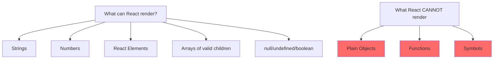
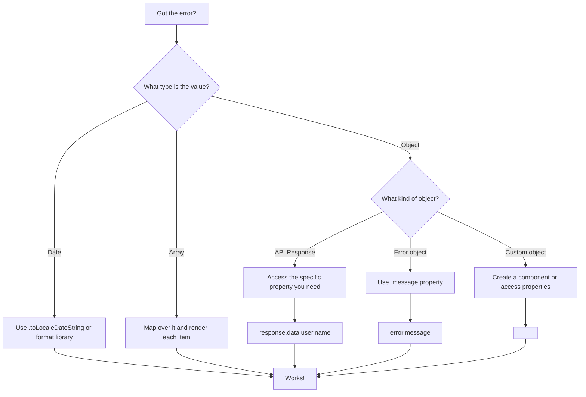

# How to Fix 'Objects Are Not Valid as React Child'

Author: [nawazdhandala](https://github.com/nawazdhandala)

Tags: React, JavaScript, Debugging, Frontend, Troubleshooting

Description: A practical guide to understanding and fixing the 'Objects are not valid as a React child' error in React applications.

---

The error "Objects are not valid as a React child (found: object with keys {...}). If you meant to render a collection of children, use an array instead" is a common React error that occurs when you try to render a plain JavaScript object directly in JSX. This guide explains why it happens and how to fix it.

## Understanding the Error

React can only render certain types as children:



## Common Causes and Solutions

### 1. Rendering an Object Directly

The most common cause is trying to render an object directly:

```javascript
// WRONG - Rendering an object directly
function UserProfile({ user }) {
  return (
    <div>
      {/* This will throw the error! */}
      <p>User: {user}</p>
    </div>
  );
}

// Where user is:
const user = { name: 'John', email: 'john@example.com' };

// CORRECT - Access specific properties
function UserProfile({ user }) {
  return (
    <div>
      <p>Name: {user.name}</p>
      <p>Email: {user.email}</p>
    </div>
  );
}

// Or convert to string if needed
function UserProfile({ user }) {
  return (
    <div>
      <p>User: {JSON.stringify(user)}</p>
    </div>
  );
}
```

### 2. Rendering Date Objects

Date objects are common culprits:

```javascript
// WRONG - Date is an object
function EventCard({ event }) {
  return (
    <div>
      <h2>{event.title}</h2>
      {/* This throws the error! */}
      <p>Date: {event.date}</p>
    </div>
  );
}

// CORRECT - Convert Date to string
function EventCard({ event }) {
  return (
    <div>
      <h2>{event.title}</h2>
      <p>Date: {event.date.toLocaleDateString()}</p>
      {/* Or use toISOString(), toDateString(), etc. */}
    </div>
  );
}

// Using a date formatting library (date-fns)
import { format } from 'date-fns';

function EventCard({ event }) {
  return (
    <div>
      <h2>{event.title}</h2>
      <p>Date: {format(event.date, 'MMMM d, yyyy')}</p>
    </div>
  );
}
```

### 3. API Response Objects

API responses often contain nested objects:

```javascript
// API response structure
const apiResponse = {
  data: {
    user: {
      id: 1,
      profile: {
        name: 'John',
        avatar: { url: '/avatar.png', size: 'large' }
      }
    }
  }
};

// WRONG - Rendering nested objects
function UserAvatar({ response }) {
  return (
    <div>
      {/* Error: avatar is an object */}
      
    </div>
  );
}

// CORRECT - Access the specific property
function UserAvatar({ response }) {
  return (
    <div>
      
    </div>
  );
}

// With optional chaining for safety
function UserAvatar({ response }) {
  return (
    <div>
      
    </div>
  );
}
```

### 4. State Containing Objects

Accidentally rendering state objects:

```javascript
// WRONG
function Counter() {
  const [count, setCount] = useState({ value: 0, lastUpdated: new Date() });

  return (
    <div>
      {/* Error: count is an object */}
      <p>Count: {count}</p>
    </div>
  );
}

// CORRECT
function Counter() {
  const [count, setCount] = useState({ value: 0, lastUpdated: new Date() });

  return (
    <div>
      <p>Count: {count.value}</p>
      <p>Last updated: {count.lastUpdated.toLocaleString()}</p>
    </div>
  );
}

// Better approach: separate state
function Counter() {
  const [count, setCount] = useState(0);
  const [lastUpdated, setLastUpdated] = useState(new Date());

  return (
    <div>
      <p>Count: {count}</p>
      <p>Last updated: {lastUpdated.toLocaleString()}</p>
    </div>
  );
}
```

### 5. Rendering Arrays of Objects

Mapping over arrays but not extracting values:

```javascript
const items = [
  { id: 1, name: 'Apple', price: 1.00 },
  { id: 2, name: 'Banana', price: 0.50 },
  { id: 3, name: 'Orange', price: 0.75 }
];

// WRONG - Rendering the object directly
function ItemList({ items }) {
  return (
    <ul>
      {items.map(item => (
        <li key={item.id}>
          {/* Error: item is an object */}
          {item}
        </li>
      ))}
    </ul>
  );
}

// CORRECT - Access specific properties
function ItemList({ items }) {
  return (
    <ul>
      {items.map(item => (
        <li key={item.id}>
          {item.name} - ${item.price.toFixed(2)}
        </li>
      ))}
    </ul>
  );
}

// Or create a component for the item
function ItemList({ items }) {
  return (
    <ul>
      {items.map(item => (
        <ItemRow key={item.id} item={item} />
      ))}
    </ul>
  );
}

function ItemRow({ item }) {
  return (
    <li>
      <span className="name">{item.name}</span>
      <span className="price">${item.price.toFixed(2)}</span>
    </li>
  );
}
```

### 6. Conditional Rendering with Objects

Falsy checks that return objects:

```javascript
// WRONG - This can return an object
function UserStatus({ user }) {
  return (
    <div>
      {/* If user exists, this renders the user object! */}
      {user && user}
    </div>
  );
}

// CORRECT
function UserStatus({ user }) {
  return (
    <div>
      {user && <span>{user.name} is online</span>}
    </div>
  );
}

// Using ternary for explicit control
function UserStatus({ user }) {
  return (
    <div>
      {user ? (
        <span>{user.name} is online</span>
      ) : (
        <span>No user logged in</span>
      )}
    </div>
  );
}
```

### 7. Error Objects

Rendering error objects from try-catch:

```javascript
// WRONG
function ErrorDisplay({ error }) {
  return (
    <div className="error">
      {/* Error object is not renderable */}
      {error}
    </div>
  );
}

// CORRECT
function ErrorDisplay({ error }) {
  return (
    <div className="error">
      <p className="error-message">{error.message}</p>
      {process.env.NODE_ENV === 'development' && (
        <pre className="error-stack">{error.stack}</pre>
      )}
    </div>
  );
}

// With error boundary pattern
function SafeErrorDisplay({ error }) {
  if (!error) return null;

  // Handle different error types
  const message = typeof error === 'string'
    ? error
    : error.message || 'An unknown error occurred';

  return (
    <div className="error">
      <p>{message}</p>
    </div>
  );
}
```

## Debugging Techniques

### Debug Wrapper Component

Create a component to help identify problematic data:

```javascript
// DebugRenderer.js
function DebugRenderer({ value, label = 'Value' }) {
  const type = typeof value;
  const isArray = Array.isArray(value);
  const isNull = value === null;
  const isUndefined = value === undefined;

  console.log(`[DebugRenderer] ${label}:`, {
    value,
    type,
    isArray,
    isNull,
    isUndefined,
    isObject: type === 'object' && !isArray && !isNull
  });

  // Safe rendering based on type
  if (isNull) return <span>[null]</span>;
  if (isUndefined) return <span>[undefined]</span>;
  if (type === 'string' || type === 'number') return <span>{value}</span>;
  if (type === 'boolean') return <span>{value.toString()}</span>;
  if (isArray) return <span>[Array: {value.length} items]</span>;
  if (type === 'object') {
    return (
      <pre style={{
        background: '#f0f0f0',
        padding: '10px',
        fontSize: '12px'
      }}>
        {JSON.stringify(value, null, 2)}
      </pre>
    );
  }
  if (type === 'function') return <span>[Function: {value.name || 'anonymous'}]</span>;

  return <span>[Unknown type: {type}]</span>;
}

// Usage
function MyComponent({ data }) {
  return (
    <div>
      <h2>Debug Output:</h2>
      <DebugRenderer value={data} label="data prop" />
    </div>
  );
}
```

### Type Checking with PropTypes or TypeScript

Catch issues early with type checking:

```javascript
// With PropTypes
import PropTypes from 'prop-types';

function UserCard({ user }) {
  return (
    <div>
      <h2>{user.name}</h2>
      <p>{user.email}</p>
    </div>
  );
}

UserCard.propTypes = {
  user: PropTypes.shape({
    name: PropTypes.string.isRequired,
    email: PropTypes.string.isRequired
  }).isRequired
};
```

```typescript
// With TypeScript
interface User {
  id: number;
  name: string;
  email: string;
  createdAt: Date;
}

interface UserCardProps {
  user: User;
}

function UserCard({ user }: UserCardProps) {
  return (
    <div>
      <h2>{user.name}</h2>
      <p>{user.email}</p>
      {/* TypeScript will catch: user.createdAt is Date, not string */}
      <p>Member since: {user.createdAt.toLocaleDateString()}</p>
    </div>
  );
}
```

## Common Patterns for Safe Rendering

### Safe Render Utility

```javascript
// safeRender.js
export function safeRender(value, fallback = '') {
  if (value === null || value === undefined) {
    return fallback;
  }

  if (typeof value === 'string' || typeof value === 'number') {
    return value;
  }

  if (typeof value === 'boolean') {
    return value.toString();
  }

  if (value instanceof Date) {
    return value.toLocaleString();
  }

  if (Array.isArray(value)) {
    return value.join(', ');
  }

  if (typeof value === 'object') {
    // Attempt to get a displayable property
    if (value.name) return value.name;
    if (value.title) return value.title;
    if (value.label) return value.label;
    if (value.value !== undefined) return safeRender(value.value, fallback);

    // Last resort: stringify
    return JSON.stringify(value);
  }

  return fallback;
}

// Usage
function DataDisplay({ data }) {
  return (
    <div>
      <p>Name: {safeRender(data.name, 'N/A')}</p>
      <p>Details: {safeRender(data.details, 'No details')}</p>
    </div>
  );
}
```

### Object Display Component

```javascript
// ObjectDisplay.js
function ObjectDisplay({ obj, depth = 0, maxDepth = 3 }) {
  if (depth > maxDepth) {
    return <span className="truncated">[Object]</span>;
  }

  if (obj === null) return <span className="null">null</span>;
  if (obj === undefined) return <span className="undefined">undefined</span>;

  const type = typeof obj;

  if (type === 'string') return <span className="string">"{obj}"</span>;
  if (type === 'number') return <span className="number">{obj}</span>;
  if (type === 'boolean') return <span className="boolean">{obj.toString()}</span>;

  if (obj instanceof Date) {
    return <span className="date">{obj.toISOString()}</span>;
  }

  if (Array.isArray(obj)) {
    return (
      <ul className="array">
        {obj.map((item, index) => (
          <li key={index}>
            <ObjectDisplay obj={item} depth={depth + 1} maxDepth={maxDepth} />
          </li>
        ))}
      </ul>
    );
  }

  if (type === 'object') {
    return (
      <dl className="object">
        {Object.entries(obj).map(([key, value]) => (
          <div key={key}>
            <dt>{key}:</dt>
            <dd>
              <ObjectDisplay obj={value} depth={depth + 1} maxDepth={maxDepth} />
            </dd>
          </div>
        ))}
      </dl>
    );
  }

  return <span className="unknown">[{type}]</span>;
}

// Usage for debugging
function DebugPanel({ data }) {
  return (
    <div className="debug-panel">
      <h3>Data Structure:</h3>
      <ObjectDisplay obj={data} />
    </div>
  );
}
```

## Decision Flowchart



## Summary

The "Objects are not valid as a React child" error occurs when you try to render a JavaScript object directly in JSX. To fix it:

1. Access specific properties instead of rendering the whole object
2. Convert Date objects to strings using toLocaleDateString(), toISOString(), or a formatting library
3. Map over arrays properly, extracting the values you want to display
4. Check conditional renders to ensure they do not return objects
5. Use TypeScript or PropTypes to catch these issues at development time
6. Create safe render utilities for complex data structures

Remember: React can render strings, numbers, React elements, and arrays of these types - but never plain objects.
