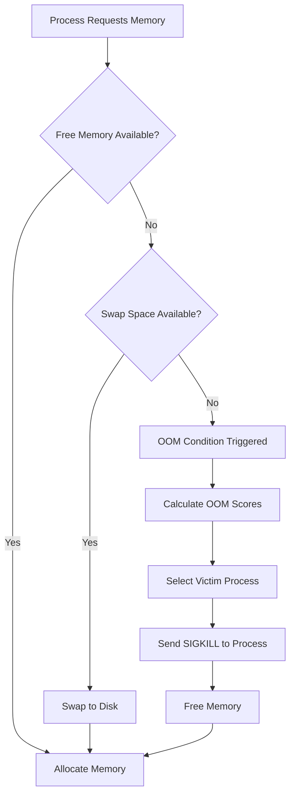
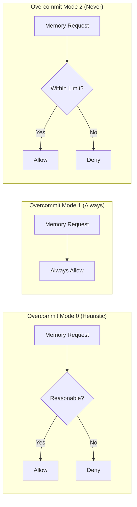
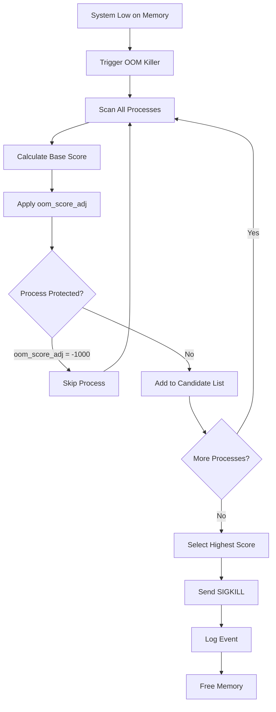

# How to Fix 'OOM Killer' Memory Issues

Author: [nawazdhandala](https://www.github.com/nawazdhandala)

Tags: Linux, Memory Management, OOM Killer, System Administration, Performance, Troubleshooting

Description: Learn how to diagnose, fix, and prevent Linux OOM Killer issues that terminate processes due to memory exhaustion.

---

The Out-Of-Memory (OOM) Killer is a Linux kernel mechanism that terminates processes when the system runs critically low on memory. While it prevents complete system crashes, it often kills important processes unexpectedly. This guide shows you how to understand, diagnose, and prevent OOM Killer issues.

## Understanding the OOM Killer

When Linux runs out of physical memory and swap space, the kernel must make a difficult choice: crash the entire system or kill selected processes to free memory. The OOM Killer chooses the latter.



### How OOM Killer Selects Victims

The kernel calculates an "OOM score" for each process based on:

- Memory consumption (higher memory = higher score)
- Process age (newer processes score higher)
- Process priority (nice value affects score)
- Root processes score lower
- User-defined adjustments (oom_score_adj)

## Detecting OOM Killer Events

### Check System Logs

```bash
# Search for OOM killer messages in system log
dmesg | grep -i "oom"

# Check kernel ring buffer for recent OOM events
dmesg -T | grep -i "killed process"

# Search journald (systemd systems)
journalctl -k | grep -i "oom"

# Check traditional syslog
grep -i "oom" /var/log/syslog
grep -i "oom" /var/log/messages
```

### Typical OOM Killer Log Output

```text
[Fri Jan 24 10:15:32 2026] Out of memory: Killed process 12345 (java)
total-vm:8192000kB, anon-rss:4096000kB, file-rss:0kB, shmem-rss:0kB
[Fri Jan 24 10:15:32 2026] oom_reaper: reaped process 12345 (java),
now anon-rss:0kB, file-rss:0kB, shmem-rss:0kB
```

### Check Current OOM Scores

```bash
# View OOM score for a specific process
cat /proc/<PID>/oom_score

# View all processes with their OOM scores (sorted by score)
ps -eo pid,ppid,cmd,%mem,%cpu --sort=-%mem | head -20

# Create a script to show OOM scores for all processes
for proc in /proc/[0-9]*; do
    pid=$(basename "$proc")
    score=$(cat "$proc/oom_score" 2>/dev/null)
    name=$(cat "$proc/comm" 2>/dev/null)
    if [ -n "$score" ] && [ "$score" -gt 0 ]; then
        echo "$score $pid $name"
    fi
done | sort -rn | head -20
```

## Protecting Critical Processes

### Adjust OOM Score

The `oom_score_adj` value ranges from -1000 (never kill) to +1000 (kill first).

```bash
# Protect a critical process (requires root)
# -1000 makes the process immune to OOM killer
echo -1000 > /proc/<PID>/oom_score_adj

# Make a process more likely to be killed
echo 500 > /proc/<PID>/oom_score_adj

# Check current adjustment value
cat /proc/<PID>/oom_score_adj
```

### Protect Services with systemd

```ini
# /etc/systemd/system/myservice.service.d/oom.conf
[Service]
# Protect service from OOM killer (-1000 to 1000)
OOMScoreAdjust=-500

# Alternative: disable OOM killing entirely for this service
OOMPolicy=continue
```

Apply the configuration:

```bash
# Reload systemd and restart service
systemctl daemon-reload
systemctl restart myservice
```

### Protect Database Processes

```bash
# Find MySQL/MariaDB PID and protect it
MYSQL_PID=$(pgrep -x mysqld)
echo -500 > /proc/$MYSQL_PID/oom_score_adj

# For PostgreSQL
POSTGRES_PID=$(pgrep -x postgres | head -1)
echo -500 > /proc/$POSTGRES_PID/oom_score_adj
```

## Kernel Memory Management Tuning

### Configure Overcommit Behavior

```bash
# Check current overcommit settings
cat /proc/sys/vm/overcommit_memory
cat /proc/sys/vm/overcommit_ratio

# vm.overcommit_memory values:
# 0 = Heuristic overcommit (default)
# 1 = Always overcommit (never refuse)
# 2 = Don't overcommit (strict accounting)
```



### Set Overcommit for Production Servers

```bash
# For database servers - disable overcommit
# This prevents OOM but may cause allocation failures
echo 2 > /proc/sys/vm/overcommit_memory
echo 80 > /proc/sys/vm/overcommit_ratio

# Make permanent in /etc/sysctl.conf
cat >> /etc/sysctl.conf << EOF
# Disable memory overcommit
vm.overcommit_memory = 2
vm.overcommit_ratio = 80
EOF

# Apply changes
sysctl -p
```

### Configure Swappiness

```bash
# Check current swappiness (0-100)
cat /proc/sys/vm/swappiness

# For servers with enough RAM, reduce swappiness
# Lower value = less swap usage
echo 10 > /proc/sys/vm/swappiness

# Make permanent
echo "vm.swappiness = 10" >> /etc/sysctl.conf
sysctl -p
```

## Adding and Managing Swap Space

### Check Current Swap

```bash
# View swap usage
free -h
swapon --show

# Detailed swap info
cat /proc/swaps
```

### Create Swap File

```bash
# Create a 4GB swap file
sudo fallocate -l 4G /swapfile

# If fallocate fails, use dd instead
sudo dd if=/dev/zero of=/swapfile bs=1G count=4

# Set proper permissions
sudo chmod 600 /swapfile

# Format as swap
sudo mkswap /swapfile

# Enable swap
sudo swapon /swapfile

# Verify
swapon --show
```

### Make Swap Permanent

```bash
# Add to /etc/fstab
echo '/swapfile none swap sw 0 0' | sudo tee -a /etc/fstab

# Verify fstab entry
cat /etc/fstab | grep swap
```

### Remove Old Swap

```bash
# Disable swap file
sudo swapoff /swapfile

# Remove from fstab
sudo sed -i '/swapfile/d' /etc/fstab

# Delete file
sudo rm /swapfile
```

## Memory Monitoring and Alerting

### Monitor Memory Usage

```bash
# Real-time memory monitoring
watch -n 1 'free -h && echo && vmstat 1 1'

# Memory usage by process
ps aux --sort=-%mem | head -20

# Detailed memory breakdown
cat /proc/meminfo

# Memory usage over time (requires sysstat)
sar -r 1 10
```

### Create Memory Alert Script

```bash
#!/bin/bash
# /usr/local/bin/memory-alert.sh
# Sends alert when memory usage exceeds threshold

THRESHOLD=90  # Percentage
MAILTO="admin@example.com"

# Calculate memory usage percentage
MEMORY_USED=$(free | awk '/^Mem:/ {printf "%.0f", $3/$2 * 100}')

if [ "$MEMORY_USED" -gt "$THRESHOLD" ]; then
    # Get top memory consumers
    TOP_PROCS=$(ps aux --sort=-%mem | head -6)

    # Send alert
    echo "Memory usage is at ${MEMORY_USED}% on $(hostname)

Top memory consumers:
$TOP_PROCS" | mail -s "Memory Alert: $(hostname)" "$MAILTO"

    # Log the event
    logger -t memory-alert "Memory usage at ${MEMORY_USED}%"
fi
```

### Set Up Cron Job

```bash
# Run memory check every 5 minutes
echo "*/5 * * * * root /usr/local/bin/memory-alert.sh" >> /etc/crontab
```

## Identifying Memory Leaks

### Monitor Process Memory Over Time

```bash
#!/bin/bash
# /usr/local/bin/track-memory.sh
# Track memory usage of a specific process

PROCESS_NAME="$1"
LOG_FILE="/var/log/memory-tracking-${PROCESS_NAME}.log"

while true; do
    TIMESTAMP=$(date '+%Y-%m-%d %H:%M:%S')
    MEM_INFO=$(ps aux | grep "$PROCESS_NAME" | grep -v grep | \
               awk '{print "PID:"$2" RSS:"$6"KB VSZ:"$5"KB MEM%:"$4}')

    if [ -n "$MEM_INFO" ]; then
        echo "$TIMESTAMP $MEM_INFO" >> "$LOG_FILE"
    fi

    sleep 60
done
```

### Analyze Memory Growth

```bash
# Check for memory growth patterns
awk '{print $1, $2, $4}' /var/log/memory-tracking-java.log | \
    tail -100 | \
    awk -F'RSS:' '{print $1, $2}' | \
    awk -F'KB' '{print $1}'
```

## Application-Specific Fixes

### Java Applications

```bash
# Set explicit heap limits for Java
# -Xmx sets maximum heap size
# -Xms sets initial heap size
java -Xms512m -Xmx2g -jar application.jar

# Use container-aware settings (Java 10+)
java -XX:+UseContainerSupport \
     -XX:MaxRAMPercentage=75.0 \
     -jar application.jar
```

### Node.js Applications

```bash
# Increase Node.js heap size (default is ~1.5GB)
node --max-old-space-size=4096 app.js

# Monitor Node.js memory
node --expose-gc app.js
```

### Database Tuning

```ini
# MySQL/MariaDB - /etc/mysql/mysql.conf.d/memory.cnf
[mysqld]
# Set buffer pool to 70% of available RAM for dedicated DB server
innodb_buffer_pool_size = 4G
# Limit per-connection memory
max_connections = 100
sort_buffer_size = 2M
read_buffer_size = 1M
```

```ini
# PostgreSQL - /etc/postgresql/14/main/postgresql.conf
# Set shared buffers to 25% of RAM
shared_buffers = 2GB
# Set effective cache size to 75% of RAM
effective_cache_size = 6GB
# Limit work memory per query
work_mem = 64MB
```

## Preventing Future OOM Issues

### Memory Limits with cgroups

```bash
# Create a memory-limited cgroup
sudo cgcreate -g memory:/limited_apps

# Set memory limit (2GB)
echo 2147483648 > /sys/fs/cgroup/memory/limited_apps/memory.limit_in_bytes

# Set swap limit (2GB additional)
echo 4294967296 > /sys/fs/cgroup/memory/limited_apps/memory.memsw.limit_in_bytes

# Run process in cgroup
sudo cgexec -g memory:limited_apps /path/to/application
```

### systemd Resource Limits

```ini
# /etc/systemd/system/myapp.service
[Unit]
Description=My Application

[Service]
ExecStart=/usr/bin/myapp
# Limit memory to 2GB
MemoryMax=2G
# Kill if memory limit exceeded
MemorySwapMax=0

[Install]
WantedBy=multi-user.target
```

### Docker Container Limits

```bash
# Run container with memory limits
docker run -d \
    --memory="2g" \
    --memory-swap="2g" \
    --oom-kill-disable=false \
    myapp:latest

# Check container memory usage
docker stats --no-stream
```

## OOM Killer Decision Flow



## Quick Reference Commands

```bash
# Check if OOM killer recently ran
dmesg | tail -50 | grep -i "oom\|killed"

# Find top memory consumers
ps aux --sort=-%mem | head -10

# Check system memory
free -h

# View process OOM score
cat /proc/$(pgrep processname)/oom_score

# Protect a process from OOM killer
echo -1000 > /proc/<PID>/oom_score_adj

# Monitor memory in real-time
watch -n 1 free -h

# Check swap usage
swapon --show

# View memory-related kernel parameters
sysctl -a | grep -E "vm\.(overcommit|swappiness|oom)"
```

## Troubleshooting Checklist

1. **Identify the victim**: Check `dmesg` for which process was killed
2. **Review memory usage**: Use `free -h` and `ps aux --sort=-%mem`
3. **Check for leaks**: Monitor process memory over time
4. **Adjust OOM scores**: Protect critical processes with `oom_score_adj`
5. **Add swap space**: Create swap file if needed
6. **Tune applications**: Configure JVM heap, database buffers
7. **Set resource limits**: Use cgroups, systemd, or container limits
8. **Monitor continuously**: Set up alerts for high memory usage

---

The OOM Killer is a last resort mechanism. Instead of fighting it, focus on preventing memory exhaustion through proper application tuning, resource limits, and monitoring. When you understand your system's memory patterns, OOM events become predictable and preventable.
