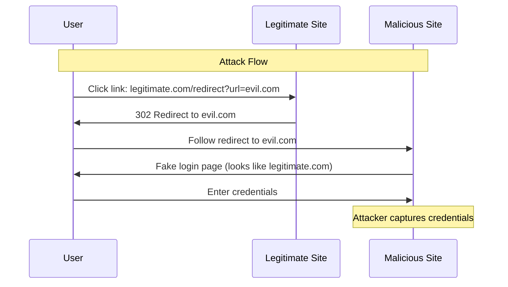

# How to Fix "Open Redirect" Vulnerabilities

Author: [nawazdhandala](https://www.github.com/nawazdhandala)

Tags: Security, Vulnerabilities, Open Redirect, Web Security, OWASP, Authentication

Description: A practical guide to identifying and fixing open redirect vulnerabilities that attackers use for phishing and credential theft.

---

Open redirect vulnerabilities seem harmless but they are a phishing attacker's best friend. When your legitimate domain redirects users to malicious sites, attackers inherit your domain's trust. Users see your domain in the initial link, trust it, and end up on a phishing page. Let's fix that.

## Understanding Open Redirects



The vulnerability exists because the application redirects users to URLs provided in request parameters without validation.

## Common Vulnerable Patterns

### Pattern 1: Login Redirect After Authentication

**Vulnerable Code (Node.js/Express):**

```javascript
// BAD: Redirects to any URL in the 'next' parameter
app.get('/login', (req, res) => {
  res.render('login', { next: req.query.next });
});

app.post('/login', async (req, res) => {
  const user = await authenticate(req.body.username, req.body.password);

  if (user) {
    req.session.user = user;
    // Vulnerable - redirects to attacker-controlled URL
    const redirectUrl = req.body.next || '/dashboard';
    return res.redirect(redirectUrl);
  }

  res.render('login', { error: 'Invalid credentials' });
});
```

**Fixed Code:**

```javascript
// GOOD: Validate redirect URL before use
const ALLOWED_REDIRECT_HOSTS = ['example.com', 'app.example.com'];

function isValidRedirectUrl(url, req) {
  // Only allow relative URLs or URLs to approved hosts
  try {
    // Handle relative URLs
    if (url.startsWith('/') && !url.startsWith('//')) {
      return true;
    }

    // Parse and validate absolute URLs
    const parsed = new URL(url);

    // Only allow HTTPS
    if (parsed.protocol !== 'https:') {
      return false;
    }

    // Check against allowlist
    return ALLOWED_REDIRECT_HOSTS.includes(parsed.hostname);

  } catch (e) {
    // Invalid URL format
    return false;
  }
}

app.post('/login', async (req, res) => {
  const user = await authenticate(req.body.username, req.body.password);

  if (user) {
    req.session.user = user;

    // Validate redirect URL
    let redirectUrl = '/dashboard';  // Safe default

    if (req.body.next && isValidRedirectUrl(req.body.next, req)) {
      redirectUrl = req.body.next;
    }

    return res.redirect(redirectUrl);
  }

  res.render('login', { error: 'Invalid credentials' });
});
```

### Pattern 2: OAuth Callback Redirect

**Vulnerable Code (Python/Flask):**

```python
# BAD: State parameter contains unvalidated redirect URL
@app.route('/oauth/callback')
def oauth_callback():
    code = request.args.get('code')
    state = request.args.get('state')

    # Exchange code for token
    token = exchange_code_for_token(code)

    # Decode state to get redirect URL
    state_data = json.loads(base64.b64decode(state))
    redirect_url = state_data.get('redirect_to', '/')

    # Vulnerable - no validation
    return redirect(redirect_url)
```

**Fixed Code:**

```python
# GOOD: Use signed state and validate redirect URL
from itsdangerous import URLSafeTimedSerializer
from urllib.parse import urlparse

serializer = URLSafeTimedSerializer(app.secret_key)
ALLOWED_HOSTS = {'example.com', 'app.example.com'}

def create_oauth_state(redirect_url):
    """Create signed state with validated redirect URL"""
    # Validate before storing
    validated_url = validate_redirect_url(redirect_url)

    state_data = {
        'redirect_to': validated_url,
        'nonce': secrets.token_hex(16)
    }

    # Sign the state to prevent tampering
    return serializer.dumps(state_data)

def validate_redirect_url(url):
    """Validate and sanitize redirect URL"""
    if not url:
        return '/'

    # Allow relative URLs (but not protocol-relative)
    if url.startswith('/') and not url.startswith('//'):
        return url

    try:
        parsed = urlparse(url)

        # Require HTTPS for absolute URLs
        if parsed.scheme != 'https':
            return '/'

        # Check against allowlist
        if parsed.netloc not in ALLOWED_HOSTS:
            return '/'

        # Reconstruct URL to prevent injection
        return f"{parsed.scheme}://{parsed.netloc}{parsed.path}"

    except Exception:
        return '/'

@app.route('/oauth/callback')
def oauth_callback():
    code = request.args.get('code')
    state = request.args.get('state')

    try:
        # Verify signature and extract state (expires after 10 minutes)
        state_data = serializer.loads(state, max_age=600)
    except Exception:
        return 'Invalid or expired state', 400

    # Exchange code for token
    token = exchange_code_for_token(code)

    # Redirect URL was validated when state was created
    return redirect(state_data['redirect_to'])
```

### Pattern 3: Logout Redirect

**Vulnerable Code:**

```javascript
// BAD: Logout redirects to any URL
app.get('/logout', (req, res) => {
  req.session.destroy();
  const redirectTo = req.query.redirect || '/';
  res.redirect(redirectTo);
});
```

**Fixed Code:**

```javascript
// GOOD: Use a redirect token system for logout
const crypto = require('crypto');
const redirectTokens = new Map();

// Generate redirect token when rendering logout link
app.get('/get-logout-url', (req, res) => {
  const intendedRedirect = req.query.redirect;
  const validatedUrl = validateRedirectUrl(intendedRedirect);

  // Create a one-time token
  const token = crypto.randomBytes(32).toString('hex');
  redirectTokens.set(token, {
    url: validatedUrl,
    expires: Date.now() + 300000  // 5 minutes
  });

  // Clean up expired tokens
  for (const [key, value] of redirectTokens) {
    if (value.expires < Date.now()) {
      redirectTokens.delete(key);
    }
  }

  res.json({ logoutUrl: `/logout?token=${token}` });
});

app.get('/logout', (req, res) => {
  req.session.destroy();

  const token = req.query.token;
  let redirectUrl = '/';

  if (token && redirectTokens.has(token)) {
    const tokenData = redirectTokens.get(token);

    if (tokenData.expires > Date.now()) {
      redirectUrl = tokenData.url;
    }

    // Delete token after use (one-time use)
    redirectTokens.delete(token);
  }

  res.redirect(redirectUrl);
});
```

## Bypass Prevention

Attackers will try to bypass your validation. Here are common bypasses and how to prevent them.

### Bypass Attempt 1: Protocol-Relative URLs

```
// Attacker tries: //evil.com
// This becomes https://evil.com when followed
```

**Prevention:**

```javascript
function preventProtocolRelative(url) {
  // Reject URLs starting with //
  if (url.startsWith('//')) {
    return false;
  }
  return true;
}
```

### Bypass Attempt 2: URL Encoding

```
// Attacker tries: %2F%2Fevil.com (URL-encoded //evil.com)
// Or: https://example.com%2F@evil.com
```

**Prevention:**

```javascript
function sanitizeUrl(url) {
  // Decode URL fully before validation
  let decoded = url;
  let previous = '';

  // Keep decoding until stable (handle double encoding)
  while (decoded !== previous) {
    previous = decoded;
    decoded = decodeURIComponent(decoded);
  }

  return decoded;
}
```

### Bypass Attempt 3: Domain Confusion

```
// Attacker tries: https://example.com.evil.com
// Or: https://exampleXcom.evil.com (where X is a special char)
```

**Prevention:**

```javascript
function validateHost(host) {
  // Exact match only - no substring matching
  const allowedHosts = new Set(['example.com', 'app.example.com']);
  return allowedHosts.has(host.toLowerCase());
}
```

### Bypass Attempt 4: IPv6 and IP Addresses

```
// Attacker tries: https://[::1]/ or https://127.0.0.1/
```

**Prevention:**

```javascript
function rejectIpAddresses(url) {
  const parsed = new URL(url);
  const host = parsed.hostname;

  // Reject IPv4
  if (/^\d{1,3}\.\d{1,3}\.\d{1,3}\.\d{1,3}$/.test(host)) {
    return false;
  }

  // Reject IPv6
  if (host.startsWith('[') || host.includes(':')) {
    return false;
  }

  return true;
}
```

## Comprehensive Validation Function

Here is a complete validation function that handles all these cases:

```javascript
const { URL } = require('url');

class RedirectValidator {
  constructor(options = {}) {
    this.allowedHosts = new Set(options.allowedHosts || []);
    this.allowRelative = options.allowRelative !== false;
    this.requireHttps = options.requireHttps !== false;
  }

  validate(redirectUrl, defaultUrl = '/') {
    if (!redirectUrl || typeof redirectUrl !== 'string') {
      return defaultUrl;
    }

    // Decode any URL encoding
    let url = this.fullyDecode(redirectUrl.trim());

    // Block protocol-relative URLs
    if (url.startsWith('//')) {
      return defaultUrl;
    }

    // Handle relative URLs
    if (url.startsWith('/')) {
      if (!this.allowRelative) {
        return defaultUrl;
      }
      // Ensure it's truly relative (no double slashes after decoding)
      if (url.startsWith('//')) {
        return defaultUrl;
      }
      // Block javascript: and data: schemes hidden in path
      if (/^\/[a-z]+:/i.test(url)) {
        return defaultUrl;
      }
      return url;
    }

    // Parse absolute URL
    try {
      const parsed = new URL(url);

      // Check protocol
      if (this.requireHttps && parsed.protocol !== 'https:') {
        return defaultUrl;
      }
      if (!['http:', 'https:'].includes(parsed.protocol)) {
        return defaultUrl;
      }

      // Reject IP addresses
      if (this.isIpAddress(parsed.hostname)) {
        return defaultUrl;
      }

      // Validate against allowlist
      if (!this.allowedHosts.has(parsed.hostname.toLowerCase())) {
        return defaultUrl;
      }

      // Reconstruct URL to prevent injection attacks
      return `${parsed.protocol}//${parsed.hostname}${parsed.pathname}${parsed.search}`;

    } catch (e) {
      return defaultUrl;
    }
  }

  fullyDecode(url) {
    let decoded = url;
    let previous = '';
    let iterations = 0;
    const maxIterations = 10;

    while (decoded !== previous && iterations < maxIterations) {
      previous = decoded;
      try {
        decoded = decodeURIComponent(decoded);
      } catch (e) {
        break;
      }
      iterations++;
    }

    return decoded;
  }

  isIpAddress(hostname) {
    // IPv4
    if (/^\d{1,3}(\.\d{1,3}){3}$/.test(hostname)) {
      return true;
    }
    // IPv6
    if (hostname.includes(':') || hostname.startsWith('[')) {
      return true;
    }
    return false;
  }
}

// Usage
const validator = new RedirectValidator({
  allowedHosts: ['example.com', 'app.example.com'],
  allowRelative: true,
  requireHttps: true
});

app.post('/login', (req, res) => {
  // ... authentication logic ...

  const safeRedirect = validator.validate(req.body.next, '/dashboard');
  res.redirect(safeRedirect);
});
```

## Testing for Open Redirects

Use these payloads to test your fix:

```bash
# Basic tests
curl -I "https://example.com/redirect?url=https://evil.com"
curl -I "https://example.com/redirect?url=//evil.com"
curl -I "https://example.com/redirect?url=/\evil.com"

# Encoding bypass tests
curl -I "https://example.com/redirect?url=%2F%2Fevil.com"
curl -I "https://example.com/redirect?url=https%3A%2F%2Fevil.com"

# Domain confusion tests
curl -I "https://example.com/redirect?url=https://example.com.evil.com"
curl -I "https://example.com/redirect?url=https://evil.com/example.com"

# Check response - should NOT redirect to evil.com
```

## Security Headers

Add these headers to provide defense in depth:

```javascript
app.use((req, res, next) => {
  // Prevent clickjacking on redirect pages
  res.setHeader('X-Frame-Options', 'DENY');

  // Strict CSP
  res.setHeader('Content-Security-Policy', "default-src 'self'");

  // Prevent MIME type sniffing
  res.setHeader('X-Content-Type-Options', 'nosniff');

  next();
});
```

---

Open redirects are deceptively dangerous. They turn your trusted domain into an attack vector. The fix is straightforward: never redirect to user-controlled URLs without validation. Use an allowlist of trusted domains, reject protocol-relative URLs, decode fully before validation, and always have a safe default. Your users trust your domain - do not let attackers abuse that trust.
