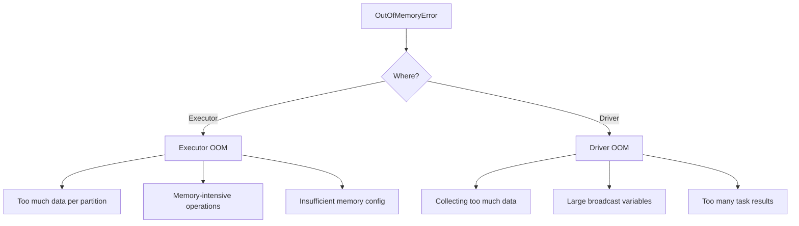
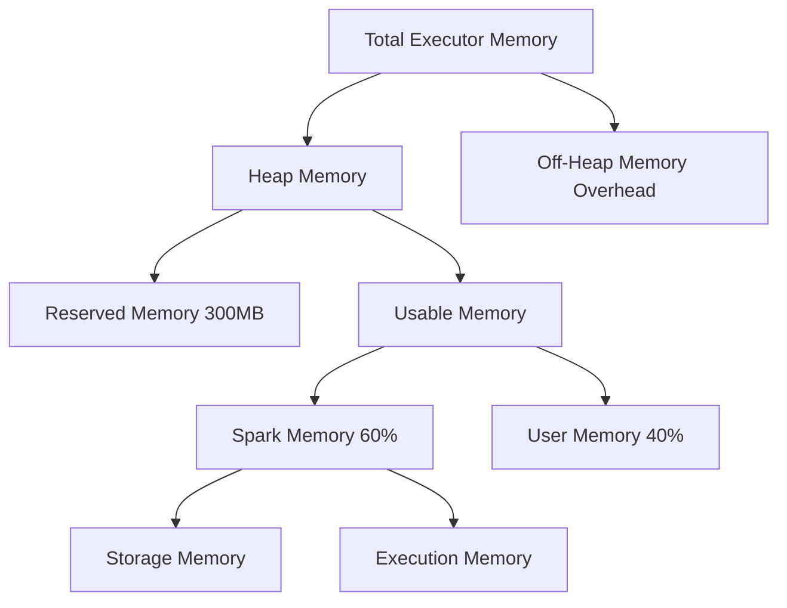

# How to Fix "Out of Memory" Spark Errors

Author: [nawazdhandala](https://www.github.com/nawazdhandala)

Tags: Apache Spark, Out of Memory, OOM, Memory Management, Big Data, Troubleshooting

Description: A practical guide to diagnosing and fixing OutOfMemoryError in Apache Spark, covering executor memory, driver memory, and broadcast variable issues.

---

OutOfMemoryError is one of the most frustrating issues in Apache Spark. The error messages can be cryptic, and the root cause is not always obvious. This guide helps you identify the type of OOM error and provides specific solutions for each case.

## Types of OOM Errors in Spark



## Diagnosing OOM Errors

### Check Error Messages

```python
# Common OOM error patterns

# 1. Executor OOM during shuffle
# "java.lang.OutOfMemoryError: Java heap space"
# "ExecutorLostFailure (executor X exited caused by one of the running tasks)"

# 2. Driver OOM
# "java.lang.OutOfMemoryError: Java heap space" (in driver logs)
# "org.apache.spark.SparkException: Job aborted due to stage failure"

# 3. Container killed by YARN/Kubernetes
# "Container killed by YARN for exceeding memory limits"
# "Container killed on request. Exit code is 137"
```

### Check Spark UI for Clues

```python
# Enable detailed memory metrics
spark.conf.set("spark.executor.processTreeMetrics.enabled", "true")
spark.conf.set("spark.metrics.conf.*.sink.console.class", "org.apache.spark.metrics.sink.ConsoleSink")

# Key metrics to check in Spark UI:
# - Storage Memory: How much memory is used for caching
# - Shuffle Spill (Memory): Data spilled during shuffle operations
# - Shuffle Spill (Disk): If this is large, you need more memory
# - Task Metrics: Peak execution memory per task
```

## Fixing Executor OOM

### Solution 1: Increase Executor Memory

```python
# Start with more executor memory
spark = SparkSession.builder \
    .appName("FixOOM") \
    .config("spark.executor.memory", "8g") \
    .config("spark.executor.memoryOverhead", "2g") \
    .getOrCreate()

# Memory overhead is for non-heap memory (native libraries, interned strings)
# Rule of thumb: overhead = 10% of executor memory or 384MB, whichever is larger
```

### Solution 2: Reduce Data Per Partition

```python
# Check partition sizes
df = spark.read.parquet("s3://bucket/data/")
print(f"Partitions: {df.rdd.getNumPartitions()}")

# If partitions are too large, increase partition count
df_repartitioned = df.repartition(500)  # More partitions = smaller each

# For shuffle operations, increase shuffle partitions
spark.conf.set("spark.sql.shuffle.partitions", "500")

# Target: 128MB to 256MB per partition
# If you have 50GB of data, use at least 200-400 partitions
```

### Solution 3: Reduce Memory Per Task

```python
# Avoid operations that accumulate data in memory

# Bad: Collects all data for a key in memory
from pyspark.sql.functions import collect_list
df.groupBy("key").agg(collect_list("value"))  # Can OOM if keys have many values

# Better: Use aggregations that don't accumulate
from pyspark.sql.functions import count, sum, avg
df.groupBy("key").agg(
    count("value"),
    sum("value"),
    avg("value")
)

# If you must collect, limit the size
from pyspark.sql.functions import slice
df.groupBy("key").agg(
    slice(collect_list("value"), 1, 100).alias("top_100_values")
)
```

### Solution 4: Spill to Disk

```python
# Configure memory fraction to allow more spilling
spark.conf.set("spark.memory.fraction", "0.6")  # Default is 0.6
spark.conf.set("spark.memory.storageFraction", "0.5")  # Default is 0.5

# This leaves more room for execution memory and allows disk spill
# Lower storageFraction means cached data will be evicted more aggressively
```

### Solution 5: Handle Skewed Data

```python
# Detect skew
from pyspark.sql.functions import spark_partition_id, count

df.withColumn("partition_id", spark_partition_id()) \
    .groupBy("partition_id") \
    .agg(count("*").alias("rows")) \
    .orderBy("rows", ascending=False) \
    .show(20)

# If one partition has 10x more data than others, you have skew

# Fix with adaptive query execution (Spark 3.0+)
spark.conf.set("spark.sql.adaptive.enabled", "true")
spark.conf.set("spark.sql.adaptive.skewJoin.enabled", "true")
spark.conf.set("spark.sql.adaptive.skewJoin.skewedPartitionFactor", "5")
spark.conf.set("spark.sql.adaptive.skewJoin.skewedPartitionThresholdInBytes", "256m")

# Manual fix: Salt skewed keys
from pyspark.sql.functions import concat, lit, floor, rand

def fix_skew_with_salting(df, skewed_key_col, num_salts=10):
    """Add salt to distribute skewed keys across partitions."""
    return df.withColumn(
        "salted_key",
        concat(col(skewed_key_col), lit("_"), floor(rand() * num_salts).cast("string"))
    )
```

## Fixing Driver OOM

### Solution 1: Don't Collect Large Datasets

```python
# Bad: Collects all data to driver
results = df.collect()  # OOM if df is large

# Good: Only collect what you need
results = df.take(1000)  # Limit results
results = df.head(100)   # Get first N rows

# Good: Process on cluster, write to storage
df.write.parquet("s3://bucket/output/")

# Good: Use aggregations to reduce data before collecting
summary = df.groupBy("category").count().collect()  # Much smaller
```

### Solution 2: Increase Driver Memory

```python
# For spark-submit
# spark-submit --driver-memory 8g --conf spark.driver.maxResultSize=4g ...

# For SparkSession
spark = SparkSession.builder \
    .appName("DriverOOM") \
    .config("spark.driver.memory", "8g") \
    .config("spark.driver.maxResultSize", "4g") \
    .getOrCreate()
```

### Solution 3: Handle Large Broadcast Variables

```python
# Check broadcast variable size before broadcasting
import sys

def get_size_mb(obj):
    """Get approximate size of object in MB."""
    return sys.getsizeof(obj) / (1024 * 1024)

lookup_data = small_df.collect()
print(f"Broadcast size: {get_size_mb(lookup_data):.2f} MB")

# If too large, don't broadcast - use regular join instead
if get_size_mb(lookup_data) > 100:
    print("Data too large for broadcast, using shuffle join")
    result = large_df.join(small_df, "key")
else:
    broadcast_var = spark.sparkContext.broadcast(lookup_data)
    # Use broadcast variable in UDF or transformation
```

### Solution 4: Limit Result Size

```python
# Set maximum result size to prevent accidental large collects
spark.conf.set("spark.driver.maxResultSize", "2g")

# This will throw an error instead of OOM if result is too large
# Error: "Total size of serialized results is bigger than spark.driver.maxResultSize"
```

## Memory Configuration Deep Dive



### Calculate Memory Requirements

```python
def calculate_memory_config(data_size_gb, num_executors, cores_per_executor):
    """Calculate recommended memory configuration."""

    # Each task processes ~128-256MB of data
    tasks_per_executor = cores_per_executor
    data_per_task_mb = 200  # Target

    # Memory per task
    memory_per_task_mb = data_per_task_mb * 3  # 3x for safety during processing

    # Executor memory
    executor_memory_mb = memory_per_task_mb * tasks_per_executor
    executor_memory_gb = max(4, executor_memory_mb / 1024)

    # Overhead (10% or 384MB minimum)
    overhead_mb = max(384, executor_memory_mb * 0.1)

    print(f"""
    Recommended Configuration:
    - spark.executor.memory: {executor_memory_gb:.0f}g
    - spark.executor.memoryOverhead: {overhead_mb:.0f}m
    - spark.executor.cores: {cores_per_executor}
    - spark.sql.shuffle.partitions: {int(data_size_gb * 1024 / 200)}
    """)

    return {
        'executor_memory': f"{executor_memory_gb:.0f}g",
        'memory_overhead': f"{overhead_mb:.0f}m",
        'cores': cores_per_executor
    }

# Example: 100GB of data, 10 executors, 4 cores each
config = calculate_memory_config(100, 10, 4)
```

## Common OOM Scenarios and Fixes

### Scenario 1: OOM During Join

```python
# Problem: Large shuffle during join
df1.join(df2, "key")  # Both tables shuffled

# Solution 1: Broadcast small table
from pyspark.sql.functions import broadcast
df1.join(broadcast(df2), "key")  # Only if df2 < 1GB

# Solution 2: Increase shuffle partitions
spark.conf.set("spark.sql.shuffle.partitions", "1000")

# Solution 3: Use bucketing for repeated joins
df1.write.bucketBy(100, "key").saveAsTable("table1")
df2.write.bucketBy(100, "key").saveAsTable("table2")
# Bucketed tables don't shuffle on join
```

### Scenario 2: OOM During GroupBy

```python
# Problem: Group has too many rows
df.groupBy("skewed_key").agg(collect_list("value"))

# Solution 1: Use streaming aggregation
spark.conf.set("spark.sql.objectHashAggregate.sortBased.fallbackThreshold", "128")

# Solution 2: Limit collection size
from pyspark.sql.functions import slice, collect_list
df.groupBy("key").agg(
    slice(collect_list("value"), 1, 1000).alias("limited_values")
)

# Solution 3: Use approximate algorithms
from pyspark.sql.functions import approx_count_distinct
df.groupBy("key").agg(approx_count_distinct("value"))
```

### Scenario 3: OOM During Sort

```python
# Problem: Sorting large dataset
df.orderBy("column")  # Requires all data in memory

# Solution 1: Sort within partitions instead
from pyspark.sql.functions import row_number
from pyspark.sql.window import Window

# Get top N per partition
window = Window.partitionBy("partition_key").orderBy("sort_key")
df.withColumn("rank", row_number().over(window)) \
    .filter("rank <= 100")

# Solution 2: Use sortWithinPartitions
df.sortWithinPartitions("column")  # Doesn't require global sort
```

## Debugging OOM in Production

```python
# Add memory monitoring to your job
def log_memory_usage():
    """Log JVM memory usage."""
    import os

    # Get memory from JVM (if running in executor)
    try:
        import psutil
        process = psutil.Process(os.getpid())
        memory_mb = process.memory_info().rss / (1024 * 1024)
        print(f"Process memory: {memory_mb:.0f} MB")
    except ImportError:
        pass

# Call periodically during job
log_memory_usage()

# Enable GC logging for JVM
spark.conf.set(
    "spark.executor.extraJavaOptions",
    "-XX:+PrintGCDetails -XX:+PrintGCTimeStamps"
)
```

## Prevention Checklist

1. **Set appropriate memory configs** before running jobs
2. **Never use collect() on large datasets** - use take(), head(), or write to storage
3. **Check partition sizes** - target 128-256MB per partition
4. **Use broadcast joins** for small tables (< 1GB)
5. **Enable adaptive query execution** for automatic optimizations
6. **Monitor memory in Spark UI** during job execution
7. **Test with realistic data volumes** before production

---

OOM errors in Spark usually come down to three things: not enough memory configured, too much data in one partition, or collecting too much data to the driver. Start by identifying which component is running out of memory (executor or driver), then apply the appropriate fix. When in doubt, increase partitions and avoid collect().
