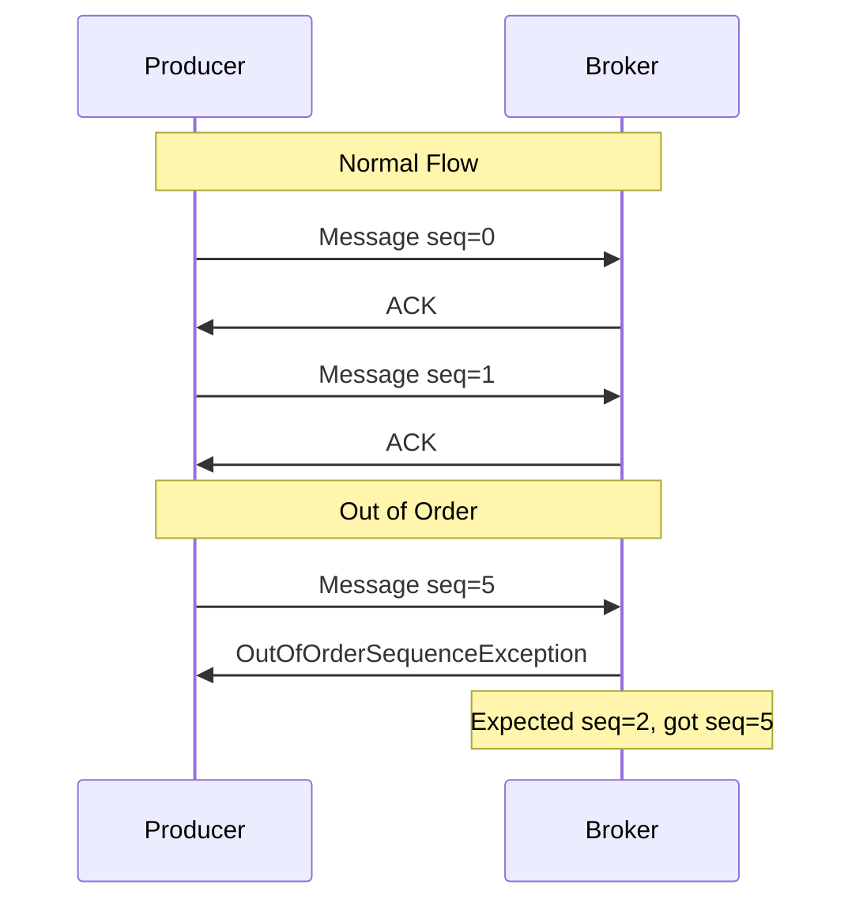
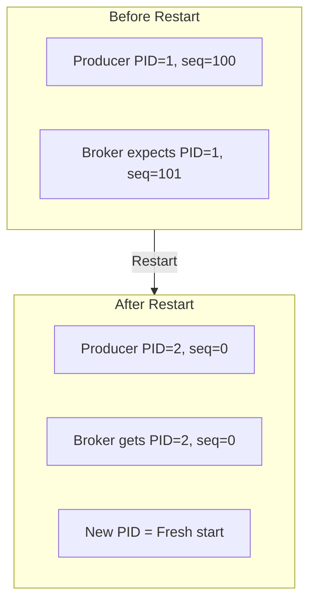
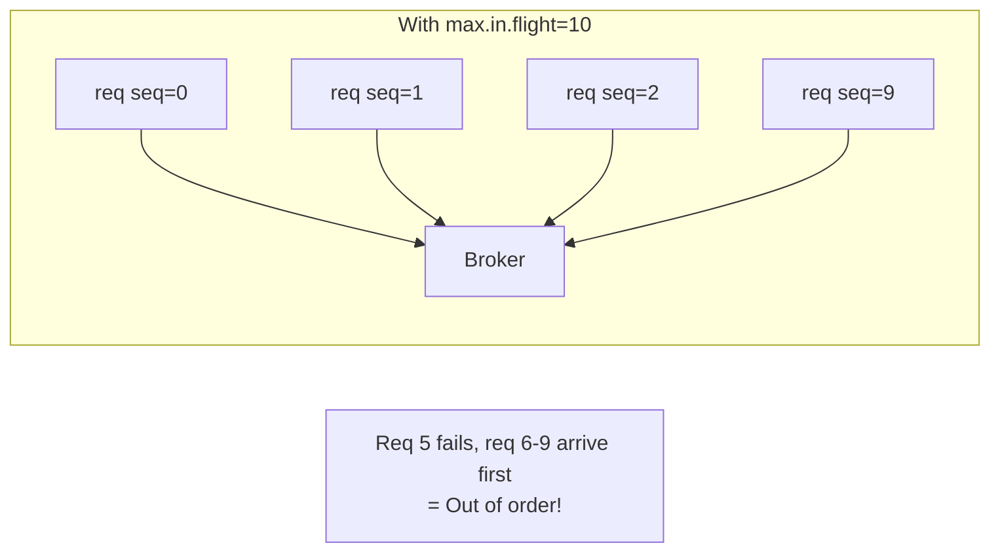
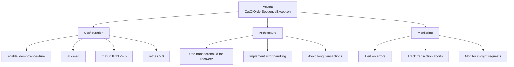

# How to Fix "OutOfOrderSequenceException" in Kafka

Author: [nawazdhandala](https://www.github.com/nawazdhandala)

Tags: Apache Kafka, OutOfOrderSequenceException, Idempotent Producer, Transactions, Error Handling, DevOps

Description: A comprehensive guide to understanding and resolving OutOfOrderSequenceException in Kafka, covering idempotent producers, transaction handling, and recovery strategies.

---

The `OutOfOrderSequenceException` occurs when Kafka's idempotent or transactional producer detects sequence number inconsistencies. This error indicates potential data integrity issues that need immediate attention.

## Understanding the Exception

Kafka assigns sequence numbers to messages from idempotent producers to detect duplicates and ensure exactly-once delivery. When sequence numbers arrive out of order, Kafka throws this exception.



### Root Causes

| Cause | Description |
|-------|-------------|
| Producer restart | Producer ID changed, sequence reset |
| Broker failover | Leader election caused state loss |
| Network issues | Retries arrived out of order |
| Transaction timeout | Transaction aborted mid-flight |
| Max in-flight exceeded | Too many concurrent requests |

## Producer Configuration Analysis

### Idempotent Producer Settings

```java
Properties props = new Properties();
props.put("bootstrap.servers", "kafka:9092");

// Enable idempotence - this is the source of sequence tracking
props.put("enable.idempotence", true);

// Required settings for idempotence
props.put("acks", "all");  // Must be "all" for idempotence
props.put("retries", Integer.MAX_VALUE);  // Retries must be > 0
props.put("max.in.flight.requests.per.connection", 5);  // Max 5 for idempotence
```

### Settings That Cause OutOfOrderSequenceException

```java
// DANGEROUS: This configuration will cause issues

// max.in.flight > 5 with idempotence breaks ordering guarantees
props.put("max.in.flight.requests.per.connection", 10);  // BAD

// acks != all breaks idempotence
props.put("acks", "1");  // BAD

// retries = 0 breaks idempotence
props.put("retries", 0);  // BAD
```

## Common Scenarios and Fixes

### Scenario 1: Producer Restart Without State Recovery

**Problem:** Producer restarts get a new Producer ID (PID), but broker expects old sequence.



**Fix:** For stateless producers, this is expected. The new PID starts fresh. But if you need to continue a transaction:

```java
public class StatefulProducer {
    private final KafkaProducer<String, String> producer;
    private final String transactionalId;

    public StatefulProducer(String transactionalId) {
        this.transactionalId = transactionalId;

        Properties props = new Properties();
        props.put("bootstrap.servers", "kafka:9092");
        props.put("enable.idempotence", true);
        props.put("acks", "all");

        // Transactional ID allows state recovery across restarts
        props.put("transactional.id", transactionalId);

        // Timeout for transaction recovery
        props.put("transaction.timeout.ms", 60000);

        this.producer = new KafkaProducer<>(props);

        // Initialize transactions - recovers state from broker
        producer.initTransactions();
    }

    public void sendInTransaction(String topic, String key, String value) {
        try {
            producer.beginTransaction();
            producer.send(new ProducerRecord<>(topic, key, value));
            producer.commitTransaction();
        } catch (ProducerFencedException e) {
            // Another producer with same transactional.id is active
            producer.close();
            throw e;
        } catch (OutOfOrderSequenceException e) {
            // Unrecoverable - must create new producer
            producer.close();
            throw e;
        } catch (KafkaException e) {
            producer.abortTransaction();
            throw e;
        }
    }
}
```

### Scenario 2: Transaction Timeout

**Problem:** Transaction took too long, broker aborted it.

**Error:**
```
org.apache.kafka.common.errors.OutOfOrderSequenceException:
The broker received an out of order sequence number
```

**Fix:** Increase transaction timeout or optimize processing.

```java
Properties props = new Properties();
// Increase transaction timeout (default is 60 seconds)
props.put("transaction.timeout.ms", 300000);  // 5 minutes

// Reduce batch size if transactions are too large
props.put("batch.size", 16384);

// Reduce linger to send faster
props.put("linger.ms", 5);
```

### Scenario 3: max.in.flight.requests Too High

**Problem:** Too many in-flight requests causing sequence gaps.



**Fix:** Set `max.in.flight.requests.per.connection` to 1 for strict ordering, or max 5 for idempotence.

```java
// For strict ordering (lower throughput)
props.put("max.in.flight.requests.per.connection", 1);

// For idempotence with better throughput
props.put("max.in.flight.requests.per.connection", 5);
```

### Scenario 4: Network Partition Recovery

**Problem:** Network partition caused retries to arrive out of order.

**Fix:** Implement proper retry handling with exponential backoff.

```java
public class ResilientProducer {
    private KafkaProducer<String, String> producer;
    private final Properties baseProps;

    public ResilientProducer(Properties props) {
        this.baseProps = props;

        // Configure retries with backoff
        props.put("retries", 10);
        props.put("retry.backoff.ms", 100);
        props.put("delivery.timeout.ms", 120000);

        // Limit in-flight requests
        props.put("max.in.flight.requests.per.connection", 1);

        this.producer = new KafkaProducer<>(props);
    }

    public void send(String topic, String key, String value) {
        int attempts = 0;
        int maxAttempts = 3;

        while (attempts < maxAttempts) {
            try {
                producer.send(new ProducerRecord<>(topic, key, value)).get();
                return;  // Success
            } catch (ExecutionException e) {
                if (e.getCause() instanceof OutOfOrderSequenceException) {
                    // Unrecoverable - recreate producer
                    System.err.println("OutOfOrderSequenceException, recreating producer");
                    producer.close();
                    producer = new KafkaProducer<>(baseProps);
                    attempts++;
                } else {
                    throw new RuntimeException(e);
                }
            } catch (InterruptedException e) {
                Thread.currentThread().interrupt();
                throw new RuntimeException(e);
            }
        }

        throw new RuntimeException("Failed to send after " + maxAttempts + " attempts");
    }
}
```

## Handling OutOfOrderSequenceException

### Strategy 1: Abort and Retry (Recommended)

```java
public class TransactionalProducer {
    private KafkaProducer<String, String> producer;
    private final String transactionalId;
    private final Properties props;

    public TransactionalProducer(String transactionalId, Properties props) {
        this.transactionalId = transactionalId;
        this.props = props;
        initProducer();
    }

    private void initProducer() {
        props.put("transactional.id", transactionalId);
        props.put("enable.idempotence", true);
        this.producer = new KafkaProducer<>(props);
        producer.initTransactions();
    }

    public void sendBatch(String topic, List<KeyValue> records) {
        boolean success = false;
        int attempt = 0;

        while (!success && attempt < 3) {
            try {
                producer.beginTransaction();

                for (KeyValue kv : records) {
                    producer.send(new ProducerRecord<>(topic, kv.key, kv.value));
                }

                producer.commitTransaction();
                success = true;

            } catch (OutOfOrderSequenceException e) {
                // Fatal - recreate producer
                System.err.println("OutOfOrderSequenceException on attempt " + attempt);
                producer.close();
                initProducer();
                attempt++;

            } catch (ProducerFencedException e) {
                // Another instance is running with same transactional.id
                throw new RuntimeException("Producer fenced", e);

            } catch (KafkaException e) {
                // Abort and retry
                try {
                    producer.abortTransaction();
                } catch (Exception abortEx) {
                    // Abort failed - recreate producer
                    producer.close();
                    initProducer();
                }
                attempt++;
            }
        }

        if (!success) {
            throw new RuntimeException("Failed to send batch after 3 attempts");
        }
    }
}
```

### Strategy 2: Circuit Breaker Pattern

```java
public class CircuitBreakerProducer {
    private final KafkaProducer<String, String> producer;
    private final AtomicInteger failures = new AtomicInteger(0);
    private final AtomicLong lastFailure = new AtomicLong(0);

    private static final int FAILURE_THRESHOLD = 5;
    private static final long RESET_TIMEOUT_MS = 30000;

    enum State { CLOSED, OPEN, HALF_OPEN }
    private volatile State state = State.CLOSED;

    public void send(String topic, String key, String value) throws Exception {
        // Check circuit breaker state
        if (state == State.OPEN) {
            if (System.currentTimeMillis() - lastFailure.get() > RESET_TIMEOUT_MS) {
                state = State.HALF_OPEN;
            } else {
                throw new RuntimeException("Circuit breaker is OPEN");
            }
        }

        try {
            producer.send(new ProducerRecord<>(topic, key, value)).get();

            // Success - reset circuit breaker
            if (state == State.HALF_OPEN) {
                state = State.CLOSED;
                failures.set(0);
            }

        } catch (ExecutionException e) {
            if (e.getCause() instanceof OutOfOrderSequenceException) {
                int count = failures.incrementAndGet();
                lastFailure.set(System.currentTimeMillis());

                if (count >= FAILURE_THRESHOLD) {
                    state = State.OPEN;
                    System.err.println("Circuit breaker OPENED after " + count + " failures");
                }

                throw e;
            }
            throw e;
        }
    }
}
```

## Monitoring for OutOfOrderSequenceException

### Key Metrics

```yaml
# Prometheus alerting rules
groups:
  - name: kafka-producer
    rules:
      - alert: KafkaProducerOutOfOrderErrors
        expr: rate(kafka_producer_record_error_total{error="OutOfOrderSequenceException"}[5m]) > 0
        for: 1m
        labels:
          severity: critical
        annotations:
          summary: "Kafka producer OutOfOrderSequenceException detected"

      - alert: KafkaTransactionAborts
        expr: rate(kafka_producer_txn_abort_total[5m]) > 5
        for: 5m
        labels:
          severity: warning
        annotations:
          summary: "High rate of Kafka transaction aborts"
```

### JMX Metrics to Watch

```bash
# Producer record error rate
kafka.producer:type=producer-metrics,client-id=*,name=record-error-rate

# Transaction abort rate
kafka.producer:type=producer-metrics,client-id=*,name=txn-abort-rate

# In-flight request count
kafka.producer:type=producer-metrics,client-id=*,name=requests-in-flight
```

### Logging for Debugging

```java
import org.slf4j.Logger;
import org.slf4j.LoggerFactory;

public class LoggingProducer {
    private static final Logger log = LoggerFactory.getLogger(LoggingProducer.class);

    public void send(ProducerRecord<String, String> record) {
        producer.send(record, (metadata, exception) -> {
            if (exception != null) {
                if (exception instanceof OutOfOrderSequenceException) {
                    log.error("OutOfOrderSequenceException - topic: {}, partition: {}, key: {}",
                        record.topic(),
                        record.partition(),
                        record.key(),
                        exception);

                    // Emit metric for monitoring
                    Metrics.counter("kafka.producer.out_of_order_errors",
                        "topic", record.topic()).increment();
                } else {
                    log.error("Failed to send record", exception);
                }
            } else {
                log.debug("Sent to {}-{} offset {}",
                    metadata.topic(),
                    metadata.partition(),
                    metadata.offset());
            }
        });
    }
}
```

## Prevention Checklist



### Configuration Checklist

```properties
# Required for idempotence
enable.idempotence=true
acks=all

# Prevent out-of-order issues
max.in.flight.requests.per.connection=5
retries=2147483647

# Timeout configuration
request.timeout.ms=30000
delivery.timeout.ms=120000
transaction.timeout.ms=60000

# Backoff configuration
retry.backoff.ms=100
```

### Code Checklist

- [ ] Handle `OutOfOrderSequenceException` explicitly in catch blocks
- [ ] Recreate producer after unrecoverable errors
- [ ] Use `transactional.id` for stateful producers
- [ ] Call `initTransactions()` before sending transactional messages
- [ ] Implement circuit breaker for repeated failures
- [ ] Log sequence exceptions with context for debugging
- [ ] Monitor error rates and alert on anomalies

## Recovery Procedures

### Immediate Recovery Steps

```bash
#!/bin/bash
# kafka-producer-recovery.sh

# 1. Check broker health
kafka-broker-api-versions.sh --bootstrap-server kafka:9092

# 2. Check for partition leadership changes
kafka-topics.sh --bootstrap-server kafka:9092 \
  --describe --topic affected-topic

# 3. Check producer coordinator
kafka-consumer-groups.sh --bootstrap-server kafka:9092 \
  --describe --group __transaction_state --state

# 4. Check for stuck transactions
kafka-transactions.sh --bootstrap-server kafka:9092 \
  list --hanging
```

### Clearing Stuck Transactions

```bash
# Abort hanging transactions
kafka-transactions.sh --bootstrap-server kafka:9092 \
  abort --producer-id <pid> --start-sequence <seq>
```

---

OutOfOrderSequenceException signals a serious data integrity issue. Always configure idempotent producers correctly with `max.in.flight.requests.per.connection <= 5`, implement proper error handling with producer recreation, and monitor for these errors proactively. When they occur, recreating the producer is usually the safest recovery path.
