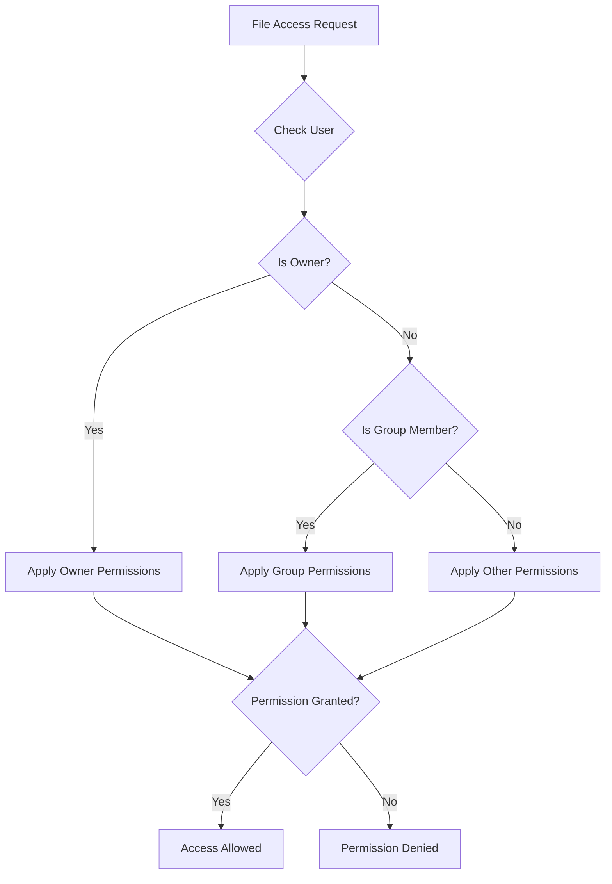
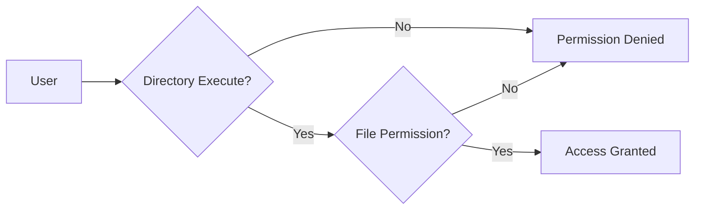
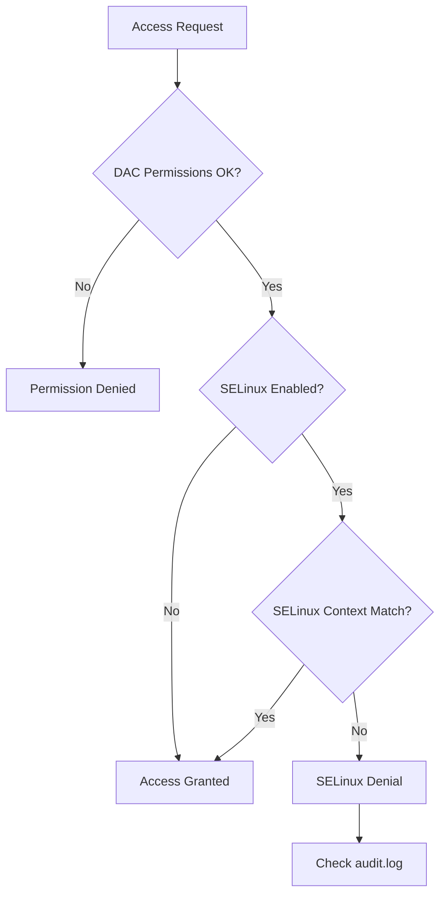

# How to Fix "Permission Denied" Errors in Linux

Author: [nawazdhandala](https://www.github.com/nawazdhandala)

Tags: Linux, System Administration, Permissions, Troubleshooting, Security, chmod, chown

Description: A comprehensive guide to diagnosing and fixing permission denied errors in Linux, covering file permissions, ownership, ACLs, and SELinux/AppArmor issues.

---

Permission denied errors are among the most common issues Linux administrators face. This guide provides a systematic approach to diagnose and fix these errors quickly and securely.

## Understanding Linux Permissions



### Permission Structure

Linux permissions consist of three sets of permissions for three categories of users:

| Category | Description |
|----------|-------------|
| Owner (u) | The user who owns the file |
| Group (g) | Users in the file's group |
| Other (o) | Everyone else |

Each category has three permission types:

| Permission | Symbol | Numeric | File Effect | Directory Effect |
|------------|--------|---------|-------------|------------------|
| Read | r | 4 | View contents | List files |
| Write | w | 2 | Modify contents | Create/delete files |
| Execute | x | 1 | Run as program | Enter directory |

## Quick Diagnosis Commands

```bash
# Check file permissions and ownership
ls -la /path/to/file

# Check your current user and groups
id

# Check effective permissions for current user
namei -l /path/to/file

# Check if SELinux is blocking access
ausearch -m avc -ts recent

# Check AppArmor status (Ubuntu/Debian)
aa-status
```

## Common Permission Denied Scenarios

### Scenario 1: Incorrect File Permissions

**Symptoms**: Cannot read, write, or execute a file

```bash
# Example error
$ cat /etc/myconfig
cat: /etc/myconfig: Permission denied
```

**Diagnosis**:

```bash
# Check current permissions
ls -la /etc/myconfig
# Output: -rw------- 1 root root 1234 Jan 24 10:00 /etc/myconfig
# Only root can read/write this file
```

**Solution**:

```bash
# Option 1: Change permissions (if appropriate)
# Add read permission for all users
sudo chmod o+r /etc/myconfig

# Or set specific permissions (owner: rw, group: r, other: r)
sudo chmod 644 /etc/myconfig

# Option 2: Change ownership
sudo chown myuser:mygroup /etc/myconfig

# Option 3: Add user to the group that owns the file
sudo usermod -aG mygroup myuser
# User must log out and back in for group changes to take effect
```

### Scenario 2: Directory Permission Issues

**Symptoms**: Cannot access files even though file permissions look correct



**Diagnosis**:

```bash
# Check entire path permissions
namei -l /path/to/deep/nested/file

# Output shows permissions at each level:
# drwxr-x--- root root /path
# drwx------ root root /path/to        # <- Problem: no access for others
# drwxr-xr-x root root /path/to/deep
```

**Solution**:

```bash
# Add execute permission to directory (required to enter it)
sudo chmod o+x /path/to

# Or recursively fix an entire directory tree
# Be careful with this - only use when appropriate
sudo chmod -R o+rX /path/to
# Note: capital X only adds execute to directories, not files
```

### Scenario 3: Script Not Executable

**Symptoms**: Cannot run a script even with correct ownership

```bash
# Example error
$ ./myscript.sh
bash: ./myscript.sh: Permission denied
```

**Diagnosis**:

```bash
# Check if execute permission is set
ls -la myscript.sh
# Output: -rw-r--r-- 1 user user 1234 Jan 24 10:00 myscript.sh
# No 'x' in permissions
```

**Solution**:

```bash
# Add execute permission for owner
chmod u+x myscript.sh

# Or for owner and group
chmod ug+x myscript.sh

# Or use numeric (755 = rwxr-xr-x)
chmod 755 myscript.sh
```

### Scenario 4: Mounted Filesystem Restrictions

**Symptoms**: Permission denied on mounted volumes despite correct permissions

**Diagnosis**:

```bash
# Check mount options
mount | grep /path/to/mount
# Output might show: noexec, nosuid, or other restrictions

# Or check fstab
cat /etc/fstab | grep /path/to/mount
```

**Solution**:

```bash
# Remount with correct options
sudo mount -o remount,exec /path/to/mount

# Or update /etc/fstab for persistent change
# Change: /dev/sdb1 /mnt/data ext4 defaults,noexec 0 0
# To:     /dev/sdb1 /mnt/data ext4 defaults 0 0

# Then remount
sudo mount -o remount /mnt/data
```

### Scenario 5: SELinux Denials (RHEL/CentOS/Fedora)

**Symptoms**: Permissions look correct but access is still denied



**Diagnosis**:

```bash
# Check SELinux status
getenforce
# Output: Enforcing

# Check SELinux context
ls -Z /path/to/file
# Output: unconfined_u:object_r:user_home_t:s0 /path/to/file

# Check for recent denials
ausearch -m avc -ts recent
# Or use sealert for detailed analysis
sealert -a /var/log/audit/audit.log
```

**Solution**:

```bash
# Option 1: Restore default SELinux context
sudo restorecon -v /path/to/file

# Option 2: Change SELinux context to match expected type
sudo chcon -t httpd_sys_content_t /var/www/html/myfile

# Option 3: Create a permanent policy (for custom applications)
# First, generate a policy module from denials
sudo ausearch -m avc -ts recent | audit2allow -M mypolicy
sudo semodule -i mypolicy.pp

# Option 4: Set SELinux boolean (for known use cases)
# List available booleans
getsebool -a | grep httpd
# Enable a boolean
sudo setsebool -P httpd_can_network_connect on
```

### Scenario 6: AppArmor Denials (Ubuntu/Debian)

**Symptoms**: Similar to SELinux - permissions look correct but access denied

**Diagnosis**:

```bash
# Check AppArmor status
sudo aa-status

# Check for denials in logs
sudo dmesg | grep -i apparmor
# Or
sudo journalctl -xe | grep -i apparmor
```

**Solution**:

```bash
# Option 1: Put profile in complain mode (logs but allows)
sudo aa-complain /etc/apparmor.d/usr.bin.myapp

# Option 2: Disable profile entirely
sudo aa-disable /etc/apparmor.d/usr.bin.myapp

# Option 3: Edit profile to add allowed paths
sudo nano /etc/apparmor.d/usr.bin.myapp
# Add: /path/to/file r,
sudo apparmor_parser -r /etc/apparmor.d/usr.bin.myapp
```

## Special Permission Bits

### SUID, SGID, and Sticky Bit

```bash
# SUID (4): Run as file owner
chmod u+s /path/to/file    # or chmod 4755
# Example: /usr/bin/passwd runs as root

# SGID (2): Run as group owner / inherit group in directories
chmod g+s /path/to/dir     # or chmod 2755
# Files created in this directory inherit the directory's group

# Sticky bit (1): Only owner can delete files
chmod +t /path/to/dir      # or chmod 1755
# Example: /tmp uses sticky bit
```

**Identify special bits**:

```bash
ls -la /usr/bin/passwd
# -rwsr-xr-x  <- 's' instead of 'x' indicates SUID

ls -la /tmp
# drwxrwxrwt  <- 't' instead of 'x' indicates sticky bit
```

## Access Control Lists (ACLs)

When standard permissions are not granular enough, use ACLs:

```bash
# Check if filesystem supports ACLs
mount | grep acl

# View ACLs
getfacl /path/to/file

# Grant specific user access
setfacl -m u:username:rwx /path/to/file

# Grant specific group access
setfacl -m g:groupname:rx /path/to/file

# Set default ACL for new files in directory
setfacl -d -m u:username:rwx /path/to/directory

# Remove all ACLs
setfacl -b /path/to/file
```

## Debugging Checklist

Use this systematic approach to diagnose permission issues:

```bash
#!/bin/bash
# Permission Debugging Script

FILE="$1"

if [ -z "$FILE" ]; then
    echo "Usage: $0 /path/to/file"
    exit 1
fi

echo "=== Current User ==="
id

echo -e "\n=== File Permissions ==="
ls -la "$FILE"

echo -e "\n=== Path Permissions ==="
namei -l "$FILE"

echo -e "\n=== ACLs ==="
getfacl "$FILE" 2>/dev/null || echo "ACLs not supported or file not found"

echo -e "\n=== SELinux Context ==="
ls -Z "$FILE" 2>/dev/null || echo "SELinux not enabled"

echo -e "\n=== Mount Options ==="
df "$FILE" | tail -1 | awk '{print $NF}' | xargs -I {} sh -c 'mount | grep " {} "'

echo -e "\n=== Recent SELinux Denials ==="
ausearch -m avc -ts recent 2>/dev/null | tail -5 || echo "No audit search available"
```

## Common Permission Patterns

### Web Server Files

```bash
# Standard web content permissions
sudo chown -R www-data:www-data /var/www/html
sudo find /var/www/html -type d -exec chmod 755 {} \;
sudo find /var/www/html -type f -exec chmod 644 {} \;

# Writable upload directory
sudo chmod 775 /var/www/html/uploads
```

### SSH Keys

```bash
# SSH directory and key permissions (must be strict)
chmod 700 ~/.ssh
chmod 600 ~/.ssh/id_rsa
chmod 644 ~/.ssh/id_rsa.pub
chmod 600 ~/.ssh/authorized_keys
chmod 644 ~/.ssh/known_hosts
chmod 644 ~/.ssh/config
```

### Shared Directory for Group

```bash
# Create shared directory with SGID
sudo mkdir /shared
sudo chgrp developers /shared
sudo chmod 2775 /shared
# All files created here will belong to 'developers' group
```

## Prevention Best Practices

1. **Use groups** instead of individual permissions when multiple users need access
2. **Follow principle of least privilege** - grant minimum necessary permissions
3. **Document custom permissions** in your configuration management
4. **Use ACLs** for complex permission requirements
5. **Test permission changes** in non-production environments first
6. **Monitor audit logs** for permission-related issues

---

Most permission denied errors fall into one of these categories: incorrect file/directory permissions, ownership issues, missing execute bit on directories in the path, or security module (SELinux/AppArmor) denials. Start by checking standard permissions with `ls -la` and `namei -l`, then investigate security modules if permissions look correct.
