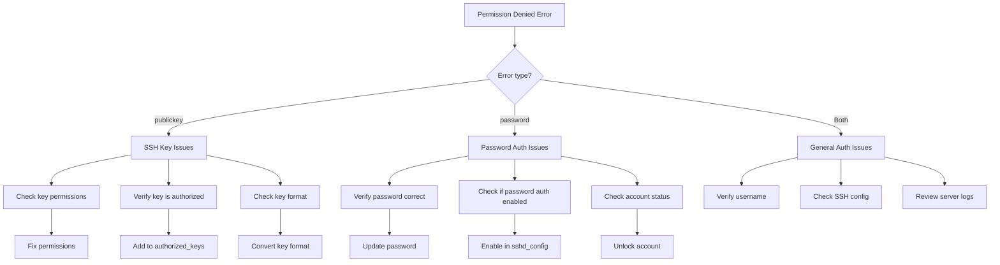
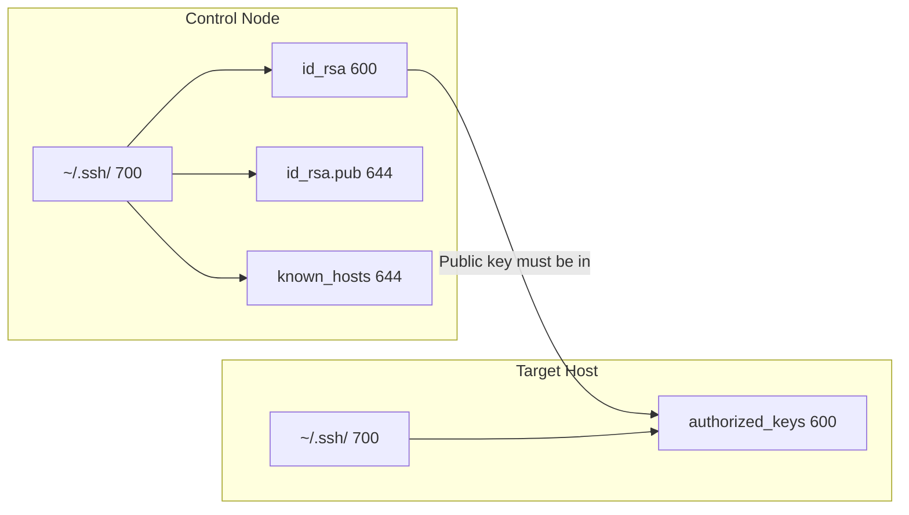
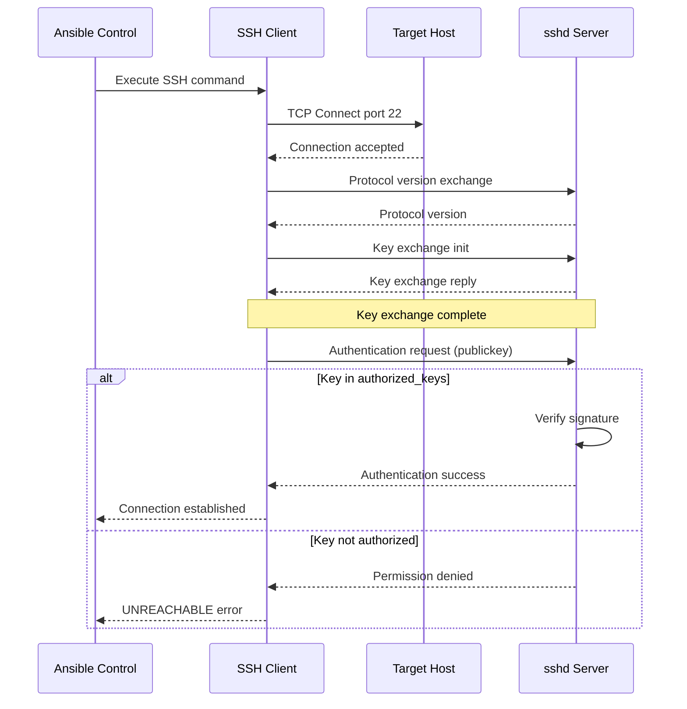
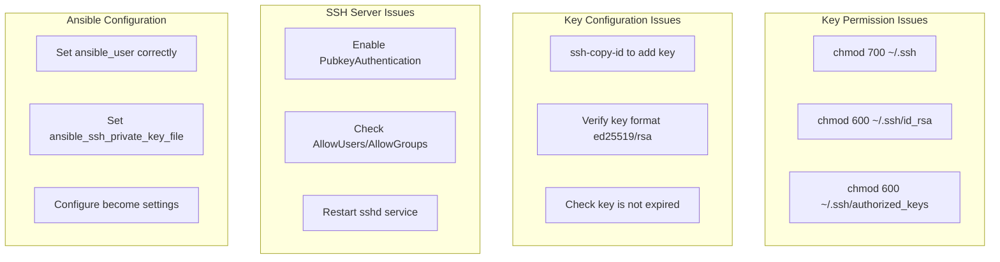

# How to Fix 'Permission Denied' SSH Errors in Ansible

Author: [nawazdhandala](https://www.github.com/nawazdhandala)

Tags: Ansible, DevOps, SSH, Security, Troubleshooting, Authentication, Linux

Description: Resolve SSH permission denied errors in Ansible by fixing key permissions, configuring proper authentication, and troubleshooting common SSH issues.

---

SSH "Permission Denied" errors are among the most common issues encountered when running Ansible playbooks. These errors prevent Ansible from connecting to target hosts and can stem from various authentication and permission problems. This guide provides comprehensive solutions to diagnose and fix these errors.

## Understanding the Error

When Ansible encounters SSH permission issues, you typically see errors like:

```
fatal: [webserver01]: UNREACHABLE! => {
    "changed": false,
    "msg": "Failed to connect to the host via ssh: Permission denied (publickey,password).",
    "unreachable": true
}
```

Or more specific variants:

```
Permission denied (publickey).
Permission denied (publickey,gssapi-keyex,gssapi-with-mic).
Permission denied, please try again.
```

## Diagnostic Flow



## Step 1: Verify SSH Key Permissions

Incorrect file permissions are the most common cause of SSH key authentication failures.

```bash
# Check current permissions on SSH directory and files
ls -la ~/.ssh/

# Expected output:
# drwx------  .ssh           (700 - owner only)
# -rw-------  id_rsa         (600 - owner read/write only)
# -rw-r--r--  id_rsa.pub     (644 - readable by all)
# -rw-r--r--  known_hosts    (644 - readable by all)
# -rw-------  authorized_keys (600 - owner only)
```

```bash
# Fix SSH directory and file permissions
# Set strict permissions on .ssh directory
chmod 700 ~/.ssh

# Set private key to be readable only by owner
chmod 600 ~/.ssh/id_rsa

# Set public key to be readable by all
chmod 644 ~/.ssh/id_rsa.pub

# Set authorized_keys to owner only
chmod 600 ~/.ssh/authorized_keys

# Set known_hosts to readable by all
chmod 644 ~/.ssh/known_hosts

# Ensure home directory is not group/world writable
chmod 755 ~
# Or more restrictive
chmod 700 ~
```

## Permission Requirements Diagram



## Step 2: Verify SSH Key Configuration

Ensure your SSH key is properly configured and the public key is on the target host.

```bash
# Generate a new SSH key pair if needed
# -t specifies key type (ed25519 is recommended)
# -C adds a comment to identify the key
ssh-keygen -t ed25519 -C "ansible@control-node"

# Or use RSA with 4096 bits for compatibility
ssh-keygen -t rsa -b 4096 -C "ansible@control-node"
```

```bash
# Copy public key to target host
# This adds your key to ~/.ssh/authorized_keys on the target
ssh-copy-id -i ~/.ssh/id_rsa.pub user@target-host

# If ssh-copy-id is not available, do it manually
cat ~/.ssh/id_rsa.pub | ssh user@target-host "mkdir -p ~/.ssh && chmod 700 ~/.ssh && cat >> ~/.ssh/authorized_keys && chmod 600 ~/.ssh/authorized_keys"
```

```bash
# Verify the key is in authorized_keys on target
ssh user@target-host "cat ~/.ssh/authorized_keys"

# Test SSH connection with verbose output
ssh -vvv -i ~/.ssh/id_rsa user@target-host
```

## Step 3: Check Ansible Configuration

Verify your Ansible inventory and configuration specify the correct authentication details.

```ini
# inventory/hosts.ini
# Specify SSH credentials for each host or group

[webservers]
web01 ansible_host=192.168.1.10 ansible_user=deploy
web02 ansible_host=192.168.1.11 ansible_user=deploy

[webservers:vars]
# Path to the SSH private key for this group
ansible_ssh_private_key_file=/home/ansible/.ssh/id_rsa
# Disable host key checking (use with caution)
ansible_ssh_common_args='-o StrictHostKeyChecking=no'
```

```yaml
# inventory/hosts.yml (YAML format)
all:
  children:
    webservers:
      hosts:
        web01:
          ansible_host: 192.168.1.10
        web02:
          ansible_host: 192.168.1.11
      vars:
        ansible_user: deploy
        ansible_ssh_private_key_file: /home/ansible/.ssh/id_rsa
        ansible_become: true
        ansible_become_method: sudo
```

```ini
# ansible.cfg
# Global SSH configuration for Ansible

[defaults]
# Default inventory file location
inventory = ./inventory/hosts.ini
# Default remote user
remote_user = deploy
# Default private key file
private_key_file = /home/ansible/.ssh/id_rsa
# Disable host key checking (not recommended for production)
host_key_checking = False
# Increase connection timeout
timeout = 30

[ssh_connection]
# SSH arguments for better connection handling
ssh_args = -C -o ControlMaster=auto -o ControlPersist=60s -o StrictHostKeyChecking=no
# Pipelining improves performance but requires requiretty disabled
pipelining = True
```

## Step 4: Configure SSH Server Settings

On the target host, verify SSH server allows your authentication method.

```bash
# View current SSH server configuration
sudo cat /etc/ssh/sshd_config | grep -E "^(PubkeyAuthentication|PasswordAuthentication|PermitRootLogin|AuthorizedKeysFile)"
```

```bash
# /etc/ssh/sshd_config
# Key settings for Ansible SSH access

# Enable public key authentication (required for key-based auth)
PubkeyAuthentication yes

# Location of authorized_keys file
AuthorizedKeysFile .ssh/authorized_keys

# Disable password authentication for security (optional)
PasswordAuthentication no

# Disable root login for security
PermitRootLogin no
# Or allow only with keys
PermitRootLogin prohibit-password

# Allow specific users
AllowUsers deploy ansible admin

# Allow specific groups
AllowGroups sshusers wheel
```

```bash
# After modifying sshd_config, restart SSH service
# On systemd-based systems
sudo systemctl restart sshd

# On older systems
sudo service ssh restart
```

## Step 5: Troubleshoot Common Issues

### Issue 1: Wrong Username

```yaml
# Verify the correct username in your playbook
---
- name: Test connection with correct user
  hosts: webservers
  # Specify the remote user explicitly
  remote_user: deploy

  tasks:
    - name: Test connectivity
      ansible.builtin.ping:
```

```bash
# Test with different users
ansible webservers -m ping -u deploy
ansible webservers -m ping -u root
ansible webservers -m ping -u admin
```

### Issue 2: SSH Key Not Being Used

```bash
# Check which key is being used
ssh -vvv user@target-host 2>&1 | grep "Trying private key"

# Output shows which keys SSH is attempting:
# debug1: Trying private key: /home/ansible/.ssh/id_rsa
# debug1: Trying private key: /home/ansible/.ssh/id_ecdsa
# debug1: Trying private key: /home/ansible/.ssh/id_ed25519
```

```bash
# Force Ansible to use a specific key
ansible webservers -m ping --private-key=/path/to/specific/key

# Or in playbook
# playbook.yml
---
- name: Use specific SSH key
  hosts: webservers
  vars:
    ansible_ssh_private_key_file: /path/to/specific/key
  tasks:
    - name: Test connection
      ansible.builtin.ping:
```

### Issue 3: SSH Agent Issues

```bash
# Start SSH agent if not running
eval $(ssh-agent -s)

# Add your key to the agent
ssh-add ~/.ssh/id_rsa

# List keys currently loaded in agent
ssh-add -l

# If you have passphrase-protected keys, add them
ssh-add ~/.ssh/id_rsa
# Enter passphrase when prompted
```

```bash
# Configure Ansible to use SSH agent forwarding
# ansible.cfg
[ssh_connection]
ssh_args = -o ForwardAgent=yes
```

### Issue 4: SELinux or AppArmor Blocking

```bash
# Check SELinux status
getenforce

# Check SELinux audit log for denials
sudo ausearch -m avc -ts recent | grep ssh

# Temporarily set SELinux to permissive for testing
sudo setenforce 0

# Restore correct SELinux context for .ssh directory
sudo restorecon -Rv ~/.ssh/
```

## Authentication Flow Diagram



## Step 6: Handle Privilege Escalation

Permission denied errors can also occur during privilege escalation (sudo/become).

```yaml
# playbook.yml
# Configure become/sudo correctly
---
- name: Tasks requiring privilege escalation
  hosts: webservers
  # Enable privilege escalation
  become: true
  # Method to use (sudo, su, pbrun, etc.)
  become_method: sudo
  # User to become (default: root)
  become_user: root

  tasks:
    - name: Install package (requires root)
      ansible.builtin.package:
        name: nginx
        state: present
```

```ini
# Configure sudoers on target host
# /etc/sudoers.d/ansible
# Allow deploy user to run sudo without password

# NOPASSWD allows sudo without password prompt
deploy ALL=(ALL) NOPASSWD: ALL

# Or restrict to specific commands
deploy ALL=(ALL) NOPASSWD: /usr/bin/systemctl, /usr/bin/apt-get
```

```bash
# Verify sudoers syntax before saving
sudo visudo -c -f /etc/sudoers.d/ansible

# Test sudo access
ssh deploy@target-host "sudo whoami"
# Should output: root
```

```yaml
# If sudo requires password, provide it securely
# playbook.yml
---
- name: Tasks with sudo password
  hosts: webservers
  become: true
  become_method: sudo
  # Prompt for sudo password
  vars_prompt:
    - name: ansible_become_password
      prompt: "Enter sudo password"
      private: true

  tasks:
    - name: Run privileged command
      ansible.builtin.command: whoami
      register: result

    - name: Show result
      ansible.builtin.debug:
        var: result.stdout
```

```bash
# Alternatively, pass sudo password via command line
ansible-playbook playbook.yml --ask-become-pass

# Or use a vault-encrypted variable
ansible-playbook playbook.yml -e "@secrets.yml" --ask-vault-pass
```

## Step 7: Debug SSH Connection

Use Ansible's built-in debugging to identify the exact issue.

```bash
# Maximum verbosity for SSH debugging
ansible webservers -m ping -vvvv

# Key things to look for in output:
# - Which SSH key is being tried
# - Authentication methods offered by server
# - Exact error message from SSH
```

```bash
# Test raw SSH connection through Ansible
ansible webservers -m raw -a "whoami" -vvv

# Check SSH configuration Ansible is using
ansible webservers -m debug -a "var=ansible_ssh_private_key_file"
```

```yaml
# playbook.yml
# Debug playbook to check connection details
---
- name: Debug SSH connection
  hosts: webservers
  gather_facts: no

  tasks:
    - name: Show connection variables
      ansible.builtin.debug:
        msg: |
          Host: {{ inventory_hostname }}
          Ansible Host: {{ ansible_host | default(inventory_hostname) }}
          User: {{ ansible_user | default('not set') }}
          Key File: {{ ansible_ssh_private_key_file | default('not set') }}
          Port: {{ ansible_port | default(22) }}

    - name: Test basic connectivity
      ansible.builtin.ping:

    - name: Get current user on remote
      ansible.builtin.command: whoami
      register: remote_user
      changed_when: false

    - name: Show remote user
      ansible.builtin.debug:
        var: remote_user.stdout
```

## Common Solutions Summary



## Quick Reference Commands

```bash
# Fix all common permission issues at once
chmod 700 ~/.ssh && \
chmod 600 ~/.ssh/id_rsa && \
chmod 644 ~/.ssh/id_rsa.pub && \
chmod 600 ~/.ssh/authorized_keys 2>/dev/null; \
chmod 644 ~/.ssh/known_hosts 2>/dev/null

# Test SSH connection
ssh -vvv -i ~/.ssh/id_rsa user@host

# Test Ansible connection
ansible all -m ping -vvvv

# Copy SSH key to new host
ssh-copy-id -i ~/.ssh/id_rsa.pub user@newhost

# Check SSH server configuration
sudo sshd -T | grep -E "pubkey|password|permitroot"

# View SSH authentication logs (on target)
sudo tail -f /var/log/auth.log      # Debian/Ubuntu
sudo tail -f /var/log/secure        # RHEL/CentOS
```

## Summary

SSH "Permission Denied" errors in Ansible typically stem from:

1. **Incorrect file permissions** - Fix with proper chmod commands
2. **Missing public key** - Use ssh-copy-id to deploy keys
3. **Wrong username** - Verify ansible_user configuration
4. **SSH server configuration** - Ensure PubkeyAuthentication is enabled
5. **Privilege escalation issues** - Configure sudoers correctly

By systematically checking each of these areas using the diagnostic flow and commands provided, you can quickly identify and resolve SSH permission issues in your Ansible automation.
