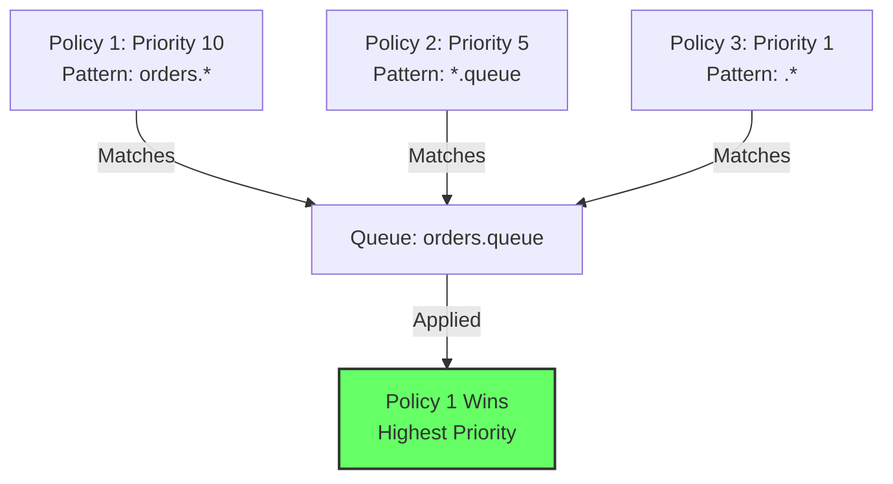
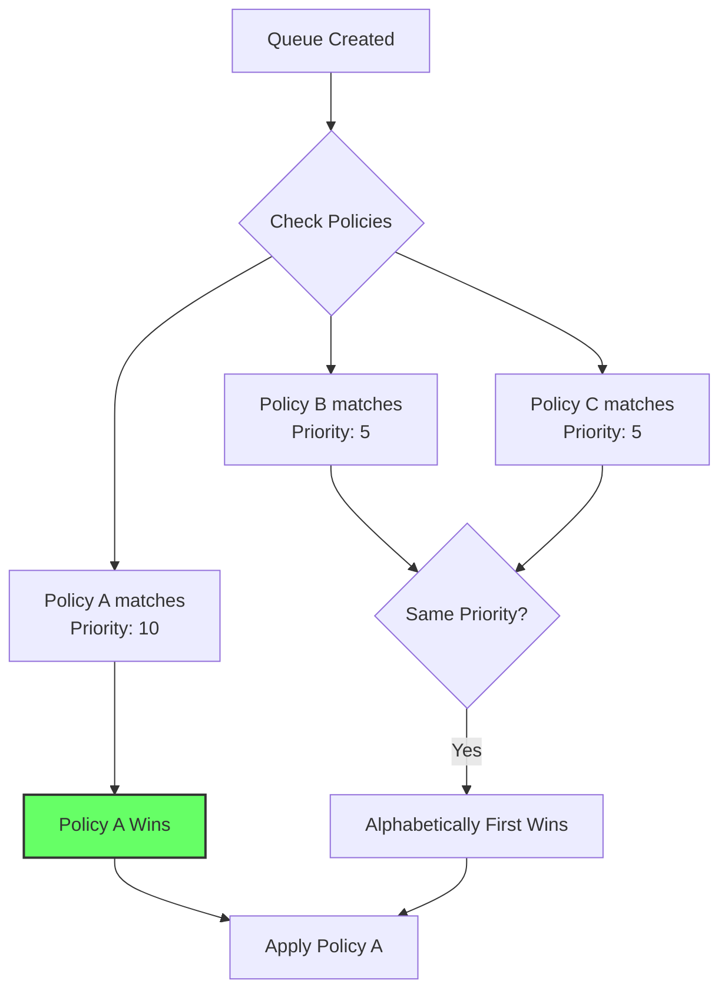

# How to Fix "Policy Not Applied" Errors in RabbitMQ

Author: [nawazdhandala](https://www.github.com/nawazdhandala)

Tags: RabbitMQ, Message Queue, Policies, Configuration, DevOps, Troubleshooting, Queue Management

Description: Learn how to diagnose and fix policy not applied errors in RabbitMQ by understanding policy priorities, patterns, and common configuration mistakes.

---

> RabbitMQ policies provide a powerful way to configure queues and exchanges dynamically. When policies fail to apply, it can lead to unexpected behavior and configuration drift.

Policies in RabbitMQ allow you to set queue parameters like TTL, max length, and dead letter exchanges without modifying application code. When policies do not apply as expected, this guide will help you diagnose and fix the issue.

---

## Understanding RabbitMQ Policies

### How Policies Work



### Policy Components

| Component | Description |
|-----------|-------------|
| Name | Unique identifier for the policy |
| Pattern | Regex pattern to match queue/exchange names |
| Definition | Configuration to apply (TTL, max-length, etc.) |
| Priority | Higher number wins when multiple policies match |
| Apply-to | queues, exchanges, or all |

---

## Common Causes of Policy Not Applied

### 1. Pattern Mismatch

The most common issue is the regex pattern not matching the queue name:

```bash
# Check if pattern matches your queue
rabbitmqctl list_policies

# Example output:
# Vhost  Name        Pattern    ApplyTo  Definition              Priority
# /      my-policy   ^orders$   queues   {"max-length":1000}     0
```

```python
import re

def test_policy_pattern(pattern, queue_name):
    """
    Test if a policy pattern matches a queue name.
    RabbitMQ uses Erlang regex, which is similar to PCRE.
    """
    try:
        regex = re.compile(pattern)
        if regex.match(queue_name):
            print(f"Pattern '{pattern}' MATCHES queue '{queue_name}'")
            return True
        else:
            print(f"Pattern '{pattern}' does NOT match queue '{queue_name}'")
            return False
    except re.error as e:
        print(f"Invalid regex pattern: {e}")
        return False

# Test examples
test_policy_pattern("^orders$", "orders")        # Matches
test_policy_pattern("^orders$", "orders-queue")  # Does NOT match
test_policy_pattern("^orders.*", "orders-queue") # Matches
test_policy_pattern("orders", "my-orders-queue") # Matches (substring)
```

### 2. Priority Conflicts

When multiple policies match, only the highest priority policy applies:

```bash
# List all policies with priorities
rabbitmqctl list_policies

# Check which policy is applied to a specific queue
rabbitmqctl list_queues name policy

# Example: Two policies matching same queue
rabbitmqctl set_policy high-priority ".*" '{"max-length":100}' --priority 10
rabbitmqctl set_policy low-priority ".*" '{"max-length":1000}' --priority 1
# Result: high-priority wins, max-length is 100
```

### 3. Apply-to Mismatch

Policies can target queues, exchanges, or both:

```bash
# Policy only for queues - will not affect exchanges
rabbitmqctl set_policy queue-policy "^orders" '{"max-length":1000}' --apply-to queues

# Policy only for exchanges - will not affect queues
rabbitmqctl set_policy exchange-policy "^orders" '{"alternate-exchange":"ae"}' --apply-to exchanges

# Policy for both
rabbitmqctl set_policy all-policy "^orders" '{"max-length":1000}' --apply-to all
```

### 4. Virtual Host Issues

Policies are scoped to virtual hosts:

```bash
# List policies for default vhost
rabbitmqctl list_policies -p /

# List policies for specific vhost
rabbitmqctl list_policies -p my-vhost

# Set policy for specific vhost
rabbitmqctl set_policy -p my-vhost my-policy ".*" '{"max-length":1000}'
```

---

## Diagnosing Policy Issues

### Step-by-Step Diagnosis

```bash
#!/bin/bash
# diagnose_policy.sh - Diagnose why a policy is not applied

QUEUE_NAME="$1"
VHOST="${2:-/}"

if [ -z "$QUEUE_NAME" ]; then
    echo "Usage: $0 <queue-name> [vhost]"
    exit 1
fi

echo "=== Diagnosing policy for queue: $QUEUE_NAME in vhost: $VHOST ==="
echo

# Step 1: Check if queue exists
echo "1. Checking if queue exists..."
rabbitmqctl list_queues -p "$VHOST" name | grep -q "^$QUEUE_NAME$"
if [ $? -eq 0 ]; then
    echo "   Queue exists"
else
    echo "   ERROR: Queue does not exist!"
    exit 1
fi

# Step 2: List all policies
echo
echo "2. Listing all policies for vhost..."
rabbitmqctl list_policies -p "$VHOST"

# Step 3: Check which policy is applied
echo
echo "3. Checking applied policy..."
rabbitmqctl list_queues -p "$VHOST" name policy | grep "^$QUEUE_NAME"

# Step 4: Get queue details
echo
echo "4. Getting queue effective arguments..."
curl -s -u guest:guest "http://localhost:15672/api/queues/$(echo $VHOST | sed 's/\//%2F/g')/$QUEUE_NAME" | jq '{
    name: .name,
    policy: .policy,
    effective_policy_definition: .effective_policy_definition,
    arguments: .arguments
}'

echo
echo "=== Diagnosis complete ==="
```

### Using the Management API

```python
import requests
import json
from urllib.parse import quote

class PolicyDiagnostics:
    """
    Diagnose RabbitMQ policy application issues.
    """

    def __init__(self, host='localhost', port=15672, username='guest', password='guest'):
        self.base_url = f'http://{host}:{port}/api'
        self.auth = (username, password)

    def get_policies(self, vhost='/'):
        """Get all policies for a vhost."""
        vhost_encoded = quote(vhost, safe='')
        url = f'{self.base_url}/policies/{vhost_encoded}'
        response = requests.get(url, auth=self.auth)
        return response.json()

    def get_queue_details(self, queue_name, vhost='/'):
        """Get detailed queue information including applied policy."""
        vhost_encoded = quote(vhost, safe='')
        queue_encoded = quote(queue_name, safe='')
        url = f'{self.base_url}/queues/{vhost_encoded}/{queue_encoded}'
        response = requests.get(url, auth=self.auth)
        return response.json()

    def diagnose_queue_policy(self, queue_name, vhost='/'):
        """
        Diagnose why a policy might not be applied to a queue.
        """
        print(f"\n=== Policy Diagnosis for Queue: {queue_name} ===\n")

        # Get queue details
        try:
            queue = self.get_queue_details(queue_name, vhost)
        except Exception as e:
            print(f"ERROR: Cannot get queue details: {e}")
            return

        # Current policy
        applied_policy = queue.get('policy')
        print(f"Applied Policy: {applied_policy or 'None'}")

        # Effective policy definition
        effective_def = queue.get('effective_policy_definition', {})
        print(f"Effective Policy Definition: {json.dumps(effective_def, indent=2)}")

        # Queue arguments (set at creation time)
        arguments = queue.get('arguments', {})
        print(f"Queue Arguments: {json.dumps(arguments, indent=2)}")

        # Get all policies and check matches
        policies = self.get_policies(vhost)
        print(f"\n--- Policies that match this queue ---")

        import re
        matching_policies = []

        for policy in policies:
            pattern = policy.get('pattern', '')
            apply_to = policy.get('apply-to', 'all')
            priority = policy.get('priority', 0)

            # Check if policy applies to queues
            if apply_to not in ['queues', 'all']:
                continue

            # Check if pattern matches
            try:
                if re.match(pattern, queue_name):
                    matching_policies.append({
                        'name': policy['name'],
                        'pattern': pattern,
                        'priority': priority,
                        'definition': policy.get('definition', {})
                    })
            except re.error:
                print(f"  Invalid regex in policy: {policy['name']}")

        # Sort by priority
        matching_policies.sort(key=lambda x: x['priority'], reverse=True)

        for mp in matching_policies:
            winner = " <-- APPLIED" if mp['name'] == applied_policy else ""
            print(f"  {mp['name']} (priority: {mp['priority']}){winner}")
            print(f"    Pattern: {mp['pattern']}")
            print(f"    Definition: {json.dumps(mp['definition'])}")

        if not matching_policies:
            print("  No matching policies found!")
            print("\n  SOLUTION: Create a policy with a pattern matching this queue")

        return {
            'queue': queue_name,
            'applied_policy': applied_policy,
            'matching_policies': matching_policies,
            'queue_arguments': arguments
        }

# Usage
diag = PolicyDiagnostics()
diag.diagnose_queue_policy('orders-queue')
```

---

## Fixing Policy Issues

### Fix 1: Correct the Pattern

```bash
# Wrong: Pattern too specific
rabbitmqctl set_policy my-policy "^orders$" '{"max-length":1000}'
# This only matches exactly "orders", not "orders-queue"

# Right: Pattern matches all orders queues
rabbitmqctl set_policy my-policy "^orders.*" '{"max-length":1000}'
# This matches "orders", "orders-queue", "orders-priority", etc.

# Or use a more general pattern
rabbitmqctl set_policy my-policy ".*orders.*" '{"max-length":1000}'
# This matches "my-orders-queue", "orders-new", etc.
```

### Fix 2: Adjust Priority

```bash
# Check current policies
rabbitmqctl list_policies

# If another policy has higher priority, increase yours
rabbitmqctl set_policy my-policy "^orders.*" '{"max-length":1000}' --priority 100

# Or remove the conflicting policy
rabbitmqctl clear_policy conflicting-policy
```

### Fix 3: Correct Apply-to Setting

```bash
# Make sure policy applies to the correct type
# For queues:
rabbitmqctl set_policy queue-policy "^orders.*" '{"max-length":1000}' --apply-to queues

# For exchanges:
rabbitmqctl set_policy exchange-policy "^orders.*" '{"alternate-exchange":"ae"}' --apply-to exchanges

# For both:
rabbitmqctl set_policy combined-policy "^orders.*" '{"max-length":1000}' --apply-to all
```

### Fix 4: Virtual Host Mismatch

```bash
# Check which vhost the queue is in
rabbitmqctl list_queues -p / name
rabbitmqctl list_queues -p my-vhost name

# Set policy in the correct vhost
rabbitmqctl set_policy -p my-vhost my-policy "^orders.*" '{"max-length":1000}'
```

---

## Policy Management Best Practices

### Naming Conventions

```bash
# Use descriptive, hierarchical names
rabbitmqctl set_policy queues.orders.retention "^orders\." '{"x-message-ttl":86400000}'
rabbitmqctl set_policy queues.logs.limits "^logs\." '{"max-length":100000}'
rabbitmqctl set_policy queues.default.dlx ".*" '{"dead-letter-exchange":"dlx"}'
```

### Policy Templates

```python
import subprocess
import json

class PolicyManager:
    """
    Manage RabbitMQ policies with templates.
    """

    # Common policy templates
    TEMPLATES = {
        'high-availability': {
            'ha-mode': 'exactly',
            'ha-params': 2,
            'ha-sync-mode': 'automatic'
        },
        'message-ttl-1h': {
            'message-ttl': 3600000
        },
        'message-ttl-24h': {
            'message-ttl': 86400000
        },
        'max-length-10k': {
            'max-length': 10000,
            'overflow': 'reject-publish'
        },
        'max-length-100k': {
            'max-length': 100000,
            'overflow': 'drop-head'
        },
        'dead-letter': {
            'dead-letter-exchange': 'dlx',
            'dead-letter-routing-key': 'dead-letter'
        },
        'lazy-queue': {
            'queue-mode': 'lazy'
        }
    }

    def create_policy(self, name, pattern, template_name, priority=0,
                      vhost='/', apply_to='queues', extra_definitions=None):
        """
        Create a policy using a template.
        """
        if template_name not in self.TEMPLATES:
            raise ValueError(f"Unknown template: {template_name}")

        definition = self.TEMPLATES[template_name].copy()

        if extra_definitions:
            definition.update(extra_definitions)

        cmd = [
            'rabbitmqctl', 'set_policy',
            '-p', vhost,
            '--priority', str(priority),
            '--apply-to', apply_to,
            name,
            pattern,
            json.dumps(definition)
        ]

        result = subprocess.run(cmd, capture_output=True, text=True)

        if result.returncode != 0:
            raise Exception(f"Failed to create policy: {result.stderr}")

        print(f"Created policy: {name}")
        print(f"  Pattern: {pattern}")
        print(f"  Definition: {json.dumps(definition)}")

        return True

    def apply_standard_policies(self, vhost='/'):
        """
        Apply a standard set of policies for production.
        """
        policies = [
            # Dead letter for all queues
            ('default-dlx', '.*', 'dead-letter', 1),

            # Lazy queues for logs
            ('logs-lazy', '^logs\\.', 'lazy-queue', 10),

            # TTL for temporary queues
            ('temp-ttl', '^temp\\.', 'message-ttl-1h', 10),

            # High availability for critical queues
            ('critical-ha', '^critical\\.', 'high-availability', 20),

            # Length limits for event queues
            ('events-limit', '^events\\.', 'max-length-100k', 10),
        ]

        for name, pattern, template, priority in policies:
            self.create_policy(name, pattern, template, priority, vhost)

# Usage
manager = PolicyManager()
manager.apply_standard_policies()

# Custom policy with template
manager.create_policy(
    name='orders-config',
    pattern='^orders\\.',
    template_name='max-length-10k',
    priority=15,
    extra_definitions={'message-ttl': 7200000}  # 2 hours
)
```

---

## Verifying Policy Application

### Check Effective Configuration

```python
import requests
from urllib.parse import quote

def verify_policy_applied(queue_name, expected_config, vhost='/', host='localhost'):
    """
    Verify that a policy has been correctly applied to a queue.
    """
    vhost_encoded = quote(vhost, safe='')
    queue_encoded = quote(queue_name, safe='')

    url = f'http://{host}:15672/api/queues/{vhost_encoded}/{queue_encoded}'
    response = requests.get(url, auth=('guest', 'guest'))
    queue = response.json()

    # Get effective policy definition
    effective = queue.get('effective_policy_definition', {})

    print(f"Queue: {queue_name}")
    print(f"Applied Policy: {queue.get('policy', 'None')}")
    print(f"Effective Configuration: {effective}")

    # Verify expected configuration
    all_match = True
    for key, expected_value in expected_config.items():
        actual_value = effective.get(key)

        if actual_value == expected_value:
            print(f"  {key}: {actual_value} (OK)")
        else:
            print(f"  {key}: {actual_value} (EXPECTED: {expected_value})")
            all_match = False

    return all_match

# Verify policy application
success = verify_policy_applied(
    'orders-queue',
    expected_config={
        'max-length': 10000,
        'message-ttl': 7200000
    }
)

if success:
    print("\nPolicy applied correctly!")
else:
    print("\nPolicy NOT applied correctly - check configuration")
```

---

## Policy Conflict Resolution



### Resolution Rules

1. **Highest priority wins** - Policy with highest priority number is applied
2. **Same priority** - Alphabetically first policy name wins
3. **Queue arguments override** - Some settings in queue arguments cannot be overridden by policies

```bash
# Example: Resolving conflicts

# These two policies have same priority
rabbitmqctl set_policy alpha-policy "^orders" '{"max-length":100}' --priority 10
rabbitmqctl set_policy beta-policy "^orders" '{"max-length":200}' --priority 10
# Result: alpha-policy wins (alphabetically first)

# Fix by increasing priority
rabbitmqctl set_policy beta-policy "^orders" '{"max-length":200}' --priority 11
# Now beta-policy wins
```

---

## Troubleshooting Checklist

```markdown
## Policy Not Applied Checklist

[ ] 1. Verify queue exists in expected vhost
    - rabbitmqctl list_queues -p <vhost> name

[ ] 2. Check policy pattern matches queue name
    - Use regex tester with queue name

[ ] 3. Verify policy applies to correct type
    - Check --apply-to setting (queues/exchanges/all)

[ ] 4. Check for higher priority conflicting policies
    - rabbitmqctl list_policies

[ ] 5. Verify policy is in correct vhost
    - rabbitmqctl list_policies -p <vhost>

[ ] 6. Check if queue arguments override policy
    - Some arguments set at queue creation take precedence

[ ] 7. Restart consumers after policy change
    - Some changes require reconnection to take effect

[ ] 8. Check RabbitMQ logs for errors
    - tail -f /var/log/rabbitmq/rabbit@hostname.log
```

---

## Conclusion

Fixing policy not applied errors requires systematic diagnosis:

- **Verify pattern matching** using regex testing
- **Check priority conflicts** between multiple policies
- **Ensure correct apply-to** setting for your target type
- **Confirm virtual host** matches where your queue exists
- **Use management API** for detailed diagnostics
- **Document and template** policies for consistency

---

*Need to monitor your RabbitMQ configuration? [OneUptime](https://oneuptime.com) provides comprehensive monitoring with alerting on configuration drift and policy changes.*
