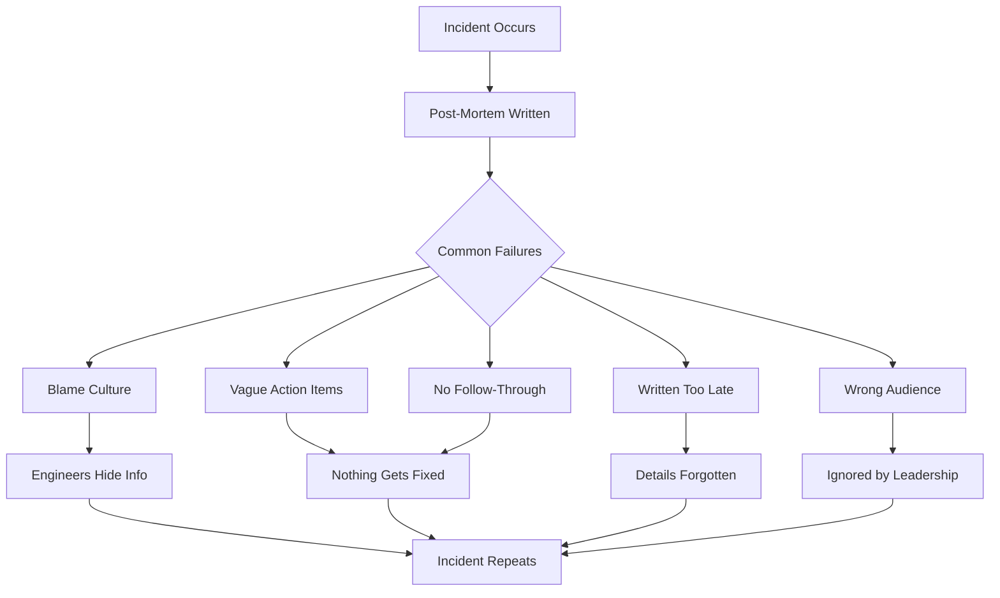
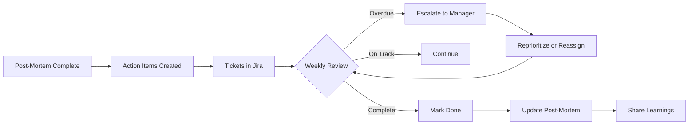

# How to Fix 'Post-Mortem' Documentation Issues

Author: [nawazdhandala](https://www.github.com/nawazdhandala)

Tags: Post-Mortem, Incident Management, Documentation, SRE, DevOps, Blameless Culture, Learning

Description: Learn how to write effective post-mortems that drive real improvements, avoid common pitfalls, and build a culture of learning from incidents.

---

Your last three post-mortems are gathering dust in a forgotten wiki. The action items were never completed. The same incident happened again last month. Sound familiar? Post-mortems fail not because teams do not write them, but because they write them wrong. Here is how to fix that.

## Why Post-Mortems Fail



## The Blameless Post-Mortem Template

Start with a template that guides toward useful outcomes:

```markdown
# Post-Mortem: [Incident Title]

**Incident ID:** INC-XXXX
**Date:** YYYY-MM-DD
**Duration:** X hours Y minutes
**Severity:** SEV-X
**Author:** [Name]
**Reviewers:** [Names]

---

## Executive Summary

[2-3 sentences describing what happened, impact, and resolution.
Write this for someone with 30 seconds to read.]

**Impact:**
- Users affected: [number or percentage]
- Revenue impact: [estimate if applicable]
- SLA impact: [if applicable]

---

## Timeline

All times in UTC.

| Time | Event |
|------|-------|
| 14:00 | Deployment of auth-service v2.3.4 begins |
| 14:05 | Deployment completes, canary looks healthy |
| 14:15 | First customer report of login failures |
| 14:18 | Alert fires: AuthServiceErrorRate > 5% |
| 14:20 | On-call acknowledges, begins investigation |
| 14:25 | Root cause identified: session validation bug |
| 14:30 | Decision to rollback |
| 14:35 | Rollback initiated |
| 14:40 | Rollback complete, errors decreasing |
| 14:50 | Error rate back to normal |
| 15:00 | Incident resolved |

---

## Root Cause Analysis

### What Happened

[Technical explanation of the failure. Be specific about the chain of events.]

The deployment included a change to session validation logic. The new code
assumed session tokens always contained a `user_id` field, but tokens created
before January 2025 used `userId` (camelCase). When users with old tokens
tried to authenticate, the validation threw a null pointer exception.

### Why It Happened

[Use the "5 Whys" technique to dig deeper]

1. **Why did the service fail?**
   Session validation threw exceptions for old token formats.

2. **Why were old tokens not handled?**
   The developer was unaware of the legacy format.

3. **Why was the developer unaware?**
   No documentation existed for token format history.

4. **Why was there no documentation?**
   Token format changes were considered internal implementation details.

5. **Why did testing not catch this?**
   Test data only included new-format tokens.

### Contributing Factors

- [ ] Code change
- [x] Missing documentation
- [x] Inadequate testing
- [ ] Configuration change
- [ ] Infrastructure issue
- [ ] External dependency
- [ ] Human error
- [ ] Process gap

---

## Detection

**How was the incident detected?**
Customer support reported login failures. Automated alerting fired 3 minutes later.

**Could we have detected it sooner?**
Yes. Our canary deployment only tested new logins, not existing sessions.
Adding session validation to canary checks would have caught this before
full rollout.

---

## Response

**What went well:**
- On-call responded within 2 minutes of alert
- Root cause identified quickly (5 minutes)
- Rollback decision made promptly
- Communication was clear in #incidents channel

**What could have been better:**
- Customer reports came before our alerts
- Rollback took 10 minutes (could be faster with one-click rollback)
- No status page update until 20 minutes in

---

## Action Items

[SMART: Specific, Measurable, Achievable, Relevant, Time-bound]

| Priority | Action | Owner | Due Date | Ticket |
|----------|--------|-------|----------|--------|
| P0 | Fix session validation to handle both formats | @alice | 2026-01-28 | JIRA-1234 |
| P1 | Add legacy token test cases to CI | @bob | 2026-02-01 | JIRA-1235 |
| P1 | Document token format history | @alice | 2026-02-01 | JIRA-1236 |
| P2 | Add session validation to canary checks | @carol | 2026-02-15 | JIRA-1237 |
| P2 | Implement one-click rollback for auth-service | @david | 2026-02-28 | JIRA-1238 |

---

## Lessons Learned

1. **Legacy data formats are landmines.** Always check for historical variations
   when modifying data handling code.

2. **Canary deployments need realistic traffic.** Our canary only tested happy
   paths with new data.

3. **Customer reports should not beat our alerts.** We need better coverage of
   user-facing flows.

---

## Appendix

### Relevant Logs

```
2026-01-24T14:15:23Z ERROR [auth-service] NullPointerException in SessionValidator
  at com.company.auth.SessionValidator.validate(SessionValidator.java:45)
  at com.company.auth.AuthController.login(AuthController.java:78)
Caused by: token.user_id is null for token abc123...
```

### Relevant Metrics

[Link to Grafana dashboard snapshot]

### Related Incidents

- INC-892: Similar issue with legacy user IDs (2025-06-15)
```

## Automate Post-Mortem Creation

Make it easy to start a post-mortem:

```python
# postmortem_generator.py
# Automatically create post-mortem document from incident data

from datetime import datetime
import requests

class PostMortemGenerator:
    def __init__(self, incident_api, docs_api):
        self.incident_api = incident_api
        self.docs_api = docs_api

    def generate(self, incident_id):
        """Generate post-mortem document from incident data"""

        # Fetch incident details
        incident = self._get_incident(incident_id)
        timeline = self._get_timeline(incident_id)
        alerts = self._get_related_alerts(incident_id)

        # Build document
        document = self._build_document(incident, timeline, alerts)

        # Create in documentation system
        doc_url = self._create_document(document, incident_id)

        # Notify team
        self._notify_team(incident, doc_url)

        return doc_url

    def _get_incident(self, incident_id):
        response = requests.get(f"{self.incident_api}/incidents/{incident_id}")
        return response.json()

    def _get_timeline(self, incident_id):
        response = requests.get(f"{self.incident_api}/incidents/{incident_id}/timeline")
        return response.json()

    def _get_related_alerts(self, incident_id):
        response = requests.get(f"{self.incident_api}/incidents/{incident_id}/alerts")
        return response.json()

    def _build_document(self, incident, timeline, alerts):
        """Assemble post-mortem content"""

        # Format timeline
        timeline_md = self._format_timeline(timeline)

        # Calculate duration
        duration = self._calculate_duration(incident)

        # Build document
        return f"""# Post-Mortem: {incident['title']}

**Incident ID:** {incident['id']}
**Date:** {incident['created_at'][:10]}
**Duration:** {duration}
**Severity:** {incident['severity']}
**Author:** [Your Name]
**Reviewers:** [Add reviewers]

---

## Executive Summary

[TODO: Write 2-3 sentence summary]

**Impact:**
- Users affected: {incident.get('users_affected', '[TODO]')}
- Revenue impact: [TODO]
- SLA impact: [TODO]

---

## Timeline

All times in UTC.

{timeline_md}

---

## Root Cause Analysis

### What Happened

[TODO: Technical explanation]

### Why It Happened

1. **Why did the service fail?**
   [TODO]

2. **Why?**
   [TODO]

3. **Why?**
   [TODO]

### Contributing Factors

- [ ] Code change
- [ ] Missing documentation
- [ ] Inadequate testing
- [ ] Configuration change
- [ ] Infrastructure issue
- [ ] External dependency
- [ ] Human error
- [ ] Process gap

---

## Detection

**How was the incident detected?**
{self._format_detection(alerts)}

**Could we have detected it sooner?**
[TODO]

---

## Response

**What went well:**
- [TODO]

**What could have been better:**
- [TODO]

---

## Action Items

| Priority | Action | Owner | Due Date | Ticket |
|----------|--------|-------|----------|--------|
| P0 | [TODO: Immediate fix] | @owner | {self._due_date(7)} | |
| P1 | [TODO: Prevention] | @owner | {self._due_date(14)} | |
| P2 | [TODO: Improvement] | @owner | {self._due_date(30)} | |

---

## Lessons Learned

1. [TODO]

---

## Appendix

### Related Alerts
{self._format_alerts(alerts)}
"""

    def _format_timeline(self, timeline):
        rows = ["| Time | Event |", "|------|-------|"]
        for event in timeline:
            time = event['timestamp'][11:16]  # Extract HH:MM
            rows.append(f"| {time} | {event['description']} |")
        return "\n".join(rows)

    def _calculate_duration(self, incident):
        if incident.get('resolved_at'):
            start = datetime.fromisoformat(incident['created_at'].replace('Z', '+00:00'))
            end = datetime.fromisoformat(incident['resolved_at'].replace('Z', '+00:00'))
            delta = end - start
            hours = delta.seconds // 3600
            minutes = (delta.seconds % 3600) // 60
            return f"{hours} hours {minutes} minutes"
        return "[Ongoing]"

    def _due_date(self, days):
        return (datetime.now() + timedelta(days=days)).strftime('%Y-%m-%d')

    def _format_detection(self, alerts):
        if alerts:
            first_alert = alerts[0]
            return f"Alert '{first_alert['name']}' fired at {first_alert['timestamp']}"
        return "[TODO: Document how incident was detected]"

    def _format_alerts(self, alerts):
        if not alerts:
            return "No automated alerts recorded."
        return "\n".join([f"- {a['name']} at {a['timestamp']}" for a in alerts])

    def _create_document(self, content, incident_id):
        response = requests.post(
            f"{self.docs_api}/documents",
            json={
                'title': f"Post-Mortem: {incident_id}",
                'content': content,
                'folder': 'post-mortems'
            }
        )
        return response.json()['url']

    def _notify_team(self, incident, doc_url):
        # Send Slack notification
        message = {
            "text": f"Post-mortem document created for {incident['id']}",
            "blocks": [
                {
                    "type": "section",
                    "text": {
                        "type": "mrkdwn",
                        "text": f"*Post-Mortem Ready for Review*\n"
                                f"Incident: {incident['title']}\n"
                                f"Please complete the TODO sections and add reviewers."
                    }
                },
                {
                    "type": "actions",
                    "elements": [
                        {
                            "type": "button",
                            "text": {"type": "plain_text", "text": "Open Document"},
                            "url": doc_url
                        }
                    ]
                }
            ]
        }
        # Send to Slack
```

## Track Action Item Completion

Post-mortems are useless without follow-through:



```python
# action_item_tracker.py
# Ensure post-mortem action items get completed

class ActionItemTracker:
    def __init__(self, jira_client, slack_client):
        self.jira = jira_client
        self.slack = slack_client

    def create_action_items(self, postmortem_id, items):
        """Create Jira tickets for each action item"""

        tickets = []
        for item in items:
            ticket = self.jira.create_issue(
                project='OPS',
                summary=f"[PM-{postmortem_id}] {item['action']}",
                description=f"Action item from post-mortem {postmortem_id}\n\n"
                           f"Priority: {item['priority']}\n"
                           f"Due: {item['due_date']}",
                assignee=item['owner'],
                due_date=item['due_date'],
                labels=['post-mortem', f'pm-{postmortem_id}']
            )
            tickets.append(ticket)

        return tickets

    def check_overdue_items(self):
        """Find and report overdue action items"""

        overdue = self.jira.search(
            "labels = post-mortem AND "
            "status != Done AND "
            "due < now()"
        )

        if overdue:
            self._send_overdue_report(overdue)

        return overdue

    def _send_overdue_report(self, items):
        """Send weekly overdue report"""

        by_owner = {}
        for item in items:
            owner = item['assignee']
            if owner not in by_owner:
                by_owner[owner] = []
            by_owner[owner].append(item)

        message = "*Overdue Post-Mortem Action Items*\n\n"

        for owner, owner_items in by_owner.items():
            message += f"*@{owner}* ({len(owner_items)} items):\n"
            for item in owner_items:
                days_overdue = (datetime.now() - item['due_date']).days
                message += f"  - {item['key']}: {item['summary']} ({days_overdue}d overdue)\n"
            message += "\n"

        self.slack.post_message('#engineering', message)

    def get_completion_metrics(self, days=90):
        """Calculate action item completion rate"""

        all_items = self.jira.search(
            f"labels = post-mortem AND created >= -{days}d"
        )

        completed = [i for i in all_items if i['status'] == 'Done']
        on_time = [i for i in completed if i['resolved_date'] <= i['due_date']]

        return {
            'total': len(all_items),
            'completed': len(completed),
            'completion_rate': len(completed) / len(all_items) if all_items else 0,
            'on_time_rate': len(on_time) / len(completed) if completed else 0,
            'avg_days_to_complete': self._avg_completion_time(completed)
        }
```

## Run Effective Post-Mortem Meetings

The meeting matters as much as the document:

```yaml
# postmortem-meeting-guide.yaml
# How to run a productive post-mortem meeting

before_meeting:
  - Document should be 80% complete before meeting
  - All participants should read the document
  - Timeline should be verified by responders
  - Schedule within 5 business days of incident

agenda:
  - duration: 5 min
    topic: "Ground rules"
    notes: |
      - This is blameless - we focus on systems, not people
      - Assume everyone acted with best intentions
      - Goal is learning, not punishment

  - duration: 10 min
    topic: "Timeline review"
    notes: |
      - Walk through events chronologically
      - Ask: "Is anything missing?"
      - Ask: "Is anything incorrect?"

  - duration: 15 min
    topic: "Root cause deep dive"
    notes: |
      - Use 5 Whys technique
      - Look for systemic issues, not individual mistakes
      - Ask: "What made this possible?"

  - duration: 10 min
    topic: "Detection and response review"
    notes: |
      - How did we find out?
      - How could we find out faster?
      - What helped our response?
      - What hindered our response?

  - duration: 15 min
    topic: "Action items"
    notes: |
      - Review proposed items
      - Assign owners and due dates
      - Prioritize ruthlessly - fewer items done > many items ignored
      - Create tickets before meeting ends

  - duration: 5 min
    topic: "Closing"
    notes: |
      - Summarize key learnings
      - Thank responders
      - Set follow-up review date

facilitation_tips:
  - Keep discussion focused on facts, not blame
  - Ask open-ended questions
  - Ensure quieter voices are heard
  - Park tangential topics for later
  - End on time
```

## Best Practices

1. **Write within 48 hours** - Memory fades fast
2. **Keep it blameless** - Focus on systems, not people
3. **Be specific** - Vague action items never get done
4. **Limit action items** - 3-5 items that will actually happen
5. **Assign owners and dates** - Unassigned items are abandoned items
6. **Track completion** - Review action items weekly
7. **Share learnings** - Other teams can benefit from your experience
8. **Review periodically** - Check if similar incidents have been prevented

---

Good post-mortems transform incidents from painful experiences into valuable learning opportunities. The goal is not to assign blame but to make your systems more resilient. Write them promptly, track the action items, and your team will stop repeating the same mistakes.
