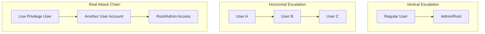

# How to Fix "Privilege Escalation" Vulnerabilities

Author: [nawazdhandala](https://www.github.com/nawazdhandala)

Tags: Security, Vulnerabilities, Privilege Escalation, DevSecOps, Access Control, Linux, Containers

Description: A practical guide to identifying and fixing privilege escalation vulnerabilities in your applications, containers, and infrastructure.

---

Privilege escalation is one of the most dangerous vulnerability classes. It allows attackers who have gained limited access to elevate their permissions to admin or root level. Once they achieve this, the entire system is compromised. Let's look at how to identify, prevent, and fix these vulnerabilities.

## Understanding Privilege Escalation

There are two types of privilege escalation:



**Vertical escalation** means gaining higher privileges (user to admin). **Horizontal escalation** means accessing another user's resources at the same privilege level. Both are serious, and attackers often chain them together.

## Common Privilege Escalation Vectors

### 1. Insecure Direct Object References (IDOR)

This happens when you expose internal object IDs without proper authorization checks.

**Vulnerable Code (Node.js):**

```javascript
// BAD: No authorization check - anyone can access any user's data
app.get('/api/users/:userId/profile', async (req, res) => {
  const user = await User.findById(req.params.userId);
  res.json(user);
});
```

**Fixed Code:**

```javascript
// GOOD: Verify the requesting user owns this resource
app.get('/api/users/:userId/profile', authenticate, async (req, res) => {
  // Check if the authenticated user is requesting their own data
  // or has admin privileges
  if (req.user.id !== req.params.userId && !req.user.isAdmin) {
    return res.status(403).json({ error: 'Access denied' });
  }

  const user = await User.findById(req.params.userId);
  if (!user) {
    return res.status(404).json({ error: 'User not found' });
  }

  res.json(user);
});
```

### 2. Insecure Role Assignment

Never trust client-provided role information.

**Vulnerable Code (Python/Flask):**

```python
# BAD: Role comes from user input
@app.route('/api/register', methods=['POST'])
def register():
    data = request.get_json()
    user = User(
        username=data['username'],
        password=hash_password(data['password']),
        role=data.get('role', 'user')  # Attacker can set role=admin
    )
    db.session.add(user)
    db.session.commit()
    return jsonify({'status': 'created'})
```

**Fixed Code:**

```python
# GOOD: Role is server-controlled, never from user input
ALLOWED_SELF_REGISTRATION_ROLES = {'user', 'viewer'}

@app.route('/api/register', methods=['POST'])
def register():
    data = request.get_json()

    # Ignore any role from user input - always default to lowest privilege
    user = User(
        username=data['username'],
        password=hash_password(data['password']),
        role='user'  # Always start with minimum privileges
    )
    db.session.add(user)
    db.session.commit()
    return jsonify({'status': 'created'})

# Separate admin-only endpoint for role assignment
@app.route('/api/admin/users/<user_id>/role', methods=['PUT'])
@require_admin  # Decorator that checks admin privileges
def update_user_role(user_id):
    data = request.get_json()
    user = User.query.get_or_404(user_id)
    user.role = data['role']
    db.session.commit()
    return jsonify({'status': 'updated'})
```

### 3. SUID/SGID Binary Exploitation

On Linux, SUID binaries run with the file owner's privileges. Misconfigured SUID binaries are a common privilege escalation path.

**Find SUID binaries:**

```bash
# Find all SUID binaries on the system
find / -perm -4000 -type f 2>/dev/null

# Find SGID binaries
find / -perm -2000 -type f 2>/dev/null

# Check for dangerous SUID binaries
find / -perm -4000 -type f 2>/dev/null | xargs ls -la | grep -E '(nmap|vim|find|bash|more|less|nano|cp|mv|awk|python|perl|ruby)'
```

**Remove unnecessary SUID bits:**

```bash
# Remove SUID from unnecessary binaries
chmod u-s /usr/bin/suspicious-binary

# If you need the functionality, use capabilities instead
# Remove SUID
chmod u-s /usr/bin/ping
# Add only the network capability it needs
setcap cap_net_raw+ep /usr/bin/ping
```

### 4. Container Escape Vulnerabilities

Running containers as root or with excessive privileges enables container escapes.

**Vulnerable Dockerfile:**

```dockerfile
# BAD: Running as root with full privileges
FROM ubuntu:22.04
RUN apt-get update && apt-get install -y myapp
CMD ["myapp"]
```

**Secure Dockerfile:**

```dockerfile
# GOOD: Non-root user with minimal privileges
FROM ubuntu:22.04

# Install dependencies as root
RUN apt-get update && apt-get install -y myapp \
    && rm -rf /var/lib/apt/lists/*

# Create non-root user
RUN groupadd -r appgroup && useradd -r -g appgroup appuser

# Set ownership and switch to non-root user
RUN chown -R appuser:appgroup /app
USER appuser

# Drop all capabilities by default
CMD ["myapp"]
```

**Secure Kubernetes Pod:**

```yaml
apiVersion: v1
kind: Pod
metadata:
  name: secure-app
spec:
  securityContext:
    runAsNonRoot: true
    runAsUser: 1000
    runAsGroup: 1000
    fsGroup: 1000
  containers:
    - name: app
      image: myapp:latest
      securityContext:
        allowPrivilegeEscalation: false  # Critical setting
        readOnlyRootFilesystem: true
        capabilities:
          drop:
            - ALL
      volumeMounts:
        - name: tmp
          mountPath: /tmp
  volumes:
    - name: tmp
      emptyDir: {}
```

### 5. SQL Injection Leading to Privilege Escalation

SQL injection can modify user roles directly in the database.

**Vulnerable Code:**

```python
# BAD: SQL injection vulnerability
@app.route('/api/login', methods=['POST'])
def login():
    username = request.form['username']
    password = request.form['password']

    # Attacker can inject: admin'--
    query = f"SELECT * FROM users WHERE username='{username}' AND password='{password}'"
    user = db.execute(query).fetchone()

    if user:
        return create_session(user)
    return jsonify({'error': 'Invalid credentials'}), 401
```

**Fixed Code:**

```python
# GOOD: Parameterized queries prevent SQL injection
@app.route('/api/login', methods=['POST'])
def login():
    username = request.form['username']
    password = request.form['password']

    # Use parameterized queries - the database driver handles escaping
    query = "SELECT * FROM users WHERE username = %s"
    user = db.execute(query, (username,)).fetchone()

    if user and verify_password(password, user['password_hash']):
        return create_session(user)
    return jsonify({'error': 'Invalid credentials'}), 401
```

## Infrastructure Hardening

### Implement Principle of Least Privilege

```mermaid
flowchart LR
    subgraph Before["Before: Excessive Privileges"]
        A1[App] --> DB1[Full DB Access]
        A1 --> FS1[Full Filesystem]
        A1 --> N1[All Network]
    end

    subgraph After["After: Least Privilege"]
        A2[App] --> DB2[Specific Tables Only]
        A2 --> FS2[/app Directory Only]
        A2 --> N2[Port 443 Outbound Only]
    end
```

### Database User Privileges

```sql
-- Create application user with minimal privileges
CREATE USER 'app_user'@'localhost' IDENTIFIED BY 'strong_password';

-- Grant only necessary permissions on specific tables
GRANT SELECT, INSERT, UPDATE ON myapp.users TO 'app_user'@'localhost';
GRANT SELECT, INSERT ON myapp.orders TO 'app_user'@'localhost';

-- Never grant these to application users:
-- GRANT ALL PRIVILEGES
-- GRANT SUPER
-- GRANT FILE
-- GRANT PROCESS

-- Separate admin user for migrations only
CREATE USER 'migration_user'@'localhost' IDENTIFIED BY 'different_password';
GRANT ALL PRIVILEGES ON myapp.* TO 'migration_user'@'localhost';
```

### Linux User Hardening

```bash
#!/bin/bash
# Harden user accounts and prevent privilege escalation

# Disable root login via SSH
sed -i 's/PermitRootLogin yes/PermitRootLogin no/' /etc/ssh/sshd_config

# Require sudo for administrative tasks
# Limit sudo access to specific commands
cat >> /etc/sudoers.d/app-user << 'EOF'
# app-user can only restart the application service
app-user ALL=(ALL) NOPASSWD: /bin/systemctl restart myapp
app-user ALL=(ALL) NOPASSWD: /bin/systemctl status myapp
EOF

# Set restrictive umask
echo "umask 027" >> /etc/profile

# Disable unused accounts
usermod -L nobody
usermod -s /usr/sbin/nologin nobody
```

## Automated Detection

### Static Analysis Rules

Use tools like Semgrep to catch privilege escalation patterns:

```yaml
# .semgrep/privilege-escalation.yaml
rules:
  - id: hardcoded-admin-role
    patterns:
      - pattern-either:
          - pattern: role = "admin"
          - pattern: isAdmin = true
          - pattern: user.role = $ROLE
    message: "Potential privilege escalation - role assignment detected"
    severity: WARNING
    languages: [python, javascript, typescript]

  - id: missing-authorization-check
    patterns:
      - pattern: |
          @app.route($PATH)
          def $FUNC(...):
            ...
            User.query.get($ID)
            ...
      - pattern-not: |
          @app.route($PATH)
          @require_auth
          def $FUNC(...):
            ...
    message: "Endpoint accesses user data without authorization decorator"
    severity: ERROR
    languages: [python]
```

### Runtime Monitoring

```python
# Monitor for privilege escalation attempts
import logging
from functools import wraps

logger = logging.getLogger('security')

def audit_privilege_change(func):
    @wraps(func)
    def wrapper(*args, **kwargs):
        # Log before the operation
        logger.info(
            'Privilege change attempt',
            extra={
                'function': func.__name__,
                'user': get_current_user().id,
                'target': kwargs.get('user_id'),
                'new_role': kwargs.get('role')
            }
        )

        result = func(*args, **kwargs)

        # Log success
        logger.info(
            'Privilege change completed',
            extra={'function': func.__name__, 'success': True}
        )

        return result
    return wrapper

@audit_privilege_change
def change_user_role(user_id, role):
    # Implementation here
    pass
```

## Security Checklist

Before deploying, verify these controls:

- [ ] All endpoints have authorization checks
- [ ] User roles are assigned server-side only
- [ ] Database users have minimal required privileges
- [ ] Containers run as non-root users
- [ ] `allowPrivilegeEscalation: false` is set in Kubernetes
- [ ] SUID binaries are audited and minimized
- [ ] Sudo access is limited to specific commands
- [ ] All privilege changes are logged and monitored
- [ ] Static analysis scans for privilege escalation patterns
- [ ] Regular penetration testing includes privilege escalation attempts

---

Privilege escalation vulnerabilities are preventable. The key is applying the principle of least privilege consistently across your entire stack - from application code to database users to container configurations. Start with the minimum permissions needed, and add more only when absolutely necessary.
