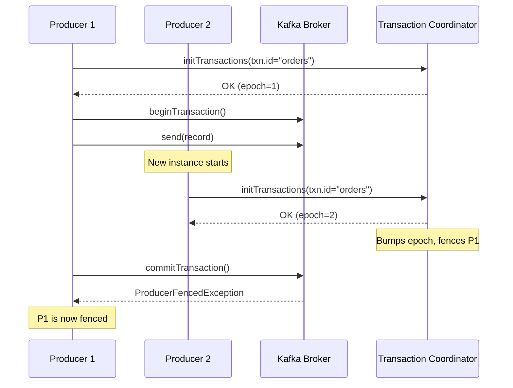
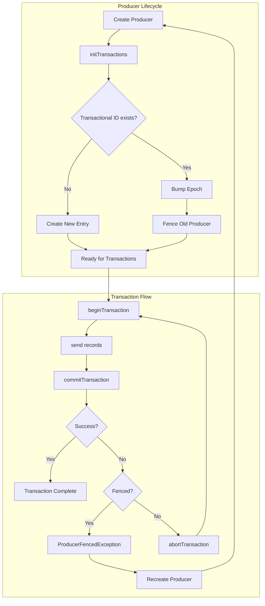

# How to Fix 'ProducerFencedException' in Kafka Transactions

Author: [nawazdhandala](https://www.github.com/nawazdhandala)

Tags: Kafka, Transactions, ProducerFencedException, Java, Distributed Systems, Exactly-Once, Troubleshooting

Description: Learn how to diagnose and fix ProducerFencedException in Kafka transactional producers, understand transaction fencing mechanisms, and implement robust exactly-once processing patterns.

---

> The ProducerFencedException is Kafka's way of enforcing exactly-once semantics by ensuring only one active producer can write to a transactional session at any given time. Understanding why it occurs is the key to fixing it.

When working with Kafka transactions for exactly-once processing, encountering a `ProducerFencedException` can halt your application unexpectedly. This guide explains why this exception occurs and provides practical solutions to prevent and handle it.

---

## Understanding ProducerFencedException

The `ProducerFencedException` is thrown when Kafka detects that another producer instance has taken over the same transactional ID. This is a safety mechanism to prevent duplicate writes and ensure transactional integrity.



---

## Common Causes

### 1. Multiple Producer Instances with Same Transactional ID

The most common cause is running multiple producer instances that share the same `transactional.id`. Each transactional producer must have a unique ID.

```java
// WRONG: Using the same transactional ID across instances
// This will cause ProducerFencedException
Properties props = new Properties();
props.put("transactional.id", "my-app-producer"); // Same ID in all instances
```

```java
// CORRECT: Use unique transactional IDs per instance
// Include instance identifier in the transactional ID
Properties props = new Properties();
String instanceId = System.getenv("HOSTNAME"); // Or use UUID, pod name, etc.
props.put("transactional.id", "my-app-producer-" + instanceId);
```

### 2. Producer Restart Without Proper Cleanup

When a producer restarts without properly closing, the new instance with the same transactional ID will fence the old one.

```java
// Proper producer lifecycle management
public class TransactionalProducerManager {
    private KafkaProducer<String, String> producer;
    private final String transactionalId;

    public TransactionalProducerManager(String transactionalId) {
        this.transactionalId = transactionalId;
    }

    // Initialize producer with proper configuration
    public void initialize() {
        Properties props = new Properties();
        props.put(ProducerConfig.BOOTSTRAP_SERVERS_CONFIG, "localhost:9092");
        props.put(ProducerConfig.KEY_SERIALIZER_CLASS_CONFIG, StringSerializer.class.getName());
        props.put(ProducerConfig.VALUE_SERIALIZER_CLASS_CONFIG, StringSerializer.class.getName());

        // Transactional configuration
        props.put(ProducerConfig.TRANSACTIONAL_ID_CONFIG, transactionalId);
        props.put(ProducerConfig.ENABLE_IDEMPOTENCE_CONFIG, "true");

        // Recommended settings for transactions
        props.put(ProducerConfig.ACKS_CONFIG, "all");
        props.put(ProducerConfig.RETRIES_CONFIG, Integer.MAX_VALUE);
        props.put(ProducerConfig.MAX_IN_FLIGHT_REQUESTS_PER_CONNECTION, 5);

        producer = new KafkaProducer<>(props);

        // Initialize transactions - this is where fencing happens
        producer.initTransactions();
    }

    // Proper shutdown to avoid orphaned transactions
    public void shutdown() {
        if (producer != null) {
            try {
                // Close will abort any in-progress transaction
                producer.close(Duration.ofSeconds(30));
            } catch (Exception e) {
                System.err.println("Error closing producer: " + e.getMessage());
            }
        }
    }
}
```

### 3. Transaction Timeout Exceeded

If a transaction takes longer than `transaction.timeout.ms`, the coordinator will abort it and the producer will be fenced.

```java
Properties props = new Properties();
// Default is 60000ms (1 minute)
// Increase if your transactions need more time
props.put(ProducerConfig.TRANSACTION_TIMEOUT_CONFIG, 120000); // 2 minutes
```

---

## Handling ProducerFencedException

When you catch a `ProducerFencedException`, the producer is in an unrecoverable state and must be recreated.

```java
import org.apache.kafka.clients.producer.*;
import org.apache.kafka.common.errors.ProducerFencedException;
import org.apache.kafka.common.errors.OutOfOrderSequenceException;
import org.apache.kafka.common.errors.AuthorizationException;

public class RobustTransactionalProducer {
    private KafkaProducer<String, String> producer;
    private final Properties baseProps;
    private final String transactionalIdPrefix;
    private int instanceGeneration = 0;

    public RobustTransactionalProducer(Properties baseProps, String transactionalIdPrefix) {
        this.baseProps = baseProps;
        this.transactionalIdPrefix = transactionalIdPrefix;
        createProducer();
    }

    // Create a new producer with incremented generation
    private void createProducer() {
        instanceGeneration++;
        Properties props = new Properties();
        props.putAll(baseProps);

        // Use generation to create unique transactional ID after fencing
        String transactionalId = transactionalIdPrefix + "-gen-" + instanceGeneration;
        props.put(ProducerConfig.TRANSACTIONAL_ID_CONFIG, transactionalId);

        producer = new KafkaProducer<>(props);
        producer.initTransactions();

        System.out.println("Created producer with transactional.id: " + transactionalId);
    }

    // Send records with proper exception handling
    public void sendInTransaction(List<ProducerRecord<String, String>> records) {
        try {
            producer.beginTransaction();

            for (ProducerRecord<String, String> record : records) {
                producer.send(record);
            }

            producer.commitTransaction();

        } catch (ProducerFencedException e) {
            // This producer has been fenced by a newer instance
            // Cannot recover - must create a new producer
            System.err.println("Producer fenced: " + e.getMessage());
            handleFatalError(e);

        } catch (OutOfOrderSequenceException e) {
            // Unrecoverable error - sequence numbers are out of order
            System.err.println("Out of order sequence: " + e.getMessage());
            handleFatalError(e);

        } catch (AuthorizationException e) {
            // Authorization failed - likely a configuration issue
            System.err.println("Authorization failed: " + e.getMessage());
            handleFatalError(e);

        } catch (Exception e) {
            // Other errors - attempt to abort and retry
            System.err.println("Transaction error: " + e.getMessage());
            try {
                producer.abortTransaction();
            } catch (Exception abortEx) {
                System.err.println("Failed to abort transaction: " + abortEx.getMessage());
                handleFatalError(abortEx);
            }
        }
    }

    // Handle fatal errors by recreating the producer
    private void handleFatalError(Exception e) {
        try {
            producer.close(Duration.ofSeconds(5));
        } catch (Exception closeEx) {
            // Ignore close errors
        }

        // Create a new producer instance
        createProducer();
    }

    public void close() {
        if (producer != null) {
            producer.close(Duration.ofSeconds(30));
        }
    }
}
```

---

## Transaction Flow and Fencing Mechanism

Understanding the transaction coordinator's role helps explain why fencing occurs:



---

## Best Practices for Avoiding ProducerFencedException

### 1. Use Unique Transactional IDs in Distributed Systems

```java
public class TransactionalIdGenerator {

    // Generate unique transactional ID for Kubernetes deployments
    public static String generateForKubernetes(String appName) {
        String podName = System.getenv("HOSTNAME");
        String namespace = System.getenv("POD_NAMESPACE");

        if (podName != null && namespace != null) {
            return String.format("%s-%s-%s", appName, namespace, podName);
        }

        // Fallback to UUID if not in Kubernetes
        return appName + "-" + UUID.randomUUID().toString();
    }

    // Generate for partitioned processing (one producer per partition)
    public static String generateForPartition(String appName, int partition) {
        return String.format("%s-partition-%d", appName, partition);
    }

    // Generate with timestamp for ephemeral instances
    public static String generateEphemeral(String appName) {
        return String.format("%s-%d-%s",
            appName,
            System.currentTimeMillis(),
            UUID.randomUUID().toString().substring(0, 8));
    }
}
```

### 2. Implement Proper Shutdown Hooks

```java
public class GracefulShutdownExample {

    public static void main(String[] args) {
        TransactionalProducerManager manager = new TransactionalProducerManager(
            TransactionalIdGenerator.generateForKubernetes("order-processor")
        );

        // Register shutdown hook for graceful cleanup
        Runtime.getRuntime().addShutdownHook(new Thread(() -> {
            System.out.println("Shutdown signal received, closing producer...");
            manager.shutdown();
            System.out.println("Producer closed gracefully");
        }));

        manager.initialize();

        // Application logic here
        processMessages(manager);
    }

    private static void processMessages(TransactionalProducerManager manager) {
        // Your message processing logic
    }
}
```

### 3. Monitor Transaction Metrics

Track these metrics to detect potential fencing issues before they occur:

```java
import io.micrometer.core.instrument.MeterRegistry;
import io.micrometer.core.instrument.Counter;
import io.micrometer.core.instrument.Timer;

public class TransactionMetrics {
    private final Counter fencedCounter;
    private final Counter abortedCounter;
    private final Counter committedCounter;
    private final Timer transactionDuration;

    public TransactionMetrics(MeterRegistry registry) {
        // Count fencing events
        this.fencedCounter = Counter.builder("kafka.producer.fenced")
            .description("Number of ProducerFencedException occurrences")
            .register(registry);

        // Count aborted transactions
        this.abortedCounter = Counter.builder("kafka.producer.transactions.aborted")
            .description("Number of aborted transactions")
            .register(registry);

        // Count committed transactions
        this.committedCounter = Counter.builder("kafka.producer.transactions.committed")
            .description("Number of committed transactions")
            .register(registry);

        // Track transaction duration
        this.transactionDuration = Timer.builder("kafka.producer.transaction.duration")
            .description("Time spent in transactions")
            .register(registry);
    }

    public void recordFenced() {
        fencedCounter.increment();
    }

    public void recordAborted() {
        abortedCounter.increment();
    }

    public void recordCommitted() {
        committedCounter.increment();
    }

    public Timer.Sample startTransaction() {
        return Timer.start();
    }

    public void stopTransaction(Timer.Sample sample) {
        sample.stop(transactionDuration);
    }
}
```

---

## Exactly-Once Consumer-Producer Pattern

When implementing exactly-once processing between consumers and producers, proper offset management is critical:

```java
public class ExactlyOnceProcessor {
    private final KafkaConsumer<String, String> consumer;
    private final KafkaProducer<String, String> producer;
    private final String outputTopic;

    public ExactlyOnceProcessor(String inputTopic, String outputTopic, String groupId) {
        this.outputTopic = outputTopic;

        // Consumer configuration for exactly-once
        Properties consumerProps = new Properties();
        consumerProps.put(ConsumerConfig.BOOTSTRAP_SERVERS_CONFIG, "localhost:9092");
        consumerProps.put(ConsumerConfig.GROUP_ID_CONFIG, groupId);
        consumerProps.put(ConsumerConfig.ENABLE_AUTO_COMMIT_CONFIG, "false"); // Critical!
        consumerProps.put(ConsumerConfig.ISOLATION_LEVEL_CONFIG, "read_committed");
        consumerProps.put(ConsumerConfig.KEY_DESERIALIZER_CLASS_CONFIG, StringDeserializer.class);
        consumerProps.put(ConsumerConfig.VALUE_DESERIALIZER_CLASS_CONFIG, StringDeserializer.class);

        // Producer configuration for exactly-once
        Properties producerProps = new Properties();
        producerProps.put(ProducerConfig.BOOTSTRAP_SERVERS_CONFIG, "localhost:9092");
        producerProps.put(ProducerConfig.TRANSACTIONAL_ID_CONFIG, groupId + "-processor");
        producerProps.put(ProducerConfig.ENABLE_IDEMPOTENCE_CONFIG, "true");
        producerProps.put(ProducerConfig.KEY_SERIALIZER_CLASS_CONFIG, StringSerializer.class);
        producerProps.put(ProducerConfig.VALUE_SERIALIZER_CLASS_CONFIG, StringSerializer.class);

        consumer = new KafkaConsumer<>(consumerProps);
        producer = new KafkaProducer<>(producerProps);

        consumer.subscribe(Collections.singletonList(inputTopic));
        producer.initTransactions();
    }

    // Process messages with exactly-once semantics
    public void processLoop() {
        while (true) {
            ConsumerRecords<String, String> records = consumer.poll(Duration.ofMillis(100));

            if (records.isEmpty()) {
                continue;
            }

            try {
                producer.beginTransaction();

                Map<TopicPartition, OffsetAndMetadata> offsetsToCommit = new HashMap<>();

                for (ConsumerRecord<String, String> record : records) {
                    // Process and produce output
                    String processedValue = processRecord(record);

                    producer.send(new ProducerRecord<>(
                        outputTopic,
                        record.key(),
                        processedValue
                    ));

                    // Track offsets to commit
                    TopicPartition tp = new TopicPartition(record.topic(), record.partition());
                    offsetsToCommit.put(tp, new OffsetAndMetadata(record.offset() + 1));
                }

                // Commit offsets as part of the transaction
                producer.sendOffsetsToTransaction(offsetsToCommit, consumer.groupMetadata());
                producer.commitTransaction();

            } catch (ProducerFencedException e) {
                // Fatal - another instance has taken over
                System.err.println("Fenced! Shutting down: " + e.getMessage());
                break;

            } catch (Exception e) {
                System.err.println("Error processing: " + e.getMessage());
                producer.abortTransaction();
            }
        }

        shutdown();
    }

    private String processRecord(ConsumerRecord<String, String> record) {
        // Your processing logic here
        return "processed-" + record.value();
    }

    public void shutdown() {
        consumer.close();
        producer.close();
    }
}
```

---

## Debugging Tips

When troubleshooting `ProducerFencedException`, check:

1. **Broker logs** for transaction coordinator messages
2. **Application logs** across all instances for duplicate transactional IDs
3. **Transaction timeout settings** vs actual transaction duration
4. **Container orchestrator** for unexpected pod restarts

```bash
# Check transaction state on broker
kafka-transactions.sh --bootstrap-server localhost:9092 \
  --describe --transactional-id "your-transactional-id"

# List all transactional IDs
kafka-transactions.sh --bootstrap-server localhost:9092 --list
```

---

## Summary

The `ProducerFencedException` is a protection mechanism, not a bug. To avoid it:

1. **Use unique transactional IDs** per producer instance
2. **Handle the exception properly** by recreating the producer
3. **Implement graceful shutdown** to clean up transactions
4. **Set appropriate timeouts** for your transaction duration
5. **Monitor transaction metrics** to detect issues early

---

*Need better visibility into your Kafka transactions? [OneUptime](https://oneuptime.com) provides comprehensive monitoring for distributed systems, helping you detect and diagnose transaction issues before they impact users.*

**Related Reading:**
- [How to Monitor Kafka Clusters Effectively](https://oneuptime.com/blog/post/2026-01-21-kafka-connect-monitoring)
- [Understanding Kafka Exactly-Once Semantics](https://oneuptime.com/blog/post/2026-01-21-kafka-exactly-once-semantics)
