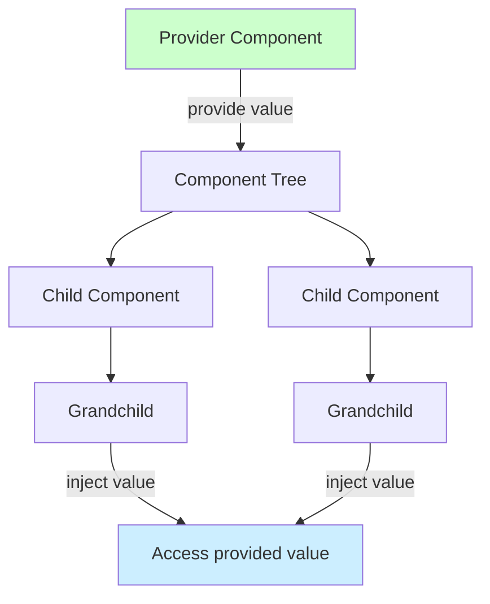
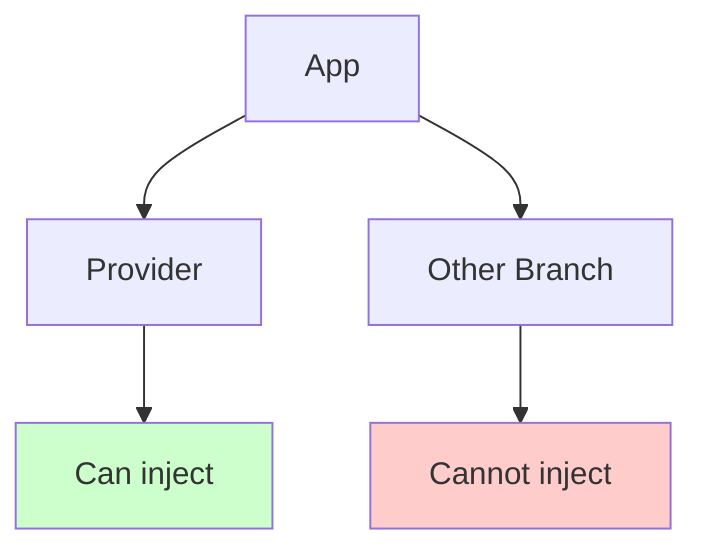

# How to Fix 'Provide/Inject' Issues in Vue

Author: [nawazdhandala](https://www.github.com/nawazdhandala)

Tags: Vue, Vue3, Provide, Inject, Composition API, Components, Debugging

Description: Diagnose and resolve Vue provide/inject issues including injection not found, reactivity problems, and TypeScript type safety.

---

Vue's provide/inject system enables dependency injection across component hierarchies without prop drilling. However, common issues can cause injection failures, lost reactivity, or type errors. This guide covers how to diagnose and fix these problems.

## Understanding Provide/Inject



Basic usage:

```vue
<!-- Provider.vue -->
<script setup>
import { provide, ref } from 'vue';

const theme = ref('dark');
provide('theme', theme);
</script>
```

```vue
<!-- Consumer.vue (any descendant) -->
<script setup>
import { inject } from 'vue';

const theme = inject('theme');
</script>
```

## Issue 1: Injection Not Found

The most common error is attempting to inject a value that was not provided.

**Error Message:**
```
[Vue warn]: injection "theme" not found.
```

### Cause: Missing Provider

```vue
<!-- This component is NOT a descendant of the provider -->
<script setup>
import { inject } from 'vue';

// Returns undefined with a warning
const theme = inject('theme');
</script>
```



### Solution: Verify Component Hierarchy

Ensure the consuming component is a descendant of the provider:

```vue
<!-- App.vue -->
<script setup>
import { provide, ref } from 'vue';

// Provide at app level so all components can access
const theme = ref('dark');
provide('theme', theme);
</script>

<template>
  <RouterView />
</template>
```

### Solution: Provide Default Value

Always provide a default value to handle missing providers:

```vue
<script setup>
import { inject } from 'vue';

// Default value prevents undefined and warning
const theme = inject('theme', 'light');

// Default factory function for complex values
const config = inject('config', () => ({
  apiUrl: '/api',
  timeout: 5000
}));
</script>
```

### Solution: Use App-Level Provide

For truly global values, provide at the app level:

```javascript
// main.js
import { createApp } from 'vue';
import App from './App.vue';

const app = createApp(App);

// Available to ALL components
app.provide('globalConfig', {
  appName: 'My App',
  version: '1.0.0'
});

app.mount('#app');
```

## Issue 2: Reactivity Lost

Injected values may lose reactivity if not handled correctly.

**Problem:**

```vue
<!-- Provider.vue -->
<script setup>
import { provide, ref } from 'vue';

const count = ref(0);

// Providing the raw value loses reactivity
provide('count', count.value);  // Wrong!
</script>
```

```vue
<!-- Consumer.vue -->
<script setup>
import { inject } from 'vue';

// This will always be the initial value (0)
const count = inject('count');  // Not reactive
</script>
```

### Solution: Provide the Ref Itself

```vue
<!-- Provider.vue -->
<script setup>
import { provide, ref } from 'vue';

const count = ref(0);

// Provide the ref, not .value
provide('count', count);

function increment() {
  count.value++;
}
</script>
```

```vue
<!-- Consumer.vue -->
<script setup>
import { inject } from 'vue';

// Now this is reactive
const count = inject('count');
</script>

<template>
  <!-- Updates when provider changes count -->
  <span>Count: {{ count }}</span>
</template>
```

### Solution: Provide Reactive Object

```vue
<!-- Provider.vue -->
<script setup>
import { provide, reactive, readonly } from 'vue';

const state = reactive({
  user: null,
  isAuthenticated: false
});

// Provide readonly to prevent consumers from mutating
provide('authState', readonly(state));

// Provide methods to update state
provide('authActions', {
  login(user) {
    state.user = user;
    state.isAuthenticated = true;
  },
  logout() {
    state.user = null;
    state.isAuthenticated = false;
  }
});
</script>
```

```vue
<!-- Consumer.vue -->
<script setup>
import { inject } from 'vue';

const authState = inject('authState');
const authActions = inject('authActions');

// State is reactive and updates automatically
// authState.user = 'hacker'; // This would fail (readonly)
</script>

<template>
  <div v-if="authState.isAuthenticated">
    Welcome, {{ authState.user.name }}
    <button @click="authActions.logout()">Logout</button>
  </div>
</template>
```

## Issue 3: TypeScript Type Errors

Without proper typing, inject returns `unknown` type.

**Problem:**

```typescript
const theme = inject('theme');
// Type is: unknown

theme.toUpperCase();  // Error: Object is of type 'unknown'
```

### Solution: Use InjectionKey

```typescript
// keys.ts
import type { InjectionKey, Ref } from 'vue';

// Define typed injection keys
export const ThemeKey: InjectionKey<Ref<'light' | 'dark'>> = Symbol('theme');

export const ConfigKey: InjectionKey<{
  apiUrl: string;
  timeout: number;
}> = Symbol('config');

export interface AuthState {
  user: { id: string; name: string } | null;
  isAuthenticated: boolean;
}

export const AuthStateKey: InjectionKey<Readonly<AuthState>> = Symbol('authState');
```

```vue
<!-- Provider.vue -->
<script setup lang="ts">
import { provide, ref } from 'vue';
import { ThemeKey } from '@/keys';

const theme = ref<'light' | 'dark'>('dark');
provide(ThemeKey, theme);
</script>
```

```vue
<!-- Consumer.vue -->
<script setup lang="ts">
import { inject } from 'vue';
import { ThemeKey } from '@/keys';

// Type is automatically: Ref<'light' | 'dark'> | undefined
const theme = inject(ThemeKey);

// With default value, type is: Ref<'light' | 'dark'>
const themeWithDefault = inject(ThemeKey, ref('light'));
</script>
```

### Solution: Create Typed Composables

```typescript
// useAuth.ts
import { inject, provide, reactive, readonly } from 'vue';
import type { InjectionKey } from 'vue';

interface User {
  id: string;
  name: string;
  email: string;
}

interface AuthState {
  user: User | null;
  isAuthenticated: boolean;
  isLoading: boolean;
}

interface AuthActions {
  login: (credentials: { email: string; password: string }) => Promise<void>;
  logout: () => Promise<void>;
}

const AuthStateKey: InjectionKey<Readonly<AuthState>> = Symbol('AuthState');
const AuthActionsKey: InjectionKey<AuthActions> = Symbol('AuthActions');

// Provider composable
export function provideAuth() {
  const state = reactive<AuthState>({
    user: null,
    isAuthenticated: false,
    isLoading: false
  });

  const actions: AuthActions = {
    async login(credentials) {
      state.isLoading = true;
      try {
        const user = await api.login(credentials);
        state.user = user;
        state.isAuthenticated = true;
      } finally {
        state.isLoading = false;
      }
    },

    async logout() {
      await api.logout();
      state.user = null;
      state.isAuthenticated = false;
    }
  };

  provide(AuthStateKey, readonly(state));
  provide(AuthActionsKey, actions);

  return { state: readonly(state), actions };
}

// Consumer composable
export function useAuth() {
  const state = inject(AuthStateKey);
  const actions = inject(AuthActionsKey);

  if (!state || !actions) {
    throw new Error('useAuth must be used within an AuthProvider');
  }

  return { state, ...actions };
}
```

Usage:

```vue
<!-- App.vue -->
<script setup lang="ts">
import { provideAuth } from '@/composables/useAuth';

provideAuth();
</script>
```

```vue
<!-- LoginForm.vue -->
<script setup lang="ts">
import { ref } from 'vue';
import { useAuth } from '@/composables/useAuth';

const { state, login } = useAuth();

const email = ref('');
const password = ref('');

async function handleSubmit() {
  await login({ email: email.value, password: password.value });
}
</script>

<template>
  <form @submit.prevent="handleSubmit">
    <input v-model="email" type="email" />
    <input v-model="password" type="password" />
    <button :disabled="state.isLoading">
      {{ state.isLoading ? 'Loading...' : 'Login' }}
    </button>
  </form>
</template>
```

## Issue 4: Circular Dependencies

Provide/inject can create circular dependency issues.

**Problem:**

```typescript
// Child tries to inject something that depends on child data
// This creates a deadlock
```

### Solution: Delayed Initialization

```vue
<script setup>
import { provide, inject, ref, onMounted } from 'vue';

const parentData = inject('parentData', null);
const childData = ref(null);

// Provide after mount when parent data is available
onMounted(() => {
  if (parentData) {
    childData.value = processParentData(parentData.value);
    provide('childData', childData);
  }
});
</script>
```

## Issue 5: Testing Components with Inject

Components using inject need providers in tests.

**Problem:**

```typescript
// Test fails because no provider exists
import { mount } from '@vue/test-utils';
import MyComponent from './MyComponent.vue';

test('renders correctly', () => {
  const wrapper = mount(MyComponent);  // Injection warning
});
```

### Solution: Provide in Test Mount

```typescript
import { mount } from '@vue/test-utils';
import { ref } from 'vue';
import MyComponent from './MyComponent.vue';
import { ThemeKey, AuthStateKey } from '@/keys';

test('renders with theme', () => {
  const wrapper = mount(MyComponent, {
    global: {
      provide: {
        [ThemeKey as symbol]: ref('dark'),
        [AuthStateKey as symbol]: {
          user: { id: '1', name: 'Test User' },
          isAuthenticated: true
        }
      }
    }
  });

  expect(wrapper.text()).toContain('Test User');
});
```

### Solution: Create Test Wrapper

```typescript
// test-utils.ts
import { mount } from '@vue/test-utils';
import { ref } from 'vue';
import type { Component } from 'vue';

export function mountWithProviders(
  component: Component,
  options: {
    theme?: 'light' | 'dark';
    user?: { id: string; name: string } | null;
  } = {}
) {
  return mount(component, {
    global: {
      provide: {
        theme: ref(options.theme || 'light'),
        authState: {
          user: options.user || null,
          isAuthenticated: !!options.user
        }
      }
    }
  });
}

// Usage in tests
test('shows user name when authenticated', () => {
  const wrapper = mountWithProviders(Header, {
    user: { id: '1', name: 'John' }
  });

  expect(wrapper.text()).toContain('John');
});
```

## Debugging Tips

### Check Provider Chain

```vue
<script setup>
import { inject, getCurrentInstance } from 'vue';

// Debug helper to check what's provided
function debugProvided() {
  const instance = getCurrentInstance();
  if (instance) {
    console.log('Provided in ancestors:', instance.provides);
  }
}

debugProvided();

const theme = inject('theme');
console.log('Injected theme:', theme);
</script>
```

### Vue DevTools

Vue DevTools shows provide/inject relationships:

1. Select a component in the component tree
2. Check the "Provided" section for values it provides
3. Check the "Injected" section for values it injects

## Summary

| Issue | Cause | Solution |
|-------|-------|----------|
| Injection not found | No ancestor provider | Add provider or default value |
| Lost reactivity | Provided `.value` instead of ref | Provide the ref itself |
| TypeScript errors | No type information | Use InjectionKey |
| Circular dependencies | Provider depends on inject | Delay initialization |
| Test failures | No provider in test | Use mount options to provide |

Provide/inject is powerful for dependency injection in Vue, but requires attention to component hierarchy, reactivity, and typing. Using typed injection keys and composables makes the pattern more maintainable and type-safe.
