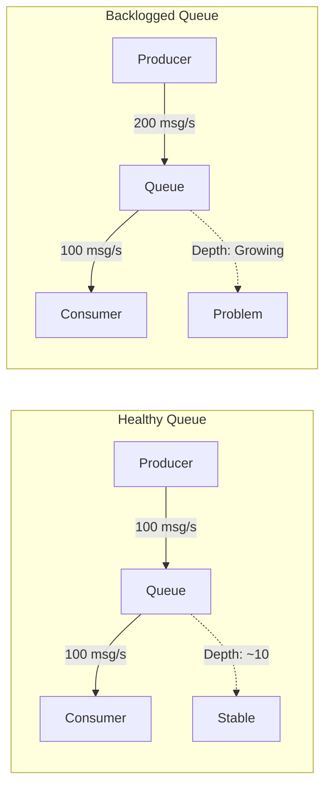
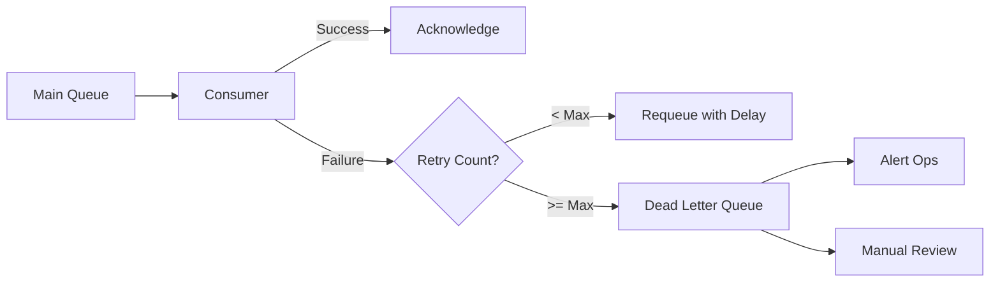

# How to Fix "Queue Backlog" Issues

Author: [nawazdhandala](https://www.github.com/nawazdhandala)

Tags: Queues, RabbitMQ, SQS, Kafka, Performance, Troubleshooting, Monitoring

Description: A practical guide to diagnosing and fixing message queue backlogs, including consumer scaling, message prioritization, and dead letter handling.

---

A queue backlog occurs when messages accumulate faster than they can be processed. This leads to increased latency, potential memory issues, and degraded user experience. This guide covers how to identify, diagnose, and resolve queue backlog issues.

## Understanding Queue Backlogs



A backlog forms when:
- Producer rate exceeds consumer capacity
- Consumer processing slows down (database issues, external API delays)
- Consumer crashes and stops processing
- Poison messages block processing

## Monitoring Queue Depth

### AWS SQS Monitoring

```javascript
// CloudWatch alarm for SQS queue depth
const AWS = require('aws-sdk');
const cloudwatch = new AWS.CloudWatch();

async function checkQueueDepth(queueName) {
    const metrics = await cloudwatch.getMetricStatistics({
        Namespace: 'AWS/SQS',
        MetricName: 'ApproximateNumberOfMessagesVisible',
        Dimensions: [
            { Name: 'QueueName', Value: queueName }
        ],
        StartTime: new Date(Date.now() - 5 * 60 * 1000),
        EndTime: new Date(),
        Period: 60,
        Statistics: ['Average', 'Maximum']
    }).promise();

    const latest = metrics.Datapoints.sort(
        (a, b) => b.Timestamp - a.Timestamp
    )[0];

    return {
        average: latest.Average,
        maximum: latest.Maximum,
        timestamp: latest.Timestamp
    };
}

// Alert threshold check
async function monitorQueue(queueName, threshold) {
    const depth = await checkQueueDepth(queueName);

    if (depth.average > threshold) {
        console.error(`Queue backlog alert: ${queueName}`);
        console.error(`Current depth: ${depth.average} (threshold: ${threshold})`);

        // Trigger scaling or alerting
        await triggerAlert({
            queue: queueName,
            depth: depth.average,
            threshold,
            severity: depth.average > threshold * 2 ? 'critical' : 'warning'
        });
    }

    return depth;
}
```

### RabbitMQ Monitoring

```python
import requests
from dataclasses import dataclass
from typing import Optional

@dataclass
class QueueMetrics:
    name: str
    messages: int
    consumers: int
    publish_rate: float
    deliver_rate: float
    backlog_growing: bool

def get_rabbitmq_metrics(
    host: str,
    queue: str,
    username: str = 'guest',
    password: str = 'guest'
) -> QueueMetrics:
    """Fetch queue metrics from RabbitMQ management API."""

    url = f'http://{host}:15672/api/queues/%2F/{queue}'
    response = requests.get(url, auth=(username, password))
    data = response.json()

    # Extract message rates
    publish_rate = data.get('message_stats', {}).get(
        'publish_details', {}
    ).get('rate', 0)

    deliver_rate = data.get('message_stats', {}).get(
        'deliver_details', {}
    ).get('rate', 0)

    return QueueMetrics(
        name=data['name'],
        messages=data['messages'],
        consumers=data['consumers'],
        publish_rate=publish_rate,
        deliver_rate=deliver_rate,
        backlog_growing=publish_rate > deliver_rate
    )

# Monitor and alert
def check_queue_health(host: str, queue: str) -> dict:
    metrics = get_rabbitmq_metrics(host, queue)

    issues = []

    if metrics.messages > 10000:
        issues.append(f'High message count: {metrics.messages}')

    if metrics.consumers == 0:
        issues.append('No consumers connected')

    if metrics.backlog_growing:
        issues.append(
            f'Backlog growing: {metrics.publish_rate:.1f}/s in, '
            f'{metrics.deliver_rate:.1f}/s out'
        )

    return {
        'healthy': len(issues) == 0,
        'metrics': metrics.__dict__,
        'issues': issues
    }
```

## Scaling Consumers

### Auto-Scaling Based on Queue Depth

```yaml
# Kubernetes KEDA ScaledObject for queue-based scaling
apiVersion: keda.sh/v1alpha1
kind: ScaledObject
metadata:
  name: order-processor
  namespace: production
spec:
  scaleTargetRef:
    name: order-processor
  minReplicaCount: 2
  maxReplicaCount: 50
  pollingInterval: 15
  cooldownPeriod: 300

  triggers:
    # Scale based on SQS queue depth
    - type: aws-sqs-queue
      metadata:
        queueURL: https://sqs.us-east-1.amazonaws.com/123456789/orders
        queueLength: "100"  # Target messages per consumer
        awsRegion: us-east-1
      authenticationRef:
        name: aws-credentials

  advanced:
    # Scale up quickly, scale down slowly
    horizontalPodAutoscalerConfig:
      behavior:
        scaleUp:
          stabilizationWindowSeconds: 0
          policies:
            - type: Percent
              value: 100
              periodSeconds: 30
        scaleDown:
          stabilizationWindowSeconds: 300
          policies:
            - type: Percent
              value: 10
              periodSeconds: 60
```

### Dynamic Consumer Scaling in Code

```javascript
const { Worker } = require('bullmq');

class AdaptiveWorkerPool {
    constructor(queueName, processor, options = {}) {
        this.queueName = queueName;
        this.processor = processor;
        this.minWorkers = options.minWorkers || 2;
        this.maxWorkers = options.maxWorkers || 20;
        this.targetLatency = options.targetLatency || 1000; // 1 second
        this.workers = [];
        this.metrics = {
            processed: 0,
            totalLatency: 0
        };
    }

    async start() {
        // Start minimum workers
        for (let i = 0; i < this.minWorkers; i++) {
            this.addWorker();
        }

        // Monitor and scale every 30 seconds
        this.scaleInterval = setInterval(
            () => this.evaluateScaling(),
            30000
        );
    }

    addWorker() {
        const worker = new Worker(this.queueName, async (job) => {
            const start = Date.now();
            try {
                await this.processor(job);
            } finally {
                this.metrics.processed++;
                this.metrics.totalLatency += Date.now() - start;
            }
        }, {
            connection: { host: 'redis', port: 6379 },
            concurrency: 5
        });

        this.workers.push(worker);
        console.log(`Added worker. Total: ${this.workers.length}`);
    }

    async removeWorker() {
        if (this.workers.length <= this.minWorkers) return;

        const worker = this.workers.pop();
        await worker.close();
        console.log(`Removed worker. Total: ${this.workers.length}`);
    }

    async evaluateScaling() {
        const avgLatency = this.metrics.processed > 0
            ? this.metrics.totalLatency / this.metrics.processed
            : 0;

        // Reset metrics for next period
        this.metrics = { processed: 0, totalLatency: 0 };

        // Get queue depth
        const queue = new Queue(this.queueName);
        const waiting = await queue.getWaitingCount();

        console.log(`Queue depth: ${waiting}, Avg latency: ${avgLatency}ms`);

        // Scale up if backlogged or latency high
        if (waiting > 1000 || avgLatency > this.targetLatency * 1.5) {
            if (this.workers.length < this.maxWorkers) {
                const toAdd = Math.min(
                    Math.ceil(this.workers.length * 0.5),
                    this.maxWorkers - this.workers.length
                );
                for (let i = 0; i < toAdd; i++) {
                    this.addWorker();
                }
            }
        }
        // Scale down if queue is empty and latency is good
        else if (waiting < 100 && avgLatency < this.targetLatency * 0.5) {
            await this.removeWorker();
        }
    }

    async stop() {
        clearInterval(this.scaleInterval);
        await Promise.all(this.workers.map(w => w.close()));
    }
}
```

## Optimizing Consumer Performance

### Batch Processing

Process multiple messages at once to reduce overhead:

```python
import asyncio
from typing import List
from dataclasses import dataclass

@dataclass
class Message:
    id: str
    body: dict

class BatchProcessor:
    def __init__(
        self,
        batch_size: int = 100,
        batch_timeout: float = 1.0
    ):
        self.batch_size = batch_size
        self.batch_timeout = batch_timeout
        self.batch: List[Message] = []
        self.lock = asyncio.Lock()

    async def add_message(self, message: Message):
        async with self.lock:
            self.batch.append(message)

            if len(self.batch) >= self.batch_size:
                await self._process_batch()

    async def _process_batch(self):
        if not self.batch:
            return

        batch = self.batch
        self.batch = []

        try:
            # Process all messages in one database transaction
            await self._bulk_insert(batch)

            # Acknowledge all messages
            await self._acknowledge_all(batch)

            print(f'Processed batch of {len(batch)} messages')
        except Exception as e:
            print(f'Batch processing failed: {e}')
            # Re-queue failed messages
            await self._requeue_batch(batch)

    async def _bulk_insert(self, messages: List[Message]):
        """Insert all messages in a single database operation."""
        # Much faster than individual inserts
        values = [(m.id, m.body) for m in messages]
        await db.executemany(
            'INSERT INTO events (id, data) VALUES ($1, $2)',
            values
        )
```

### Parallel Processing with Rate Limiting

```javascript
const { RateLimiter } = require('limiter');

class RateLimitedProcessor {
    constructor(options) {
        // Limit external API calls to avoid overload
        this.apiLimiter = new RateLimiter({
            tokensPerInterval: options.apiRateLimit || 100,
            interval: 'second'
        });

        // Limit database connections
        this.dbLimiter = new RateLimiter({
            tokensPerInterval: options.dbRateLimit || 50,
            interval: 'second'
        });
    }

    async processMessage(message) {
        // Wait for rate limit tokens
        await this.dbLimiter.removeTokens(1);

        // Fetch data from database
        const data = await this.db.query(
            'SELECT * FROM orders WHERE id = $1',
            [message.orderId]
        );

        // Rate limit external API calls
        await this.apiLimiter.removeTokens(1);

        // Call external service
        const result = await this.paymentApi.process(data);

        return result;
    }

    async processInParallel(messages, concurrency = 10) {
        const results = [];
        const executing = new Set();

        for (const message of messages) {
            // Start processing
            const promise = this.processMessage(message)
                .then(result => {
                    executing.delete(promise);
                    results.push({ message, result, success: true });
                })
                .catch(error => {
                    executing.delete(promise);
                    results.push({ message, error, success: false });
                });

            executing.add(promise);

            // Wait if we hit concurrency limit
            if (executing.size >= concurrency) {
                await Promise.race(executing);
            }
        }

        // Wait for remaining
        await Promise.all(executing);

        return results;
    }
}
```

## Handling Poison Messages

Poison messages that repeatedly fail can block queue processing:



### Implementing Dead Letter Queues

```javascript
const { Queue, Worker } = require('bullmq');

// Main processing queue
const mainQueue = new Queue('orders', {
    connection: { host: 'redis', port: 6379 }
});

// Dead letter queue for failed messages
const dlq = new Queue('orders-dlq', {
    connection: { host: 'redis', port: 6379 }
});

const worker = new Worker('orders', async (job) => {
    // Track retry count
    const retryCount = job.attemptsMade;

    try {
        await processOrder(job.data);
    } catch (error) {
        // Log failure details
        console.error(`Job ${job.id} failed (attempt ${retryCount + 1}):`, error);

        // Check if max retries exceeded
        if (retryCount >= 3) {
            // Move to dead letter queue
            await dlq.add('failed-order', {
                originalJob: job.data,
                error: error.message,
                stack: error.stack,
                failedAt: new Date().toISOString(),
                attempts: retryCount + 1
            });

            // Alert operations team
            await alertOps({
                type: 'dead-letter',
                queue: 'orders',
                jobId: job.id,
                error: error.message
            });

            // Don't retry - job is in DLQ
            return;
        }

        // Throw to trigger retry with backoff
        throw error;
    }
}, {
    connection: { host: 'redis', port: 6379 },
    settings: {
        backoffStrategy: (attemptsMade) => {
            // Exponential backoff: 1s, 4s, 9s, 16s...
            return Math.pow(attemptsMade, 2) * 1000;
        }
    }
});
```

### DLQ Processing and Recovery

```python
import json
from datetime import datetime

class DLQProcessor:
    def __init__(self, dlq_client, main_queue_client):
        self.dlq = dlq_client
        self.main_queue = main_queue_client

    async def review_dlq(self) -> list:
        """List all messages in the DLQ for review."""
        messages = await self.dlq.get_messages(limit=100)

        summary = []
        for msg in messages:
            summary.append({
                'id': msg.id,
                'error': msg.body.get('error'),
                'failed_at': msg.body.get('failedAt'),
                'attempts': msg.body.get('attempts'),
                'original_data': msg.body.get('originalJob')
            })

        return summary

    async def retry_message(self, message_id: str) -> bool:
        """Retry a specific DLQ message."""
        message = await self.dlq.get_message(message_id)

        if not message:
            return False

        # Re-queue the original job
        await self.main_queue.add(
            message.body['originalJob'],
            {
                'retry_from_dlq': True,
                'dlq_message_id': message_id,
                'original_failure': message.body['error']
            }
        )

        # Delete from DLQ
        await self.dlq.delete_message(message_id)

        return True

    async def purge_old_messages(self, days: int = 7) -> int:
        """Remove DLQ messages older than specified days."""
        cutoff = datetime.now() - timedelta(days=days)
        deleted = 0

        messages = await self.dlq.get_messages(limit=1000)
        for msg in messages:
            failed_at = datetime.fromisoformat(msg.body['failedAt'])
            if failed_at < cutoff:
                await self.dlq.delete_message(msg.id)
                deleted += 1

        return deleted
```

## Monitoring Dashboard

Track these key metrics for queue health:

```yaml
# Prometheus alerting rules for queues
groups:
  - name: queue_alerts
    rules:
      # Alert on growing backlog
      - alert: QueueBacklogGrowing
        expr: |
          increase(rabbitmq_queue_messages[5m]) > 1000
        for: 10m
        labels:
          severity: warning
        annotations:
          summary: "Queue {{ $labels.queue }} backlog is growing"

      # Alert on no consumers
      - alert: QueueNoConsumers
        expr: |
          rabbitmq_queue_consumers == 0
        for: 5m
        labels:
          severity: critical
        annotations:
          summary: "Queue {{ $labels.queue }} has no consumers"

      # Alert on high DLQ count
      - alert: HighDLQCount
        expr: |
          rabbitmq_queue_messages{queue=~".*-dlq"} > 100
        for: 5m
        labels:
          severity: warning
        annotations:
          summary: "DLQ {{ $labels.queue }} has {{ $value }} messages"

      # Alert on consumer processing slowdown
      - alert: SlowConsumerProcessing
        expr: |
          rate(rabbitmq_queue_messages_delivered_total[5m])
          <
          rate(rabbitmq_queue_messages_published_total[5m]) * 0.8
        for: 15m
        labels:
          severity: warning
        annotations:
          summary: "Consumers not keeping up with producers on {{ $labels.queue }}"
```

## Best Practices Summary

1. **Monitor proactively** - Set up alerts before backlogs become critical
2. **Scale consumers dynamically** - Use queue depth to trigger auto-scaling
3. **Process in batches** - Reduce per-message overhead for high-throughput queues
4. **Implement DLQ** - Prevent poison messages from blocking processing
5. **Use backoff strategies** - Exponential backoff prevents retry storms
6. **Set message TTL** - Expire stale messages that are no longer relevant
7. **Optimize consumer code** - Profile and optimize slow processing paths

---

Queue backlogs are often symptoms of underlying capacity or reliability issues. Start by monitoring queue depth and consumer lag, then implement auto-scaling to handle traffic spikes. Use dead letter queues to isolate problem messages and maintain overall system health.
