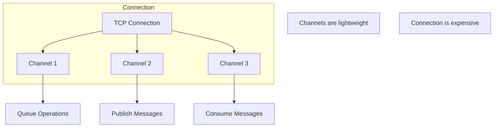
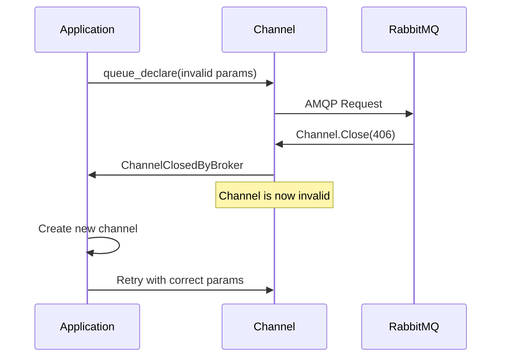
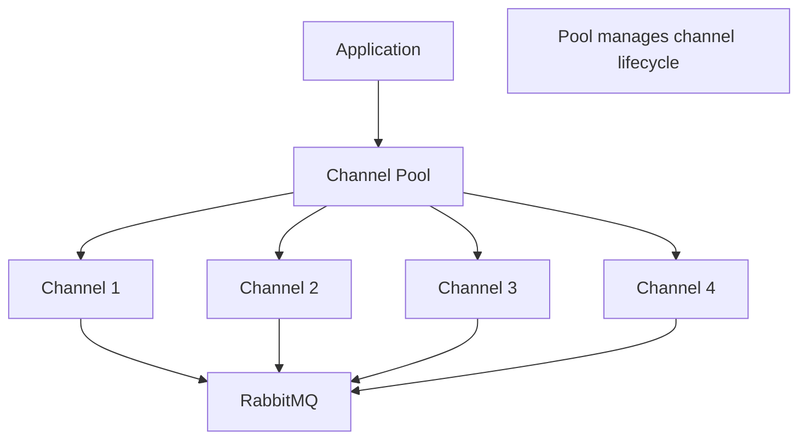
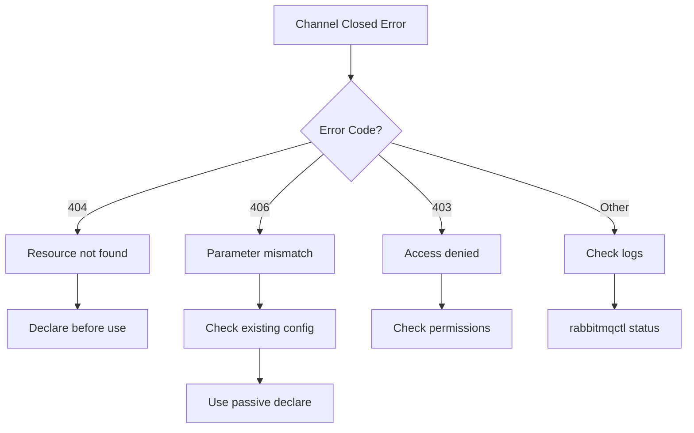

# How to Fix 'Channel Closed' Errors in RabbitMQ

Author: [nawazdhandala](https://www.github.com/nawazdhandala)

Tags: RabbitMQ, Messaging, Troubleshooting, Backend, Error Handling

Description: Learn how to diagnose and fix RabbitMQ channel closed errors, including common causes like protocol violations and resource limits.

---

Channel closed errors in RabbitMQ occur when the broker forcefully terminates a channel due to protocol violations, resource issues, or application errors. Understanding why channels close and how to handle them is crucial for building robust messaging applications.

## Understanding Channels and Connections



A single TCP connection can have multiple channels. Channels are lightweight and should be used for different operations. When a channel error occurs, only that channel is closed - the connection remains open.

## Common Channel Close Errors

### 1. PRECONDITION_FAILED (406)

Occurs when you try to redeclare an exchange or queue with different parameters:

```
Channel closed by server: 406 PRECONDITION_FAILED -
inequivalent arg 'durable' for queue 'orders' in vhost '/'
```

**Solution**: Ensure consistent declaration parameters or use passive declaration:

```python
import pika

connection = pika.BlockingConnection(pika.ConnectionParameters('localhost'))
channel = connection.channel()

try:
    # Try to declare with desired parameters
    channel.queue_declare(queue='orders', durable=True)
except pika.exceptions.ChannelClosedByBroker as e:
    if e.reply_code == 406:
        print(f"Queue exists with different parameters: {e.reply_text}")
        # Get a new channel since the old one is closed
        channel = connection.channel()
        # Use passive=True to just check if queue exists without creating
        channel.queue_declare(queue='orders', passive=True)
```

### 2. NOT_FOUND (404)

The queue or exchange does not exist:

```
Channel closed by server: 404 NOT_FOUND -
no queue 'missing_queue' in vhost '/'
```

**Solution**: Always declare queues before using them:

```python
import pika

connection = pika.BlockingConnection(pika.ConnectionParameters('localhost'))
channel = connection.channel()

def safe_consume(queue_name):
    """
    Safely start consuming from a queue.
    Creates the queue if it doesn't exist.
    """
    try:
        # Declare queue to ensure it exists
        # This is idempotent - safe to call even if queue exists
        channel.queue_declare(queue=queue_name, durable=True)

        # Now start consuming
        channel.basic_consume(
            queue=queue_name,
            on_message_callback=callback,
            auto_ack=False
        )
    except pika.exceptions.ChannelClosedByBroker as e:
        print(f"Channel error: {e.reply_code} - {e.reply_text}")
        raise
```

### 3. ACCESS_REFUSED (403)

Permission denied for the operation:

```
Channel closed by server: 403 ACCESS_REFUSED -
access to queue 'admin_queue' in vhost '/' refused for user 'app_user'
```

**Solution**: Check user permissions:

```bash
# List permissions for a user
rabbitmqctl list_user_permissions app_user

# Grant permissions
# Pattern format: configure, write, read
rabbitmqctl set_permissions -p / app_user "^app_.*" "^app_.*" ".*"
```

## Channel Error Flow



## Handling Channel Closures Gracefully

### Python Implementation

```python
import pika
import logging
from contextlib import contextmanager

logging.basicConfig(level=logging.INFO)
logger = logging.getLogger(__name__)

class RabbitMQClient:
    """
    RabbitMQ client with automatic channel recovery.
    Handles channel closures and reconnection automatically.
    """

    def __init__(self, host='localhost', port=5672, credentials=None):
        self.params = pika.ConnectionParameters(
            host=host,
            port=port,
            credentials=credentials or pika.PlainCredentials('guest', 'guest'),
            # Enable automatic connection recovery
            connection_attempts=3,
            retry_delay=5
        )
        self.connection = None
        self.channel = None

    def connect(self):
        """Establish connection and create a channel."""
        self.connection = pika.BlockingConnection(self.params)
        self.channel = self.connection.channel()
        logger.info("Connected to RabbitMQ")

    def ensure_channel(self):
        """
        Ensure we have a valid channel.
        Creates new connection/channel if needed.
        """
        if self.connection is None or self.connection.is_closed:
            self.connect()
        elif self.channel is None or self.channel.is_closed:
            self.channel = self.connection.channel()
            logger.info("Created new channel")

    @contextmanager
    def safe_channel(self):
        """
        Context manager that provides a channel and handles errors.
        Automatically recreates channel on closure.
        """
        self.ensure_channel()
        try:
            yield self.channel
        except pika.exceptions.ChannelClosedByBroker as e:
            logger.error(f"Channel closed: {e.reply_code} - {e.reply_text}")
            # Channel is invalid, will be recreated on next use
            self.channel = None
            raise
        except pika.exceptions.AMQPConnectionError as e:
            logger.error(f"Connection error: {e}")
            self.connection = None
            self.channel = None
            raise

    def publish(self, exchange, routing_key, body, properties=None):
        """
        Publish a message with automatic channel recovery.
        """
        max_retries = 3
        for attempt in range(max_retries):
            try:
                with self.safe_channel() as channel:
                    channel.basic_publish(
                        exchange=exchange,
                        routing_key=routing_key,
                        body=body,
                        properties=properties or pika.BasicProperties(
                            delivery_mode=2  # Persistent
                        )
                    )
                    logger.info(f"Published message to {routing_key}")
                    return True
            except pika.exceptions.ChannelClosedByBroker:
                if attempt < max_retries - 1:
                    logger.warning(f"Retrying publish (attempt {attempt + 2})")
                else:
                    raise
        return False

    def close(self):
        """Close connection gracefully."""
        if self.connection and not self.connection.is_closed:
            self.connection.close()
            logger.info("Connection closed")

# Usage
client = RabbitMQClient()
client.connect()

try:
    client.publish('', 'my_queue', b'Hello World')
finally:
    client.close()
```

### Node.js Implementation

```javascript
const amqp = require('amqplib');

class RabbitMQClient {
    constructor(url = 'amqp://localhost') {
        this.url = url;
        this.connection = null;
        this.channel = null;
    }

    async connect() {
        // Establish connection with automatic reconnection handling
        this.connection = await amqp.connect(this.url);

        // Handle connection errors
        this.connection.on('error', (err) => {
            console.error('Connection error:', err.message);
            this.connection = null;
            this.channel = null;
        });

        // Handle connection close
        this.connection.on('close', () => {
            console.log('Connection closed');
            this.connection = null;
            this.channel = null;
        });

        await this.createChannel();
        console.log('Connected to RabbitMQ');
    }

    async createChannel() {
        if (!this.connection) {
            throw new Error('No connection available');
        }

        this.channel = await this.connection.createChannel();

        // Handle channel errors
        this.channel.on('error', (err) => {
            console.error('Channel error:', err.message);
            this.channel = null;
        });

        // Handle channel close
        this.channel.on('close', () => {
            console.log('Channel closed');
            this.channel = null;
        });
    }

    async ensureChannel() {
        // Reconnect if needed
        if (!this.connection) {
            await this.connect();
        } else if (!this.channel) {
            await this.createChannel();
        }
    }

    async publish(exchange, routingKey, content, options = {}) {
        const maxRetries = 3;

        for (let attempt = 0; attempt < maxRetries; attempt++) {
            try {
                await this.ensureChannel();

                this.channel.publish(
                    exchange,
                    routingKey,
                    Buffer.from(content),
                    { persistent: true, ...options }
                );

                console.log(`Published to ${routingKey}`);
                return true;

            } catch (error) {
                console.error(`Publish failed (attempt ${attempt + 1}):`, error.message);

                // Channel might be closed, will be recreated on next attempt
                this.channel = null;

                if (attempt === maxRetries - 1) {
                    throw error;
                }

                // Wait before retry
                await new Promise(resolve => setTimeout(resolve, 1000));
            }
        }
        return false;
    }

    async close() {
        if (this.connection) {
            await this.connection.close();
            console.log('Connection closed');
        }
    }
}

// Usage
async function main() {
    const client = new RabbitMQClient();

    try {
        await client.connect();
        await client.publish('', 'my_queue', 'Hello World');
    } finally {
        await client.close();
    }
}

main().catch(console.error);
```

## Channel Pooling for High Throughput



```python
import pika
import threading
from queue import Queue, Empty

class ChannelPool:
    """
    Pool of RabbitMQ channels for concurrent operations.
    Reuses channels efficiently and handles closures.
    """

    def __init__(self, connection, pool_size=10):
        self.connection = connection
        self.pool_size = pool_size
        self.pool = Queue(maxsize=pool_size)
        self.lock = threading.Lock()

        # Pre-create channels
        for _ in range(pool_size):
            channel = connection.channel()
            self.pool.put(channel)

    def acquire(self, timeout=5):
        """
        Get a channel from the pool.
        Creates a new one if pool is empty and channel is closed.
        """
        try:
            channel = self.pool.get(timeout=timeout)

            # Check if channel is still valid
            if channel.is_closed:
                channel = self.connection.channel()

            return channel

        except Empty:
            # Pool exhausted, create new channel
            return self.connection.channel()

    def release(self, channel):
        """Return a channel to the pool."""
        if channel.is_closed:
            # Don't return closed channels, create a new one
            try:
                channel = self.connection.channel()
            except Exception:
                return  # Connection might be closed

        try:
            self.pool.put_nowait(channel)
        except:
            # Pool full, close the channel
            try:
                channel.close()
            except:
                pass

    def close_all(self):
        """Close all channels in the pool."""
        while not self.pool.empty():
            try:
                channel = self.pool.get_nowait()
                if not channel.is_closed:
                    channel.close()
            except Empty:
                break

# Usage
connection = pika.BlockingConnection(pika.ConnectionParameters('localhost'))
pool = ChannelPool(connection, pool_size=5)

def publish_message(message):
    channel = pool.acquire()
    try:
        channel.basic_publish(
            exchange='',
            routing_key='my_queue',
            body=message
        )
    finally:
        pool.release(channel)

# Publish multiple messages concurrently
import concurrent.futures

with concurrent.futures.ThreadPoolExecutor(max_workers=10) as executor:
    futures = [executor.submit(publish_message, f"Message {i}") for i in range(100)]
    concurrent.futures.wait(futures)

pool.close_all()
connection.close()
```

## Preventing Channel Closures

### 1. Validate Parameters Before Declaration

```python
def validate_queue_params(channel, queue_name, **desired_params):
    """
    Check if queue exists and has matching parameters.
    Returns True if safe to declare, raises error if mismatch.
    """
    try:
        # Passive declaration just checks if queue exists
        result = channel.queue_declare(queue=queue_name, passive=True)

        # Queue exists - we can't check parameters via AMQP
        # Use management API for detailed comparison
        print(f"Queue {queue_name} exists with {result.method.message_count} messages")
        return True

    except pika.exceptions.ChannelClosedByBroker as e:
        if e.reply_code == 404:
            # Queue doesn't exist, safe to create
            return True
        raise
```

### 2. Use Confirm Mode for Publish Errors

```python
connection = pika.BlockingConnection(pika.ConnectionParameters('localhost'))
channel = connection.channel()

# Enable publisher confirms
# This makes publish() raise an exception if the message can't be routed
channel.confirm_delivery()

try:
    channel.basic_publish(
        exchange='nonexistent',  # This exchange doesn't exist
        routing_key='test',
        body=b'Hello',
        mandatory=True  # Return message if not routed
    )
except pika.exceptions.UnroutableError:
    print("Message could not be routed")
except pika.exceptions.NackError:
    print("Message was rejected by broker")
```

### 3. Set Up Error Handlers

```python
import pika

def on_channel_closed(channel, reason):
    """Callback when channel is closed."""
    print(f"Channel {channel} closed: {reason}")

def on_channel_open(channel):
    """Callback when channel is opened."""
    print(f"Channel {channel} opened")
    # Set up channel close callback
    channel.add_on_close_callback(on_channel_closed)

# With SelectConnection for async handling
def on_connection_open(connection):
    connection.channel(on_open_callback=on_channel_open)

parameters = pika.ConnectionParameters('localhost')
connection = pika.SelectConnection(
    parameters,
    on_open_callback=on_connection_open
)
```

## Troubleshooting Checklist



## Common Causes and Solutions

| Error Code | Reason | Solution |
|------------|--------|----------|
| 404 NOT_FOUND | Queue/exchange doesn't exist | Declare before using |
| 406 PRECONDITION_FAILED | Parameter mismatch | Match existing parameters |
| 403 ACCESS_REFUSED | Permission denied | Grant user permissions |
| 320 CONNECTION_FORCED | Admin closed connection | Check for maintenance |
| 505 UNEXPECTED_FRAME | Protocol violation | Check client library version |

---

Channel closed errors are RabbitMQ's way of telling you something is wrong with your request. By understanding the error codes, implementing proper error handling, and using techniques like channel pooling, you can build resilient applications that recover gracefully from channel failures. Always declare resources before using them and ensure your parameters match the existing configuration.
