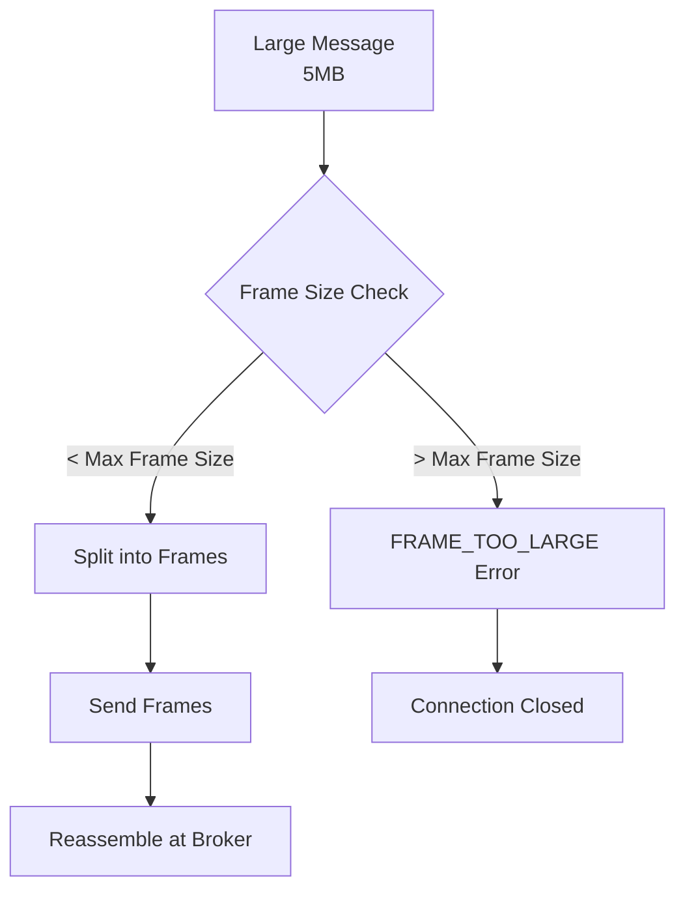
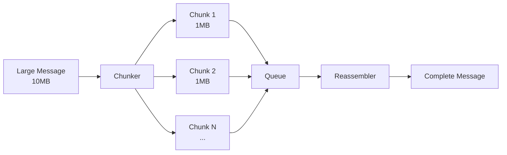
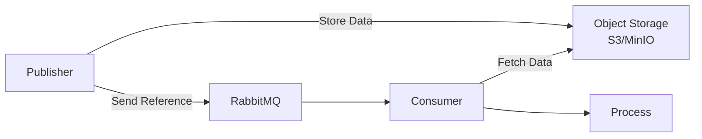

# How to Fix "Frame Too Large" Errors in RabbitMQ

Author: [nawazdhandala](https://www.github.com/nawazdhandala)

Tags: RabbitMQ, Message Queue, Troubleshooting, AMQP, Backend, Distributed Systems, Configuration

Description: Learn how to diagnose and fix RabbitMQ frame too large errors caused by oversized messages exceeding the configured frame size limit.

---

> Frame too large errors occur when a message exceeds RabbitMQ's maximum frame size limit. Understanding frame sizes and configuring appropriate limits prevents message delivery failures and connection drops.

This error appears as `frame_too_large` or error code 501, typically causing channel or connection closure.

---

## Understanding Frame Size



---

## What Causes Frame Too Large Errors

### 1. Message Exceeds Negotiated Frame Size

```python
import pika

# Default frame size is often 131072 bytes (128KB)
# Sending a larger message without proper configuration fails

connection = pika.BlockingConnection(
    pika.ConnectionParameters('localhost')
)
channel = connection.channel()
channel.queue_declare(queue='large_messages')

# This 1MB message will fail with default settings
large_message = 'x' * (1024 * 1024)  # 1MB

try:
    channel.basic_publish(
        exchange='',
        routing_key='large_messages',
        body=large_message
    )
except pika.exceptions.AMQPError as e:
    print(f"Error: {e}")
    # Error: frame_too_large
```

### 2. Frame Size Mismatch

Client and server frame sizes must match:

```python
import pika

# Client requests 1MB frame size
connection = pika.BlockingConnection(
    pika.ConnectionParameters(
        'localhost',
        frame_max=1048576  # 1MB
    )
)

# If server's max is lower (e.g., 128KB), connection will use lower value
# Messages larger than the negotiated size will fail
```

---

## Checking Current Frame Size

### Via RabbitMQ CLI

```bash
# Check the configured frame_max in RabbitMQ
rabbitmqctl environment | grep frame_max

# Check connection details including negotiated frame size
rabbitmqctl list_connections name frame_max

# Sample output:
# name                          frame_max
# 127.0.0.1:52436 -> ...        131072
```

### Via Management API

```bash
# Get connection details including frame_max
curl -u guest:guest \
    http://localhost:15672/api/connections | \
    jq '.[] | {name: .name, frame_max: .frame_max}'

# Check overview for default settings
curl -u guest:guest \
    http://localhost:15672/api/overview | jq '.frame_max'
```

---

## Solutions

### Solution 1: Increase Frame Size

Configure RabbitMQ to accept larger frames:

```ini
# rabbitmq.conf
# Increase frame_max to 1MB (default is 131072 = 128KB)
frame_max = 1048576
```

Or using the advanced config format:

```erlang
% advanced.config
[
  {rabbit, [
    {frame_max, 1048576}
  ]}
].
```

### Client Configuration

Match the client frame size to the server:

```python
import pika

# Configure client with matching frame size
connection_params = pika.ConnectionParameters(
    host='localhost',
    frame_max=1048576  # 1MB - must not exceed server's frame_max
)

connection = pika.BlockingConnection(connection_params)
channel = connection.channel()
channel.queue_declare(queue='large_messages')

# Now 1MB messages work
large_message = 'x' * (1024 * 1024)
channel.basic_publish(
    exchange='',
    routing_key='large_messages',
    body=large_message
)
print("Large message sent successfully")
connection.close()
```

### Solution 2: Compress Messages

Reduce message size through compression:

```python
import pika
import zlib
import json

def publish_compressed(channel, queue, data):
    """
    Compress data before publishing to reduce frame size.
    """
    # Convert to JSON and compress
    json_data = json.dumps(data).encode('utf-8')
    compressed = zlib.compress(json_data, level=9)

    compression_ratio = len(compressed) / len(json_data)
    print(f"Compression ratio: {compression_ratio:.2%}")

    # Publish with content-encoding header
    properties = pika.BasicProperties(
        content_type='application/json',
        content_encoding='gzip',
        delivery_mode=2
    )

    channel.basic_publish(
        exchange='',
        routing_key=queue,
        body=compressed,
        properties=properties
    )

def consume_compressed(ch, method, properties, body):
    """
    Decompress message before processing.
    """
    if properties.content_encoding == 'gzip':
        decompressed = zlib.decompress(body)
        data = json.loads(decompressed.decode('utf-8'))
    else:
        data = json.loads(body.decode('utf-8'))

    print(f"Received data with {len(data)} items")
    ch.basic_ack(delivery_tag=method.delivery_tag)

# Usage
connection = pika.BlockingConnection(
    pika.ConnectionParameters('localhost')
)
channel = connection.channel()
channel.queue_declare(queue='compressed_queue', durable=True)

# Large data that compresses well
large_data = {'items': ['data'] * 100000}  # Repetitive data compresses well

publish_compressed(channel, 'compressed_queue', large_data)
```

### Solution 3: Chunk Large Messages

Split large messages into smaller chunks:



```python
import pika
import uuid
import json
import math

class ChunkedMessagePublisher:
    """
    Publish large messages in chunks to avoid frame size limits.
    """

    def __init__(self, channel, chunk_size=100000):
        self.channel = channel
        self.chunk_size = chunk_size  # 100KB chunks

    def publish(self, queue, data):
        """
        Split data into chunks and publish with correlation.
        """
        # Serialize the data
        serialized = json.dumps(data).encode('utf-8')

        # Generate correlation ID for all chunks
        correlation_id = str(uuid.uuid4())

        # Calculate number of chunks
        total_chunks = math.ceil(len(serialized) / self.chunk_size)

        print(f"Splitting {len(serialized)} bytes into {total_chunks} chunks")

        # Publish each chunk
        for i in range(total_chunks):
            start = i * self.chunk_size
            end = start + self.chunk_size
            chunk_data = serialized[start:end]

            properties = pika.BasicProperties(
                correlation_id=correlation_id,
                headers={
                    'chunk_index': i,
                    'total_chunks': total_chunks,
                    'is_last': i == total_chunks - 1
                },
                delivery_mode=2
            )

            self.channel.basic_publish(
                exchange='',
                routing_key=queue,
                body=chunk_data,
                properties=properties
            )

        print(f"Published {total_chunks} chunks with correlation_id: {correlation_id}")
        return correlation_id


class ChunkedMessageConsumer:
    """
    Reassemble chunked messages before processing.
    """

    def __init__(self, channel):
        self.channel = channel
        self.pending_messages = {}  # correlation_id -> {chunks: [], expected: N}

    def consume(self, queue, callback):
        """
        Consume and reassemble chunked messages.
        """
        def on_message(ch, method, properties, body):
            correlation_id = properties.correlation_id
            headers = properties.headers or {}

            chunk_index = headers.get('chunk_index', 0)
            total_chunks = headers.get('total_chunks', 1)
            is_last = headers.get('is_last', True)

            # Initialize storage for this message
            if correlation_id not in self.pending_messages:
                self.pending_messages[correlation_id] = {
                    'chunks': [None] * total_chunks,
                    'received': 0,
                    'expected': total_chunks
                }

            # Store chunk
            pending = self.pending_messages[correlation_id]
            pending['chunks'][chunk_index] = body
            pending['received'] += 1

            # Check if all chunks received
            if pending['received'] == pending['expected']:
                # Reassemble
                complete_data = b''.join(pending['chunks'])
                data = json.loads(complete_data.decode('utf-8'))

                # Clean up
                del self.pending_messages[correlation_id]

                # Call user callback with complete message
                callback(ch, method, properties, data)
            else:
                # Partial message, acknowledge chunk
                ch.basic_ack(delivery_tag=method.delivery_tag)

        self.channel.basic_consume(
            queue=queue,
            on_message_callback=on_message
        )

# Usage
connection = pika.BlockingConnection(
    pika.ConnectionParameters('localhost')
)
channel = connection.channel()
channel.queue_declare(queue='chunked_queue', durable=True)

# Publish large message in chunks
publisher = ChunkedMessagePublisher(channel, chunk_size=50000)  # 50KB chunks
large_data = {'records': [{'id': i, 'data': 'x' * 1000} for i in range(1000)]}
publisher.publish('chunked_queue', large_data)

# Consume and reassemble
def process_complete_message(ch, method, properties, data):
    print(f"Received complete message with {len(data['records'])} records")
    ch.basic_ack(delivery_tag=method.delivery_tag)

consumer = ChunkedMessageConsumer(channel)
consumer.consume('chunked_queue', process_complete_message)
channel.start_consuming()
```

### Solution 4: Use External Storage

Store large data externally and send reference:



```python
import pika
import json
import uuid
import boto3
from botocore.client import Config

class LargeMessagePublisher:
    """
    Store large messages in S3 and publish reference through RabbitMQ.
    """

    def __init__(self, channel, s3_bucket, size_threshold=100000):
        self.channel = channel
        self.s3_bucket = s3_bucket
        self.size_threshold = size_threshold  # 100KB

        # Initialize S3 client
        self.s3 = boto3.client(
            's3',
            endpoint_url='http://localhost:9000',  # MinIO
            aws_access_key_id='minioadmin',
            aws_secret_access_key='minioadmin',
            config=Config(signature_version='s3v4')
        )

    def publish(self, queue, data):
        """
        Publish message, using S3 for large payloads.
        """
        serialized = json.dumps(data).encode('utf-8')

        if len(serialized) > self.size_threshold:
            # Store in S3
            object_key = f"messages/{uuid.uuid4()}.json"
            self.s3.put_object(
                Bucket=self.s3_bucket,
                Key=object_key,
                Body=serialized,
                ContentType='application/json'
            )

            # Publish reference
            reference = {
                'type': 's3_reference',
                'bucket': self.s3_bucket,
                'key': object_key,
                'size': len(serialized)
            }

            properties = pika.BasicProperties(
                content_type='application/x-s3-reference',
                delivery_mode=2
            )

            self.channel.basic_publish(
                exchange='',
                routing_key=queue,
                body=json.dumps(reference),
                properties=properties
            )

            print(f"Published S3 reference: {object_key}")
        else:
            # Publish directly
            properties = pika.BasicProperties(
                content_type='application/json',
                delivery_mode=2
            )

            self.channel.basic_publish(
                exchange='',
                routing_key=queue,
                body=serialized,
                properties=properties
            )

            print("Published direct message")


class LargeMessageConsumer:
    """
    Consume messages, fetching from S3 when needed.
    """

    def __init__(self, channel):
        self.channel = channel
        self.s3 = boto3.client(
            's3',
            endpoint_url='http://localhost:9000',
            aws_access_key_id='minioadmin',
            aws_secret_access_key='minioadmin'
        )

    def consume(self, queue, callback):
        """
        Consume messages, resolving S3 references automatically.
        """
        def on_message(ch, method, properties, body):
            if properties.content_type == 'application/x-s3-reference':
                # Fetch from S3
                reference = json.loads(body)
                response = self.s3.get_object(
                    Bucket=reference['bucket'],
                    Key=reference['key']
                )
                data = json.loads(response['Body'].read())

                # Optionally delete after processing
                # self.s3.delete_object(Bucket=reference['bucket'], Key=reference['key'])
            else:
                # Direct message
                data = json.loads(body)

            callback(ch, method, properties, data)

        self.channel.basic_consume(
            queue=queue,
            on_message_callback=on_message
        )
```

---

## Recommended Frame Sizes

| Use Case | Frame Size | Notes |
|----------|-----------|-------|
| Default | 128 KB | Suitable for most applications |
| JSON APIs | 256 KB | Accommodates typical JSON payloads |
| File processing | 1 MB | Balance between performance and memory |
| Large documents | 4 MB | For PDF/image processing |
| Maximum | 128 MB | AMQP protocol limit |

### Configuration Examples

```ini
# rabbitmq.conf

# For typical web applications
frame_max = 262144

# For document processing systems
frame_max = 4194304

# Maximum allowed (not recommended)
# frame_max = 134217728
```

---

## Monitoring Frame Size Issues

### Log Patterns

```bash
# Search for frame errors in RabbitMQ logs
grep -i "frame_too_large\|frame size" /var/log/rabbitmq/rabbit@hostname.log

# Common error patterns:
# "closing AMQP connection... frame_too_large"
# "frame size X > max X"
```

### Prometheus Metrics

```promql
# Connection close reasons (look for frame_too_large)
increase(rabbitmq_connection_closed_total{reason="frame_too_large"}[5m])

# Monitor message sizes via histogram
histogram_quantile(0.99, rabbitmq_message_size_bytes_bucket)
```

### Alert Configuration

```yaml
# Alert when frame errors occur
groups:
  - name: rabbitmq_frame_alerts
    rules:
      - alert: RabbitMQFrameTooLarge
        expr: increase(rabbitmq_connection_closed_total{reason="frame_too_large"}[5m]) > 0
        for: 1m
        labels:
          severity: warning
        annotations:
          summary: "Frame too large errors detected"
          description: "Messages are exceeding the configured frame size"
```

---

## Best Practices

### 1. Validate Message Size Before Publishing

```python
import pika

class SafePublisher:
    """
    Publisher that validates message size before sending.
    """

    def __init__(self, channel, max_size=131072):
        self.channel = channel
        self.max_size = max_size

    def publish(self, queue, message, force=False):
        """
        Publish message with size validation.
        """
        if isinstance(message, str):
            body = message.encode('utf-8')
        else:
            body = message

        if len(body) > self.max_size and not force:
            raise ValueError(
                f"Message size {len(body)} exceeds max {self.max_size}. "
                f"Use compression or chunking."
            )

        self.channel.basic_publish(
            exchange='',
            routing_key=queue,
            body=body
        )

        return len(body)
```

### 2. Use Appropriate Content Types

```python
import pika
import json
import msgpack  # More compact than JSON

def publish_efficient(channel, queue, data):
    """
    Use efficient serialization to reduce message size.
    """
    # MessagePack is typically 15-20% smaller than JSON
    packed = msgpack.packb(data, use_bin_type=True)

    properties = pika.BasicProperties(
        content_type='application/msgpack',
        delivery_mode=2
    )

    channel.basic_publish(
        exchange='',
        routing_key=queue,
        body=packed,
        properties=properties
    )

    # Compare sizes
    json_size = len(json.dumps(data).encode())
    print(f"JSON: {json_size} bytes, MessagePack: {len(packed)} bytes")
```

### 3. Handle Frame Errors Gracefully

```python
import pika
from pika.exceptions import AMQPError, ChannelClosedByBroker

def safe_publish(channel, queue, message, fallback_handler=None):
    """
    Publish with graceful error handling for frame size issues.
    """
    try:
        channel.basic_publish(
            exchange='',
            routing_key=queue,
            body=message
        )
        return True

    except ChannelClosedByBroker as e:
        if 'frame_too_large' in str(e).lower():
            print(f"Message too large ({len(message)} bytes)")

            if fallback_handler:
                # Use fallback strategy (compress, chunk, external storage)
                return fallback_handler(message)
            else:
                raise ValueError(
                    f"Message exceeds frame size limit. "
                    f"Size: {len(message)}, implement fallback handler."
                )
        raise

    except AMQPError as e:
        print(f"AMQP error: {e}")
        raise
```

---

## Conclusion

Frame too large errors indicate messages exceeding RabbitMQ's configured limits. Key takeaways:

- **Increase frame_max** on both server and client for larger messages
- **Compress messages** to reduce size before publishing
- **Chunk large messages** when compression is insufficient
- **Use external storage** (S3, Redis) for very large payloads
- **Monitor frame errors** to catch configuration issues early
- **Validate message sizes** before publishing in your application

---

*Need to monitor your RabbitMQ message sizes? [OneUptime](https://oneuptime.com) provides comprehensive monitoring for message queue systems with alerting on connection issues and frame errors.*
