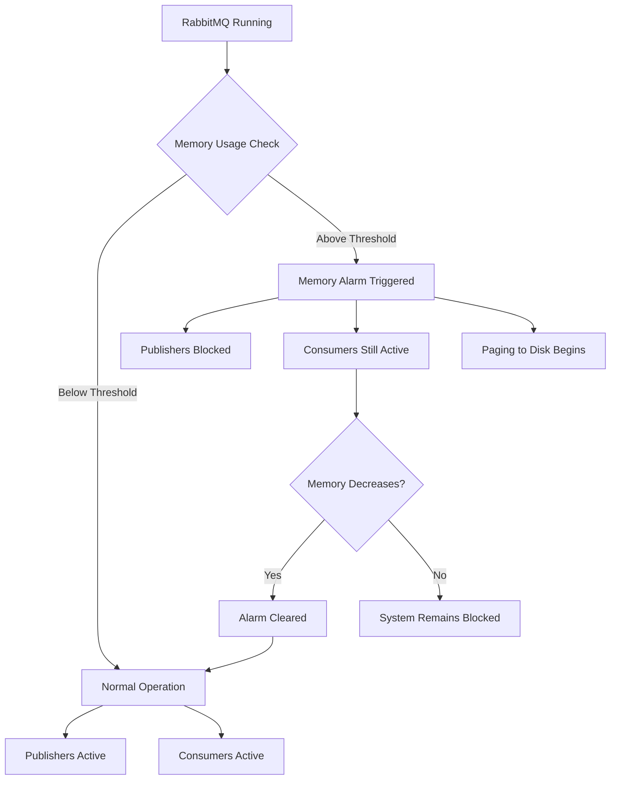
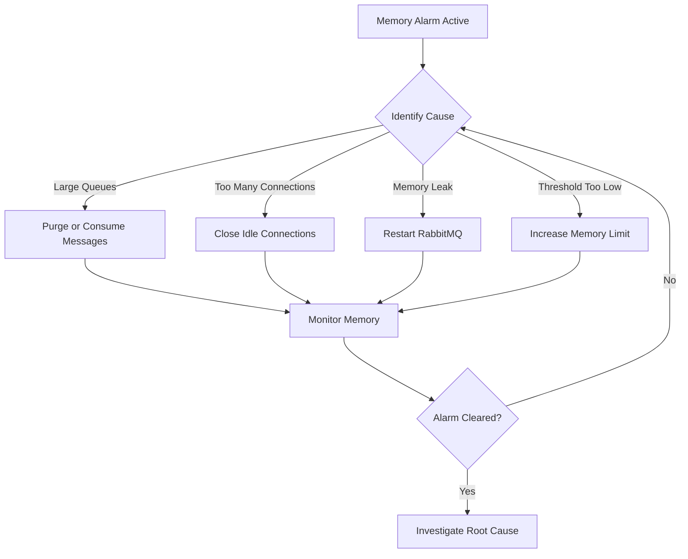
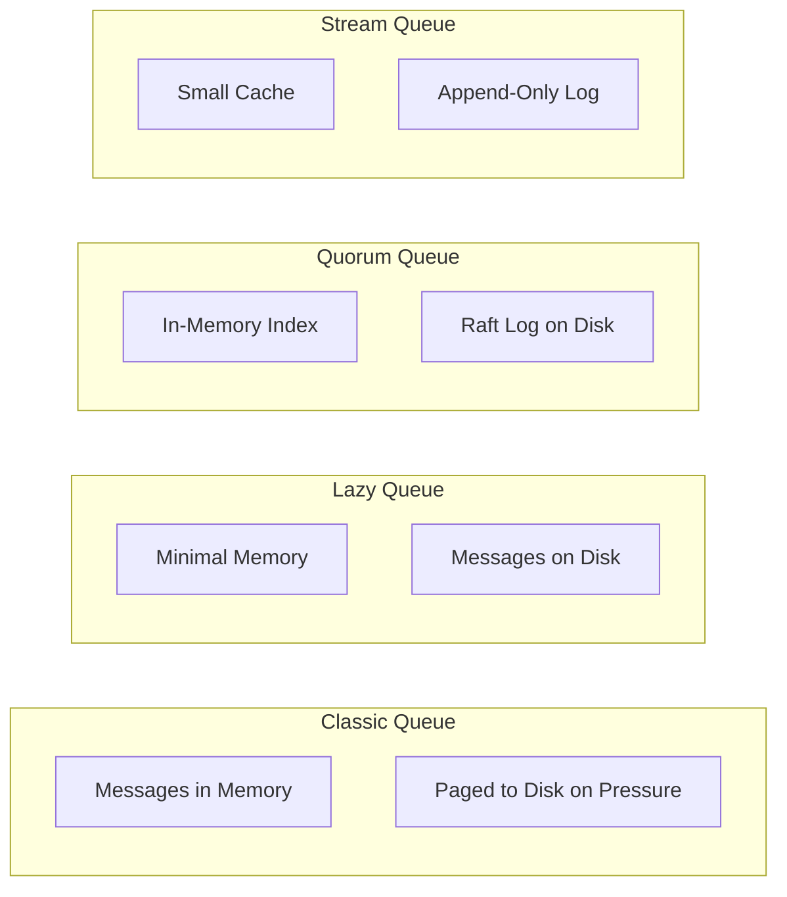

# How to Fix "Memory Alarm" Errors in RabbitMQ

Author: [nawazdhandala](https://www.github.com/nawazdhandala)

Tags: RabbitMQ, Memory Management, Troubleshooting, Performance, Message Queue

Description: Learn how to diagnose, resolve, and prevent memory alarm errors that block publishers in RabbitMQ.

---

Memory alarms in RabbitMQ are protective mechanisms that trigger when the broker consumes too much memory. When activated, RabbitMQ blocks all publishing connections to prevent the system from running out of memory and crashing. While this protection is essential, persistent memory alarms indicate underlying issues that need resolution. This guide explains how to diagnose, fix, and prevent memory alarm conditions.

## Understanding Memory Alarms

RabbitMQ monitors system memory and triggers an alarm when usage exceeds a configurable threshold.



### Default Memory Threshold

By default, RabbitMQ triggers a memory alarm when it uses more than 40% of available system memory.

```bash
# Check current memory status
rabbitmqctl status | grep -A 20 "memory"

# Sample output showing memory alarm
# Memory
# ------
# Total memory used: 2.5 GB
# Memory limit: 3.2 GB
# Memory high watermark: 40%
# Memory alarm: true  <-- ALARM ACTIVE
```

## Immediate Resolution Steps

When a memory alarm is active, follow these steps to restore normal operation.

### Step 1: Verify Memory Alarm Status

```bash
# Check if memory alarm is active
rabbitmqctl status | grep "memory"

# Get detailed memory breakdown
rabbitmqctl status | grep -A 50 "Memory"

# Via management API
curl -u admin:password http://localhost:15672/api/nodes | jq '.[0].mem_alarm'
```

### Step 2: Identify Memory Consumers

```bash
# List queues by memory usage
rabbitmqadmin list queues name memory messages --sort memory

# Check connection memory usage
rabbitmqadmin list connections name recv_oct_details send_oct_details

# Get detailed memory breakdown by category
rabbitmqctl status | grep -A 30 "Memory used by category"
```

Sample memory breakdown:
```
Memory used by category (bytes):
  allocated_unused: 45,678,912
  atom: 1,234,567
  binary: 890,123,456
  code: 23,456,789
  connection_channels: 12,345,678
  connection_other: 8,901,234
  connection_readers: 5,678,901
  connection_writers: 4,567,890
  metrics: 2,345,678
  mgmt_db: 34,567,890
  mnesia: 1,234,567
  msg_index: 23,456,789
  other_ets: 12,345,678
  other_proc: 45,678,901
  other_system: 23,456,789
  plugins: 5,678,901
  queue_procs: 234,567,890
  queue_slave_procs: 0
  quorum_queue_procs: 45,678,901
  reserved_unallocated: 0
```

### Step 3: Take Immediate Action



#### Option A: Purge Large Queues (If Messages Can Be Lost)

```bash
# List queues sorted by message count
rabbitmqadmin list queues name messages --sort messages

# Purge a specific queue (WARNING: Deletes all messages)
rabbitmqadmin purge queue name=large_queue

# Or via rabbitmqctl
rabbitmqctl purge_queue large_queue
```

#### Option B: Increase Consumer Throughput

```bash
# Check consumer count on queues
rabbitmqadmin list queues name consumers messages

# If consumers are slow, scale them up or increase prefetch
# Example: Increase prefetch count for existing consumers
```

#### Option C: Temporarily Increase Memory Threshold

```bash
# Increase memory threshold to 60% temporarily
rabbitmqctl set_vm_memory_high_watermark 0.6

# Or set an absolute limit (e.g., 4GB)
rabbitmqctl set_vm_memory_high_watermark absolute 4294967296
```

#### Option D: Force Memory Release

```bash
# Force garbage collection on all processes
rabbitmqctl eval 'erlang:garbage_collect().'

# Clear management database statistics (if using management plugin)
rabbitmqctl eval 'rabbit_mgmt_db:reset().'
```

## Configuration for Prevention

### Memory Threshold Settings

Edit `/etc/rabbitmq/rabbitmq.conf`:

```ini
# Set memory high watermark as percentage of total RAM
# Default is 0.4 (40%)
vm_memory_high_watermark.relative = 0.6

# Or set absolute memory limit
# vm_memory_high_watermark.absolute = 4GB

# Configure paging threshold (when to start paging messages to disk)
# This is a fraction of the high watermark
# At 50% of high watermark, start paging
vm_memory_high_watermark_paging_ratio = 0.5

# Memory calculation strategy
# Options: rss (resident set), allocated, erlang
vm_memory_calculation_strategy = allocated
```

### Memory Calculation Strategies

| Strategy | Description | Use Case |
|----------|-------------|----------|
| `rss` | Resident Set Size | Most accurate for bare metal |
| `allocated` | Memory allocated by Erlang VM | Default, good for containers |
| `erlang` | Memory reported by Erlang | Fallback option |

### Container-Specific Configuration

When running RabbitMQ in containers, memory limits need special handling.

```yaml
# docker-compose.yml
version: '3.8'
services:
  rabbitmq:
    image: rabbitmq:3.12-management
    environment:
      # Tell RabbitMQ about the container memory limit
      RABBITMQ_VM_MEMORY_HIGH_WATERMARK: 0.8
      RABBITMQ_TOTAL_MEMORY_AVAILABLE_OVERRIDE_VALUE: 2147483648  # 2GB
    deploy:
      resources:
        limits:
          memory: 2G
        reservations:
          memory: 1G
```

For Kubernetes:

```yaml
# rabbitmq-deployment.yaml
apiVersion: apps/v1
kind: Deployment
metadata:
  name: rabbitmq
spec:
  template:
    spec:
      containers:
      - name: rabbitmq
        image: rabbitmq:3.12-management
        resources:
          limits:
            memory: "2Gi"
          requests:
            memory: "1Gi"
        env:
        - name: RABBITMQ_VM_MEMORY_HIGH_WATERMARK
          value: "0.8"
        # Calculate available memory from cgroup limits
        - name: RABBITMQ_TOTAL_MEMORY_AVAILABLE_OVERRIDE_VALUE
          value: "1717986918"  # ~1.6GB (80% of 2GB limit)
```

## Diagnosing Root Causes

### Cause 1: Message Backlog

Messages accumulating faster than they are consumed.

```bash
# Identify queues with large backlogs
rabbitmqadmin list queues name messages consumers message_bytes \
  --sort messages | head -20

# Check message rates
rabbitmqctl list_queues name messages_ready messages_unacknowledged \
  publish_rate deliver_rate
```

Solution:
```bash
# Add more consumers or increase prefetch
# Configure TTL to expire old messages
rabbitmqctl set_policy ttl-policy "^queue\." \
  '{"message-ttl": 86400000}' \
  --apply-to queues

# Set maximum queue length
rabbitmqctl set_policy max-length "^queue\." \
  '{"max-length": 100000, "overflow": "drop-head"}' \
  --apply-to queues
```

### Cause 2: Large Messages

Individual messages consuming significant memory.

```bash
# Check average message size per queue
rabbitmqadmin list queues name messages message_bytes | \
  awk 'NR>3 && $4 > 0 {print $2, $4/$4, $6/$4}'
```

Solution:
```bash
# Limit maximum message size
# In rabbitmq.conf:
# max_message_size = 134217728  # 128MB max

# Or use message compression in your application
# Example policy to reject large messages
rabbitmqctl set_policy max-length ".*" \
  '{"max-length-bytes": 1073741824}' \
  --apply-to queues
```

### Cause 3: Too Many Connections/Channels

Each connection and channel consumes memory.

```bash
# Count connections
rabbitmqctl list_connections | wc -l

# Count channels
rabbitmqctl list_channels | wc -l

# Find connections with many channels
rabbitmqadmin list connections name channels --sort channels
```

Solution:
```ini
# rabbitmq.conf - Limit connections and channels

# Maximum connections per node
# connection_max = 10000

# Maximum channels per connection
channel_max = 128

# Heartbeat timeout (detects dead connections)
heartbeat = 60
```

### Cause 4: Management Plugin Statistics

The management plugin stores statistics in memory.

```bash
# Check management database size
rabbitmqctl status | grep mgmt_db

# Reset management statistics
rabbitmqctl eval 'rabbit_mgmt_db:reset().'
```

Solution:
```ini
# rabbitmq.conf - Limit management statistics retention

# Reduce statistics retention (default is 5 minutes)
management.rates_mode = basic
management.sample_retention_policies.global.minute = 5
management.sample_retention_policies.global.hour = 60
management.sample_retention_policies.global.day = 1200

# Disable detailed statistics collection
collect_statistics_interval = 10000
```

### Cause 5: Binary Memory Fragmentation

Erlang binary memory can become fragmented over time.

```bash
# Check binary memory
rabbitmqctl status | grep binary

# Force binary garbage collection
rabbitmqctl eval '[erlang:garbage_collect(P) || P <- erlang:processes()].'
```

## Queue Type Considerations

Different queue types have different memory characteristics.



### Converting to Lazy Queues

```bash
# Set policy for lazy queue mode
rabbitmqctl set_policy lazy-queues "^memory-intensive\." \
  '{"queue-mode": "lazy"}' \
  --apply-to queues

# For new queues, declare with lazy mode
rabbitmqadmin declare queue name=lazy_queue durable=true \
  arguments='{"x-queue-mode": "lazy"}'
```

### Using Quorum Queues

```bash
# Quorum queues have better memory efficiency for large queues
rabbitmqadmin declare queue name=efficient_queue durable=true \
  arguments='{
    "x-queue-type": "quorum",
    "x-max-in-memory-length": 0
  }'
```

## Monitoring and Alerting

### Prometheus Metrics

```yaml
# prometheus-alerts.yml
groups:
  - name: rabbitmq_memory
    rules:
      - alert: RabbitMQMemoryAlarm
        expr: rabbitmq_alarms_memory_used_watermark == 1
        for: 0m
        labels:
          severity: critical
        annotations:
          summary: "RabbitMQ memory alarm on {{ $labels.instance }}"
          description: "Publishers are blocked due to memory alarm"

      - alert: RabbitMQHighMemoryUsage
        expr: rabbitmq_process_resident_memory_bytes / rabbitmq_resident_memory_limit_bytes > 0.7
        for: 5m
        labels:
          severity: warning
        annotations:
          summary: "RabbitMQ memory usage above 70%"
          description: "Memory usage is {{ $value | humanizePercentage }}"

      - alert: RabbitMQQueueMemoryHigh
        expr: rabbitmq_queue_messages_bytes > 500000000
        for: 10m
        labels:
          severity: warning
        annotations:
          summary: "Queue {{ $labels.queue }} using high memory"
          description: "Queue has {{ $value | humanize1024 }}B of messages"
```

### Health Check Script

```bash
#!/bin/bash
# /usr/local/bin/rabbitmq-memory-check.sh

# Get memory alarm status
MEMORY_ALARM=$(rabbitmqctl status 2>/dev/null | grep -c "mem_alarm,true")

if [ "$MEMORY_ALARM" -gt 0 ]; then
    echo "CRITICAL: Memory alarm active"

    # Get top queues by memory
    echo "Top queues by memory:"
    rabbitmqadmin list queues name messages memory --sort memory 2>/dev/null | tail -10

    # Get memory breakdown
    echo "Memory breakdown:"
    rabbitmqctl status 2>/dev/null | grep -A 20 "Memory used by category"

    exit 2
fi

# Check if approaching threshold
MEMORY_USED=$(rabbitmqctl status 2>/dev/null | grep "used:" | grep -oP '\d+' | head -1)
MEMORY_LIMIT=$(rabbitmqctl status 2>/dev/null | grep "limit:" | grep -oP '\d+' | head -1)

if [ -n "$MEMORY_USED" ] && [ -n "$MEMORY_LIMIT" ]; then
    USAGE_PERCENT=$((MEMORY_USED * 100 / MEMORY_LIMIT))

    if [ "$USAGE_PERCENT" -gt 80 ]; then
        echo "WARNING: Memory usage at ${USAGE_PERCENT}%"
        exit 1
    fi
fi

echo "OK: Memory usage normal"
exit 0
```

## Automated Recovery

### Systemd Memory Limit

```ini
# /etc/systemd/system/rabbitmq-server.service.d/override.conf
[Service]
# Restart if memory exceeds 80% of limit
MemoryHigh=80%
MemoryMax=90%

# Restart on failure
Restart=on-failure
RestartSec=30
```

### Cron Job for Queue Cleanup

```bash
# /etc/cron.d/rabbitmq-cleanup
# Purge queues older than 7 days with no consumers

0 * * * * rabbitmq /usr/local/bin/rabbitmq-cleanup.sh

# /usr/local/bin/rabbitmq-cleanup.sh
#!/bin/bash
for queue in $(rabbitmqctl list_queues name consumers --quiet | awk '$2 == 0 {print $1}'); do
    # Check if queue has idle messages
    IDLE=$(rabbitmqctl list_queues name idle_since --quiet | grep "^$queue" | awk '{print $2}')
    if [ -n "$IDLE" ]; then
        # Delete queue if idle for more than 7 days
        rabbitmqctl delete_queue "$queue" 2>/dev/null
        echo "Deleted idle queue: $queue"
    fi
done
```

## Summary

To fix and prevent memory alarm errors in RabbitMQ:

1. **Immediate Actions**
   - Identify and purge large queues if data loss is acceptable
   - Temporarily increase memory threshold
   - Scale up consumers to drain queues

2. **Configuration Tuning**
   - Set appropriate memory thresholds for your environment
   - Configure container memory limits properly
   - Enable paging at appropriate thresholds

3. **Architectural Improvements**
   - Use lazy queues or quorum queues for large backlogs
   - Implement message TTLs and queue size limits
   - Use backpressure mechanisms in producers

4. **Monitoring**
   - Set up alerts before memory alarm triggers
   - Monitor queue depth and message rates
   - Track memory usage by category

By implementing these practices, you can maintain stable RabbitMQ operations and prevent memory-related service disruptions.
