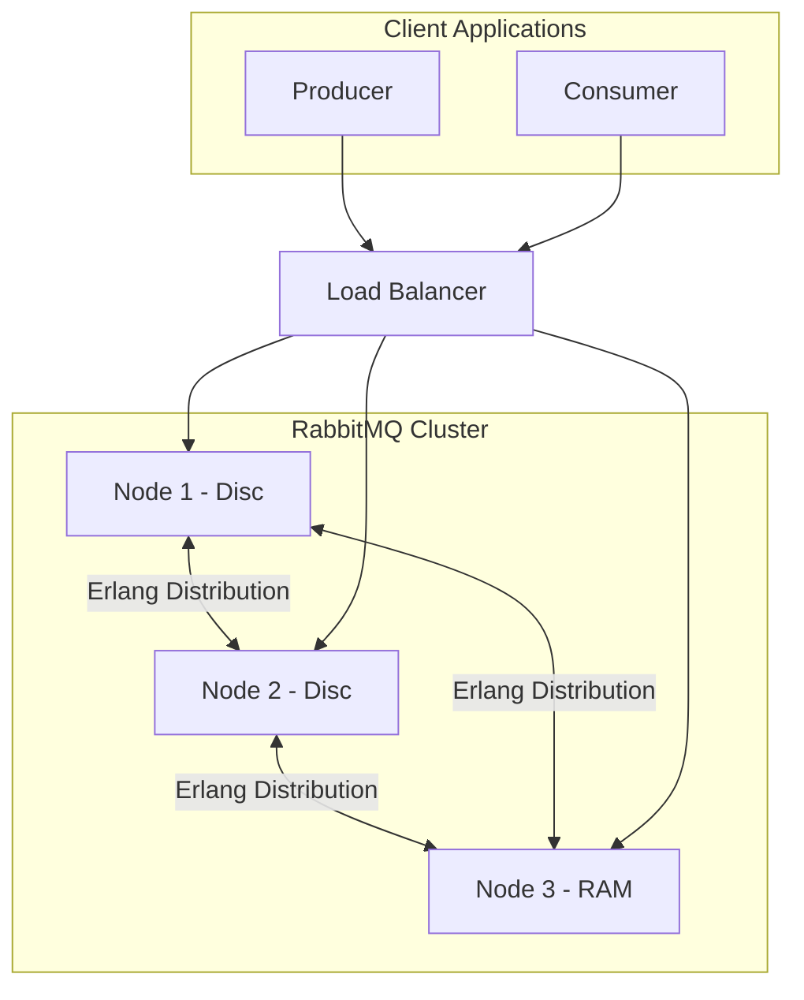
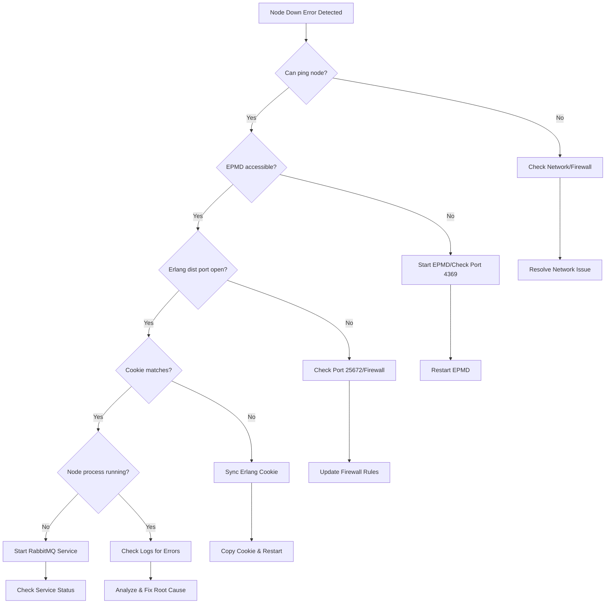
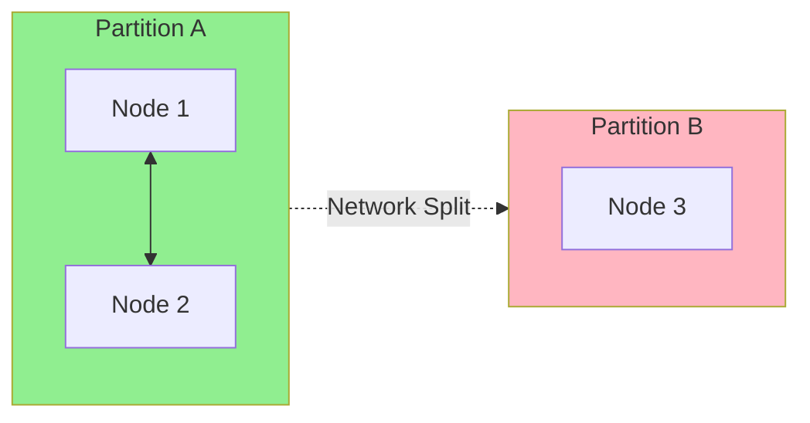

# How to Fix "Node Down" Errors in RabbitMQ Cluster

Author: [nawazdhandala](https://www.github.com/nawazdhandala)

Tags: RabbitMQ, Clustering, High Availability, Troubleshooting, Message Queue

Description: Learn how to diagnose and resolve node down errors in RabbitMQ clusters to maintain high availability.

---

When operating RabbitMQ in a clustered configuration, "Node Down" errors can disrupt message processing and impact application availability. These errors indicate that one or more nodes in your cluster have become unreachable or have failed. This guide provides a systematic approach to diagnosing and resolving these issues while preventing future occurrences.

## Understanding RabbitMQ Cluster Architecture

Before diving into troubleshooting, it is important to understand how RabbitMQ clusters operate.



RabbitMQ clusters use Erlang's distributed communication protocol for inter-node messaging. All nodes share:
- Queue metadata and definitions
- Exchange and binding information
- User credentials and permissions
- Virtual host configurations

## Common Causes of Node Down Errors

### 1. Network Connectivity Issues

Network problems are the most frequent cause of node failures.

```bash
# Check network connectivity between nodes
ping -c 5 rabbit-node2.example.com

# Verify the Erlang distribution port is accessible (default: 25672)
nc -zv rabbit-node2.example.com 25672

# Check if EPMD is running and accessible (default: 4369)
nc -zv rabbit-node2.example.com 4369

# List registered nodes on EPMD
epmd -names
```

### 2. Erlang Cookie Mismatch

All nodes in a cluster must share the same Erlang cookie.

```bash
# Check the Erlang cookie on each node
cat /var/lib/rabbitmq/.erlang.cookie

# Or check via rabbitmqctl
rabbitmqctl eval 'erlang:get_cookie().'
```

### 3. DNS Resolution Failures

Nodes must be able to resolve each other's hostnames.

```bash
# Verify DNS resolution
nslookup rabbit-node1.example.com
nslookup rabbit-node2.example.com
nslookup rabbit-node3.example.com

# Check /etc/hosts if using static resolution
cat /etc/hosts | grep rabbit
```

### 4. Resource Exhaustion

Memory or disk space issues can cause nodes to become unresponsive.

```bash
# Check memory usage
free -h

# Check disk space
df -h /var/lib/rabbitmq

# Check RabbitMQ resource status
rabbitmqctl status | grep -A 10 "memory"
```

## Diagnostic Workflow

Follow this systematic approach to diagnose node down errors.



## Step-by-Step Resolution

### Step 1: Verify Cluster Status

```bash
# Check cluster status from a working node
rabbitmqctl cluster_status

# Expected output shows running and disc/ram nodes
# Cluster status of node rabbit@node1
# Basics
# Cluster name: rabbit@node1
# Disk Nodes: rabbit@node1, rabbit@node2
# RAM Nodes: rabbit@node3
# Running Nodes: rabbit@node1, rabbit@node2
# Maintenance status: No nodes are under maintenance
```

### Step 2: Check Node Health

```bash
# Check if the problematic node's process is running
ssh rabbit-node2 'systemctl status rabbitmq-server'

# Check RabbitMQ logs for errors
ssh rabbit-node2 'tail -100 /var/log/rabbitmq/rabbit@node2.log'

# Look for specific error patterns
ssh rabbit-node2 'grep -i "error\|crash\|down" /var/log/rabbitmq/rabbit@node2.log | tail -50'
```

### Step 3: Verify Network Configuration

```bash
# Check all required ports are open
# Port 4369: EPMD - Erlang Port Mapper Daemon
# Port 5672: AMQP client connections
# Port 15672: Management UI
# Port 25672: Erlang distribution (inter-node communication)

# Test from the working node
for port in 4369 5672 15672 25672; do
    echo "Testing port $port..."
    nc -zv rabbit-node2.example.com $port
done
```

### Step 4: Sync Erlang Cookie (If Mismatched)

```bash
# Stop RabbitMQ on the problematic node
ssh rabbit-node2 'systemctl stop rabbitmq-server'

# Copy the cookie from a working node
COOKIE=$(cat /var/lib/rabbitmq/.erlang.cookie)
ssh rabbit-node2 "echo '$COOKIE' > /var/lib/rabbitmq/.erlang.cookie"
ssh rabbit-node2 'chmod 400 /var/lib/rabbitmq/.erlang.cookie'
ssh rabbit-node2 'chown rabbitmq:rabbitmq /var/lib/rabbitmq/.erlang.cookie'

# Restart the node
ssh rabbit-node2 'systemctl start rabbitmq-server'
```

### Step 5: Rejoin the Cluster

If the node was reset or lost its cluster membership, rejoin it.

```bash
# On the problematic node
rabbitmqctl stop_app

# Reset the node (WARNING: This removes all data on this node)
rabbitmqctl reset

# Join the cluster
rabbitmqctl join_cluster rabbit@node1

# Start the application
rabbitmqctl start_app

# Verify cluster status
rabbitmqctl cluster_status
```

## Handling Network Partitions

Network partitions (split-brain scenarios) require special handling.



### Detecting Partitions

```bash
# Check for partition status
rabbitmqctl cluster_status | grep -A 5 "Network Partitions"

# Via the management API
curl -u admin:password http://localhost:15672/api/nodes | jq '.[].partitions'
```

### Resolving Partitions

```bash
# Option 1: Restart the minority partition nodes
# First, identify which nodes are in the minority
rabbitmqctl cluster_status

# Stop and reset the minority nodes
ssh rabbit-node3 'rabbitmqctl stop_app'
ssh rabbit-node3 'rabbitmqctl reset'
ssh rabbit-node3 'rabbitmqctl join_cluster rabbit@node1'
ssh rabbit-node3 'rabbitmqctl start_app'

# Option 2: Use forget_cluster_node to remove unreachable nodes
# WARNING: Only use if the node is permanently gone
rabbitmqctl forget_cluster_node rabbit@node3
```

### Partition Handling Strategies

Configure automatic partition handling in `rabbitmq.conf`:

```ini
# rabbitmq.conf

# Partition handling mode
# Options: ignore, pause_minority, autoheal
cluster_partition_handling = pause_minority

# For autoheal mode (automatically picks a winning partition)
# cluster_partition_handling = autoheal
```

| Strategy | Behavior | Use Case |
|----------|----------|----------|
| `ignore` | No automatic action | Manual intervention preferred |
| `pause_minority` | Minority partition nodes pause | Most common, prevents split-brain |
| `autoheal` | Automatically heals by restarting nodes | Hands-off operation |

## Preventing Future Node Down Errors

### 1. Configure Proper Networking

```bash
# /etc/rabbitmq/rabbitmq.conf

# Increase net tick time for high-latency networks
net_ticktime = 120

# Configure cluster formation
cluster_formation.peer_discovery_backend = rabbit_peer_discovery_dns
cluster_formation.dns.hostname = rabbitmq.service.consul

# Set node type
cluster_formation.node_type = disc
```

### 2. Set Up Health Checks

```bash
# Create a health check script
cat > /usr/local/bin/rabbitmq-health-check.sh << 'EOF'
#!/bin/bash

# Check if RabbitMQ is responding
if ! rabbitmqctl status > /dev/null 2>&1; then
    echo "CRITICAL: RabbitMQ not responding"
    exit 2
fi

# Check cluster status
CLUSTER_STATUS=$(rabbitmqctl cluster_status 2>&1)
if echo "$CLUSTER_STATUS" | grep -q "Network Partitions"; then
    echo "WARNING: Network partition detected"
    exit 1
fi

# Check for down nodes
RUNNING_NODES=$(echo "$CLUSTER_STATUS" | grep -A 100 "Running Nodes" | grep "rabbit@" | wc -l)
TOTAL_NODES=$(echo "$CLUSTER_STATUS" | grep -A 100 "Disc Nodes\|RAM Nodes" | grep "rabbit@" | sort -u | wc -l)

if [ "$RUNNING_NODES" -lt "$TOTAL_NODES" ]; then
    echo "WARNING: Only $RUNNING_NODES of $TOTAL_NODES nodes running"
    exit 1
fi

echo "OK: All $RUNNING_NODES nodes healthy"
exit 0
EOF

chmod +x /usr/local/bin/rabbitmq-health-check.sh
```

### 3. Configure Monitoring and Alerts

```yaml
# Prometheus alerting rules
groups:
  - name: rabbitmq_cluster
    rules:
      - alert: RabbitMQNodeDown
        expr: rabbitmq_running{job="rabbitmq"} == 0
        for: 1m
        labels:
          severity: critical
        annotations:
          summary: "RabbitMQ node {{ $labels.instance }} is down"
          description: "Node has been unreachable for more than 1 minute"

      - alert: RabbitMQClusterPartition
        expr: rabbitmq_partitions > 0
        for: 0m
        labels:
          severity: critical
        annotations:
          summary: "RabbitMQ cluster partition detected"
          description: "Cluster has {{ $value }} partitions"

      - alert: RabbitMQNodeNotDistributed
        expr: rabbitmq_clustered == 0
        for: 5m
        labels:
          severity: warning
        annotations:
          summary: "RabbitMQ node not clustered"
          description: "Node {{ $labels.instance }} is not part of the cluster"
```

### 4. Implement Proper Load Balancing

```nginx
# nginx.conf for RabbitMQ load balancing
upstream rabbitmq_cluster {
    # Use least_conn for better distribution
    least_conn;

    server rabbit-node1:5672 weight=1 max_fails=3 fail_timeout=30s;
    server rabbit-node2:5672 weight=1 max_fails=3 fail_timeout=30s;
    server rabbit-node3:5672 weight=1 max_fails=3 fail_timeout=30s;
}

server {
    listen 5672;
    proxy_pass rabbitmq_cluster;

    # Health check configuration
    health_check interval=5s fails=3 passes=2;
}
```

## Emergency Recovery Procedures

### Complete Cluster Recovery

When all nodes are down, follow this procedure:

```bash
# 1. Identify the node that was shut down last
# Check the shutdown order in logs
for node in node1 node2 node3; do
    echo "=== $node ==="
    ssh rabbit-$node 'grep "Stopping RabbitMQ" /var/log/rabbitmq/rabbit*.log | tail -1'
done

# 2. Start the last node to shut down FIRST
ssh rabbit-node2 'systemctl start rabbitmq-server'

# 3. Wait for it to fully start
ssh rabbit-node2 'rabbitmqctl wait /var/lib/rabbitmq/mnesia/rabbit@node2.pid'

# 4. Start remaining nodes
ssh rabbit-node1 'systemctl start rabbitmq-server'
ssh rabbit-node3 'systemctl start rabbitmq-server'

# 5. Verify cluster status
rabbitmqctl cluster_status
```

### Force Boot a Single Node

If the cluster cannot start normally:

```bash
# WARNING: Use only as last resort - may cause data loss

# Force boot the node (ignores cluster membership)
rabbitmqctl force_boot

# Start the application
systemctl start rabbitmq-server

# Check status
rabbitmqctl cluster_status
```

## Summary

Resolving "Node Down" errors in RabbitMQ requires systematic diagnosis:

1. **Verify network connectivity** between all cluster nodes
2. **Check Erlang cookie consistency** across the cluster
3. **Ensure EPMD and distribution ports** are accessible
4. **Monitor resource usage** to prevent exhaustion
5. **Configure partition handling** appropriate for your use case
6. **Set up proactive monitoring** to catch issues early

By following these practices and maintaining proper monitoring, you can minimize downtime and ensure your RabbitMQ cluster remains highly available.
