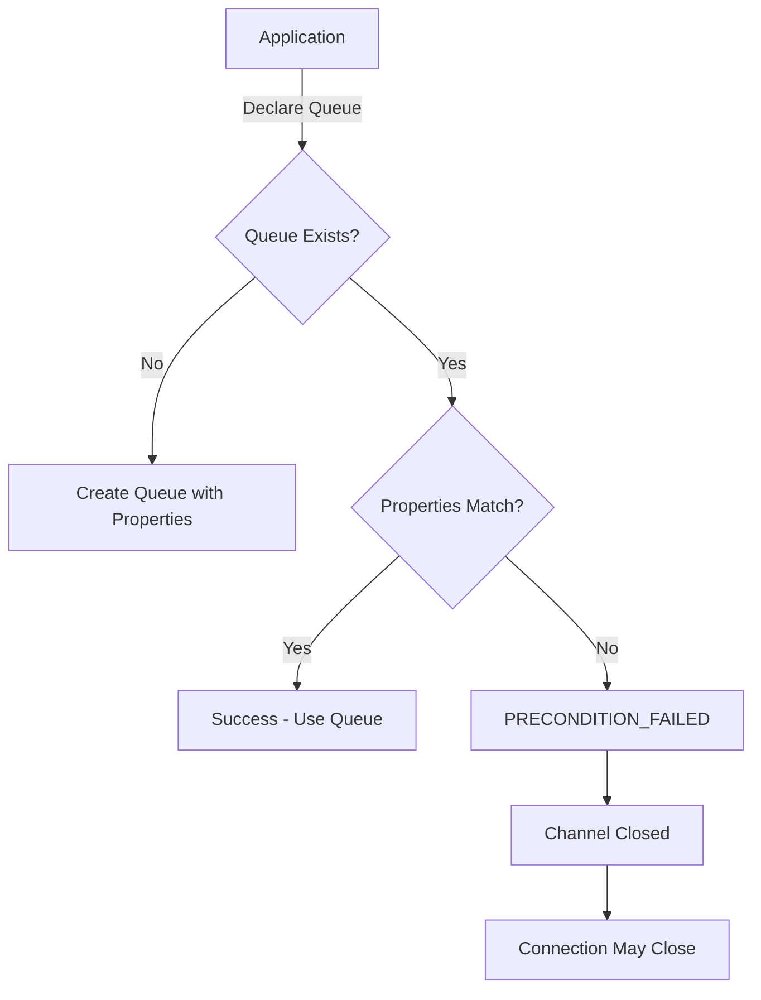
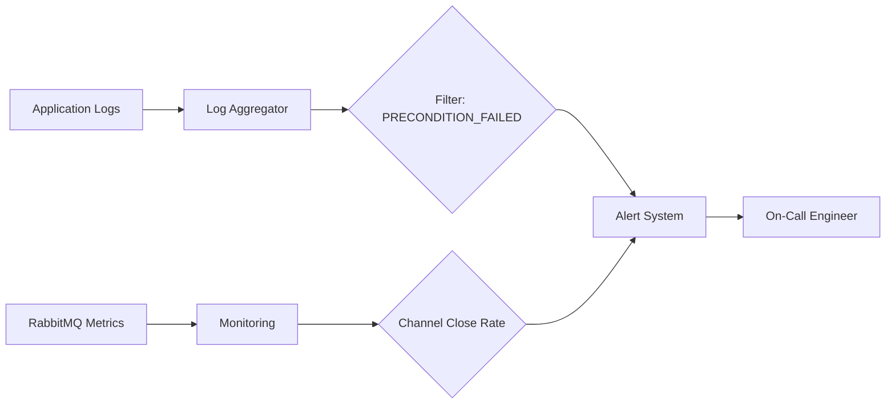

# How to Fix 'Precondition Failed' Errors in RabbitMQ

Author: [nawazdhandala](https://www.github.com/nawazdhandala)

Tags: RabbitMQ, Message Queue, Troubleshooting, AMQP, Backend, Distributed Systems, Error Handling

Description: Learn how to diagnose and fix RabbitMQ precondition failed errors caused by queue and exchange property mismatches.

---

> Precondition failed errors in RabbitMQ occur when you try to declare a queue or exchange with properties that conflict with an existing declaration. Understanding the root cause helps you fix these errors quickly and prevent them in the future.

This error typically appears as `PRECONDITION_FAILED` in your application logs, causing connection or channel closures.

---

## Understanding the Error



---

## Common Causes

### 1. Mismatched Durability

The most common cause is declaring a queue with different durability settings:

```python
# First declaration - durable queue
# Durable queues survive broker restarts
channel.queue_declare(queue='orders', durable=True)

# Later declaration - non-durable queue (FAILS!)
# This conflicts with the existing durable queue
channel.queue_declare(queue='orders', durable=False)
# Error: PRECONDITION_FAILED - inequivalent arg 'durable'
```

### 2. Different Arguments

Queue arguments like TTL, max length, or dead letter exchange must match:

```python
# Original declaration with TTL
channel.queue_declare(
    queue='notifications',
    durable=True,
    arguments={
        'x-message-ttl': 60000  # 60 seconds
    }
)

# Conflicting declaration with different TTL (FAILS!)
channel.queue_declare(
    queue='notifications',
    durable=True,
    arguments={
        'x-message-ttl': 30000  # 30 seconds - different value!
    }
)
```

### 3. Exchange Type Mismatch

Declaring an exchange with a different type than what exists:

```python
# Original - direct exchange
channel.exchange_declare(
    exchange='events',
    exchange_type='direct'
)

# Conflicting - topic exchange (FAILS!)
channel.exchange_declare(
    exchange='events',
    exchange_type='topic'  # Different type!
)
```

---

## Diagnosing the Problem

### Check Existing Queue Properties

Use the RabbitMQ management CLI to inspect queue properties:

```bash
# List all queues with their properties
rabbitmqctl list_queues name durable auto_delete arguments

# Get detailed information about a specific queue
rabbitmqctl list_queues name durable auto_delete arguments \
    --formatter json | jq '.[] | select(.name == "orders")'
```

### Check via Management API

Query the HTTP API to get queue details:

```bash
# Get queue information via REST API
# Replace localhost with your RabbitMQ host
curl -u guest:guest \
    http://localhost:15672/api/queues/%2f/orders | jq .

# Response includes all queue properties:
# {
#   "name": "orders",
#   "durable": true,
#   "auto_delete": false,
#   "arguments": {
#     "x-message-ttl": 60000
#   }
# }
```

### Check Exchange Properties

```bash
# List exchanges with their types
rabbitmqctl list_exchanges name type durable auto_delete

# Query specific exchange via API
curl -u guest:guest \
    http://localhost:15672/api/exchanges/%2f/events | jq .
```

---

## Solutions

### Solution 1: Delete and Recreate

If the queue is empty or can be recreated, delete it first:

```python
import pika

connection = pika.BlockingConnection(
    pika.ConnectionParameters('localhost')
)
channel = connection.channel()

# Delete the existing queue
# This removes the queue and all messages in it
channel.queue_delete(queue='orders')

# Now declare with the new properties
channel.queue_declare(
    queue='orders',
    durable=True,
    arguments={
        'x-message-ttl': 30000  # New TTL value
    }
)

print("Queue recreated successfully")
connection.close()
```

### Solution 2: Use Passive Declaration

Check if a queue exists without modifying it:

```python
import pika
from pika.exceptions import ChannelClosedByBroker

def queue_exists(channel, queue_name):
    """
    Check if a queue exists using passive declaration.
    Passive mode only checks existence, does not create.
    """
    try:
        # passive=True means "check only, don't create"
        channel.queue_declare(queue=queue_name, passive=True)
        return True
    except ChannelClosedByBroker:
        # Queue does not exist
        return False

connection = pika.BlockingConnection(
    pika.ConnectionParameters('localhost')
)
channel = connection.channel()

if queue_exists(channel, 'orders'):
    print("Queue exists - using existing properties")
    # Work with the queue as-is
else:
    # Queue doesn't exist, safe to create with desired properties
    channel.queue_declare(
        queue='orders',
        durable=True,
        arguments={'x-message-ttl': 30000}
    )
```

### Solution 3: Match Existing Properties

Query the queue properties and match them in your code:

```python
import pika
import requests
from requests.auth import HTTPBasicAuth

def get_queue_properties(queue_name, host='localhost'):
    """
    Fetch existing queue properties from RabbitMQ Management API.
    Returns None if queue doesn't exist.
    """
    url = f'http://{host}:15672/api/queues/%2f/{queue_name}'
    response = requests.get(
        url,
        auth=HTTPBasicAuth('guest', 'guest')
    )

    if response.status_code == 200:
        return response.json()
    return None

def declare_queue_safely(channel, queue_name, desired_props):
    """
    Declare a queue, matching existing properties if it exists.
    """
    existing = get_queue_properties(queue_name)

    if existing:
        # Use existing properties to avoid precondition failed
        channel.queue_declare(
            queue=queue_name,
            durable=existing.get('durable', False),
            auto_delete=existing.get('auto_delete', False),
            arguments=existing.get('arguments', {})
        )
        print(f"Using existing queue with properties: {existing}")
    else:
        # Queue doesn't exist, create with desired properties
        channel.queue_declare(
            queue=queue_name,
            **desired_props
        )
        print(f"Created new queue with properties: {desired_props}")

# Usage
connection = pika.BlockingConnection(
    pika.ConnectionParameters('localhost')
)
channel = connection.channel()

declare_queue_safely(channel, 'orders', {
    'durable': True,
    'arguments': {'x-message-ttl': 30000}
})
```

---

## Prevention Strategies

### Centralized Queue Configuration

Define all queue configurations in a single location:

```python
# queue_config.py
# Centralized configuration for all queues and exchanges
# This ensures consistency across all services

QUEUES = {
    'orders': {
        'durable': True,
        'auto_delete': False,
        'arguments': {
            'x-message-ttl': 86400000,  # 24 hours
            'x-max-length': 100000,
            'x-dead-letter-exchange': 'dlx'
        }
    },
    'notifications': {
        'durable': True,
        'auto_delete': False,
        'arguments': {
            'x-message-ttl': 3600000,  # 1 hour
            'x-max-priority': 10
        }
    },
    'events': {
        'durable': False,
        'auto_delete': True,
        'arguments': {}
    }
}

EXCHANGES = {
    'orders': {
        'type': 'direct',
        'durable': True
    },
    'events': {
        'type': 'topic',
        'durable': True
    },
    'dlx': {
        'type': 'fanout',
        'durable': True
    }
}

def declare_all_queues(channel):
    """Declare all queues with their configured properties."""
    for queue_name, props in QUEUES.items():
        channel.queue_declare(
            queue=queue_name,
            durable=props['durable'],
            auto_delete=props['auto_delete'],
            arguments=props['arguments']
        )
        print(f"Declared queue: {queue_name}")

def declare_all_exchanges(channel):
    """Declare all exchanges with their configured properties."""
    for exchange_name, props in EXCHANGES.items():
        channel.exchange_declare(
            exchange=exchange_name,
            exchange_type=props['type'],
            durable=props['durable']
        )
        print(f"Declared exchange: {exchange_name}")
```

### Version Your Queue Definitions

Use versioned queue names during migrations:

```python
# When changing queue properties, create a new version
# This allows gradual migration without downtime

QUEUE_VERSION = 'v2'

def get_queue_name(base_name):
    """Generate versioned queue name."""
    return f"{base_name}_{QUEUE_VERSION}"

# Old consumers use: orders_v1
# New consumers use: orders_v2
# Migrate messages between versions using a shovel or consumer
```

---

## Error Handling in Production

```python
import pika
from pika.exceptions import ChannelClosedByBroker
import logging

logging.basicConfig(level=logging.INFO)
logger = logging.getLogger(__name__)

class RabbitMQClient:
    def __init__(self, host='localhost'):
        self.host = host
        self.connection = None
        self.channel = None

    def connect(self):
        """Establish connection to RabbitMQ."""
        self.connection = pika.BlockingConnection(
            pika.ConnectionParameters(self.host)
        )
        self.channel = self.connection.channel()

    def declare_queue_with_retry(self, queue_name, properties, max_retries=3):
        """
        Declare a queue with automatic retry on precondition failure.
        Handles the case where queue exists with different properties.
        """
        for attempt in range(max_retries):
            try:
                self.channel.queue_declare(
                    queue=queue_name,
                    durable=properties.get('durable', False),
                    auto_delete=properties.get('auto_delete', False),
                    arguments=properties.get('arguments', {})
                )
                logger.info(f"Queue {queue_name} declared successfully")
                return True

            except ChannelClosedByBroker as e:
                if 'PRECONDITION_FAILED' in str(e):
                    logger.warning(
                        f"Precondition failed for {queue_name}, "
                        f"attempt {attempt + 1}/{max_retries}"
                    )

                    # Reconnect since channel was closed
                    self.connect()

                    if attempt < max_retries - 1:
                        # Try passive declaration to use existing queue
                        try:
                            self.channel.queue_declare(
                                queue=queue_name,
                                passive=True
                            )
                            logger.info(
                                f"Using existing queue {queue_name} "
                                "with original properties"
                            )
                            return True
                        except:
                            continue
                else:
                    raise

        logger.error(f"Failed to declare queue {queue_name}")
        return False

# Usage
client = RabbitMQClient('localhost')
client.connect()

success = client.declare_queue_with_retry('orders', {
    'durable': True,
    'arguments': {'x-message-ttl': 60000}
})
```

---

## Monitoring for Precondition Errors



### Log Pattern to Monitor

```bash
# Search for precondition errors in logs
grep -i "precondition_failed" /var/log/rabbitmq/rabbit@hostname.log

# Common log patterns to alert on:
# - "PRECONDITION_FAILED - inequivalent arg"
# - "channel error: precondition_failed"
# - "reply-code=406, reply-text=PRECONDITION_FAILED"
```

---

## Best Practices

1. **Centralize queue definitions** - single source of truth for all properties
2. **Use passive declarations** - check before modifying in consumer code
3. **Version queue names** - during property migrations
4. **Handle errors gracefully** - reconnect and retry with fallback
5. **Monitor channel closures** - alert on unexpected precondition failures
6. **Document all queue properties** - maintain a registry of configurations

---

## Conclusion

Precondition failed errors indicate a mismatch between declared and existing queue or exchange properties. Key takeaways:

- **Identify the mismatch** - use management CLI or API to inspect properties
- **Fix the conflict** - delete/recreate or match existing properties
- **Prevent future issues** - centralize configuration and version migrations
- **Handle gracefully** - implement retry logic with proper error handling

---

*Need to monitor your RabbitMQ clusters? [OneUptime](https://oneuptime.com) provides comprehensive monitoring for message queue systems with alerting on connection issues and queue health.*
