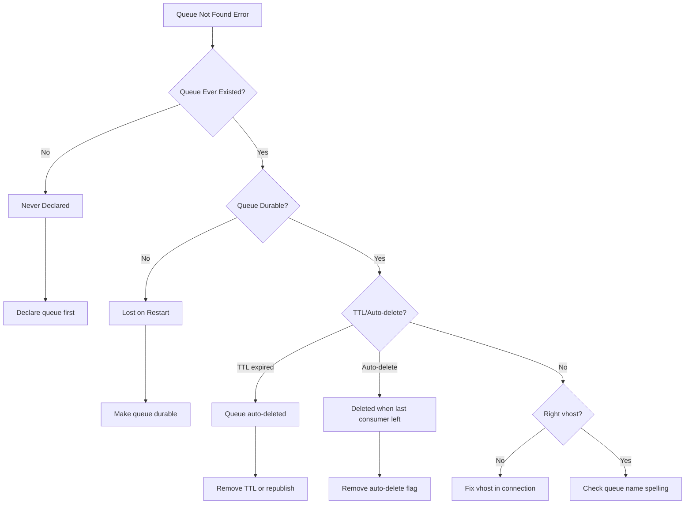
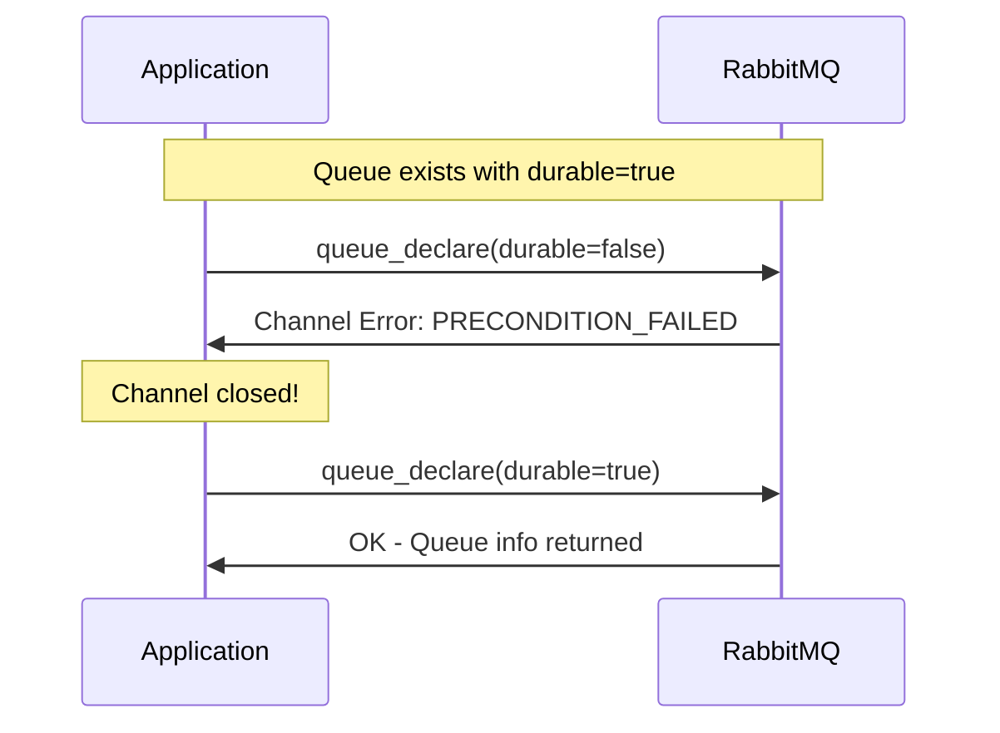
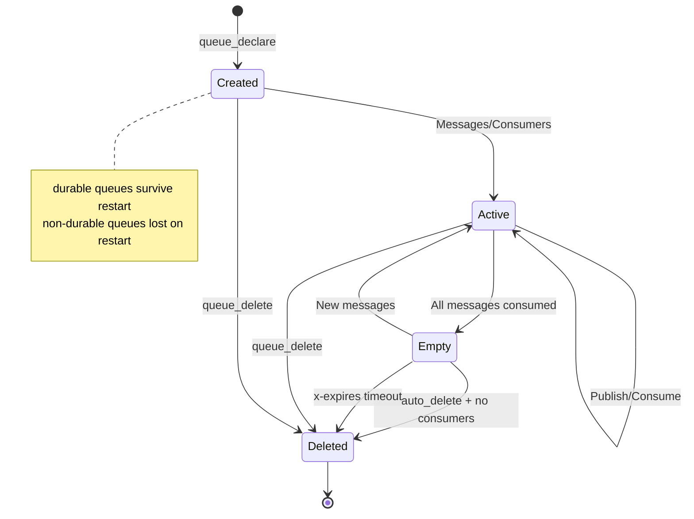

# How to Fix 'Queue Not Found' Errors in RabbitMQ

Author: [nawazdhandala](https://www.github.com/nawazdhandala)

Tags: RabbitMQ, Messaging, Troubleshooting, Backend, DevOps

Description: Learn how to diagnose and fix RabbitMQ queue not found errors, including queue declaration, naming issues, and virtual host configuration.

---

The "queue not found" error (NOT_FOUND) is a common issue in RabbitMQ that occurs when your application tries to consume from or publish to a queue that does not exist. This guide explains why this happens and how to fix it.

## Understanding the Error

When RabbitMQ cannot find a queue, you will see errors like:

```
pika.exceptions.ChannelClosedByBroker: (404, "NOT_FOUND - no queue 'my_queue' in vhost '/'")
```

Or in Node.js:

```
Error: Channel closed by server: 404 (NOT-FOUND) with message "NOT_FOUND - no queue 'my_queue' in vhost '/'"
```

## Common Causes



## Step 1: Check If Queue Exists

First, verify whether the queue actually exists on the RabbitMQ server.

```bash
# List all queues in the default vhost
rabbitmqctl list_queues name messages consumers

# List queues in a specific vhost
rabbitmqctl list_queues -p my_vhost name messages consumers

# Using the HTTP API (requires management plugin)
curl -u guest:guest http://localhost:15672/api/queues
```

## Step 2: Declare the Queue Before Using It

The most common cause is simply that the queue was never created. Always declare queues before publishing or consuming.

### Python Example

```python
import pika

connection = pika.BlockingConnection(pika.ConnectionParameters('localhost'))
channel = connection.channel()

# Declare the queue - this is idempotent
# If the queue already exists with the same parameters, nothing happens
# If it exists with different parameters, an error is raised
channel.queue_declare(
    queue='my_queue',
    durable=True,      # Survive broker restart
    exclusive=False,   # Allow multiple connections
    auto_delete=False  # Don't delete when consumers disconnect
)

# Now safe to publish
channel.basic_publish(
    exchange='',
    routing_key='my_queue',
    body='Hello World',
    properties=pika.BasicProperties(
        delivery_mode=2  # Persistent message
    )
)

print("Message sent successfully")
connection.close()
```

### Node.js Example

```javascript
const amqp = require('amqplib');

async function publishMessage() {
    const connection = await amqp.connect('amqp://localhost');
    const channel = await connection.createChannel();

    const queue = 'my_queue';

    // assertQueue creates the queue if it doesn't exist
    // If it exists with matching properties, returns queue info
    // If it exists with different properties, throws an error
    await channel.assertQueue(queue, {
        durable: true,      // Queue survives broker restart
        exclusive: false,   // Not limited to this connection
        autoDelete: false   // Don't delete when empty
    });

    // Now safe to publish
    channel.sendToQueue(queue, Buffer.from('Hello World'), {
        persistent: true  // Message survives restart
    });

    console.log('Message sent successfully');

    await channel.close();
    await connection.close();
}

publishMessage().catch(console.error);
```

## Step 3: Check Virtual Host Configuration

Queues are scoped to virtual hosts. If you are connecting to the wrong vhost, you will not find your queue.

```python
import pika

# Specify the correct virtual host in connection parameters
# Each vhost is isolated - queues in one vhost are not visible in another
connection = pika.BlockingConnection(
    pika.ConnectionParameters(
        host='localhost',
        port=5672,
        virtual_host='/production',  # Specify the correct vhost
        credentials=pika.PlainCredentials('user', 'password')
    )
)

channel = connection.channel()
```

List virtual hosts and their queues:

```bash
# List all virtual hosts
rabbitmqctl list_vhosts

# List queues in a specific vhost
rabbitmqctl list_queues -p /production name messages
```

## Step 4: Handle Queue Property Mismatches

If you try to declare a queue with different properties than an existing queue, RabbitMQ will close the channel.



### Handling Property Mismatch

```python
import pika

def safe_queue_declare(channel, queue_name, **kwargs):
    """
    Safely declare a queue, handling property mismatches.

    If the queue exists with different properties, we have options:
    1. Use passive=True to just check if it exists
    2. Delete and recreate (if appropriate)
    3. Use the existing queue as-is
    """
    try:
        # First, try passive declaration to check if queue exists
        # passive=True means don't create, just check
        result = channel.queue_declare(queue=queue_name, passive=True)
        print(f"Queue exists with {result.method.message_count} messages")
        return result

    except pika.exceptions.ChannelClosedByBroker as e:
        if e.reply_code == 404:
            # Queue doesn't exist, create it with our parameters
            # Need a new channel since the old one was closed
            channel = connection.channel()
            result = channel.queue_declare(queue=queue_name, **kwargs)
            print(f"Queue created: {queue_name}")
            return result
        else:
            raise

# Usage
connection = pika.BlockingConnection(pika.ConnectionParameters('localhost'))
channel = connection.channel()

result = safe_queue_declare(
    channel,
    'my_queue',
    durable=True,
    auto_delete=False
)
```

## Step 5: Prevent Queue Auto-Deletion

Queues can be automatically deleted under certain conditions:

### 1. Auto-Delete Queues

```python
# Auto-delete queue - deleted when last consumer disconnects
channel.queue_declare(
    queue='temp_queue',
    auto_delete=True  # Will be deleted when no consumers
)

# Non-auto-delete queue - persists even without consumers
channel.queue_declare(
    queue='persistent_queue',
    auto_delete=False  # Stays until explicitly deleted
)
```

### 2. TTL (Time-To-Live) on Queues

```python
# Queue with expiration - deleted after 1 hour of inactivity
# x-expires is in milliseconds
channel.queue_declare(
    queue='expiring_queue',
    arguments={
        'x-expires': 3600000  # Queue expires after 1 hour unused
    }
)
```

### 3. Exclusive Queues

```python
# Exclusive queue - only this connection can use it
# Automatically deleted when connection closes
channel.queue_declare(
    queue='',  # Let RabbitMQ generate a unique name
    exclusive=True  # Only this connection, deleted on close
)
```

## Step 6: Implement Robust Queue Setup

Create a robust setup that handles all edge cases:

```python
import pika
import logging

logging.basicConfig(level=logging.INFO)
logger = logging.getLogger(__name__)

class QueueManager:
    """
    Manages RabbitMQ queue operations with robust error handling.
    """

    def __init__(self, host='localhost', vhost='/', credentials=None):
        self.connection_params = pika.ConnectionParameters(
            host=host,
            virtual_host=vhost,
            credentials=credentials or pika.PlainCredentials('guest', 'guest')
        )
        self.connection = None
        self.channel = None

    def connect(self):
        """Establish connection to RabbitMQ."""
        self.connection = pika.BlockingConnection(self.connection_params)
        self.channel = self.connection.channel()
        logger.info("Connected to RabbitMQ")

    def ensure_queue(self, queue_name, durable=True, auto_delete=False, arguments=None):
        """
        Ensure a queue exists with the specified parameters.

        If the queue exists with different parameters, logs a warning
        and returns the existing queue info.
        """
        try:
            # Try to declare with our desired parameters
            result = self.channel.queue_declare(
                queue=queue_name,
                durable=durable,
                auto_delete=auto_delete,
                arguments=arguments or {}
            )
            logger.info(f"Queue '{queue_name}' ready - {result.method.message_count} messages")
            return result

        except pika.exceptions.ChannelClosedByBroker as e:
            if e.reply_code == 406:  # PRECONDITION_FAILED
                logger.warning(f"Queue '{queue_name}' exists with different parameters")
                # Reconnect since channel was closed
                self.connect()
                # Use passive declaration to get existing queue info
                result = self.channel.queue_declare(queue=queue_name, passive=True)
                return result
            raise

    def delete_queue(self, queue_name, if_unused=True, if_empty=True):
        """
        Delete a queue safely.

        Args:
            if_unused: Only delete if no consumers
            if_empty: Only delete if no messages
        """
        try:
            self.channel.queue_delete(
                queue=queue_name,
                if_unused=if_unused,
                if_empty=if_empty
            )
            logger.info(f"Queue '{queue_name}' deleted")
            return True

        except pika.exceptions.ChannelClosedByBroker as e:
            if e.reply_code == 404:
                logger.info(f"Queue '{queue_name}' doesn't exist")
                self.connect()  # Reconnect
                return False
            raise

    def close(self):
        """Close connection."""
        if self.connection and not self.connection.is_closed:
            self.connection.close()
            logger.info("Connection closed")

# Usage example
manager = QueueManager(host='localhost', vhost='/')
manager.connect()

# Ensure queues exist
manager.ensure_queue('orders', durable=True)
manager.ensure_queue('notifications', durable=True, auto_delete=False)

manager.close()
```

## Queue Lifecycle Overview



## Step 7: Monitor Queue Status

Set up monitoring to catch issues early:

```bash
#!/bin/bash
# monitor_queues.sh - Check if critical queues exist

QUEUES=("orders" "payments" "notifications")
VHOST="/"

for queue in "${QUEUES[@]}"; do
    # Check if queue exists using rabbitmqctl
    result=$(rabbitmqctl list_queues -p "$VHOST" name 2>/dev/null | grep -w "$queue")

    if [ -z "$result" ]; then
        echo "ALERT: Queue '$queue' not found in vhost '$VHOST'"
        # Send alert to monitoring system
    else
        echo "OK: Queue '$queue' exists"
    fi
done
```

## Common Solutions Summary

| Issue | Cause | Solution |
|-------|-------|----------|
| NOT_FOUND 404 | Queue never created | Call queue_declare before use |
| NOT_FOUND after restart | Non-durable queue | Set durable=True |
| Queue disappears | auto_delete=True | Set auto_delete=False |
| Queue expires | x-expires argument | Remove TTL or increase value |
| Wrong vhost | Connection to wrong vhost | Check virtual_host parameter |
| Property mismatch | Different queue options | Use passive=True or match properties |

---

Queue not found errors are straightforward to fix once you understand the lifecycle of RabbitMQ queues. Always declare queues before using them, ensure durability for important queues, and be mindful of the virtual host you are connecting to. With proper queue management, these errors become a thing of the past.
