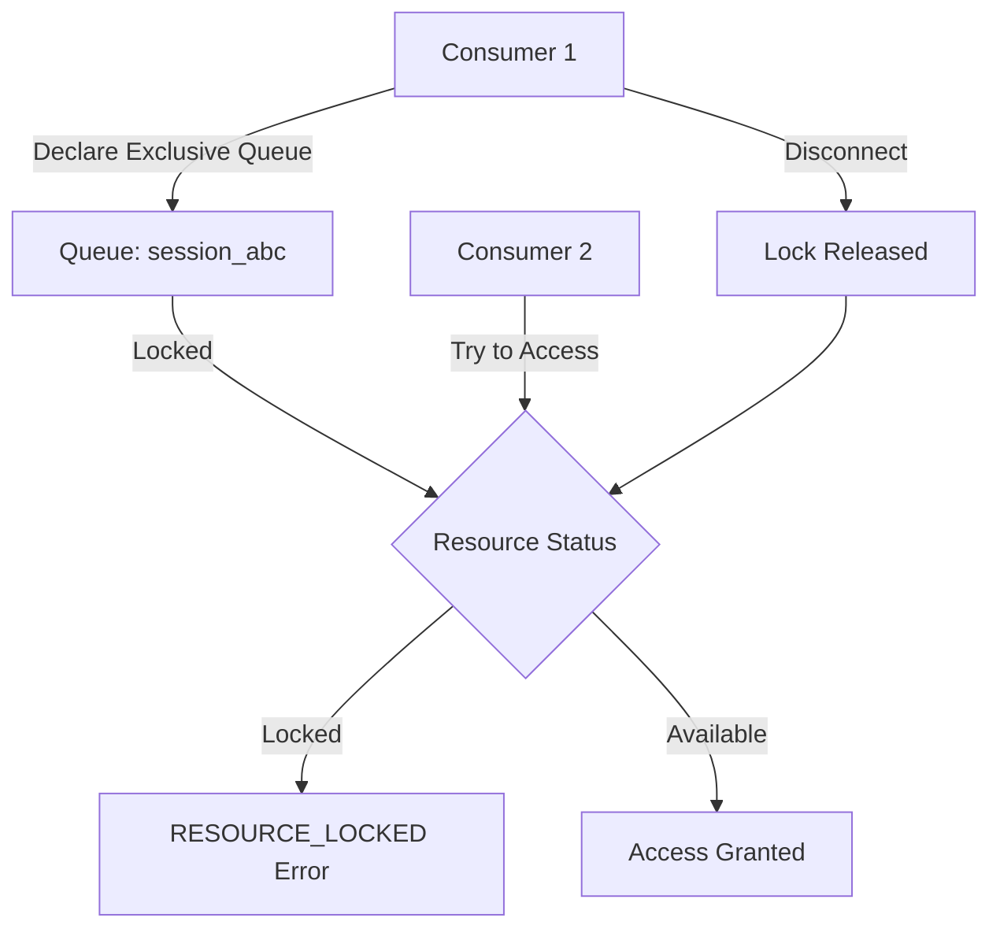
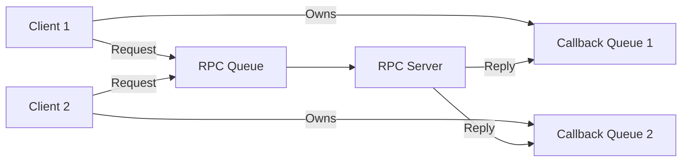

# How to Fix 'Resource Locked' Errors in RabbitMQ

Author: [nawazdhandala](https://www.github.com/nawazdhandala)

Tags: RabbitMQ, Message Queue, Troubleshooting, AMQP, Backend, Distributed Systems, Error Handling

Description: Learn how to diagnose and fix RabbitMQ resource locked errors caused by exclusive queue access and competing consumers.

---

> Resource locked errors in RabbitMQ occur when multiple consumers or connections try to access a resource that has been claimed exclusively. Understanding exclusive access patterns helps prevent these conflicts in distributed systems.

This error typically appears as `RESOURCE_LOCKED` with error code 405, causing consumer failures and connection issues.

---

## Understanding the Error



---

## Common Causes

### 1. Exclusive Queue Access

Exclusive queues can only be accessed by the connection that created them:

```python
import pika

# Connection 1 creates an exclusive queue
connection1 = pika.BlockingConnection(
    pika.ConnectionParameters('localhost')
)
channel1 = connection1.channel()

# exclusive=True means only this connection can access the queue
channel1.queue_declare(
    queue='my_exclusive_queue',
    exclusive=True
)
print("Connection 1: Exclusive queue created")

# Connection 2 tries to access the same queue
connection2 = pika.BlockingConnection(
    pika.ConnectionParameters('localhost')
)
channel2 = connection2.channel()

try:
    # This will fail with RESOURCE_LOCKED
    channel2.queue_declare(
        queue='my_exclusive_queue',
        exclusive=True
    )
except pika.exceptions.ChannelClosedByBroker as e:
    print(f"Connection 2: {e}")
    # Error: RESOURCE_LOCKED - cannot obtain exclusive access to locked queue
```

### 2. Consumer Tag Conflicts

Multiple consumers cannot use the same consumer tag on a queue:

```python
import pika

connection = pika.BlockingConnection(
    pika.ConnectionParameters('localhost')
)
channel = connection.channel()
channel.queue_declare(queue='tasks')

def callback(ch, method, properties, body):
    print(f"Received: {body}")

# First consumer with explicit tag
channel.basic_consume(
    queue='tasks',
    consumer_tag='worker-1',
    on_message_callback=callback
)

# Second consumer tries to use the same tag (FAILS)
try:
    channel.basic_consume(
        queue='tasks',
        consumer_tag='worker-1',  # Duplicate tag!
        on_message_callback=callback
    )
except Exception as e:
    print(f"Error: {e}")
    # Cannot use duplicate consumer tag
```

### 3. Single Active Consumer Mode

Queues with single active consumer only allow one consumer at a time:

```python
import pika

connection = pika.BlockingConnection(
    pika.ConnectionParameters('localhost')
)
channel = connection.channel()

# Queue with single active consumer mode
channel.queue_declare(
    queue='singleton_tasks',
    durable=True,
    arguments={
        'x-single-active-consumer': True
    }
)

# Only one consumer can be active at a time
# Additional consumers will be queued but not receive messages
```

---

## Diagnosing Resource Locked Errors

### Check Queue Properties

```bash
# List queues with their exclusive and owner details
rabbitmqctl list_queues name exclusive owner_pid

# Sample output:
# name                    exclusive  owner_pid
# session_abc123          true       <rabbit@host.1.234.0>
# tasks                   false      none
```

### Check Active Consumers

```bash
# List consumers and their details
rabbitmqctl list_consumers queue_name channel_pid consumer_tag

# Check for exclusive consumers
rabbitmqctl list_consumers queue_name exclusive ack_required

# Via Management API
curl -u guest:guest \
    http://localhost:15672/api/queues/%2f/my_queue | jq '.consumer_details'
```

### Check Connections Holding Locks

```bash
# List connections with their locked resources
rabbitmqctl list_connections name state channel_max

# Find which connection owns an exclusive queue
rabbitmqctl list_queues name owner_pid | grep -v "none"
```

---

## Solutions

### Solution 1: Avoid Exclusive Queues When Not Needed

Only use exclusive queues when you truly need single-connection access:

```python
import pika

connection = pika.BlockingConnection(
    pika.ConnectionParameters('localhost')
)
channel = connection.channel()

# WRONG: Using exclusive for a shared work queue
# channel.queue_declare(queue='tasks', exclusive=True)

# CORRECT: Non-exclusive queue for shared access
channel.queue_declare(
    queue='tasks',
    durable=True,
    exclusive=False  # Default, but explicit for clarity
)

# Multiple consumers can now access this queue
print("Queue declared for shared access")
```

### Solution 2: Generate Unique Queue Names

For exclusive queues, use unique names per connection:

```python
import pika
import uuid

def create_exclusive_callback_queue():
    """
    Create an exclusive queue with a unique name for RPC callbacks.
    Each connection gets its own callback queue.
    """
    connection = pika.BlockingConnection(
        pika.ConnectionParameters('localhost')
    )
    channel = connection.channel()

    # Generate a unique queue name
    unique_id = uuid.uuid4().hex[:8]
    queue_name = f"callback_{unique_id}"

    # Now safe to use exclusive since name is unique
    result = channel.queue_declare(
        queue=queue_name,
        exclusive=True,
        auto_delete=True  # Clean up when connection closes
    )

    return channel, result.method.queue

# Alternative: Let RabbitMQ generate the name
def create_anonymous_exclusive_queue():
    """
    Create an exclusive queue with auto-generated name.
    RabbitMQ generates a unique name like 'amq.gen-xxxxx'.
    """
    connection = pika.BlockingConnection(
        pika.ConnectionParameters('localhost')
    )
    channel = connection.channel()

    # Empty string queue name = auto-generate
    result = channel.queue_declare(
        queue='',
        exclusive=True
    )

    queue_name = result.method.queue  # e.g., 'amq.gen-JzTY20BRgKO-HjmUJj0wLg'
    print(f"Created exclusive queue: {queue_name}")

    return channel, queue_name
```

### Solution 3: Implement Lock Retry Logic

Retry access with backoff when encountering resource locks:

```python
import pika
from pika.exceptions import ChannelClosedByBroker
import time
import logging

logging.basicConfig(level=logging.INFO)
logger = logging.getLogger(__name__)

class RabbitMQClient:
    def __init__(self, host='localhost'):
        self.host = host
        self.connection = None
        self.channel = None

    def connect(self):
        """Establish connection to RabbitMQ."""
        self.connection = pika.BlockingConnection(
            pika.ConnectionParameters(self.host)
        )
        self.channel = self.connection.channel()

    def consume_with_retry(
        self,
        queue_name,
        callback,
        max_retries=5,
        base_delay=1.0
    ):
        """
        Attempt to consume from a queue with retry on resource lock.
        Uses exponential backoff to avoid thundering herd.
        """
        for attempt in range(max_retries):
            try:
                self.connect()

                # Attempt to consume
                self.channel.basic_consume(
                    queue=queue_name,
                    on_message_callback=callback,
                    auto_ack=False
                )

                logger.info(f"Successfully connected to queue: {queue_name}")
                return True

            except ChannelClosedByBroker as e:
                if 'RESOURCE_LOCKED' in str(e):
                    delay = base_delay * (2 ** attempt)  # Exponential backoff
                    logger.warning(
                        f"Resource locked, retry {attempt + 1}/{max_retries} "
                        f"after {delay}s"
                    )
                    time.sleep(delay)

                    # Close the failed connection before retrying
                    try:
                        self.connection.close()
                    except:
                        pass
                else:
                    raise

            except Exception as e:
                logger.error(f"Unexpected error: {e}")
                raise

        logger.error(f"Failed to access queue after {max_retries} attempts")
        return False

# Usage
client = RabbitMQClient('localhost')

def my_callback(ch, method, properties, body):
    print(f"Received: {body}")
    ch.basic_ack(delivery_tag=method.delivery_tag)

if client.consume_with_retry('tasks', my_callback):
    client.channel.start_consuming()
```

### Solution 4: Use Single Active Consumer Pattern

Instead of exclusive queues, use the single active consumer feature:

```python
import pika

def setup_single_active_consumer_queue():
    """
    Create a queue where only one consumer is active at a time.
    Other consumers become standbys and take over on failure.
    """
    connection = pika.BlockingConnection(
        pika.ConnectionParameters('localhost')
    )
    channel = connection.channel()

    # Declare queue with single active consumer
    # Multiple consumers can connect, but only one receives messages
    channel.queue_declare(
        queue='leader_tasks',
        durable=True,
        arguments={
            'x-single-active-consumer': True
        }
    )

    return channel

def consume_as_standby(channel, queue_name, callback):
    """
    Connect as a consumer. Will become active when current consumer fails.
    """
    channel.basic_qos(prefetch_count=1)
    channel.basic_consume(
        queue=queue_name,
        on_message_callback=callback
    )

    print(f"Connected to {queue_name} (may be standby)")
    channel.start_consuming()
```

---

## Prevention Patterns

### Pattern 1: Connection/Channel Factory

Create a factory that manages exclusive resources:

```python
import pika
import threading
from contextlib import contextmanager

class RabbitMQConnectionPool:
    """
    Connection pool that manages exclusive queue access.
    Ensures only one consumer per exclusive queue.
    """

    def __init__(self, host='localhost', max_connections=10):
        self.host = host
        self.max_connections = max_connections
        self._lock = threading.Lock()
        self._exclusive_queues = {}  # queue_name -> connection

    @contextmanager
    def get_exclusive_queue(self, base_name):
        """
        Get or create an exclusive queue, ensuring no conflicts.
        """
        with self._lock:
            if base_name in self._exclusive_queues:
                # Return existing exclusive queue
                channel, queue_name = self._exclusive_queues[base_name]
                yield channel, queue_name
                return

            # Create new exclusive queue with unique name
            connection = pika.BlockingConnection(
                pika.ConnectionParameters(self.host)
            )
            channel = connection.channel()

            result = channel.queue_declare(
                queue='',  # Auto-generate name
                exclusive=True
            )

            queue_name = result.method.queue
            self._exclusive_queues[base_name] = (channel, queue_name)

        try:
            yield channel, queue_name
        finally:
            # Cleanup handled by exclusive queue auto-delete
            pass

    def release_exclusive_queue(self, base_name):
        """Release an exclusive queue."""
        with self._lock:
            if base_name in self._exclusive_queues:
                channel, _ = self._exclusive_queues.pop(base_name)
                try:
                    channel.close()
                except:
                    pass
```

### Pattern 2: Unique Consumer Tags

Generate unique consumer tags to avoid conflicts:

```python
import pika
import socket
import os
import uuid

def generate_consumer_tag():
    """
    Generate a unique consumer tag based on hostname, PID, and UUID.
    Format: hostname-pid-uuid
    """
    hostname = socket.gethostname()
    pid = os.getpid()
    unique = uuid.uuid4().hex[:8]

    return f"{hostname}-{pid}-{unique}"

def safe_consume(channel, queue_name, callback):
    """
    Consume from a queue with a guaranteed unique consumer tag.
    """
    consumer_tag = generate_consumer_tag()

    channel.basic_consume(
        queue=queue_name,
        consumer_tag=consumer_tag,
        on_message_callback=callback
    )

    print(f"Consuming with tag: {consumer_tag}")
    return consumer_tag
```

---

## RPC Pattern with Exclusive Queues

Proper implementation of RPC avoiding resource locks:



```python
import pika
import uuid

class RPCClient:
    """
    RPC client with exclusive callback queue.
    Each client instance has its own callback queue.
    """

    def __init__(self, host='localhost'):
        self.connection = pika.BlockingConnection(
            pika.ConnectionParameters(host)
        )
        self.channel = self.connection.channel()

        # Create exclusive callback queue for this client
        # Empty string = auto-generated unique name
        result = self.channel.queue_declare(
            queue='',
            exclusive=True  # Safe because name is unique
        )
        self.callback_queue = result.method.queue

        # Store pending responses
        self.responses = {}

        # Set up consumer for responses
        self.channel.basic_consume(
            queue=self.callback_queue,
            on_message_callback=self._on_response,
            auto_ack=True
        )

    def _on_response(self, ch, method, properties, body):
        """Handle response from RPC server."""
        if properties.correlation_id in self.responses:
            self.responses[properties.correlation_id] = body

    def call(self, routing_key, message, timeout=30):
        """
        Make an RPC call and wait for response.
        """
        correlation_id = str(uuid.uuid4())
        self.responses[correlation_id] = None

        # Send request with reply_to pointing to our exclusive queue
        self.channel.basic_publish(
            exchange='',
            routing_key=routing_key,
            properties=pika.BasicProperties(
                reply_to=self.callback_queue,
                correlation_id=correlation_id,
            ),
            body=message
        )

        # Wait for response
        start_time = time.time()
        while self.responses[correlation_id] is None:
            self.connection.process_data_events(time_limit=1)
            if time.time() - start_time > timeout:
                raise TimeoutError("RPC call timed out")

        return self.responses.pop(correlation_id)

    def close(self):
        """Clean up connection."""
        self.connection.close()
```

---

## Monitoring Resource Locks

```bash
# Monitor exclusive queues
watch -n 5 'rabbitmqctl list_queues name exclusive owner_pid | grep true'

# Check for locked resources in logs
tail -f /var/log/rabbitmq/rabbit@hostname.log | grep -i "resource_locked"

# List all consumers with exclusive access
rabbitmqctl list_consumers queue_name exclusive | grep true
```

### Alert Configuration

```yaml
# Prometheus alert for resource lock errors
groups:
  - name: rabbitmq_alerts
    rules:
      - alert: RabbitMQResourceLocked
        expr: increase(rabbitmq_channel_closed_total{reason="resource_locked"}[5m]) > 0
        for: 1m
        labels:
          severity: warning
        annotations:
          summary: "Resource lock errors detected"
          description: "{{ $value }} resource lock errors in the last 5 minutes"
```

---

## Best Practices

1. **Minimize exclusive queue usage** - only use when truly needed for single-consumer scenarios
2. **Use auto-generated queue names** - let RabbitMQ generate unique names for exclusive queues
3. **Generate unique consumer tags** - include hostname, PID, and UUID
4. **Prefer single active consumer** - use `x-single-active-consumer` instead of exclusive queues
5. **Implement retry with backoff** - handle transient lock errors gracefully
6. **Monitor for lock errors** - alert on unusual patterns

---

## Conclusion

Resource locked errors indicate contention for exclusive resources in RabbitMQ. Key takeaways:

- **Exclusive queues** are locked to a single connection
- **Use unique names** for exclusive queues to avoid conflicts
- **Implement retry logic** with exponential backoff
- **Prefer single active consumer** for leader election patterns
- **Monitor lock errors** to detect configuration issues early

---

*Need to monitor your RabbitMQ resource usage? [OneUptime](https://oneuptime.com) provides comprehensive monitoring for message queue systems with alerting on connection issues and lock errors.*
