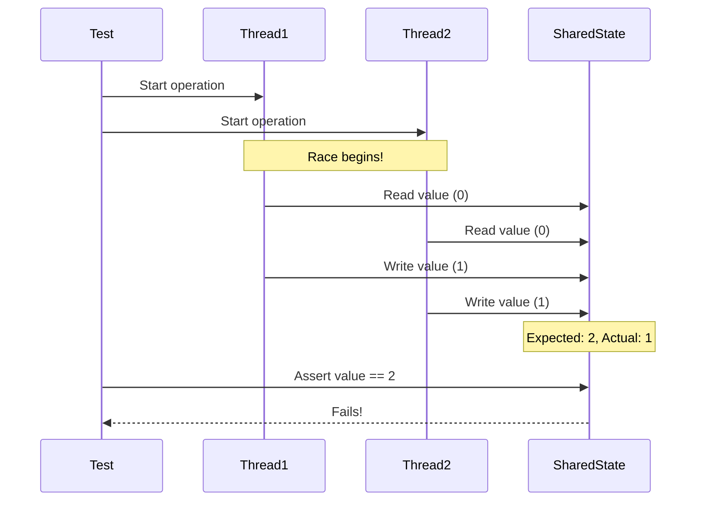
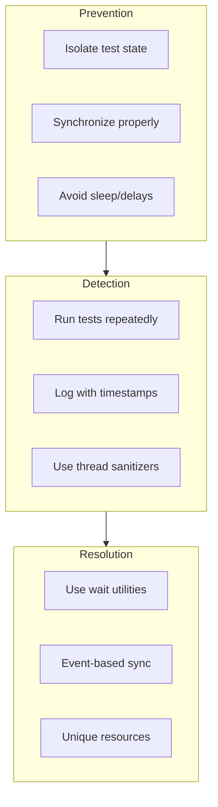

# How to Fix "Race Condition" Test Failures

Author: [nawazdhandala](https://www.github.com/nawazdhandala)

Tags: Testing, Race Conditions, Concurrency, Debugging, Flaky Tests, Async, Multithreading

Description: Learn how to identify, debug, and fix race condition test failures that cause intermittent test flakiness in concurrent and asynchronous code.

---

Your test passes 9 times out of 10. Sometimes it fails for no apparent reason. Rerun it, and it passes again. This is the nightmare of race condition test failures. They are maddening to debug because the act of debugging often changes the timing enough to make the problem disappear.

## Understanding Race Conditions in Tests

A race condition occurs when the outcome depends on the timing of events that are not properly synchronized. In tests, this manifests as flaky behavior.



## Common Patterns That Cause Race Conditions

### Pattern 1: Shared Mutable State

```javascript
// Bad: Shared state between tests
let counter = 0;

describe('Counter tests', () => {
  it('increments counter', () => {
    counter++;
    expect(counter).toBe(1);  // Might fail if other test runs first
  });

  it('also increments counter', () => {
    counter++;
    expect(counter).toBe(1);  // Will definitely fail
  });
});

// Good: Isolated state per test
describe('Counter tests', () => {
  let counter;

  beforeEach(() => {
    counter = 0;  // Fresh state for each test
  });

  it('increments counter', () => {
    counter++;
    expect(counter).toBe(1);
  });

  it('also increments counter', () => {
    counter++;
    expect(counter).toBe(1);
  });
});
```

### Pattern 2: Timing-Dependent Assertions

```javascript
// Bad: Assumes operation completes within arbitrary time
it('should update after async operation', async () => {
  startBackgroundJob();
  await sleep(100);  // Hope it's done in 100ms
  expect(result).toBe('done');  // Flaky!
});

// Good: Wait for actual completion
it('should update after async operation', async () => {
  const result = await startBackgroundJob();  // Await the actual promise
  expect(result).toBe('done');
});

// Good: Poll for condition with timeout
it('should update after async operation', async () => {
  startBackgroundJob();

  await waitFor(() => {
    expect(result).toBe('done');
  }, { timeout: 5000 });
});
```

### Pattern 3: Uncontrolled Concurrency

```python
# Bad: Concurrent operations without synchronization
def test_concurrent_increments():
    counter = Counter()
    threads = []

    for _ in range(10):
        t = threading.Thread(target=counter.increment)
        threads.append(t)
        t.start()

    for t in threads:
        t.join()

    assert counter.value == 10  # Flaky! Race condition in Counter

# Good: Use thread-safe counter or synchronization
def test_concurrent_increments():
    counter = ThreadSafeCounter()  # Uses locks internally
    threads = []

    for _ in range(10):
        t = threading.Thread(target=counter.increment)
        threads.append(t)
        t.start()

    for t in threads:
        t.join()

    assert counter.value == 10  # Reliable

# Or test the actual thread safety
def test_concurrent_increments_with_lock():
    counter = Counter()
    lock = threading.Lock()

    def safe_increment():
        with lock:
            counter.increment()

    threads = [threading.Thread(target=safe_increment) for _ in range(10)]
    for t in threads:
        t.start()
    for t in threads:
        t.join()

    assert counter.value == 10
```

## Debugging Race Conditions

### Add Logging with Timestamps

```python
import logging
import time
import threading

logging.basicConfig(
    level=logging.DEBUG,
    format='%(asctime)s.%(msecs)03d [%(threadName)s] %(message)s',
    datefmt='%H:%M:%S'
)
logger = logging.getLogger(__name__)

def debug_concurrent_operation():
    logger.debug(f"Starting operation, thread={threading.current_thread().name}")
    # ... operation ...
    logger.debug(f"Completed operation, thread={threading.current_thread().name}")
```

### Use Thread Sanitizers

```bash
# C/C++ with ThreadSanitizer
gcc -fsanitize=thread -g -O1 my_test.c -o my_test
./my_test

# Go with race detector
go test -race ./...

# Python with threading debug
PYTHONTHREADDEBUG=1 python -m pytest tests/
```

### Stress Testing to Reproduce

```javascript
// Run test many times to increase reproduction rate
describe('Flaky test', () => {
  // Run this test 100 times
  for (let i = 0; i < 100; i++) {
    it(`should work consistently (run ${i})`, async () => {
      // Your flaky test
    });
  }
});
```

```python
# pytest-repeat plugin
# pytest --count=100 test_flaky.py

import pytest

@pytest.mark.repeat(100)
def test_potentially_flaky():
    # Your test here
    pass
```

## Fixing Strategies

### Strategy 1: Proper Synchronization

```java
// Java: Use CountDownLatch for coordination
@Test
void testConcurrentOperations() throws InterruptedException {
    int threadCount = 10;
    CountDownLatch startLatch = new CountDownLatch(1);
    CountDownLatch doneLatch = new CountDownLatch(threadCount);
    AtomicInteger counter = new AtomicInteger(0);

    for (int i = 0; i < threadCount; i++) {
        new Thread(() -> {
            try {
                startLatch.await();  // Wait for signal to start
                counter.incrementAndGet();
            } catch (InterruptedException e) {
                Thread.currentThread().interrupt();
            } finally {
                doneLatch.countDown();
            }
        }).start();
    }

    startLatch.countDown();  // Start all threads at once
    doneLatch.await();  // Wait for all to complete

    assertEquals(threadCount, counter.get());
}
```

### Strategy 2: Use Awaitility for Async Assertions

```java
// Java: Awaitility library
import static org.awaitility.Awaitility.*;

@Test
void testAsyncOperation() {
    triggerAsyncOperation();

    await()
        .atMost(5, TimeUnit.SECONDS)
        .pollInterval(100, TimeUnit.MILLISECONDS)
        .until(() -> getStatus().equals("complete"));
}

@Test
void testEventualConsistency() {
    sendMessage("test");

    await()
        .atMost(Duration.ofSeconds(10))
        .untilAsserted(() -> {
            List<Message> messages = getMessages();
            assertThat(messages).hasSize(1);
            assertThat(messages.get(0).getContent()).isEqualTo("test");
        });
}
```

### Strategy 3: Deterministic Test Scheduling

```typescript
// TypeScript: Control async execution order
import { runAllTimers, useFakeTimers } from '@jest/globals';

describe('Timer-based tests', () => {
  beforeEach(() => {
    jest.useFakeTimers();
  });

  afterEach(() => {
    jest.useRealTimers();
  });

  it('should handle delayed operations', () => {
    const callback = jest.fn();

    scheduleCallback(callback, 1000);

    expect(callback).not.toHaveBeenCalled();

    jest.advanceTimersByTime(1000);

    expect(callback).toHaveBeenCalledTimes(1);
  });
});
```

### Strategy 4: Event-Based Synchronization

```python
# Python: Use events instead of sleep
import threading
import pytest

def test_producer_consumer():
    results = []
    produced_event = threading.Event()
    consumed_event = threading.Event()

    def producer():
        results.append('produced')
        produced_event.set()
        consumed_event.wait(timeout=5)  # Wait for consumer

    def consumer():
        produced_event.wait(timeout=5)  # Wait for producer
        results.append('consumed')
        consumed_event.set()

    t1 = threading.Thread(target=producer)
    t2 = threading.Thread(target=consumer)

    t1.start()
    t2.start()
    t1.join()
    t2.join()

    assert results == ['produced', 'consumed']
```

### Strategy 5: Isolated Test Resources

```python
# Python: Use unique resources per test
import pytest
import uuid

@pytest.fixture
def unique_queue_name():
    """Generate unique queue name to avoid test interference"""
    return f"test-queue-{uuid.uuid4()}"

def test_queue_operations(unique_queue_name, message_broker):
    queue = message_broker.create_queue(unique_queue_name)
    queue.send("test message")

    message = queue.receive(timeout=5)
    assert message == "test message"
```

## Testing Concurrent Code Properly

```java
// Java: Comprehensive concurrent test
@Test
void testThreadSafeCache() throws InterruptedException {
    ThreadSafeCache<String, Integer> cache = new ThreadSafeCache<>();
    int threads = 100;
    int operationsPerThread = 1000;

    ExecutorService executor = Executors.newFixedThreadPool(threads);
    CountDownLatch latch = new CountDownLatch(threads);
    AtomicInteger errors = new AtomicInteger(0);

    for (int i = 0; i < threads; i++) {
        final int threadId = i;
        executor.submit(() -> {
            try {
                for (int j = 0; j < operationsPerThread; j++) {
                    String key = "key-" + (j % 100);

                    // Mix of operations
                    if (j % 3 == 0) {
                        cache.put(key, j);
                    } else if (j % 3 == 1) {
                        cache.get(key);
                    } else {
                        cache.remove(key);
                    }
                }
            } catch (Exception e) {
                errors.incrementAndGet();
                e.printStackTrace();
            } finally {
                latch.countDown();
            }
        });
    }

    latch.await(30, TimeUnit.SECONDS);
    executor.shutdown();

    assertEquals(0, errors.get(), "No errors should occur");
}
```

## CI Configuration for Flaky Tests

```yaml
# .github/workflows/test.yml
name: Tests

on: [push, pull_request]

jobs:
  test:
    runs-on: ubuntu-latest
    strategy:
      fail-fast: false  # Don't cancel other runs if one fails

    steps:
      - uses: actions/checkout@v4

      - name: Run tests with retry
        uses: nick-fields/retry@v2
        with:
          timeout_minutes: 10
          max_attempts: 3
          command: npm test

      - name: Upload test results on failure
        if: failure()
        uses: actions/upload-artifact@v4
        with:
          name: test-results
          path: test-results/
```

## Best Practices Summary



1. **Isolate state** between tests using beforeEach/fixtures
2. **Never use arbitrary sleep** - wait for actual conditions
3. **Use proper synchronization primitives** like latches, events, barriers
4. **Run tests repeatedly** to catch intermittent failures
5. **Add detailed logging** with timestamps when debugging
6. **Use thread sanitizers** in CI to catch data races
7. **Consider test execution order** - tests should not depend on order

---

Race conditions are among the hardest bugs to fix because they are hard to reproduce. The key is to never assume timing and always explicitly synchronize. When you do encounter a flaky test, invest the time to fix it properly rather than just rerunning until it passes. Future you will be grateful.
