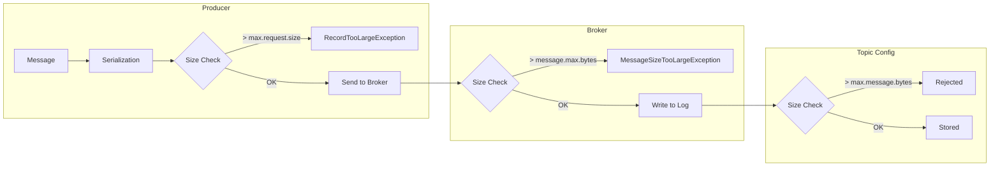
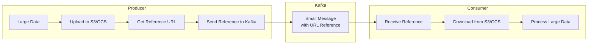
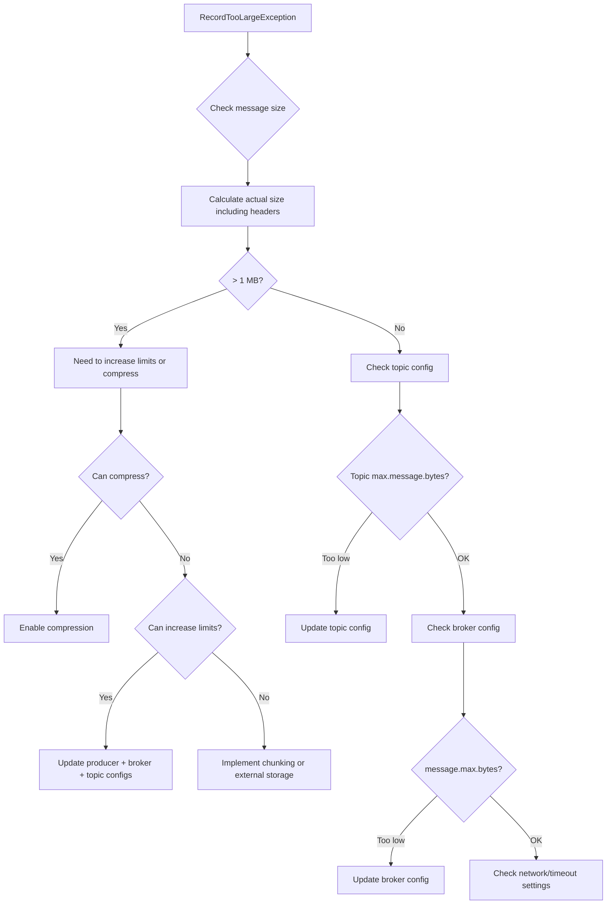

# How to Fix "Record Too Large" Errors in Kafka Producer

Author: [nawazdhandala](https://www.github.com/nawazdhandala)

Tags: Kafka, Producer, Error Handling, Message Size, Configuration, Troubleshooting

Description: A comprehensive guide to diagnosing and fixing the RecordTooLargeException in Apache Kafka producers with practical configuration and code solutions.

---

The "Record Too Large" error is one of the most common issues developers face when working with Apache Kafka producers. This error occurs when a message exceeds the maximum allowed size at various points in the Kafka pipeline. This guide explains the causes, provides diagnostic steps, and offers multiple solutions to resolve this error effectively.

## Understanding the Error

When you see `RecordTooLargeException` or a message like "The message is X bytes when serialized which is larger than the maximum request size you have configured", it means your message has exceeded a size limit.



## Size Limits in Kafka

Kafka has multiple size limits that can trigger this error.

| Configuration | Default | Location | Description |
|---------------|---------|----------|-------------|
| `max.request.size` | 1 MB | Producer | Maximum size of a produce request |
| `message.max.bytes` | 1 MB | Broker | Maximum size of a message the broker accepts |
| `max.message.bytes` | 1 MB | Topic | Maximum size for a specific topic |
| `replica.fetch.max.bytes` | 1 MB | Broker | Maximum size for replication fetches |
| `fetch.max.bytes` | 50 MB | Consumer | Maximum data returned per fetch request |

## Diagnosing the Issue

First, determine where the size limit is being exceeded.

### Check Current Message Size

```java
import org.apache.kafka.clients.producer.*;
import org.apache.kafka.common.serialization.StringSerializer;
import java.nio.charset.StandardCharsets;

public class MessageSizeChecker {

    /**
     * Calculates the approximate size of a Kafka message.
     * This includes key, value, headers, and metadata overhead.
     */
    public static long calculateMessageSize(String key, String value,
            Map<String, String> headers) {

        long size = 0;

        // Key size (null keys are allowed)
        if (key != null) {
            size += key.getBytes(StandardCharsets.UTF_8).length;
        }

        // Value size
        if (value != null) {
            size += value.getBytes(StandardCharsets.UTF_8).length;
        }

        // Headers size
        if (headers != null) {
            for (Map.Entry<String, String> header : headers.entrySet()) {
                size += header.getKey().getBytes(StandardCharsets.UTF_8).length;
                size += header.getValue().getBytes(StandardCharsets.UTF_8).length;
            }
        }

        // Add overhead for record metadata (timestamp, offset, etc.)
        // This is approximately 50-100 bytes depending on configuration
        size += 100;

        return size;
    }

    public static void main(String[] args) {
        String key = "order-12345";
        String value = generateLargePayload(2_000_000); // 2 MB payload

        long messageSize = calculateMessageSize(key, value, null);
        System.out.printf("Message size: %d bytes (%.2f MB)%n",
            messageSize, messageSize / (1024.0 * 1024.0));

        // Check against default limit
        if (messageSize > 1_048_576) {
            System.out.println("WARNING: Message exceeds default 1 MB limit!");
        }
    }

    private static String generateLargePayload(int sizeInBytes) {
        StringBuilder sb = new StringBuilder(sizeInBytes);
        for (int i = 0; i < sizeInBytes; i++) {
            sb.append('X');
        }
        return sb.toString();
    }
}
```

### Check Broker Configuration

Use the Kafka admin client or command-line tools to check broker settings.

```bash
# Check broker configuration
kafka-configs.sh --bootstrap-server localhost:9092 \
    --entity-type brokers \
    --entity-default \
    --describe

# Check topic-specific configuration
kafka-configs.sh --bootstrap-server localhost:9092 \
    --entity-type topics \
    --entity-name your-topic-name \
    --describe
```

## Solution 1: Increase Size Limits

The simplest solution is to increase the size limits at all relevant points.

### Producer Configuration

```java
import org.apache.kafka.clients.producer.*;
import java.util.Properties;

public class LargeMessageProducer {

    public static KafkaProducer<String, String> createProducer(String bootstrapServers) {
        Properties props = new Properties();
        props.put(ProducerConfig.BOOTSTRAP_SERVERS_CONFIG, bootstrapServers);
        props.put(ProducerConfig.KEY_SERIALIZER_CLASS_CONFIG,
            "org.apache.kafka.common.serialization.StringSerializer");
        props.put(ProducerConfig.VALUE_SERIALIZER_CLASS_CONFIG,
            "org.apache.kafka.common.serialization.StringSerializer");

        // Increase max request size to 10 MB
        // This is the maximum size of a single produce request
        props.put(ProducerConfig.MAX_REQUEST_SIZE_CONFIG, 10_485_760);

        // Buffer memory should be larger than max request size
        // This is the total memory available for buffering
        props.put(ProducerConfig.BUFFER_MEMORY_CONFIG, 33_554_432); // 32 MB

        // Increase batch size to accommodate large messages
        // Messages larger than this will be sent immediately
        props.put(ProducerConfig.BATCH_SIZE_CONFIG, 1_048_576); // 1 MB

        // Compression can significantly reduce message size on the wire
        props.put(ProducerConfig.COMPRESSION_TYPE_CONFIG, "lz4");

        return new KafkaProducer<>(props);
    }
}
```

### Broker Configuration

Update your `server.properties` file.

```properties
# Maximum size of a message the broker will accept
# Set this to match or exceed producer max.request.size
message.max.bytes=10485760

# Maximum size for replication fetches
# Must be at least as large as message.max.bytes
replica.fetch.max.bytes=10485760

# Socket receive buffer size
# Should accommodate large messages
socket.receive.buffer.bytes=10485760

# Socket request max size
socket.request.max.bytes=104857600
```

### Topic Configuration

Configure topic-level message size limits.

```bash
# Create topic with larger message size limit
kafka-topics.sh --bootstrap-server localhost:9092 \
    --create \
    --topic large-messages \
    --partitions 6 \
    --replication-factor 3 \
    --config max.message.bytes=10485760

# Update existing topic
kafka-configs.sh --bootstrap-server localhost:9092 \
    --entity-type topics \
    --entity-name existing-topic \
    --alter \
    --add-config max.message.bytes=10485760
```

### Consumer Configuration

Ensure consumers can fetch large messages.

```java
Properties consumerProps = new Properties();
consumerProps.put(ConsumerConfig.BOOTSTRAP_SERVERS_CONFIG, "localhost:9092");
consumerProps.put(ConsumerConfig.GROUP_ID_CONFIG, "large-message-consumer");

// Maximum data returned in a single fetch request
consumerProps.put(ConsumerConfig.FETCH_MAX_BYTES_CONFIG, 52_428_800); // 50 MB

// Maximum data per partition per fetch
consumerProps.put(ConsumerConfig.MAX_PARTITION_FETCH_BYTES_CONFIG, 10_485_760); // 10 MB
```

## Solution 2: Message Compression

Compression can significantly reduce message size without changing your application logic.

```java
import org.apache.kafka.clients.producer.*;
import java.util.Properties;

public class CompressedProducer {

    public static KafkaProducer<String, String> createCompressedProducer(
            String bootstrapServers, String compressionType) {

        Properties props = new Properties();
        props.put(ProducerConfig.BOOTSTRAP_SERVERS_CONFIG, bootstrapServers);
        props.put(ProducerConfig.KEY_SERIALIZER_CLASS_CONFIG,
            "org.apache.kafka.common.serialization.StringSerializer");
        props.put(ProducerConfig.VALUE_SERIALIZER_CLASS_CONFIG,
            "org.apache.kafka.common.serialization.StringSerializer");

        // Enable compression
        // Options: none, gzip, snappy, lz4, zstd
        props.put(ProducerConfig.COMPRESSION_TYPE_CONFIG, compressionType);

        // For zstd compression, you can also set the compression level
        // Higher levels = better compression but slower
        // props.put("compression.zstd.level", 3);

        return new KafkaProducer<>(props);
    }

    public static void main(String[] args) {
        // Compare compression ratios
        String[] compressionTypes = {"none", "gzip", "snappy", "lz4", "zstd"};

        System.out.println("Compression comparison:");
        System.out.println("| Type   | Speed    | Ratio | CPU Usage |");
        System.out.println("|--------|----------|-------|-----------|");
        System.out.println("| none   | Fastest  | 1.0x  | Lowest    |");
        System.out.println("| lz4    | Fast     | 2-3x  | Low       |");
        System.out.println("| snappy | Fast     | 2-3x  | Low       |");
        System.out.println("| zstd   | Medium   | 3-5x  | Medium    |");
        System.out.println("| gzip   | Slow     | 4-6x  | High      |");
    }
}
```

### Measuring Compression Effectiveness

```java
import java.io.*;
import java.util.zip.*;

public class CompressionAnalyzer {

    public static void analyzeCompression(String data) throws IOException {
        byte[] original = data.getBytes("UTF-8");

        System.out.printf("Original size: %d bytes%n", original.length);

        // GZIP compression
        ByteArrayOutputStream gzipOut = new ByteArrayOutputStream();
        try (GZIPOutputStream gzip = new GZIPOutputStream(gzipOut)) {
            gzip.write(original);
        }
        byte[] gzipped = gzipOut.toByteArray();
        System.out.printf("GZIP size: %d bytes (%.1f%% reduction)%n",
            gzipped.length, (1 - (double) gzipped.length / original.length) * 100);

        // For production, use the Kafka producer's built-in compression
        // which handles LZ4, Snappy, and ZSTD as well
    }

    public static void main(String[] args) throws IOException {
        // Test with JSON-like data (compresses well)
        StringBuilder jsonData = new StringBuilder();
        for (int i = 0; i < 10000; i++) {
            jsonData.append("{\"id\":").append(i)
                   .append(",\"name\":\"item").append(i)
                   .append("\",\"value\":\"data").append(i)
                   .append("\"},");
        }

        System.out.println("JSON data compression:");
        analyzeCompression(jsonData.toString());
    }
}
```

## Solution 3: Message Chunking

For very large messages that exceed even increased limits, split them into smaller chunks.

```java
import org.apache.kafka.clients.producer.*;
import org.apache.kafka.clients.consumer.*;
import org.apache.kafka.common.header.Header;
import org.apache.kafka.common.header.internals.RecordHeader;
import java.util.*;
import java.nio.charset.StandardCharsets;

public class MessageChunker {

    private static final int MAX_CHUNK_SIZE = 900_000; // Leave room for headers

    /**
     * Splits a large message into smaller chunks with metadata headers.
     */
    public static List<ProducerRecord<String, byte[]>> chunkMessage(
            String topic, String key, byte[] value) {

        List<ProducerRecord<String, byte[]>> chunks = new ArrayList<>();
        String messageId = UUID.randomUUID().toString();
        int totalChunks = (int) Math.ceil((double) value.length / MAX_CHUNK_SIZE);

        for (int i = 0; i < totalChunks; i++) {
            int start = i * MAX_CHUNK_SIZE;
            int end = Math.min(start + MAX_CHUNK_SIZE, value.length);
            byte[] chunkData = Arrays.copyOfRange(value, start, end);

            ProducerRecord<String, byte[]> record = new ProducerRecord<>(topic, key, chunkData);

            // Add chunking metadata as headers
            record.headers()
                .add(new RecordHeader("chunk-message-id",
                    messageId.getBytes(StandardCharsets.UTF_8)))
                .add(new RecordHeader("chunk-index",
                    String.valueOf(i).getBytes(StandardCharsets.UTF_8)))
                .add(new RecordHeader("chunk-total",
                    String.valueOf(totalChunks).getBytes(StandardCharsets.UTF_8)))
                .add(new RecordHeader("chunk-size",
                    String.valueOf(value.length).getBytes(StandardCharsets.UTF_8)));

            chunks.add(record);
        }

        return chunks;
    }

    /**
     * Sends a large message as multiple chunks.
     */
    public static void sendLargeMessage(KafkaProducer<String, byte[]> producer,
            String topic, String key, byte[] value) throws Exception {

        List<ProducerRecord<String, byte[]>> chunks = chunkMessage(topic, key, value);

        System.out.printf("Splitting message into %d chunks%n", chunks.size());

        // Send all chunks - they must go to the same partition (using same key)
        List<Future<RecordMetadata>> futures = new ArrayList<>();
        for (ProducerRecord<String, byte[]> chunk : chunks) {
            futures.add(producer.send(chunk));
        }

        // Wait for all chunks to be acknowledged
        for (Future<RecordMetadata> future : futures) {
            RecordMetadata metadata = future.get();
            System.out.printf("Chunk sent to partition %d at offset %d%n",
                metadata.partition(), metadata.offset());
        }
    }
}
```

### Chunk Reassembly on Consumer Side

```java
import org.apache.kafka.clients.consumer.*;
import java.util.*;
import java.util.concurrent.*;
import java.nio.charset.StandardCharsets;

public class ChunkAssembler {

    // Cache for partial messages (messageId -> chunks)
    private final Map<String, SortedMap<Integer, byte[]>> partialMessages =
        new ConcurrentHashMap<>();

    // Track total chunks expected for each message
    private final Map<String, Integer> expectedChunks = new ConcurrentHashMap<>();

    // Track total size for each message
    private final Map<String, Integer> expectedSizes = new ConcurrentHashMap<>();

    /**
     * Processes a chunk and returns the complete message if all chunks received.
     */
    public byte[] processChunk(ConsumerRecord<String, byte[]> record) {
        // Extract chunking headers
        String messageId = getHeaderValue(record, "chunk-message-id");
        int chunkIndex = Integer.parseInt(getHeaderValue(record, "chunk-index"));
        int totalChunks = Integer.parseInt(getHeaderValue(record, "chunk-total"));
        int totalSize = Integer.parseInt(getHeaderValue(record, "chunk-size"));

        // Store chunk metadata
        expectedChunks.put(messageId, totalChunks);
        expectedSizes.put(messageId, totalSize);

        // Add chunk to partial message
        partialMessages
            .computeIfAbsent(messageId, k -> new TreeMap<>())
            .put(chunkIndex, record.value());

        // Check if all chunks received
        SortedMap<Integer, byte[]> chunks = partialMessages.get(messageId);
        if (chunks.size() == totalChunks) {
            // Reassemble message
            byte[] complete = reassemble(messageId);

            // Cleanup
            partialMessages.remove(messageId);
            expectedChunks.remove(messageId);
            expectedSizes.remove(messageId);

            return complete;
        }

        System.out.printf("Received chunk %d/%d for message %s%n",
            chunkIndex + 1, totalChunks, messageId);
        return null;
    }

    private byte[] reassemble(String messageId) {
        SortedMap<Integer, byte[]> chunks = partialMessages.get(messageId);
        int totalSize = expectedSizes.get(messageId);

        byte[] result = new byte[totalSize];
        int offset = 0;

        for (byte[] chunk : chunks.values()) {
            System.arraycopy(chunk, 0, result, offset, chunk.length);
            offset += chunk.length;
        }

        System.out.printf("Reassembled message %s: %d bytes from %d chunks%n",
            messageId, result.length, chunks.size());

        return result;
    }

    private String getHeaderValue(ConsumerRecord<String, byte[]> record, String key) {
        for (var header : record.headers()) {
            if (header.key().equals(key)) {
                return new String(header.value(), StandardCharsets.UTF_8);
            }
        }
        throw new IllegalArgumentException("Header not found: " + key);
    }
}
```

## Solution 4: External Storage Reference Pattern

For very large data, store the actual content externally and send only a reference through Kafka.



### Implementation Example

```java
import com.amazonaws.services.s3.*;
import com.amazonaws.services.s3.model.*;
import org.apache.kafka.clients.producer.*;
import com.fasterxml.jackson.databind.ObjectMapper;
import java.util.*;

public class ExternalStorageProducer {

    private final KafkaProducer<String, String> producer;
    private final AmazonS3 s3Client;
    private final String bucketName;
    private final ObjectMapper objectMapper;
    private final int sizeThreshold;

    public ExternalStorageProducer(String bootstrapServers, String bucketName,
            int sizeThreshold) {

        Properties props = new Properties();
        props.put(ProducerConfig.BOOTSTRAP_SERVERS_CONFIG, bootstrapServers);
        props.put(ProducerConfig.KEY_SERIALIZER_CLASS_CONFIG,
            "org.apache.kafka.common.serialization.StringSerializer");
        props.put(ProducerConfig.VALUE_SERIALIZER_CLASS_CONFIG,
            "org.apache.kafka.common.serialization.StringSerializer");

        this.producer = new KafkaProducer<>(props);
        this.s3Client = AmazonS3ClientBuilder.defaultClient();
        this.bucketName = bucketName;
        this.objectMapper = new ObjectMapper();
        this.sizeThreshold = sizeThreshold;
    }

    /**
     * Sends a message, using S3 for large payloads.
     */
    public void send(String topic, String key, byte[] payload) throws Exception {

        if (payload.length <= sizeThreshold) {
            // Small message - send directly
            String value = Base64.getEncoder().encodeToString(payload);
            MessageReference ref = new MessageReference(
                "inline", null, payload.length, null);

            producer.send(new ProducerRecord<>(topic, key,
                objectMapper.writeValueAsString(ref)));

        } else {
            // Large message - upload to S3 first
            String objectKey = String.format("kafka/%s/%s/%s",
                topic, key, UUID.randomUUID().toString());

            // Upload to S3
            ObjectMetadata metadata = new ObjectMetadata();
            metadata.setContentLength(payload.length);
            metadata.setContentType("application/octet-stream");

            s3Client.putObject(new PutObjectRequest(
                bucketName, objectKey,
                new java.io.ByteArrayInputStream(payload), metadata));

            // Send reference to Kafka
            String s3Uri = String.format("s3://%s/%s", bucketName, objectKey);
            MessageReference ref = new MessageReference(
                "s3", s3Uri, payload.length, objectKey);

            producer.send(new ProducerRecord<>(topic, key,
                objectMapper.writeValueAsString(ref)));

            System.out.printf("Large message stored in S3: %s (%d bytes)%n",
                s3Uri, payload.length);
        }
    }

    /**
     * Reference object sent through Kafka.
     */
    static class MessageReference {
        public String storageType;  // "inline" or "s3"
        public String uri;          // S3 URI for external storage
        public int size;            // Original message size
        public String objectKey;    // S3 object key for cleanup

        public MessageReference(String storageType, String uri, int size, String objectKey) {
            this.storageType = storageType;
            this.uri = uri;
            this.size = size;
            this.objectKey = objectKey;
        }
    }
}
```

### Consumer with External Storage Retrieval

```java
import com.amazonaws.services.s3.*;
import com.amazonaws.services.s3.model.*;
import org.apache.kafka.clients.consumer.*;
import com.fasterxml.jackson.databind.ObjectMapper;
import java.io.*;
import java.util.*;

public class ExternalStorageConsumer {

    private final KafkaConsumer<String, String> consumer;
    private final AmazonS3 s3Client;
    private final ObjectMapper objectMapper;

    public ExternalStorageConsumer(String bootstrapServers, String groupId) {
        Properties props = new Properties();
        props.put(ConsumerConfig.BOOTSTRAP_SERVERS_CONFIG, bootstrapServers);
        props.put(ConsumerConfig.GROUP_ID_CONFIG, groupId);
        props.put(ConsumerConfig.KEY_DESERIALIZER_CLASS_CONFIG,
            "org.apache.kafka.common.serialization.StringDeserializer");
        props.put(ConsumerConfig.VALUE_DESERIALIZER_CLASS_CONFIG,
            "org.apache.kafka.common.serialization.StringDeserializer");

        this.consumer = new KafkaConsumer<>(props);
        this.s3Client = AmazonS3ClientBuilder.defaultClient();
        this.objectMapper = new ObjectMapper();
    }

    /**
     * Retrieves the actual payload, fetching from S3 if needed.
     */
    public byte[] getPayload(ConsumerRecord<String, String> record) throws Exception {
        MessageReference ref = objectMapper.readValue(
            record.value(), MessageReference.class);

        if ("inline".equals(ref.storageType)) {
            // Payload is embedded in the message
            return Base64.getDecoder().decode(record.value());

        } else if ("s3".equals(ref.storageType)) {
            // Fetch from S3
            String[] parts = ref.uri.replace("s3://", "").split("/", 2);
            String bucket = parts[0];
            String key = parts[1];

            S3Object s3Object = s3Client.getObject(bucket, key);
            byte[] payload = s3Object.getObjectContent().readAllBytes();
            s3Object.close();

            System.out.printf("Retrieved %d bytes from S3: %s%n",
                payload.length, ref.uri);

            return payload;

        } else {
            throw new IllegalArgumentException("Unknown storage type: " + ref.storageType);
        }
    }

    static class MessageReference {
        public String storageType;
        public String uri;
        public int size;
        public String objectKey;
    }
}
```

## Troubleshooting Checklist

When encountering "Record Too Large" errors, follow this checklist.



### Quick Diagnostic Commands

```bash
# Check producer config
kafka-configs.sh --bootstrap-server localhost:9092 \
    --entity-type clients \
    --entity-name producer-client-id \
    --describe

# Check broker message size limit
kafka-configs.sh --bootstrap-server localhost:9092 \
    --entity-type brokers \
    --entity-default \
    --describe | grep message.max.bytes

# Check topic message size limit
kafka-configs.sh --bootstrap-server localhost:9092 \
    --entity-type topics \
    --entity-name your-topic \
    --describe | grep max.message.bytes

# Monitor producer metrics
kafka-producer-perf-test.sh --topic test-topic \
    --num-records 1000 \
    --record-size 1000 \
    --throughput -1 \
    --producer-props bootstrap.servers=localhost:9092
```

## Conclusion

The "Record Too Large" error in Kafka can be resolved through several approaches:

1. **Increase size limits** - Update producer, broker, and topic configurations to allow larger messages
2. **Enable compression** - Use LZ4 or ZSTD compression to reduce message size with minimal CPU overhead
3. **Implement chunking** - Split large messages into smaller chunks with reassembly on the consumer side
4. **Use external storage** - Store large payloads in S3 or similar services and pass references through Kafka

Choose the approach based on your specific requirements for latency, throughput, and message size patterns. For most use cases, enabling compression and moderately increasing size limits provides the best balance of simplicity and effectiveness.
