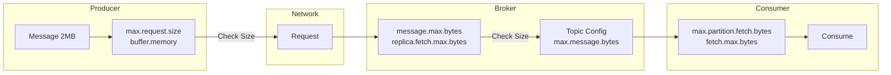
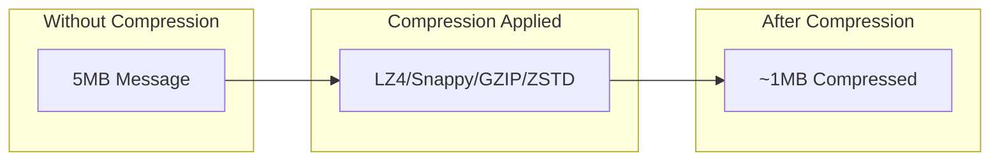
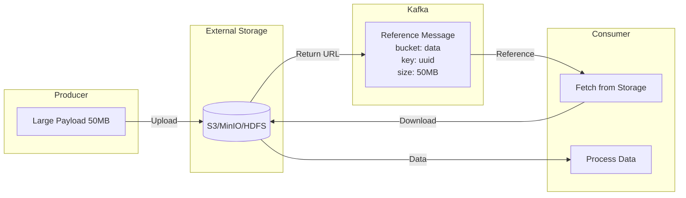

# How to Fix 'RecordTooLargeException' in Kafka

Author: [nawazdhandala](https://www.github.com/nawazdhandala)

Tags: Kafka, Troubleshooting, RecordTooLargeException, Message Size, Producer, Broker Configuration

Description: A practical guide to diagnosing and resolving Kafka's RecordTooLargeException, including configuration adjustments and alternative strategies for handling large messages.

---

The `RecordTooLargeException` is one of the most common errors encountered when working with Apache Kafka. This error occurs when a producer attempts to send a message that exceeds the configured size limits. This guide explains why this happens and provides multiple solutions to resolve it.

## Understanding the Error

When you see this exception, Kafka is telling you that your message is too large:

```
org.apache.kafka.common.errors.RecordTooLargeException: The message is 1548576 bytes when serialized which is larger than the maximum request size you have configured with the max.request.size configuration.
```

Or from the broker side:

```
org.apache.kafka.common.errors.RecordTooLargeException: The request included a message larger than the max message size the server will accept.
```

## Message Size Limits Architecture



## Size Limits at Each Layer

Understanding where size limits are enforced helps you configure them correctly:

| Layer | Configuration | Default | Description |
|-------|--------------|---------|-------------|
| Producer | max.request.size | 1MB | Maximum size of a request |
| Producer | buffer.memory | 32MB | Total memory for buffering |
| Broker | message.max.bytes | 1MB | Maximum message size broker accepts |
| Topic | max.message.bytes | 1MB | Per-topic message size limit |
| Broker | replica.fetch.max.bytes | 1MB | Max bytes replicas fetch |
| Consumer | max.partition.fetch.bytes | 1MB | Max data per partition per fetch |
| Consumer | fetch.max.bytes | 50MB | Max data per fetch request |

## Solution 1: Increase Size Limits

### Configure the Producer

For Java producers:

```java
import org.apache.kafka.clients.producer.ProducerConfig;
import java.util.Properties;

public class LargeMessageProducer {
    public static Properties getProducerConfig() {
        Properties props = new Properties();

        // Kafka broker connection
        props.put(ProducerConfig.BOOTSTRAP_SERVERS_CONFIG, "localhost:9092");

        // Serializers for key and value
        props.put(ProducerConfig.KEY_SERIALIZER_CLASS_CONFIG,
            "org.apache.kafka.common.serialization.StringSerializer");
        props.put(ProducerConfig.VALUE_SERIALIZER_CLASS_CONFIG,
            "org.apache.kafka.common.serialization.ByteArraySerializer");

        // Increase maximum request size to 10MB
        props.put(ProducerConfig.MAX_REQUEST_SIZE_CONFIG, 10485760);

        // Increase buffer memory to accommodate large messages
        props.put(ProducerConfig.BUFFER_MEMORY_CONFIG, 67108864); // 64MB

        // Increase batch size for better throughput with large messages
        props.put(ProducerConfig.BATCH_SIZE_CONFIG, 1048576); // 1MB batches

        // Compression helps reduce message size
        props.put(ProducerConfig.COMPRESSION_TYPE_CONFIG, "lz4");

        return props;
    }
}
```

For Python producers (using kafka-python):

```python
from kafka import KafkaProducer

# Create producer with increased message size limits
producer = KafkaProducer(
    bootstrap_servers=['localhost:9092'],
    # Maximum size of a request in bytes (10MB)
    max_request_size=10485760,
    # Total bytes of memory the producer can use for buffering (64MB)
    buffer_memory=67108864,
    # Compression reduces message size before sending
    compression_type='lz4',
    # Serializer for message values
    value_serializer=lambda v: v.encode('utf-8') if isinstance(v, str) else v
)

# Send a large message
large_data = b'x' * 5000000  # 5MB message
producer.send('large-messages-topic', value=large_data)
producer.flush()
```

### Configure the Broker

Edit the broker configuration file:

```bash
sudo nano /opt/kafka/config/server.properties
```

```properties
# Maximum message size the broker will accept (10MB)
message.max.bytes=10485760

# Maximum bytes that can be fetched by replicas
replica.fetch.max.bytes=10485760

# Socket receive buffer size
socket.receive.buffer.bytes=1048576

# Socket request maximum size
socket.request.max.bytes=104857600
```

Restart the broker:

```bash
sudo systemctl restart kafka
```

### Configure Topic-Level Limits

Set the limit for a specific topic:

```bash
# Create topic with larger message size
/opt/kafka/bin/kafka-topics.sh --create \
  --bootstrap-server localhost:9092 \
  --topic large-messages \
  --partitions 3 \
  --replication-factor 1 \
  --config max.message.bytes=10485760

# Or modify existing topic
/opt/kafka/bin/kafka-configs.sh --alter \
  --bootstrap-server localhost:9092 \
  --entity-type topics \
  --entity-name large-messages \
  --add-config max.message.bytes=10485760
```

### Configure the Consumer

```java
import org.apache.kafka.clients.consumer.ConsumerConfig;
import java.util.Properties;

public class LargeMessageConsumer {
    public static Properties getConsumerConfig() {
        Properties props = new Properties();

        props.put(ConsumerConfig.BOOTSTRAP_SERVERS_CONFIG, "localhost:9092");
        props.put(ConsumerConfig.GROUP_ID_CONFIG, "large-message-consumer");

        // Deserializers
        props.put(ConsumerConfig.KEY_DESERIALIZER_CLASS_CONFIG,
            "org.apache.kafka.common.serialization.StringDeserializer");
        props.put(ConsumerConfig.VALUE_DESERIALIZER_CLASS_CONFIG,
            "org.apache.kafka.common.serialization.ByteArrayDeserializer");

        // Increase fetch size to handle large messages (10MB per partition)
        props.put(ConsumerConfig.MAX_PARTITION_FETCH_BYTES_CONFIG, 10485760);

        // Increase total fetch size (50MB total)
        props.put(ConsumerConfig.FETCH_MAX_BYTES_CONFIG, 52428800);

        return props;
    }
}
```

## Solution 2: Enable Compression

Compression can significantly reduce message size:



### Compression Comparison

| Algorithm | Speed | Ratio | CPU Usage | Best For |
|-----------|-------|-------|-----------|----------|
| lz4 | Very Fast | Good | Low | General use |
| snappy | Fast | Good | Low | Real-time |
| gzip | Slow | Best | High | Batch processing |
| zstd | Fast | Better | Medium | Modern deployments |

### Producer Compression Configuration

```java
// Enable LZ4 compression (recommended for most cases)
props.put(ProducerConfig.COMPRESSION_TYPE_CONFIG, "lz4");

// For maximum compression ratio (higher CPU)
props.put(ProducerConfig.COMPRESSION_TYPE_CONFIG, "gzip");

// For Kafka 2.1+ with best balance
props.put(ProducerConfig.COMPRESSION_TYPE_CONFIG, "zstd");
```

### Broker-Side Compression

```properties
# Allow broker to preserve producer compression
compression.type=producer

# Or force specific compression for all messages
compression.type=lz4
```

## Solution 3: Chunk Large Messages

For very large messages, split them into chunks:

```java
import org.apache.kafka.clients.producer.*;
import org.apache.kafka.common.header.Header;
import org.apache.kafka.common.header.internals.RecordHeader;
import java.nio.ByteBuffer;
import java.util.*;

public class ChunkedMessageProducer {

    private final KafkaProducer<String, byte[]> producer;
    private final String topic;
    // Maximum chunk size (900KB to leave room for headers)
    private static final int CHUNK_SIZE = 921600;

    public ChunkedMessageProducer(Properties props, String topic) {
        this.producer = new KafkaProducer<>(props);
        this.topic = topic;
    }

    /**
     * Send a large message by splitting it into chunks.
     * Each chunk includes headers for reassembly.
     */
    public void sendLargeMessage(String key, byte[] largePayload) throws Exception {
        // Generate unique message ID for correlation
        String messageId = UUID.randomUUID().toString();

        // Calculate number of chunks needed
        int totalChunks = (int) Math.ceil((double) largePayload.length / CHUNK_SIZE);

        System.out.printf("Splitting %d bytes into %d chunks%n",
            largePayload.length, totalChunks);

        // Send each chunk with metadata headers
        for (int i = 0; i < totalChunks; i++) {
            int start = i * CHUNK_SIZE;
            int end = Math.min(start + CHUNK_SIZE, largePayload.length);
            byte[] chunk = Arrays.copyOfRange(largePayload, start, end);

            // Create headers for chunk reassembly
            List<Header> headers = Arrays.asList(
                new RecordHeader("messageId", messageId.getBytes()),
                new RecordHeader("chunkIndex", ByteBuffer.allocate(4).putInt(i).array()),
                new RecordHeader("totalChunks", ByteBuffer.allocate(4).putInt(totalChunks).array()),
                new RecordHeader("totalSize", ByteBuffer.allocate(4).putInt(largePayload.length).array())
            );

            // Create and send the record
            ProducerRecord<String, byte[]> record = new ProducerRecord<>(
                topic, null, key, chunk, headers
            );

            // Send synchronously to maintain order
            producer.send(record).get();
        }

        System.out.printf("Successfully sent message %s in %d chunks%n",
            messageId, totalChunks);
    }

    public void close() {
        producer.close();
    }
}
```

### Consumer for Chunked Messages

```java
import org.apache.kafka.clients.consumer.*;
import org.apache.kafka.common.header.Header;
import java.nio.ByteBuffer;
import java.time.Duration;
import java.util.*;
import java.util.concurrent.*;

public class ChunkedMessageConsumer {

    private final KafkaConsumer<String, byte[]> consumer;
    // Store chunks until complete message is received
    private final Map<String, ChunkBuffer> messageBuffers = new ConcurrentHashMap<>();
    // Timeout for incomplete messages (5 minutes)
    private static final long BUFFER_TIMEOUT_MS = 300000;

    /**
     * Buffer to collect chunks for a single message.
     */
    private static class ChunkBuffer {
        final int totalChunks;
        final int totalSize;
        final byte[][] chunks;
        final long createdAt;
        int receivedChunks = 0;

        ChunkBuffer(int totalChunks, int totalSize) {
            this.totalChunks = totalChunks;
            this.totalSize = totalSize;
            this.chunks = new byte[totalChunks][];
            this.createdAt = System.currentTimeMillis();
        }

        // Add a chunk and return true if message is complete
        synchronized boolean addChunk(int index, byte[] data) {
            if (chunks[index] == null) {
                chunks[index] = data;
                receivedChunks++;
            }
            return receivedChunks == totalChunks;
        }

        // Reassemble the complete message
        byte[] reassemble() {
            byte[] result = new byte[totalSize];
            int offset = 0;
            for (byte[] chunk : chunks) {
                System.arraycopy(chunk, 0, result, offset, chunk.length);
                offset += chunk.length;
            }
            return result;
        }

        boolean isExpired() {
            return System.currentTimeMillis() - createdAt > BUFFER_TIMEOUT_MS;
        }
    }

    public ChunkedMessageConsumer(Properties props, String topic) {
        this.consumer = new KafkaConsumer<>(props);
        consumer.subscribe(Collections.singletonList(topic));
    }

    /**
     * Poll for messages and reassemble chunked messages.
     */
    public void consume() {
        while (true) {
            ConsumerRecords<String, byte[]> records = consumer.poll(Duration.ofMillis(100));

            for (ConsumerRecord<String, byte[]> record : records) {
                processChunk(record);
            }

            // Clean up expired buffers
            cleanupExpiredBuffers();
        }
    }

    private void processChunk(ConsumerRecord<String, byte[]> record) {
        // Extract headers
        String messageId = getHeaderString(record, "messageId");
        int chunkIndex = getHeaderInt(record, "chunkIndex");
        int totalChunks = getHeaderInt(record, "totalChunks");
        int totalSize = getHeaderInt(record, "totalSize");

        // Get or create buffer for this message
        ChunkBuffer buffer = messageBuffers.computeIfAbsent(
            messageId,
            k -> new ChunkBuffer(totalChunks, totalSize)
        );

        // Add chunk and check if complete
        if (buffer.addChunk(chunkIndex, record.value())) {
            byte[] completeMessage = buffer.reassemble();
            messageBuffers.remove(messageId);

            // Process the complete message
            handleCompleteMessage(record.key(), completeMessage, messageId);
        }
    }

    private void handleCompleteMessage(String key, byte[] message, String messageId) {
        System.out.printf("Received complete message %s: %d bytes%n",
            messageId, message.length);
        // Process your complete message here
    }

    private String getHeaderString(ConsumerRecord<String, byte[]> record, String key) {
        Header header = record.headers().lastHeader(key);
        return header != null ? new String(header.value()) : null;
    }

    private int getHeaderInt(ConsumerRecord<String, byte[]> record, String key) {
        Header header = record.headers().lastHeader(key);
        return header != null ? ByteBuffer.wrap(header.value()).getInt() : 0;
    }

    private void cleanupExpiredBuffers() {
        messageBuffers.entrySet().removeIf(entry -> entry.getValue().isExpired());
    }
}
```

## Solution 4: Store Large Data Externally

For very large payloads, store the data externally and send only a reference:



### Implementation with S3

```java
import software.amazon.awssdk.services.s3.S3Client;
import software.amazon.awssdk.services.s3.model.*;
import software.amazon.awssdk.core.sync.RequestBody;
import com.fasterxml.jackson.databind.ObjectMapper;
import org.apache.kafka.clients.producer.*;

public class ExternalStorageProducer {

    private final S3Client s3Client;
    private final KafkaProducer<String, String> producer;
    private final String bucket;
    private final String topic;
    private final ObjectMapper mapper = new ObjectMapper();

    // Threshold for using external storage (1MB)
    private static final int EXTERNAL_THRESHOLD = 1048576;

    public ExternalStorageProducer(S3Client s3, KafkaProducer<String, String> producer,
                                    String bucket, String topic) {
        this.s3Client = s3;
        this.producer = producer;
        this.bucket = bucket;
        this.topic = topic;
    }

    /**
     * Send message, using external storage for large payloads.
     */
    public void send(String key, byte[] payload) throws Exception {
        String messageJson;

        if (payload.length > EXTERNAL_THRESHOLD) {
            // Large payload: store externally and send reference
            String objectKey = "kafka-overflow/" + key + "/" + UUID.randomUUID();

            // Upload to S3
            s3Client.putObject(
                PutObjectRequest.builder()
                    .bucket(bucket)
                    .key(objectKey)
                    .build(),
                RequestBody.fromBytes(payload)
            );

            // Create reference message
            Map<String, Object> reference = new HashMap<>();
            reference.put("type", "external-reference");
            reference.put("storage", "s3");
            reference.put("bucket", bucket);
            reference.put("key", objectKey);
            reference.put("size", payload.length);
            reference.put("checksum", computeChecksum(payload));

            messageJson = mapper.writeValueAsString(reference);
        } else {
            // Small payload: send directly
            Map<String, Object> direct = new HashMap<>();
            direct.put("type", "inline");
            direct.put("data", Base64.getEncoder().encodeToString(payload));

            messageJson = mapper.writeValueAsString(direct);
        }

        producer.send(new ProducerRecord<>(topic, key, messageJson)).get();
    }

    private String computeChecksum(byte[] data) {
        // Implement MD5 or SHA-256 checksum
        return "checksum";
    }
}
```

## Solution 5: Use Kafka Headers for Metadata

Keep the message body small by moving metadata to headers:

```java
import org.apache.kafka.clients.producer.*;
import org.apache.kafka.common.header.internals.RecordHeaders;

public class HeaderOptimizedProducer {

    /**
     * Send message with metadata in headers instead of body.
     */
    public void sendOptimized(KafkaProducer<String, byte[]> producer,
                              String topic, String key, byte[] payload,
                              Map<String, String> metadata) {

        // Create headers for metadata
        RecordHeaders headers = new RecordHeaders();
        for (Map.Entry<String, String> entry : metadata.entrySet()) {
            headers.add(entry.getKey(), entry.getValue().getBytes());
        }

        // Add common headers
        headers.add("timestamp", String.valueOf(System.currentTimeMillis()).getBytes());
        headers.add("content-type", "application/octet-stream".getBytes());
        headers.add("producer-id", "service-a".getBytes());

        // Create record with headers (body contains only payload)
        ProducerRecord<String, byte[]> record = new ProducerRecord<>(
            topic,
            null,  // partition
            key,
            payload,
            headers
        );

        producer.send(record);
    }
}
```

## Diagnostic Commands

### Check Current Configuration

```bash
# Check broker configuration
/opt/kafka/bin/kafka-configs.sh --describe \
  --bootstrap-server localhost:9092 \
  --entity-type brokers \
  --entity-name 0

# Check topic configuration
/opt/kafka/bin/kafka-configs.sh --describe \
  --bootstrap-server localhost:9092 \
  --entity-type topics \
  --entity-name your-topic
```

### Test Message Size

```bash
# Generate test data
dd if=/dev/urandom of=/tmp/test-5mb.bin bs=1M count=5

# Test sending via console producer
cat /tmp/test-5mb.bin | /opt/kafka/bin/kafka-console-producer.sh \
  --bootstrap-server localhost:9092 \
  --topic test-large \
  --producer-property max.request.size=10485760
```

### Monitor Message Sizes

```bash
# Check message sizes in topic
/opt/kafka/bin/kafka-run-class.sh kafka.tools.GetOffsetShell \
  --broker-list localhost:9092 \
  --topic your-topic

# Use kafka-dump-log to inspect segment files
/opt/kafka/bin/kafka-dump-log.sh \
  --files /var/lib/kafka/data/your-topic-0/00000000000000000000.log \
  --print-data-log
```

## Configuration Summary

Here is a complete configuration for handling messages up to 10MB:

### Producer (application.properties)

```properties
spring.kafka.producer.bootstrap-servers=localhost:9092
spring.kafka.producer.key-serializer=org.apache.kafka.common.serialization.StringSerializer
spring.kafka.producer.value-serializer=org.apache.kafka.common.serialization.ByteArraySerializer
spring.kafka.producer.properties.max.request.size=10485760
spring.kafka.producer.properties.buffer.memory=67108864
spring.kafka.producer.properties.compression.type=lz4
```

### Broker (server.properties)

```properties
message.max.bytes=10485760
replica.fetch.max.bytes=10485760
socket.request.max.bytes=104857600
```

### Consumer (application.properties)

```properties
spring.kafka.consumer.bootstrap-servers=localhost:9092
spring.kafka.consumer.properties.max.partition.fetch.bytes=10485760
spring.kafka.consumer.properties.fetch.max.bytes=52428800
```

---

The `RecordTooLargeException` can be resolved through configuration changes, compression, message chunking, or external storage. Choose the approach that best fits your use case: increase limits for moderately large messages, use compression for text-heavy data, implement chunking for structured large messages, or use external storage for very large blobs.
