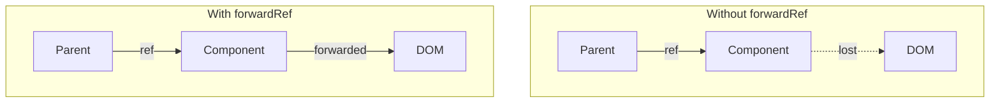

# How to Fix "Ref Forwarding" Issues in React

Author: [nawazdhandala](https://www.github.com/nawazdhandala)

Tags: React, Refs, forwardRef, useRef, useImperativeHandle, TypeScript, Components

Description: Learn how to properly forward refs through components, handle common ref issues, and expose custom imperative handles in React.

---

Refs do not automatically pass through components. This guide covers proper ref forwarding patterns.

## The Problem

```typescript
// This will NOT work - ref is lost
function CustomButton({ children }) {
  return <button>{children}</button>;
}

// Parent tries to use ref
function Parent() {
  const buttonRef = useRef(null);
  return <CustomButton ref={buttonRef}>Click</CustomButton>; // Warning!
}
```

## Solution: forwardRef

```typescript
import { forwardRef, useRef, useEffect } from 'react';

const CustomButton = forwardRef<HTMLButtonElement, { children: React.ReactNode }>(
  function CustomButton({ children }, ref) {
    return <button ref={ref}>{children}</button>;
  }
);

function Parent() {
  const buttonRef = useRef<HTMLButtonElement>(null);

  useEffect(() => {
    buttonRef.current?.focus(); // Works!
  }, []);

  return <CustomButton ref={buttonRef}>Click</CustomButton>;
}
```

## Ref Flow Diagram



## useImperativeHandle: Custom Ref API

```typescript
import { forwardRef, useRef, useImperativeHandle, useState } from 'react';

interface InputHandle {
  focus: () => void;
  clear: () => void;
  getValue: () => string;
}

const CustomInput = forwardRef<InputHandle, { label: string }>(
  function CustomInput({ label }, ref) {
    const inputRef = useRef<HTMLInputElement>(null);
    const [value, setValue] = useState('');

    useImperativeHandle(ref, () => ({
      focus() { inputRef.current?.focus(); },
      clear() { setValue(''); },
      getValue() { return value; },
    }), [value]);

    return (
      <div>
        <label>{label}</label>
        <input
          ref={inputRef}
          value={value}
          onChange={(e) => setValue(e.target.value)}
        />
      </div>
    );
  }
);

// Usage
function Form() {
  const inputRef = useRef<InputHandle>(null);

  const handleSubmit = () => {
    console.log(inputRef.current?.getValue());
    inputRef.current?.clear();
  };

  return (
    <div>
      <CustomInput ref={inputRef} label="Name" />
      <button onClick={handleSubmit}>Submit</button>
    </div>
  );
}
```

## Common Mistakes

```typescript
// BAD: Wrong element type
const Button = forwardRef<HTMLDivElement, Props>( // Should be HTMLButtonElement
  (props, ref) => <button ref={ref} {...props} />
);

// BAD: Missing dependencies
useImperativeHandle(ref, () => ({
  getValue: () => value,
}), []); // Missing value in deps

// GOOD: Correct types and deps
const Button = forwardRef<HTMLButtonElement, Props>(
  (props, ref) => <button ref={ref} {...props} />
);

useImperativeHandle(ref, () => ({
  getValue: () => value,
}), [value]);
```

## Summary

| Concept | Use Case |
|---------|----------|
| forwardRef | Pass ref through component |
| useImperativeHandle | Custom ref API |
| Callback refs | Measure elements |

Use forwardRef when building reusable components and useImperativeHandle when you need a custom imperative API.
