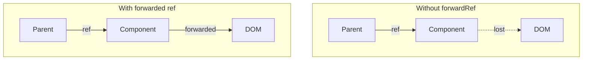

# How to Fix 'Ref Forwarding' Issues in React

Author: [nawazdhandala](https://www.github.com/nawazdhandala)

Tags: React, Ref, ForwardRef, UseRef, UseImperativeHandle, TypeScript, Component

Description: Learn how to properly forward refs through components, handle common ref issues, and expose custom imperative handles in React.

---

Refs do not automatically pass through components. In React 19, pass `ref` as a prop and forward it yourself. In React 18 and earlier, use `forwardRef` for the same pattern.

## The Problem

```typescript
import { useRef, type ReactNode, type Ref } from 'react';

// This will NOT work - ref is lost
function CustomButton({ children }: { children: ReactNode; ref?: Ref<HTMLButtonElement> }) {
  return <button>{children}</button>;
}

// Parent tries to use ref
function Parent() {
  const buttonRef = useRef<HTMLButtonElement>(null);
  return <CustomButton ref={buttonRef}>Click</CustomButton>; // ref stays null
}
```

## Solution: Pass the ref Through

```typescript
import { useRef, useEffect, type ReactNode, type Ref } from 'react';

interface CustomButtonProps {
  children: ReactNode;
  ref?: Ref<HTMLButtonElement>;
}

function CustomButton({ children, ref }: CustomButtonProps) {
  return <button ref={ref}>{children}</button>;
}

function Parent() {
  const buttonRef = useRef<HTMLButtonElement>(null);

  useEffect(() => {
    buttonRef.current?.focus(); // Works!
  }, []);

  return <CustomButton ref={buttonRef}>Click</CustomButton>;
}
```

## Ref Flow Diagram


```mermaid
flowchart TD
    subgraph Without["Without forwardRef"]
        P1[Parent] -->|ref| C1[Component]
        C1 -.->|lost| D1[DOM]
    end

    subgraph With["With forwarded ref"]
        P2[Parent] -->|ref| C2[Component]
        C2 -->|forwarded| D2[DOM]
    end
```

## useImperativeHandle: Custom Ref API

```typescript
import { useRef, useImperativeHandle, useState, type Ref } from 'react';

interface InputHandle {
  focus: () => void;
  clear: () => void;
  getValue: () => string;
}

interface CustomInputProps {
  label: string;
  ref?: Ref<InputHandle>;
}

function CustomInput({ label, ref }: CustomInputProps) {
  const inputRef = useRef<HTMLInputElement>(null);
  const [value, setValue] = useState('');

  useImperativeHandle(ref, () => ({
    focus() { inputRef.current?.focus(); },
    clear() { setValue(''); },
    getValue() { return value; },
  }), [value]);

  return (
    <div>
      <label>{label}</label>
      <input
        ref={inputRef}
        value={value}
        onChange={(e) => setValue(e.target.value)}
      />
    </div>
  );
}

// Usage
function Form() {
  const inputRef = useRef<InputHandle>(null);

  const handleSubmit = () => {
    console.log(inputRef.current?.getValue());
    inputRef.current?.clear();
  };

  return (
    <div>
      <CustomInput ref={inputRef} label="Name" />
      <button onClick={handleSubmit}>Submit</button>
    </div>
  );
}
```

## Common Mistakes

```typescript
import { useImperativeHandle, type ReactNode, type Ref } from 'react';

// BAD: Wrong element type
interface BadButtonProps {
  children: ReactNode;
  ref?: Ref<HTMLDivElement>; // Should be HTMLButtonElement
}

function BadButton({ ref, ...props }: BadButtonProps) {
  return <button ref={ref} {...props} />;
}

// BAD: Missing dependencies
interface InputHandle {
  getValue: () => string;
}

function BadInput({ ref, value }: { ref?: Ref<InputHandle>; value: string }) {
  useImperativeHandle(ref, () => ({
    getValue: () => value,
  }), []); // Missing value in deps

  return null;
}

// GOOD: Correct types and deps
interface ButtonProps {
  children: ReactNode;
  ref?: Ref<HTMLButtonElement>;
}

function Button({ ref, ...props }: ButtonProps) {
  return <button ref={ref} {...props} />;
}

function Input({ ref, value }: { ref?: Ref<InputHandle>; value: string }) {
  useImperativeHandle(ref, () => ({
    getValue: () => value,
  }), [value]);

  return null;
}
```

## Summary

| Concept | Use Case |
|---------|----------|
| ref prop | Pass ref through component in React 19 |
| forwardRef | Pass ref through component in React 18 and earlier |
| useImperativeHandle | Custom ref API |
| Callback refs | Measure elements |

Pass `ref` through reusable components when parents need access to the underlying node, and use useImperativeHandle when you need a custom imperative API. Use forwardRef for React 18 and earlier.
