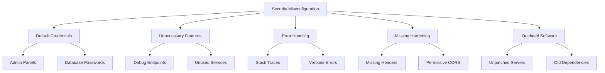
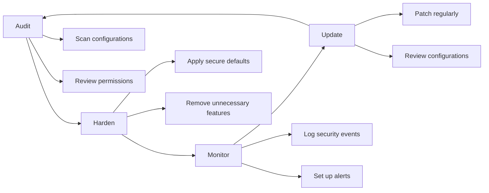

# How to Fix 'Security Misconfiguration' Issues

Author: [nawazdhandala](https://www.github.com/nawazdhandala)

Tags: Security, OWASP, Configuration, DevOps, Hardening, Best Practices, Node.js, Python, Nginx

Description: Learn how to identify and fix security misconfiguration vulnerabilities in web applications, servers, and cloud infrastructure with practical examples.

---

> Security misconfiguration is one of the most common vulnerabilities in web applications. It occurs when security settings are not properly defined, implemented, or maintained. This guide walks you through identifying and fixing these issues across your entire stack.

Security misconfiguration ranks consistently in the OWASP Top 10 because it is easy to introduce and often overlooked during development and deployment.

---

## Understanding Security Misconfiguration



---

## Common Misconfiguration Categories

Security misconfigurations typically fall into these categories:

1. **Default configurations** - Using out-of-the-box settings without hardening
2. **Incomplete configurations** - Missing security headers or settings
3. **Overly permissive settings** - Granting more access than necessary
4. **Exposed sensitive information** - Debug modes, stack traces, directory listings
5. **Outdated components** - Running unpatched software with known vulnerabilities

---

## Server Configuration Hardening

### Nginx Secure Configuration

```nginx
# /etc/nginx/nginx.conf
# Secure Nginx configuration

# Run as non-privileged user
user nginx;
worker_processes auto;

http {
    # Hide Nginx version number
    server_tokens off;

    # Prevent clickjacking attacks
    add_header X-Frame-Options "SAMEORIGIN" always;

    # Prevent MIME type sniffing
    add_header X-Content-Type-Options "nosniff" always;

    # Enable XSS filter
    add_header X-XSS-Protection "1; mode=block" always;

    # Control referrer information
    add_header Referrer-Policy "strict-origin-when-cross-origin" always;

    # Content Security Policy
    add_header Content-Security-Policy "default-src 'self'; script-src 'self'; style-src 'self' 'unsafe-inline';" always;

    # Disable directory listing
    autoindex off;

    # Limit request body size
    client_max_body_size 10M;

    # SSL/TLS configuration
    ssl_protocols TLSv1.2 TLSv1.3;
    ssl_ciphers ECDHE-ECDSA-AES128-GCM-SHA256:ECDHE-RSA-AES128-GCM-SHA256;
    ssl_prefer_server_ciphers on;
    ssl_session_cache shared:SSL:10m;
    ssl_session_timeout 10m;

    # HSTS - enforce HTTPS
    add_header Strict-Transport-Security "max-age=31536000; includeSubDomains" always;

    server {
        listen 443 ssl http2;
        server_name example.com;

        # Deny access to hidden files
        location ~ /\. {
            deny all;
            access_log off;
            log_not_found off;
        }

        # Deny access to sensitive files
        location ~* \.(env|git|gitignore|htaccess|htpasswd|ini|log|sh|sql)$ {
            deny all;
        }

        # Restrict HTTP methods
        if ($request_method !~ ^(GET|HEAD|POST|PUT|DELETE)$) {
            return 405;
        }
    }
}
```

---

## Application Configuration

### Node.js Express Security

```javascript
// app.js
// Secure Express.js configuration

const express = require('express');
const helmet = require('helmet');
const rateLimit = require('express-rate-limit');

const app = express();

// Set security headers with Helmet
app.use(helmet({
    // Content Security Policy
    contentSecurityPolicy: {
        directives: {
            defaultSrc: ["'self'"],
            scriptSrc: ["'self'"],
            styleSrc: ["'self'", "'unsafe-inline'"],
            imgSrc: ["'self'", "data:", "https:"],
            connectSrc: ["'self'"],
            fontSrc: ["'self'"],
            objectSrc: ["'none'"],
            frameSrc: ["'none'"],
            upgradeInsecureRequests: []
        }
    },
    // HTTP Strict Transport Security
    hsts: {
        maxAge: 31536000,
        includeSubDomains: true,
        preload: true
    },
    // Prevent clickjacking
    frameguard: { action: 'deny' },
    // Hide X-Powered-By header
    hidePoweredBy: true,
    // Prevent MIME sniffing
    noSniff: true,
    // XSS filter
    xssFilter: true
}));

// Rate limiting to prevent brute force
const limiter = rateLimit({
    windowMs: 15 * 60 * 1000, // 15 minutes
    max: 100, // Limit each IP to 100 requests per window
    message: 'Too many requests, please try again later.',
    standardHeaders: true,
    legacyHeaders: false
});
app.use(limiter);

// Stricter rate limit for authentication endpoints
const authLimiter = rateLimit({
    windowMs: 60 * 60 * 1000, // 1 hour
    max: 5, // 5 failed attempts per hour
    message: 'Too many login attempts, please try again later.'
});
app.use('/api/auth', authLimiter);

// Disable debug in production
if (process.env.NODE_ENV === 'production') {
    // Disable stack traces in error responses
    app.set('env', 'production');

    // Generic error handler - no stack traces
    app.use((err, req, res, next) => {
        console.error(err); // Log internally
        res.status(500).json({ error: 'Internal server error' });
    });
}

// Disable X-Powered-By header
app.disable('x-powered-by');

// Parse JSON with size limit
app.use(express.json({ limit: '10kb' }));

// Trust proxy only in production behind load balancer
if (process.env.NODE_ENV === 'production') {
    app.set('trust proxy', 1);
}
```

---

## Database Configuration

### PostgreSQL Hardening

```sql
-- postgresql_hardening.sql
-- Secure PostgreSQL configuration

-- Never use default postgres superuser for applications
-- Create application-specific users with minimal privileges

-- Create application database
CREATE DATABASE myapp_production;

-- Create read-only user for reporting
CREATE USER myapp_readonly WITH PASSWORD 'strong_random_password_here';
GRANT CONNECT ON DATABASE myapp_production TO myapp_readonly;
GRANT USAGE ON SCHEMA public TO myapp_readonly;
GRANT SELECT ON ALL TABLES IN SCHEMA public TO myapp_readonly;

-- Create application user with limited privileges
CREATE USER myapp_api WITH PASSWORD 'another_strong_password_here';
GRANT CONNECT ON DATABASE myapp_production TO myapp_api;
GRANT USAGE ON SCHEMA public TO myapp_api;
GRANT SELECT, INSERT, UPDATE, DELETE ON ALL TABLES IN SCHEMA public TO myapp_api;

-- Revoke public access
REVOKE ALL ON DATABASE myapp_production FROM PUBLIC;
REVOKE CREATE ON SCHEMA public FROM PUBLIC;

-- Enable SSL connections only
-- In postgresql.conf:
-- ssl = on
-- ssl_cert_file = '/path/to/server.crt'
-- ssl_key_file = '/path/to/server.key'

-- Restrict connections in pg_hba.conf:
-- hostssl myapp_production myapp_api 10.0.0.0/8 scram-sha-256
-- hostssl myapp_production myapp_readonly 10.0.0.0/8 scram-sha-256
```

---

## Environment Configuration

### Secure Environment Variables

```python
# config.py
# Secure configuration management in Python

import os
from typing import Optional
from dataclasses import dataclass

@dataclass
class Config:
    """Application configuration with secure defaults"""

    # Database - no defaults, must be explicitly set
    database_url: str

    # Security settings with secure defaults
    debug: bool = False
    secret_key: str = ""  # Must be set in production

    # Session configuration
    session_cookie_secure: bool = True  # HTTPS only
    session_cookie_httponly: bool = True  # No JavaScript access
    session_cookie_samesite: str = "Lax"  # CSRF protection

    # CORS - restrictive by default
    cors_origins: list = None

    @classmethod
    def from_environment(cls) -> "Config":
        """Load configuration from environment variables"""

        # Determine environment
        env = os.getenv("APP_ENV", "production")

        # Secret key is required in production
        secret_key = os.getenv("SECRET_KEY", "")
        if env == "production" and not secret_key:
            raise ValueError("SECRET_KEY must be set in production")

        # Generate warning for weak secret key
        if len(secret_key) < 32:
            print("WARNING: SECRET_KEY should be at least 32 characters")

        # Parse CORS origins from comma-separated string
        cors_origins_str = os.getenv("CORS_ORIGINS", "")
        cors_origins = [o.strip() for o in cors_origins_str.split(",") if o.strip()]

        # Validate CORS origins - no wildcards in production
        if env == "production" and "*" in cors_origins:
            raise ValueError("Wildcard CORS origin not allowed in production")

        return cls(
            database_url=os.environ["DATABASE_URL"],  # Required
            debug=env != "production",
            secret_key=secret_key,
            session_cookie_secure=env == "production",
            cors_origins=cors_origins or None
        )

    def validate(self) -> list:
        """Validate configuration and return list of issues"""
        issues = []

        if self.debug:
            issues.append("DEBUG mode is enabled")

        if not self.session_cookie_secure:
            issues.append("Session cookies not marked as secure")

        if self.cors_origins and "*" in self.cors_origins:
            issues.append("CORS allows all origins")

        if len(self.secret_key) < 32:
            issues.append("Secret key is too short")

        return issues


# Usage
config = Config.from_environment()
issues = config.validate()
if issues:
    for issue in issues:
        print(f"Security Warning: {issue}")
```

---

## Cloud Configuration

### AWS S3 Bucket Security

```json
{
    "Version": "2012-10-17",
    "Statement": [
        {
            "Sid": "DenyPublicAccess",
            "Effect": "Deny",
            "Principal": "*",
            "Action": "s3:GetObject",
            "Resource": "arn:aws:s3:::my-private-bucket/*",
            "Condition": {
                "StringNotEquals": {
                    "aws:PrincipalAccount": "123456789012"
                }
            }
        },
        {
            "Sid": "EnforceSSLOnly",
            "Effect": "Deny",
            "Principal": "*",
            "Action": "s3:*",
            "Resource": [
                "arn:aws:s3:::my-private-bucket",
                "arn:aws:s3:::my-private-bucket/*"
            ],
            "Condition": {
                "Bool": {
                    "aws:SecureTransport": "false"
                }
            }
        },
        {
            "Sid": "DenyUnencryptedUploads",
            "Effect": "Deny",
            "Principal": "*",
            "Action": "s3:PutObject",
            "Resource": "arn:aws:s3:::my-private-bucket/*",
            "Condition": {
                "StringNotEquals": {
                    "s3:x-amz-server-side-encryption": "AES256"
                }
            }
        }
    ]
}
```

---

## Security Misconfiguration Checklist



| Category | Check | Status |
|----------|-------|--------|
| Server | Remove default pages and error messages | Required |
| Server | Disable directory listing | Required |
| Server | Hide server version information | Required |
| Headers | Set security headers (CSP, HSTS, etc.) | Required |
| Authentication | Change all default credentials | Critical |
| Database | Use application-specific users | Required |
| Database | Enable SSL connections | Required |
| Cloud | Block public access to storage | Critical |
| Cloud | Enable encryption at rest | Required |
| Application | Disable debug mode in production | Critical |
| Application | Sanitize error messages | Required |
| Dependencies | Keep all software updated | Required |

---

## Automated Security Scanning

```bash
#!/bin/bash
# security_scan.sh
# Basic security misconfiguration scanner

echo "Security Misconfiguration Scanner"
echo "================================="

# Check for common misconfigurations
echo ""
echo "Checking server configuration..."

# Check if debug mode is enabled
if grep -r "DEBUG.*=.*True" . --include="*.py" 2>/dev/null; then
    echo "[WARNING] Debug mode may be enabled in Python files"
fi

# Check for hardcoded secrets
if grep -rE "(password|secret|key)\s*=\s*['\"][^'\"]+['\"]" . \
    --include="*.py" --include="*.js" --include="*.env" 2>/dev/null; then
    echo "[WARNING] Potential hardcoded secrets found"
fi

# Check for permissive CORS
if grep -r "Access-Control-Allow-Origin.*\*" . 2>/dev/null; then
    echo "[WARNING] Wildcard CORS origin found"
fi

# Check file permissions
echo ""
echo "Checking file permissions..."
find . -name "*.env" -perm -004 2>/dev/null | while read f; do
    echo "[WARNING] $f is world-readable"
done

echo ""
echo "Scan complete. Review warnings above."
```

---

## Key Takeaways

1. **Never use default credentials** - Change all default passwords and API keys before deployment
2. **Disable unnecessary features** - Remove debug endpoints, sample applications, and unused services
3. **Set security headers** - Configure CSP, HSTS, X-Frame-Options, and other protective headers
4. **Apply least privilege** - Give users and applications only the permissions they need
5. **Keep software updated** - Regularly patch servers, frameworks, and dependencies
6. **Monitor configurations** - Use automated tools to detect configuration drift

---

*Need to monitor your application for security misconfigurations? [OneUptime](https://oneuptime.com) provides security monitoring with automated alerts when configurations drift from secure baselines.*

**Related Reading:**
- [How to Configure CORS Securely](https://oneuptime.com/blog/post/2026-01-24-configure-cors-securely/view)
- [How to Fix "Sensitive Data Exposure" Issues](https://oneuptime.com/blog/post/2026-01-24-fix-sensitive-data-exposure/view)
- [How to Handle Input Validation](https://oneuptime.com/blog/post/2026-01-24-handle-input-validation/view)
