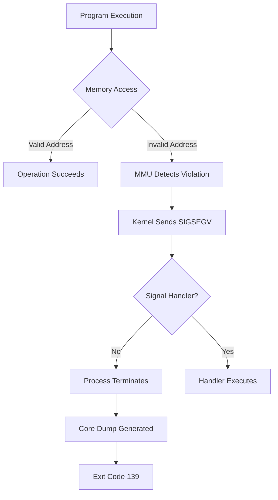
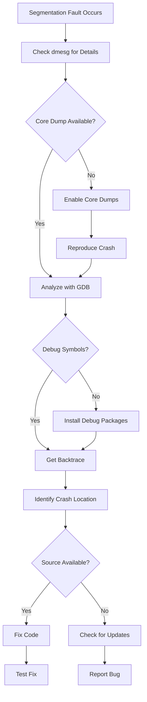

# How to Fix "Segmentation Fault" Errors in Linux

Author: [nawazdhandala](https://github.com/nawazdhandala)

Tags: Linux, Debugging, System Administration, Troubleshooting, Memory, Core Dumps

Description: Learn how to diagnose and fix segmentation fault errors in Linux using core dumps, debugging tools, and systematic troubleshooting approaches.

---

A segmentation fault (segfault) occurs when a program attempts to access memory that it is not allowed to access. This could be reading from or writing to an invalid memory address, accessing memory that has been freed, or violating memory protection. Understanding how to diagnose and fix these errors is crucial for system administrators and developers.

## Understanding Segmentation Faults



### Common Causes

| Cause | Description | Example |
|-------|-------------|---------|
| Null pointer dereference | Accessing memory at address 0 | `char *p = NULL; *p = 'x';` |
| Buffer overflow | Writing beyond allocated memory | `char buf[10]; strcpy(buf, "very long string");` |
| Use after free | Accessing freed memory | `free(ptr); printf("%s", ptr);` |
| Stack overflow | Recursive function exhausts stack | Infinite recursion |
| Invalid pointer arithmetic | Pointer points outside valid range | `arr[1000]` when arr has 10 elements |

## Initial Diagnosis

### Check System Logs

```bash
# View kernel messages for segfault details
dmesg | grep -i segfault

# Example output:
# [12345.678901] app[1234]: segfault at 0 ip 00007f1234567890 sp 00007ffc12345678 error 6 in libc.so.6[7f1234500000+1c0000]

# Check journal for application crashes
journalctl -xe | grep -i segfault

# View specific service crashes
journalctl -u myservice.service | grep -i fault
```

### Understanding dmesg Output

```bash
# Format: process[pid]: segfault at ADDRESS ip INSTRUCTION_POINTER sp STACK_POINTER error CODE in BINARY

# Error codes (binary flags):
# Bit 0: 0 = no page found, 1 = protection fault
# Bit 1: 0 = read, 1 = write
# Bit 2: 0 = kernel mode, 1 = user mode
# Bit 3: 0 = no INSTR fetch, 1 = INSTR fetch

# Common error codes:
# 4 = user mode read of unmapped area
# 6 = user mode write of unmapped area
# 14 = user mode write protection violation
```

## Enabling Core Dumps

Core dumps are memory snapshots taken when a program crashes. They are essential for debugging segfaults.

### Configure Core Dump Settings

```bash
# Check current core dump limit
ulimit -c

# Enable core dumps for current session (unlimited size)
ulimit -c unlimited

# Make permanent by adding to /etc/security/limits.conf
# Add these lines:
# *               soft    core            unlimited
# *               hard    core            unlimited

# Or for specific user:
# myuser          soft    core            unlimited
```

### Configure Core Dump Location

```bash
# Check current pattern
cat /proc/sys/kernel/core_pattern

# Set custom core dump pattern
# %e = executable name
# %p = PID
# %t = timestamp
echo "/var/crash/core.%e.%p.%t" > /proc/sys/kernel/core_pattern

# Make permanent in /etc/sysctl.conf
echo "kernel.core_pattern = /var/crash/core.%e.%p.%t" >> /etc/sysctl.conf
sysctl -p

# Create dump directory with proper permissions
mkdir -p /var/crash
chmod 1777 /var/crash
```

### Using systemd-coredump

```bash
# Check if systemd-coredump is configured
cat /proc/sys/kernel/core_pattern
# Should show: |/usr/lib/systemd/systemd-coredump ...

# List stored core dumps
coredumpctl list

# Show details of most recent dump
coredumpctl info

# Show dump for specific PID
coredumpctl info 12345

# Extract core dump to file
coredumpctl dump -o /tmp/core.dump

# Debug directly with gdb
coredumpctl debug
```

## Analyzing Core Dumps with GDB

### Basic GDB Analysis

```bash
# Install GDB and debugging symbols
# Debian/Ubuntu
apt-get install gdb
apt-get install libc6-dbg  # C library debug symbols

# RHEL/CentOS
yum install gdb
debuginfo-install glibc

# Load core dump in GDB
gdb /path/to/executable /path/to/core

# Or if using systemd-coredump
coredumpctl gdb
```

### Essential GDB Commands

```bash
# Once in GDB with core loaded:

# Show backtrace (call stack) - most important command
(gdb) bt
# or full backtrace with local variables
(gdb) bt full

# Show specific frame
(gdb) frame 3

# Print variable value
(gdb) print variable_name

# Show registers
(gdb) info registers

# Show memory at address
(gdb) x/20x 0x7fff12345678

# Show source code around crash (if symbols available)
(gdb) list

# Show all threads
(gdb) info threads

# Switch to specific thread
(gdb) thread 2

# Show thread backtraces
(gdb) thread apply all bt
```

### Example GDB Session

```bash
$ gdb /usr/bin/myapp /var/crash/core.myapp.1234.1706123456

GNU gdb (GDB) 10.1
Reading symbols from /usr/bin/myapp...
[New LWP 1234]
Core was generated by '/usr/bin/myapp --config /etc/myapp.conf'.
Program terminated with signal SIGSEGV, Segmentation fault.
#0  0x00007f1234567890 in process_data (data=0x0) at src/processor.c:42

(gdb) bt
#0  0x00007f1234567890 in process_data (data=0x0) at src/processor.c:42
#1  0x00007f1234567abc in handle_request (req=0x7f1234000010) at src/handler.c:128
#2  0x00007f1234567def in main (argc=3, argv=0x7ffc12345678) at src/main.c:56

(gdb) frame 0
#0  0x00007f1234567890 in process_data (data=0x0) at src/processor.c:42
42          result = data->value * 2;  // Crash here - data is NULL

(gdb) print data
$1 = (struct DataStruct *) 0x0

# The crash occurred because 'data' pointer is NULL
```

## Debugging Without Core Dumps

### Using strace

```bash
# Trace system calls until crash
strace -f -o /tmp/strace.log ./myapp

# Trace specific syscalls
strace -e trace=memory,read,write ./myapp

# Attach to running process
strace -p 1234
```

### Using ltrace

```bash
# Trace library calls
ltrace ./myapp

# Trace with timestamps
ltrace -t ./myapp

# Show return values
ltrace -r ./myapp
```

### Using Valgrind

```bash
# Install Valgrind
apt-get install valgrind  # Debian/Ubuntu
yum install valgrind      # RHEL/CentOS

# Run with memory checking
valgrind --leak-check=full --show-leak-kinds=all ./myapp

# Track origins of uninitialized values
valgrind --track-origins=yes ./myapp

# Generate suppressions file for known issues
valgrind --gen-suppressions=all ./myapp
```

### Using Address Sanitizer (ASan)

```bash
# Recompile application with ASan (if you have source)
gcc -fsanitize=address -g -o myapp myapp.c

# Run normally - ASan will report memory errors
./myapp

# ASan environment variables
ASAN_OPTIONS=detect_leaks=1:abort_on_error=1 ./myapp
```

## Common Fixes

### Fix 1: Library Version Mismatch

```bash
# Check library dependencies
ldd /usr/bin/myapp

# Look for "not found" or version mismatches
ldd /usr/bin/myapp | grep -i "not found"

# Check library versions
ldd /usr/bin/myapp | xargs -I{} sh -c 'echo {}; file {}'

# Reinstall the application to fix library issues
apt-get install --reinstall myapp

# Or update shared library cache
ldconfig
```

### Fix 2: Memory Limits

```bash
# Check current memory limits
ulimit -a

# Increase stack size (default often 8MB)
ulimit -s unlimited

# Increase virtual memory limit
ulimit -v unlimited

# Make permanent in /etc/security/limits.conf
# myuser    soft    stack    unlimited
# myuser    hard    stack    unlimited
```

### Fix 3: Corrupted Installation

```bash
# Verify package integrity (Debian/Ubuntu)
debsums myapp

# Reinstall if corrupted
apt-get install --reinstall myapp

# Verify RPM package (RHEL/CentOS)
rpm -V myapp

# Reinstall if needed
yum reinstall myapp
```

### Fix 4: Hardware Issues

```bash
# Test RAM with memtest86+
# Boot from memtest86+ USB/CD and run overnight

# Check for disk errors
dmesg | grep -i error
smartctl -a /dev/sda

# Run filesystem check
fsck -n /dev/sda1
```

## Debugging Flow



## Creating a Crash Analysis Script

```bash
#!/bin/bash
# Save as /usr/local/bin/analyze-crash.sh
# Usage: analyze-crash.sh <core-file> <executable>

CORE=$1
EXEC=$2

if [ -z "$CORE" ] || [ -z "$EXEC" ]; then
    echo "Usage: $0 <core-file> <executable>"
    exit 1
fi

echo "=== Crash Analysis Report ==="
echo "Date: $(date)"
echo "Core file: $CORE"
echo "Executable: $EXEC"
echo ""

echo "=== File Information ==="
file "$CORE"
file "$EXEC"
echo ""

echo "=== Library Dependencies ==="
ldd "$EXEC"
echo ""

echo "=== Backtrace ==="
gdb -batch -ex "bt full" -ex "info registers" -ex "thread apply all bt" "$EXEC" "$CORE" 2>/dev/null
echo ""

echo "=== Recent dmesg entries ==="
dmesg | grep -i segfault | tail -10
echo ""

echo "=== Memory Info at Crash Time ==="
free -h
echo ""

echo "=== Analysis Complete ==="
```

## Preventing Segmentation Faults

### For Developers

```c
// Always check pointers before use
if (ptr != NULL) {
    // Safe to use ptr
}

// Initialize pointers to NULL
char *data = NULL;

// Use safe string functions
strncpy(dest, src, sizeof(dest) - 1);
dest[sizeof(dest) - 1] = '\0';

// Check array bounds
if (index >= 0 && index < array_size) {
    array[index] = value;
}

// Free memory only once
free(ptr);
ptr = NULL;  // Prevent double-free
```

### For System Administrators

```bash
# Keep systems updated
apt-get update && apt-get upgrade

# Monitor for crashes
# Add to /etc/cron.hourly/check-crashes
#!/bin/bash
CRASHES=$(dmesg | grep -c segfault)
if [ "$CRASHES" -gt 0 ]; then
    dmesg | grep segfault | mail -s "Segfault detected" admin@example.com
fi

# Set up automatic core dump collection
systemctl enable systemd-coredump
```

## Quick Reference

| Task | Command |
|------|---------|
| Check for segfaults | `dmesg \| grep segfault` |
| Enable core dumps | `ulimit -c unlimited` |
| List core dumps | `coredumpctl list` |
| Analyze core dump | `gdb <executable> <core>` |
| Get backtrace | `(gdb) bt full` |
| Trace system calls | `strace ./program` |
| Memory check | `valgrind ./program` |
| Check libraries | `ldd ./program` |

## Conclusion

Segmentation faults can be challenging to debug, but with the right tools and systematic approach, they become manageable. Always start by checking system logs and enabling core dumps. Use GDB to analyze the crash, and tools like Valgrind and AddressSanitizer to catch memory issues early. For production systems, setting up automated core dump collection and monitoring helps catch and diagnose issues quickly.
