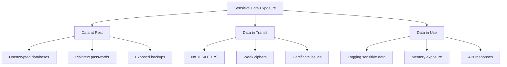
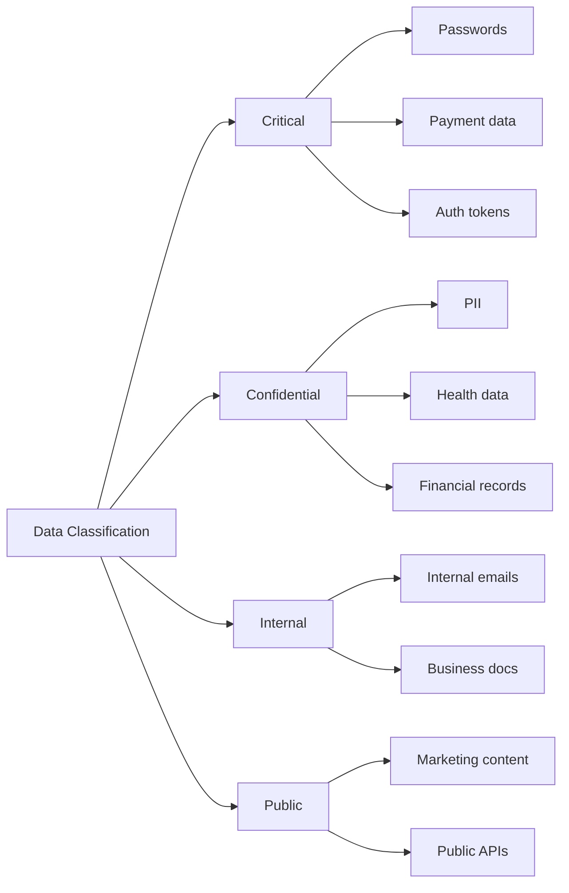

# How to Fix 'Sensitive Data Exposure' Issues

Author: [nawazdhandala](https://www.github.com/nawazdhandala)

Tags: Security, OWASP, Encryption, Data Protection, PII, API Security, Node.js, Python, Database

Description: Learn how to identify and fix sensitive data exposure vulnerabilities in your applications, including encryption, secure storage, and data masking techniques.

---

> Sensitive data exposure occurs when applications fail to adequately protect confidential information such as passwords, credit card numbers, health records, and personal data. This guide shows you how to identify vulnerable data and implement proper protection mechanisms.

Sensitive data exposure is consistently ranked in the OWASP Top 10 because the consequences of exposing user data can be severe, including identity theft, financial fraud, and regulatory penalties.

---

## Understanding Sensitive Data Exposure



---

## Types of Sensitive Data

Not all data requires the same level of protection. Classify your data appropriately:



---

## Encryption at Rest

### Database Field Encryption

```python
# encryption.py
# Field-level encryption for sensitive data

from cryptography.fernet import Fernet
from cryptography.hazmat.primitives import hashes
from cryptography.hazmat.primitives.kdf.pbkdf2 import PBKDF2HMAC
from cryptography.hazmat.backends import default_backend
import base64
import os
from typing import Optional

class FieldEncryption:
    """Encrypt sensitive fields before storing in database"""

    def __init__(self, master_key: str, salt: bytes = None):
        """
        Initialize encryption with master key.

        Args:
            master_key: Strong secret key from environment
            salt: Salt for key derivation (generate and store securely)
        """
        if len(master_key) < 32:
            raise ValueError("Master key must be at least 32 characters")

        self.salt = salt or os.urandom(16)

        # Derive encryption key from master key
        kdf = PBKDF2HMAC(
            algorithm=hashes.SHA256(),
            length=32,
            salt=self.salt,
            iterations=100000,
            backend=default_backend()
        )
        key = base64.urlsafe_b64encode(kdf.derive(master_key.encode()))
        self.fernet = Fernet(key)

    def encrypt(self, plaintext: str) -> str:
        """Encrypt a string value"""
        if not plaintext:
            return plaintext
        return self.fernet.encrypt(plaintext.encode()).decode()

    def decrypt(self, ciphertext: str) -> str:
        """Decrypt an encrypted value"""
        if not ciphertext:
            return ciphertext
        return self.fernet.decrypt(ciphertext.encode()).decode()


# Example: Encrypting user data before storage
class User:
    """User model with encrypted sensitive fields"""

    def __init__(self, encryption: FieldEncryption):
        self.encryption = encryption
        self.id: Optional[int] = None
        self.email: str = ""
        self._ssn_encrypted: str = ""  # Stored encrypted
        self._phone_encrypted: str = ""  # Stored encrypted

    @property
    def ssn(self) -> str:
        """Decrypt SSN when accessed"""
        return self.encryption.decrypt(self._ssn_encrypted)

    @ssn.setter
    def ssn(self, value: str):
        """Encrypt SSN before storing"""
        # Validate SSN format first
        if not self._validate_ssn(value):
            raise ValueError("Invalid SSN format")
        self._ssn_encrypted = self.encryption.encrypt(value)

    @property
    def phone(self) -> str:
        """Decrypt phone when accessed"""
        return self.encryption.decrypt(self._phone_encrypted)

    @phone.setter
    def phone(self, value: str):
        """Encrypt phone before storing"""
        self._phone_encrypted = self.encryption.encrypt(value)

    def _validate_ssn(self, ssn: str) -> bool:
        """Validate SSN format"""
        import re
        pattern = r'^\d{3}-\d{2}-\d{4}$'
        return bool(re.match(pattern, ssn))

    def to_dict(self, include_sensitive: bool = False) -> dict:
        """Convert to dictionary, optionally masking sensitive data"""
        data = {
            'id': self.id,
            'email': self.email,
        }

        if include_sensitive:
            data['ssn'] = self.ssn
            data['phone'] = self.phone
        else:
            # Return masked versions
            data['ssn'] = self._mask_ssn()
            data['phone'] = self._mask_phone()

        return data

    def _mask_ssn(self) -> str:
        """Show only last 4 digits"""
        ssn = self.ssn
        if ssn:
            return f"***-**-{ssn[-4:]}"
        return ""

    def _mask_phone(self) -> str:
        """Show only last 4 digits"""
        phone = self.phone
        if phone and len(phone) >= 4:
            return f"***-***-{phone[-4:]}"
        return ""
```

---

## Secure Password Storage

```javascript
// password.js
// Secure password hashing with bcrypt

const bcrypt = require('bcrypt');

// Configuration
const SALT_ROUNDS = 12;  // Adjust based on your security needs and hardware

/**
 * Hash a password securely
 * @param {string} password - Plain text password
 * @returns {Promise<string>} - Hashed password
 */
async function hashPassword(password) {
    // Validate password strength first
    if (!isPasswordStrong(password)) {
        throw new Error('Password does not meet strength requirements');
    }

    // Generate salt and hash
    const hash = await bcrypt.hash(password, SALT_ROUNDS);
    return hash;
}

/**
 * Verify a password against its hash
 * @param {string} password - Plain text password to verify
 * @param {string} hash - Stored password hash
 * @returns {Promise<boolean>} - True if password matches
 */
async function verifyPassword(password, hash) {
    // Use constant-time comparison (bcrypt does this internally)
    return await bcrypt.compare(password, hash);
}

/**
 * Check if password needs rehashing (algorithm/cost changed)
 * @param {string} hash - Current password hash
 * @returns {boolean} - True if should rehash
 */
function needsRehash(hash) {
    // Check if hash uses current cost factor
    const rounds = bcrypt.getRounds(hash);
    return rounds < SALT_ROUNDS;
}

/**
 * Validate password strength
 * @param {string} password - Password to validate
 * @returns {boolean} - True if password is strong enough
 */
function isPasswordStrong(password) {
    // Minimum 12 characters
    if (password.length < 12) return false;

    // Must contain uppercase
    if (!/[A-Z]/.test(password)) return false;

    // Must contain lowercase
    if (!/[a-z]/.test(password)) return false;

    // Must contain number
    if (!/[0-9]/.test(password)) return false;

    // Must contain special character
    if (!/[^A-Za-z0-9]/.test(password)) return false;

    // Check against common passwords (use a proper list in production)
    const commonPasswords = ['Password123!', 'Admin123!', 'Welcome1!'];
    if (commonPasswords.includes(password)) return false;

    return true;
}

// Example usage in authentication
async function authenticateUser(email, password, db) {
    // Find user by email
    const user = await db.users.findOne({ email: email.toLowerCase() });

    if (!user) {
        // Use same response time to prevent timing attacks
        await bcrypt.hash(password, SALT_ROUNDS);
        return null;
    }

    // Verify password
    const valid = await verifyPassword(password, user.passwordHash);

    if (!valid) {
        return null;
    }

    // Check if password needs rehashing
    if (needsRehash(user.passwordHash)) {
        // Rehash with current cost and update
        const newHash = await hashPassword(password);
        await db.users.updateOne(
            { _id: user._id },
            { $set: { passwordHash: newHash } }
        );
    }

    return user;
}

module.exports = { hashPassword, verifyPassword, needsRehash, isPasswordStrong };
```

---

## Secure API Responses

```javascript
// api-response.js
// Filter sensitive data from API responses

/**
 * User data sanitization for API responses
 */
class UserSerializer {
    /**
     * Public profile - minimal information
     */
    static public(user) {
        return {
            id: user.id,
            username: user.username,
            displayName: user.displayName,
            avatarUrl: user.avatarUrl,
            createdAt: user.createdAt
        };
    }

    /**
     * Self profile - user viewing their own data
     */
    static self(user) {
        return {
            id: user.id,
            username: user.username,
            email: user.email,
            displayName: user.displayName,
            avatarUrl: user.avatarUrl,
            phone: this.maskPhone(user.phone),
            emailVerified: user.emailVerified,
            twoFactorEnabled: user.twoFactorEnabled,
            createdAt: user.createdAt,
            updatedAt: user.updatedAt
        };
    }

    /**
     * Admin view - includes more details but still filtered
     */
    static admin(user) {
        return {
            ...this.self(user),
            roles: user.roles,
            lastLoginAt: user.lastLoginAt,
            loginAttempts: user.loginAttempts,
            accountStatus: user.accountStatus
            // Never include: passwordHash, tokens, SSN, full credit card
        };
    }

    /**
     * Mask phone number - show only last 4 digits
     */
    static maskPhone(phone) {
        if (!phone) return null;
        const cleaned = phone.replace(/\D/g, '');
        if (cleaned.length < 4) return '****';
        return `***-***-${cleaned.slice(-4)}`;
    }

    /**
     * Mask email - partial hiding
     */
    static maskEmail(email) {
        if (!email) return null;
        const [local, domain] = email.split('@');
        const maskedLocal = local.charAt(0) + '***' + local.charAt(local.length - 1);
        return `${maskedLocal}@${domain}`;
    }
}

// Middleware to strip sensitive fields from responses
function sanitizeResponse(sensitiveFields) {
    return (req, res, next) => {
        const originalJson = res.json.bind(res);

        res.json = (data) => {
            const sanitized = removeSensitiveFields(data, sensitiveFields);
            return originalJson(sanitized);
        };

        next();
    };
}

function removeSensitiveFields(obj, fields) {
    if (Array.isArray(obj)) {
        return obj.map(item => removeSensitiveFields(item, fields));
    }

    if (obj && typeof obj === 'object') {
        const result = {};
        for (const [key, value] of Object.entries(obj)) {
            if (!fields.includes(key)) {
                result[key] = removeSensitiveFields(value, fields);
            }
        }
        return result;
    }

    return obj;
}

// Usage
const express = require('express');
const app = express();

// Apply globally to remove sensitive fields
app.use(sanitizeResponse([
    'password',
    'passwordHash',
    'ssn',
    'socialSecurityNumber',
    'creditCard',
    'cvv',
    'secretKey',
    'apiSecret',
    'refreshToken'
]));
```

---

## Secure Logging

```python
# secure_logging.py
# Logging with sensitive data filtering

import logging
import re
import json
from typing import Any, Dict

class SensitiveDataFilter(logging.Filter):
    """Filter sensitive data from log messages"""

    # Patterns to detect and mask
    PATTERNS = [
        # Credit card numbers
        (r'\b\d{4}[- ]?\d{4}[- ]?\d{4}[- ]?\d{4}\b', '[CREDIT_CARD]'),
        # SSN
        (r'\b\d{3}-\d{2}-\d{4}\b', '[SSN]'),
        # Email addresses
        (r'\b[A-Za-z0-9._%+-]+@[A-Za-z0-9.-]+\.[A-Z|a-z]{2,}\b', '[EMAIL]'),
        # Phone numbers
        (r'\b\d{3}[-.]?\d{3}[-.]?\d{4}\b', '[PHONE]'),
        # API keys (common formats)
        (r'\b[A-Za-z0-9]{32,}\b', '[API_KEY]'),
        # JWT tokens
        (r'\beyJ[A-Za-z0-9-_]+\.eyJ[A-Za-z0-9-_]+\.[A-Za-z0-9-_]+\b', '[JWT]'),
        # Bearer tokens
        (r'Bearer\s+[A-Za-z0-9-_]+', 'Bearer [TOKEN]'),
    ]

    # Field names to mask in structured logs
    SENSITIVE_FIELDS = {
        'password', 'passwd', 'secret', 'token', 'apikey', 'api_key',
        'authorization', 'auth', 'credential', 'ssn', 'credit_card',
        'card_number', 'cvv', 'pin', 'private_key'
    }

    def filter(self, record: logging.LogRecord) -> bool:
        """Filter and mask sensitive data in log record"""
        # Mask patterns in message
        record.msg = self._mask_patterns(str(record.msg))

        # Mask patterns in arguments
        if record.args:
            record.args = tuple(
                self._mask_patterns(str(arg)) if isinstance(arg, str) else arg
                for arg in record.args
            )

        return True

    def _mask_patterns(self, text: str) -> str:
        """Apply all masking patterns to text"""
        for pattern, replacement in self.PATTERNS:
            text = re.sub(pattern, replacement, text)
        return text


def mask_dict(data: Dict[str, Any], sensitive_fields: set = None) -> Dict[str, Any]:
    """Recursively mask sensitive fields in a dictionary"""
    if sensitive_fields is None:
        sensitive_fields = SensitiveDataFilter.SENSITIVE_FIELDS

    masked = {}
    for key, value in data.items():
        key_lower = key.lower()

        if any(field in key_lower for field in sensitive_fields):
            # Mask the entire value
            masked[key] = '[REDACTED]'
        elif isinstance(value, dict):
            # Recursively mask nested dicts
            masked[key] = mask_dict(value, sensitive_fields)
        elif isinstance(value, list):
            # Handle lists
            masked[key] = [
                mask_dict(item, sensitive_fields) if isinstance(item, dict) else item
                for item in value
            ]
        else:
            masked[key] = value

    return masked


# Configure logging with filter
def setup_secure_logging():
    """Set up logging with sensitive data filtering"""
    logger = logging.getLogger()
    logger.setLevel(logging.INFO)

    # Add filter to all handlers
    sensitive_filter = SensitiveDataFilter()

    # Console handler
    console_handler = logging.StreamHandler()
    console_handler.addFilter(sensitive_filter)
    console_handler.setFormatter(logging.Formatter(
        '%(asctime)s - %(name)s - %(levelname)s - %(message)s'
    ))

    logger.addHandler(console_handler)

    return logger


# Usage example
logger = setup_secure_logging()

# These will be automatically masked
logger.info("User login attempt for john.doe@example.com")  # Email masked
logger.info("Processing payment for card 4111-1111-1111-1111")  # Card masked
logger.info("API request with token: eyJhbGciOiJIUzI1NiIsInR5cCI6IkpXVCJ9...")  # JWT masked

# Structured logging with masking
request_data = {
    'user_id': 123,
    'email': 'user@example.com',
    'password': 'secret123',
    'credit_card': '4111111111111111'
}
logger.info("Request data: %s", json.dumps(mask_dict(request_data)))
```

---

## Transport Security

```nginx
# nginx-tls.conf
# Secure TLS configuration

server {
    listen 443 ssl http2;
    server_name example.com;

    # Modern TLS configuration
    ssl_certificate /etc/ssl/certs/example.com.crt;
    ssl_certificate_key /etc/ssl/private/example.com.key;

    # TLS 1.2 and 1.3 only (no older protocols)
    ssl_protocols TLSv1.2 TLSv1.3;

    # Strong cipher suites
    ssl_ciphers ECDHE-ECDSA-AES128-GCM-SHA256:ECDHE-RSA-AES128-GCM-SHA256:ECDHE-ECDSA-AES256-GCM-SHA384:ECDHE-RSA-AES256-GCM-SHA384;
    ssl_prefer_server_ciphers on;

    # OCSP stapling
    ssl_stapling on;
    ssl_stapling_verify on;
    ssl_trusted_certificate /etc/ssl/certs/ca-certificates.crt;

    # Session settings
    ssl_session_cache shared:SSL:10m;
    ssl_session_timeout 1d;
    ssl_session_tickets off;

    # HSTS - force HTTPS for 1 year
    add_header Strict-Transport-Security "max-age=31536000; includeSubDomains; preload" always;

    # Additional security headers
    add_header X-Content-Type-Options "nosniff" always;
    add_header X-Frame-Options "DENY" always;
}

# Redirect HTTP to HTTPS
server {
    listen 80;
    server_name example.com;
    return 301 https://$server_name$request_uri;
}
```

---

## Security Checklist

| Category | Check | Priority |
|----------|-------|----------|
| Passwords | Hash with bcrypt/Argon2 (never MD5/SHA1) | Critical |
| PII | Encrypt sensitive fields at rest | Critical |
| Transport | Use TLS 1.2+ for all connections | Critical |
| API | Never expose passwords, tokens, or keys | Critical |
| Logging | Filter sensitive data from logs | High |
| Backups | Encrypt database backups | High |
| Responses | Mask partial data (last 4 digits) | High |
| Headers | Enable HSTS | High |
| Storage | Encrypt files containing PII | High |
| Access | Limit who can access sensitive data | High |

---

## Key Takeaways

1. **Classify your data** - Not all data needs the same protection level
2. **Encrypt sensitive data at rest** - Use field-level encryption for PII
3. **Use proper password hashing** - bcrypt or Argon2 with appropriate cost factors
4. **Sanitize API responses** - Never expose more data than necessary
5. **Secure data in transit** - TLS 1.2+ with strong ciphers
6. **Filter logs** - Remove or mask sensitive data before logging

---

*Need to monitor for sensitive data exposure in your applications? [OneUptime](https://oneuptime.com) provides security monitoring with alerting on suspicious data access patterns.*

**Related Reading:**
- [How to Fix "Security Misconfiguration" Issues](https://oneuptime.com/blog/post/2026-01-24-fix-security-misconfiguration/view)
- [How to Configure CORS Securely](https://oneuptime.com/blog/post/2026-01-24-configure-cors-securely/view)
- [How to Handle Input Validation](https://oneuptime.com/blog/post/2026-01-24-handle-input-validation/view)
