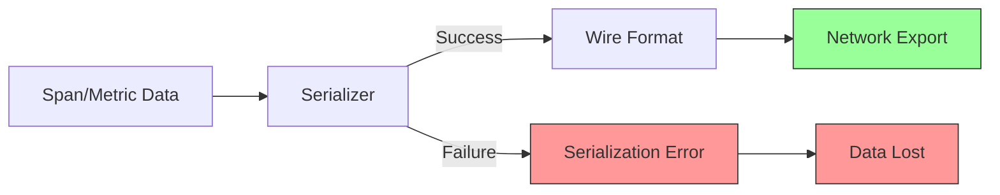
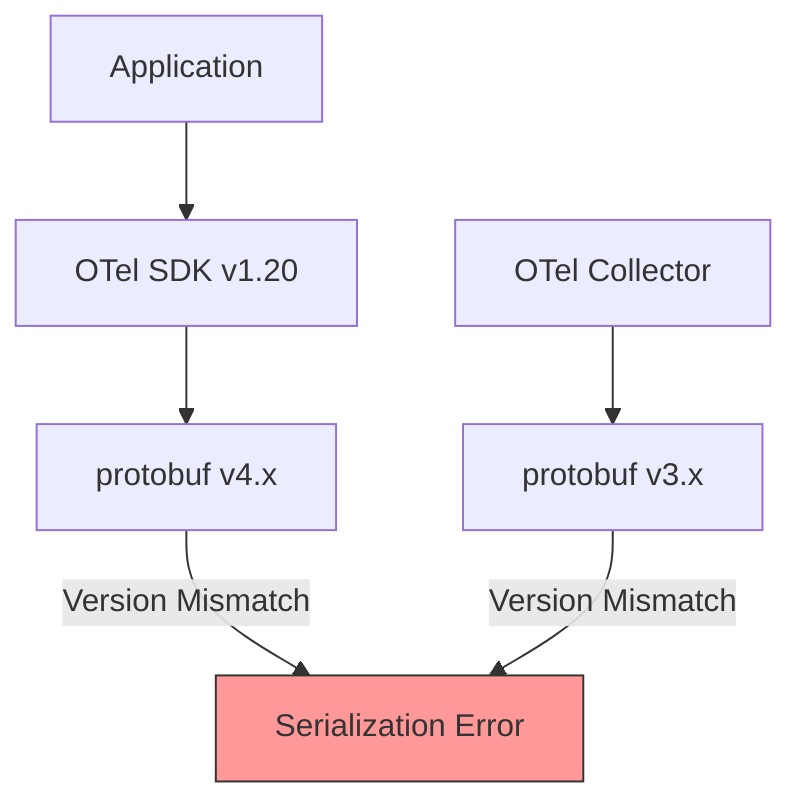
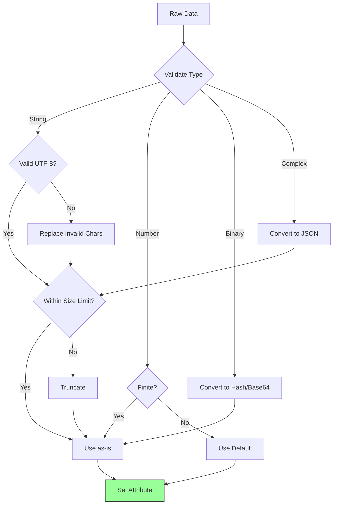

# How to Fix "Serialization Failed" Export Errors

Author: [nawazdhandala](https://www.github.com/nawazdhandala)

Tags: OpenTelemetry, Debugging, Export, Serialization, Troubleshooting

Description: Learn how to diagnose and fix serialization errors when exporting telemetry data in OpenTelemetry applications.

---

Serialization failed errors in OpenTelemetry indicate that your telemetry data cannot be converted to the wire format for export. These errors cause data loss and leave gaps in your observability. This guide covers the common causes and solutions.

## Understanding Serialization Errors



## Common Error Messages

Here are typical serialization error messages you might encounter:

```
Error: failed to serialize span: invalid UTF-8 in string
Error: proto: cannot convert invalid UTF-8 string to Text
Error: serialization failed: attribute value exceeds maximum length
Error: failed to marshal trace data: proto: required field not set
Error: grpc: error while marshaling: proto: Marshal called with nil
```

## Cause 1: Invalid UTF-8 Characters in Attributes

The most common cause is non-UTF-8 characters in span attributes or log messages.

```python
# WRONG: Binary data or invalid encoding causes serialization errors
from opentelemetry import trace

tracer = trace.get_tracer(__name__)

def process_file(filepath):
    with tracer.start_as_current_span("process-file") as span:
        # Reading binary file as string - PROBLEM!
        with open(filepath, 'rb') as f:
            content = f.read()

        # This will fail serialization if content has non-UTF-8 bytes
        span.set_attribute("file.content", content)  # ERROR!
        span.set_attribute("file.path", filepath)
```

**The Fix**: Validate and sanitize string attributes:

```python
# CORRECT: Sanitize data before setting as attributes
from opentelemetry import trace
import base64

tracer = trace.get_tracer(__name__)

def sanitize_string(value, max_length=4096):
    """
    Sanitize a value for use as a span attribute.
    Handles encoding issues and length limits.
    """
    if value is None:
        return ""

    if isinstance(value, bytes):
        # Convert bytes to base64 string for safe serialization
        try:
            # Try to decode as UTF-8 first
            return value.decode('utf-8')[:max_length]
        except UnicodeDecodeError:
            # Fall back to base64 encoding
            return base64.b64encode(value).decode('ascii')[:max_length]

    if isinstance(value, str):
        # Ensure valid UTF-8 by encoding and decoding
        try:
            # Remove any invalid characters
            cleaned = value.encode('utf-8', errors='replace').decode('utf-8')
            return cleaned[:max_length]
        except Exception:
            return f"<invalid string: {len(value)} chars>"

    # Convert other types to string
    return str(value)[:max_length]

def process_file(filepath):
    with tracer.start_as_current_span("process-file") as span:
        with open(filepath, 'rb') as f:
            content = f.read()

        # Store hash instead of content for binary files
        import hashlib
        content_hash = hashlib.sha256(content).hexdigest()

        span.set_attribute("file.hash", content_hash)
        span.set_attribute("file.size_bytes", len(content))
        span.set_attribute("file.path", sanitize_string(filepath))
```

## Cause 2: Oversized Attributes

Attributes that exceed size limits will fail serialization.

```go
// WRONG: Storing large data in attributes
func processRequest(ctx context.Context, body []byte) {
    ctx, span := tracer.Start(ctx, "process-request")
    defer span.End()

    // This may exceed attribute size limits (typically 4KB-64KB)
    span.SetAttributes(
        attribute.String("request.body", string(body)), // Could be megabytes!
    )
}
```

**The Fix**: Implement size limits and truncation:

```go
// CORRECT: Limit attribute sizes
package main

import (
    "crypto/sha256"
    "encoding/hex"
    "unicode/utf8"

    "go.opentelemetry.io/otel/attribute"
    "go.opentelemetry.io/otel/trace"
)

const (
    MaxAttributeLength = 4096  // 4KB limit for attribute values
    TruncationSuffix   = "...[truncated]"
)

// SafeStringAttribute creates a string attribute with size validation
func SafeStringAttribute(key, value string) attribute.KeyValue {
    // Ensure valid UTF-8
    if !utf8.ValidString(value) {
        value = string([]rune(value)) // Remove invalid runes
    }

    // Truncate if too long
    if len(value) > MaxAttributeLength {
        truncateAt := MaxAttributeLength - len(TruncationSuffix)
        // Don't cut in the middle of a UTF-8 character
        for truncateAt > 0 && !utf8.RuneStart(value[truncateAt]) {
            truncateAt--
        }
        value = value[:truncateAt] + TruncationSuffix
    }

    return attribute.String(key, value)
}

// SafeBodyAttribute stores a hash and size instead of full content
func SafeBodyAttribute(body []byte) []attribute.KeyValue {
    hash := sha256.Sum256(body)
    return []attribute.KeyValue{
        attribute.String("request.body_hash", hex.EncodeToString(hash[:])),
        attribute.Int("request.body_size", len(body)),
    }
}

func processRequest(ctx context.Context, body []byte) {
    ctx, span := tracer.Start(ctx, "process-request")
    defer span.End()

    // Use safe attributes
    span.SetAttributes(SafeBodyAttribute(body)...)

    // For smaller string values, use SafeStringAttribute
    span.SetAttributes(
        SafeStringAttribute("request.path", "/api/users"),
    )
}
```

## Cause 3: Nil or Invalid Span Context

Attempting to serialize spans with invalid context causes errors.

```go
// WRONG: May result in nil span context
func doWork() {
    // Getting span from potentially empty context
    span := trace.SpanFromContext(context.Background())

    // This span might be a no-op span with invalid context
    span.SetAttributes(attribute.String("key", "value"))
    // Serialization may fail when exporting
}
```

**The Fix**: Always validate span context:

```go
// CORRECT: Validate span before use
func doWork(ctx context.Context) {
    span := trace.SpanFromContext(ctx)

    // Check if span is recording before setting attributes
    if span.IsRecording() {
        span.SetAttributes(attribute.String("key", "value"))
    }

    // Or create a new span if needed
    if !span.SpanContext().IsValid() {
        ctx, span = tracer.Start(ctx, "doWork")
        defer span.End()
    }

    span.SetAttributes(attribute.String("key", "value"))
}
```

## Cause 4: Unsupported Attribute Types

OpenTelemetry only supports specific attribute types.

```python
# WRONG: Using unsupported types as attributes
from opentelemetry import trace
from datetime import datetime

tracer = trace.get_tracer(__name__)

def process_data(data):
    with tracer.start_as_current_span("process") as span:
        # These types are not directly supported
        span.set_attribute("timestamp", datetime.now())  # datetime not supported
        span.set_attribute("config", {"key": "value"})   # dict not supported
        span.set_attribute("items", [1, "two", 3.0])     # mixed list not supported
```

**The Fix**: Convert to supported types:

```python
# CORRECT: Convert to supported types
from opentelemetry import trace
from datetime import datetime
import json

tracer = trace.get_tracer(__name__)

def convert_attribute(value):
    """
    Convert a value to an OpenTelemetry-compatible attribute type.

    Supported types:
    - str
    - bool
    - int
    - float
    - Sequence[str]
    - Sequence[bool]
    - Sequence[int]
    - Sequence[float]
    """
    if value is None:
        return ""

    # Handle datetime
    if isinstance(value, datetime):
        return value.isoformat()

    # Handle dict by converting to JSON string
    if isinstance(value, dict):
        return json.dumps(value)

    # Handle lists - must be homogeneous type
    if isinstance(value, (list, tuple)):
        if not value:
            return []

        # Determine the dominant type
        first_type = type(value[0])
        if first_type == str:
            return [str(v) for v in value]
        elif first_type == bool:
            return [bool(v) for v in value]
        elif first_type == int:
            return [int(v) for v in value]
        elif first_type == float:
            return [float(v) for v in value]
        else:
            # Fall back to string representation
            return [str(v) for v in value]

    # Handle other types
    if isinstance(value, (str, bool, int, float)):
        return value

    # Default to string representation
    return str(value)

def process_data(data):
    with tracer.start_as_current_span("process") as span:
        # Convert to supported types
        span.set_attribute("timestamp", convert_attribute(datetime.now()))
        span.set_attribute("config", convert_attribute({"key": "value"}))
        span.set_attribute("items", convert_attribute([1, 2, 3]))
```

## Cause 5: Protobuf Version Mismatch

Incompatible protobuf versions can cause serialization issues.



**The Fix**: Ensure compatible versions:

```bash
# Check current protobuf version
pip show protobuf

# Upgrade to compatible version
pip install --upgrade protobuf>=4.21.0

# Or pin to a specific version in requirements.txt
# requirements.txt
opentelemetry-api==1.20.0
opentelemetry-sdk==1.20.0
opentelemetry-exporter-otlp==1.20.0
protobuf>=4.21.0,<5.0.0
```

For Go applications:

```go
// go.mod
module myapp

go 1.21

require (
    go.opentelemetry.io/otel v1.21.0
    go.opentelemetry.io/otel/exporters/otlp/otlptrace v1.21.0
    google.golang.org/protobuf v1.31.0
)
```

## Debugging Serialization Errors

Create a wrapper to catch and debug serialization issues:

```python
# debug_exporter.py
from opentelemetry.sdk.trace.export import SpanExporter, SpanExportResult
from opentelemetry.sdk.trace import ReadableSpan
import logging
import json

logger = logging.getLogger(__name__)

class DebugSpanExporter(SpanExporter):
    """
    A wrapper exporter that catches and logs serialization errors.
    Use this to debug which spans are causing issues.
    """

    def __init__(self, wrapped_exporter: SpanExporter):
        self.wrapped = wrapped_exporter

    def export(self, spans):
        for span in spans:
            try:
                # Attempt to serialize the span
                self._validate_span(span)
            except Exception as e:
                logger.error(f"Serialization error for span '{span.name}': {e}")
                self._log_span_details(span)

        try:
            return self.wrapped.export(spans)
        except Exception as e:
            logger.error(f"Export failed: {e}")
            return SpanExportResult.FAILURE

    def _validate_span(self, span: ReadableSpan):
        """Validate span attributes for serialization issues."""
        for key, value in span.attributes.items():
            # Check for None values
            if value is None:
                raise ValueError(f"Attribute '{key}' has None value")

            # Check string attributes for UTF-8 validity
            if isinstance(value, str):
                try:
                    value.encode('utf-8')
                except UnicodeEncodeError as e:
                    raise ValueError(f"Attribute '{key}' has invalid UTF-8: {e}")

                # Check length
                if len(value) > 4096:
                    logger.warning(
                        f"Attribute '{key}' is very long ({len(value)} chars), "
                        "may cause issues"
                    )

    def _log_span_details(self, span: ReadableSpan):
        """Log detailed span information for debugging."""
        logger.debug(f"Span name: {span.name}")
        logger.debug(f"Trace ID: {span.context.trace_id}")
        logger.debug(f"Span ID: {span.context.span_id}")
        logger.debug(f"Attributes: {dict(span.attributes)}")
        logger.debug(f"Events: {span.events}")

    def shutdown(self):
        return self.wrapped.shutdown()

    def force_flush(self, timeout_millis=30000):
        return self.wrapped.force_flush(timeout_millis)

# Usage
from opentelemetry.exporter.otlp.proto.grpc.trace_exporter import OTLPSpanExporter

# Wrap your exporter for debugging
actual_exporter = OTLPSpanExporter(endpoint="http://localhost:4317")
debug_exporter = DebugSpanExporter(actual_exporter)
```

## Safe Attribute Helper Library

Create a utility library for safe attribute handling:

```python
# safe_attributes.py
"""
Utility functions for creating safe OpenTelemetry attributes.
"""
from typing import Any, Dict, List, Optional, Union
import json
import hashlib
import base64

# Maximum lengths for different attribute types
MAX_STRING_LENGTH = 4096
MAX_ARRAY_LENGTH = 128

AttributeValue = Union[str, bool, int, float, List[str], List[bool], List[int], List[float]]

def safe_string(value: Any, max_length: int = MAX_STRING_LENGTH) -> str:
    """Convert any value to a safe string attribute."""
    if value is None:
        return ""

    if isinstance(value, bytes):
        try:
            s = value.decode('utf-8')
        except UnicodeDecodeError:
            s = base64.b64encode(value).decode('ascii')
    elif isinstance(value, str):
        s = value
    else:
        s = str(value)

    # Ensure valid UTF-8
    s = s.encode('utf-8', errors='replace').decode('utf-8')

    # Truncate if needed
    if len(s) > max_length:
        return s[:max_length - 15] + "...[truncated]"

    return s

def safe_int(value: Any) -> int:
    """Convert any value to a safe integer attribute."""
    if value is None:
        return 0

    try:
        return int(value)
    except (ValueError, TypeError):
        return 0

def safe_float(value: Any) -> float:
    """Convert any value to a safe float attribute."""
    if value is None:
        return 0.0

    try:
        f = float(value)
        # Handle infinity and NaN
        if f != f or f == float('inf') or f == float('-inf'):
            return 0.0
        return f
    except (ValueError, TypeError):
        return 0.0

def safe_bool(value: Any) -> bool:
    """Convert any value to a safe boolean attribute."""
    if isinstance(value, bool):
        return value
    if isinstance(value, str):
        return value.lower() in ('true', '1', 'yes', 'on')
    return bool(value)

def safe_json(value: Any) -> str:
    """Safely serialize a complex object to JSON string."""
    try:
        return safe_string(json.dumps(value, default=str))
    except Exception:
        return "{}"

def safe_hash(value: Any) -> str:
    """Create a hash of the value for large data."""
    if isinstance(value, str):
        value = value.encode('utf-8')
    elif not isinstance(value, bytes):
        value = str(value).encode('utf-8')

    return hashlib.sha256(value).hexdigest()

def safe_list(values: List[Any], element_type: str = 'string') -> List:
    """Convert a list to a safe attribute list of uniform type."""
    if not values:
        return []

    # Limit array length
    values = values[:MAX_ARRAY_LENGTH]

    if element_type == 'string':
        return [safe_string(v) for v in values]
    elif element_type == 'int':
        return [safe_int(v) for v in values]
    elif element_type == 'float':
        return [safe_float(v) for v in values]
    elif element_type == 'bool':
        return [safe_bool(v) for v in values]
    else:
        return [safe_string(v) for v in values]

def create_safe_attributes(attrs: Dict[str, Any]) -> Dict[str, AttributeValue]:
    """
    Convert a dictionary of arbitrary values to safe attributes.

    Example:
        span.set_attributes(create_safe_attributes({
            "user.id": user_id,
            "request.body": large_body,
            "timestamp": datetime.now(),
        }))
    """
    safe_attrs = {}

    for key, value in attrs.items():
        # Clean the key
        safe_key = safe_string(key, max_length=256)

        if isinstance(value, bool):
            safe_attrs[safe_key] = value
        elif isinstance(value, int):
            safe_attrs[safe_key] = safe_int(value)
        elif isinstance(value, float):
            safe_attrs[safe_key] = safe_float(value)
        elif isinstance(value, (list, tuple)):
            safe_attrs[safe_key] = safe_list(value)
        elif isinstance(value, dict):
            safe_attrs[safe_key] = safe_json(value)
        else:
            safe_attrs[safe_key] = safe_string(value)

    return safe_attrs
```

## Collector-Side Validation

Configure your OpenTelemetry Collector to handle malformed data:

```yaml
# otel-collector-config.yaml
processors:
  # Transform processor to fix common issues
  transform:
    trace_statements:
      - context: span
        statements:
          # Truncate long attribute values
          - truncate_all(attributes, 4096)
          # Remove attributes with empty keys
          - delete_key(attributes, "") where attributes[""] != nil

    log_statements:
      - context: log
        statements:
          # Truncate long log bodies
          - truncate_all(body, 65536)

  # Filter out spans with invalid data
  filter:
    error_mode: ignore
    traces:
      span:
        # Drop spans with suspiciously long names
        - 'len(name) > 256'

service:
  pipelines:
    traces:
      receivers: [otlp]
      processors: [transform, filter, batch]
      exporters: [otlp]
```

## Best Practices Summary

1. **Validate Before Setting**: Always validate attribute values before setting them on spans.

2. **Use Helper Functions**: Create utility functions to sanitize and convert values.

3. **Implement Size Limits**: Enforce maximum lengths for all string attributes.

4. **Handle Binary Data**: Never store raw binary data as string attributes.

5. **Log Serialization Failures**: Use debug exporters to identify problematic spans.

6. **Keep Dependencies Updated**: Ensure compatible versions of protobuf and OpenTelemetry packages.



## Conclusion

Serialization errors in OpenTelemetry are usually caused by invalid data types, encoding issues, or oversized attributes. By implementing proper validation and sanitization for all telemetry data, you can prevent these errors and ensure complete observability.

The key takeaways are:
- Always validate strings for UTF-8 compliance
- Enforce size limits on all attributes
- Convert complex types to supported primitive types
- Use debug wrappers to identify problematic spans
- Keep your dependencies compatible and up to date

With these practices in place, your telemetry pipeline will be robust and reliable.
