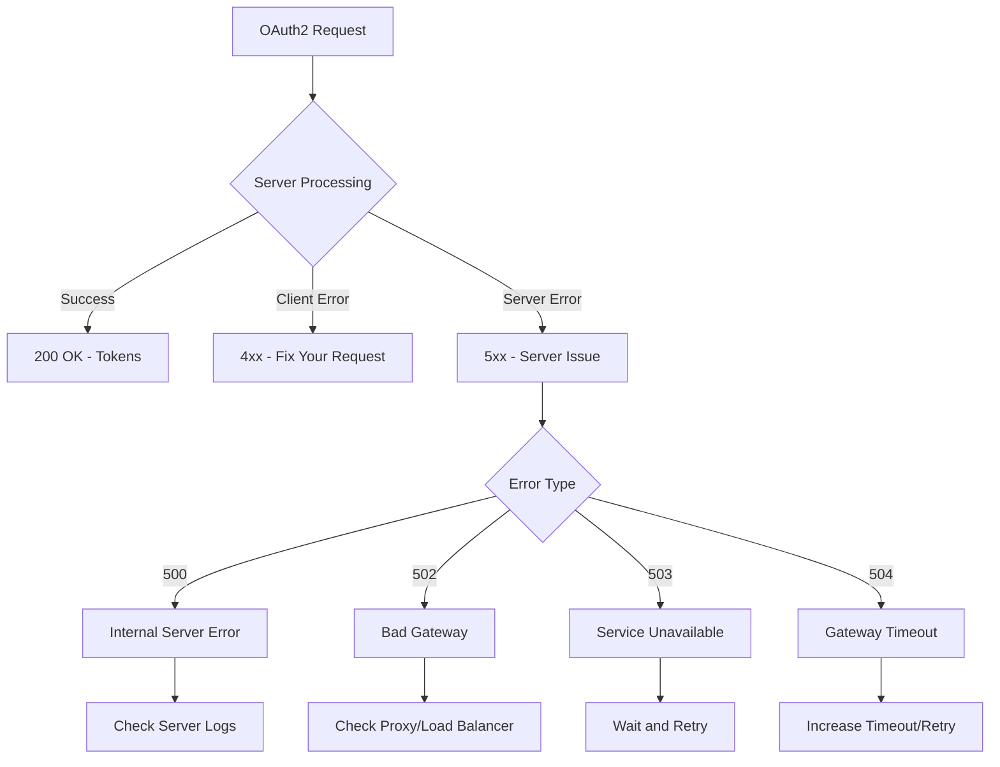
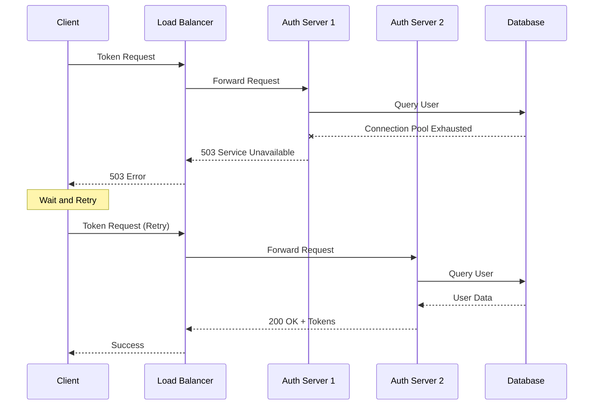

# How to Fix "Server Error" OAuth2 Errors

Author: [nawazdhandala](https://www.github.com/nawazdhandala)

Tags: OAuth2, Authentication, Troubleshooting, Server Error, API, Authorization, Debugging

Description: A practical guide to diagnosing and resolving OAuth2 server errors (5xx), including identification of root causes, debugging strategies, and implementation of retry logic with exponential backoff.

---

OAuth2 server errors (HTTP 5xx status codes) indicate problems on the authorization server side. Unlike client errors (4xx), these are typically transient issues that may resolve themselves. This guide covers how to identify, debug, and handle server errors gracefully.

## Understanding OAuth2 Server Errors



### Common Server Error Response

```json
{
  "error": "server_error",
  "error_description": "The authorization server encountered an unexpected condition that prevented it from fulfilling the request."
}
```

## Root Cause 1: Authorization Server Overload

High traffic or resource exhaustion can cause temporary failures.



### Implementing Retry Logic

```javascript
class OAuth2ClientWithRetry {
    constructor(config) {
        this.config = config;
        this.maxRetries = config.maxRetries || 3;
        this.baseDelay = config.baseDelay || 1000;
        this.maxDelay = config.maxDelay || 30000;
    }

    async exchangeCodeForToken(code, codeVerifier) {
        return this.withRetry(() => this.tokenRequest({
            grant_type: 'authorization_code',
            code,
            code_verifier: codeVerifier,
            redirect_uri: this.config.redirectUri,
            client_id: this.config.clientId,
        }));
    }

    async tokenRequest(params) {
        const response = await fetch(this.config.tokenEndpoint, {
            method: 'POST',
            headers: {
                'Content-Type': 'application/x-www-form-urlencoded',
            },
            body: new URLSearchParams(params).toString(),
        });

        if (!response.ok) {
            const error = await response.json().catch(() => ({}));
            const err = new Error(error.error_description || error.error || 'Token request failed');
            err.status = response.status;
            err.error = error.error;
            throw err;
        }

        return response.json();
    }

    async withRetry(operation) {
        let lastError;

        for (let attempt = 0; attempt < this.maxRetries; attempt++) {
            try {
                return await operation();
            } catch (error) {
                lastError = error;

                // Only retry on server errors (5xx) or network errors
                if (!this.isRetryable(error)) {
                    throw error;
                }

                // Calculate delay with exponential backoff and jitter
                const delay = this.calculateDelay(attempt);
                console.log(`Attempt ${attempt + 1} failed, retrying in ${delay}ms...`);

                await this.sleep(delay);
            }
        }

        throw lastError;
    }

    isRetryable(error) {
        // Retry on network errors
        if (error.name === 'TypeError' && error.message.includes('fetch')) {
            return true;
        }

        // Retry on 5xx server errors
        if (error.status >= 500 && error.status < 600) {
            return true;
        }

        // Retry on specific error codes
        if (error.error === 'temporarily_unavailable') {
            return true;
        }

        return false;
    }

    calculateDelay(attempt) {
        // Exponential backoff: 1s, 2s, 4s, 8s...
        const exponentialDelay = this.baseDelay * Math.pow(2, attempt);

        // Add jitter (0-25% of delay)
        const jitter = exponentialDelay * 0.25 * Math.random();

        // Cap at max delay
        return Math.min(exponentialDelay + jitter, this.maxDelay);
    }

    sleep(ms) {
        return new Promise(resolve => setTimeout(resolve, ms));
    }
}

// Usage
const oauth = new OAuth2ClientWithRetry({
    tokenEndpoint: 'https://auth.example.com/oauth/token',
    clientId: 'your-client-id',
    redirectUri: 'https://app.com/callback',
    maxRetries: 3,
    baseDelay: 1000,
    maxDelay: 30000,
});
```

## Root Cause 2: Database Connection Issues

Authorization servers rely on databases for user data and session storage.

```javascript
// Server-side debugging (if you control the auth server)
// Check database connectivity

const { Pool } = require('pg');

class AuthServerHealthCheck {
    constructor(pool) {
        this.pool = pool;
    }

    async checkDatabase() {
        const startTime = Date.now();
        try {
            const client = await this.pool.connect();
            try {
                await client.query('SELECT 1');
                return {
                    healthy: true,
                    latency: Date.now() - startTime,
                };
            } finally {
                client.release();
            }
        } catch (error) {
            return {
                healthy: false,
                error: error.message,
                latency: Date.now() - startTime,
            };
        }
    }
}

// Health endpoint
app.get('/health', async (req, res) => {
    const healthCheck = new AuthServerHealthCheck(pool);
    const dbHealth = await healthCheck.checkDatabase();

    const isHealthy = dbHealth.healthy;

    res.status(isHealthy ? 200 : 503).json({
        status: isHealthy ? 'healthy' : 'unhealthy',
        database: dbHealth,
    });
});
```

## Root Cause 3: Circuit Breaker Pattern

```javascript
class CircuitBreaker {
    constructor(options = {}) {
        this.failureThreshold = options.failureThreshold || 5;
        this.resetTimeout = options.resetTimeout || 30000;
        this.state = 'CLOSED';
        this.failureCount = 0;
        this.lastFailureTime = null;
        this.nextAttemptTime = null;
    }

    async execute(operation) {
        if (this.state === 'OPEN') {
            if (Date.now() >= this.nextAttemptTime) {
                this.state = 'HALF_OPEN';
            } else {
                throw new Error('Circuit breaker is OPEN');
            }
        }

        try {
            const result = await operation();
            this.onSuccess();
            return result;
        } catch (error) {
            this.onFailure();
            throw error;
        }
    }

    onSuccess() {
        this.failureCount = 0;
        this.state = 'CLOSED';
    }

    onFailure() {
        this.failureCount++;
        this.lastFailureTime = Date.now();

        if (this.failureCount >= this.failureThreshold) {
            this.state = 'OPEN';
            this.nextAttemptTime = Date.now() + this.resetTimeout;
        }
    }

    getState() {
        return {
            state: this.state,
            failureCount: this.failureCount,
            nextAttemptTime: this.nextAttemptTime,
        };
    }
}
```

## Comprehensive Error Handler

```javascript
class OAuth2ErrorHandler {
    static handle(error, context = {}) {
        const result = {
            recoverable: false,
            action: 'none',
            message: error.message,
            userMessage: 'An error occurred during authentication.',
        };

        // Server errors (5xx)
        if (error.status >= 500 && error.status < 600) {
            result.recoverable = true;
            result.action = 'retry';
            result.userMessage = 'Authentication service is temporarily unavailable. Please try again.';

            switch (error.status) {
                case 500:
                    result.details = 'Internal server error';
                    break;
                case 502:
                    result.details = 'Bad gateway - check proxy configuration';
                    break;
                case 503:
                    result.details = 'Service unavailable - server may be overloaded';
                    result.retryAfter = 30000;
                    break;
                case 504:
                    result.details = 'Gateway timeout - request took too long';
                    result.retryAfter = 10000;
                    break;
            }
        }

        // OAuth2 specific errors
        if (error.error) {
            switch (error.error) {
                case 'server_error':
                    result.recoverable = true;
                    result.action = 'retry';
                    result.userMessage = 'Authentication service encountered an error. Please try again.';
                    break;

                case 'temporarily_unavailable':
                    result.recoverable = true;
                    result.action = 'retry';
                    result.retryAfter = 60000;
                    result.userMessage = 'Authentication service is temporarily unavailable.';
                    break;
            }
        }

        // Log for debugging
        console.error('OAuth2 Error:', {
            ...result,
            originalError: error,
            context,
        });

        return result;
    }
}
```

## Summary

OAuth2 server errors require different handling than client errors:

1. Implement retry logic with exponential backoff for transient failures
2. Use circuit breakers to prevent cascading failures
3. Distinguish between recoverable and non-recoverable errors
4. Monitor error rates to detect systemic issues
5. Provide clear user feedback with appropriate recovery actions

Server errors are often temporary. A well-designed retry strategy handles most cases automatically without user intervention.
