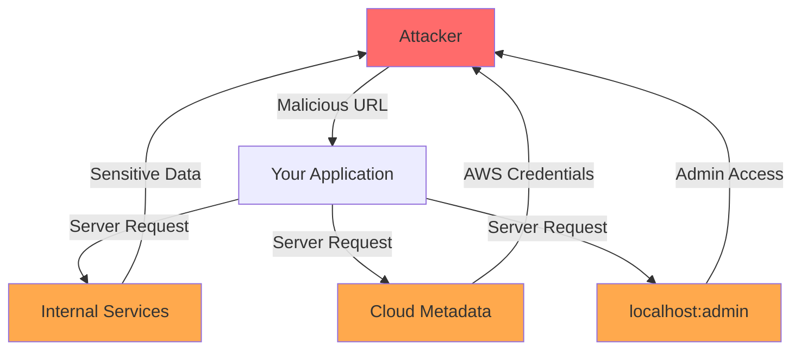

# How to Fix 'Server-Side Request Forgery (SSRF)'

Author: [nawazdhandala](https://www.github.com/nawazdhandala)

Tags: Security, SSRF, API Security, OWASP, Input Validation

Description: Learn how to identify and fix Server-Side Request Forgery vulnerabilities that allow attackers to make requests from your server to internal resources.

---

Server-Side Request Forgery (SSRF) occurs when an attacker can make your server send requests to unintended destinations. This vulnerability can expose internal services, cloud metadata endpoints, and enable attacks against systems behind your firewall. SSRF has been responsible for major breaches including the 2019 Capital One incident.

## Understanding SSRF



## Common SSRF Attack Vectors

### Vulnerable Code Example

```javascript
// VULNERABLE - Never do this
app.get('/fetch-url', async (req, res) => {
    const { url } = req.query;

    // Attacker can provide any URL including:
    // - http://169.254.169.254/latest/meta-data/iam/security-credentials/
    // - http://localhost:6379/ (Redis)
    // - http://internal-api.corp/admin
    // - file:///etc/passwd

    const response = await fetch(url);
    const data = await response.text();
    res.send(data);
});
```

### Attack Payloads

```
# AWS metadata (most common SSRF target)
http://169.254.169.254/latest/meta-data/iam/security-credentials/

# GCP metadata
http://metadata.google.internal/computeMetadata/v1/

# Azure metadata
http://169.254.169.254/metadata/instance

# Internal services
http://localhost:6379/           # Redis
http://localhost:9200/_cat/indices  # Elasticsearch
http://internal-api:8080/admin

# DNS rebinding
http://attacker-controlled-domain.com/  # Resolves to internal IP

# URL bypasses
http://127.0.0.1/
http://0.0.0.0/
http://[::1]/
http://127.1/
http://0x7f000001/
http://2130706433/
```

## SSRF Prevention Strategies

### Strategy 1: URL Allowlist Validation

```javascript
// ssrf-protection.js
const { URL } = require('url');
const dns = require('dns').promises;
const ipaddr = require('ipaddr.js');

class SSRFProtection {
    constructor(options = {}) {
        this.allowedHosts = new Set(options.allowedHosts || []);
        this.allowedProtocols = new Set(options.allowedProtocols || ['https:']);
        this.blockPrivateIPs = options.blockPrivateIPs !== false;
        this.blockMetadataIPs = options.blockMetadataIPs !== false;
        this.maxRedirects = options.maxRedirects || 0;
    }

    async validateUrl(urlString) {
        let parsedUrl;

        try {
            parsedUrl = new URL(urlString);
        } catch (error) {
            throw new Error('Invalid URL format');
        }

        // Check protocol
        if (!this.allowedProtocols.has(parsedUrl.protocol)) {
            throw new Error(`Protocol ${parsedUrl.protocol} is not allowed`);
        }

        // Check against allowlist if configured
        if (this.allowedHosts.size > 0 && !this.allowedHosts.has(parsedUrl.hostname)) {
            throw new Error(`Host ${parsedUrl.hostname} is not in allowlist`);
        }

        // Resolve hostname to IP
        const ips = await this.resolveHostname(parsedUrl.hostname);

        // Validate all resolved IPs
        for (const ip of ips) {
            this.validateIP(ip);
        }

        return {
            url: parsedUrl,
            resolvedIPs: ips
        };
    }

    async resolveHostname(hostname) {
        // Check if hostname is already an IP
        if (ipaddr.isValid(hostname)) {
            return [hostname];
        }

        try {
            const addresses = await dns.resolve(hostname);
            return addresses;
        } catch (error) {
            throw new Error(`Unable to resolve hostname: ${hostname}`);
        }
    }

    validateIP(ipString) {
        let addr;

        try {
            addr = ipaddr.parse(ipString);
        } catch (error) {
            throw new Error(`Invalid IP address: ${ipString}`);
        }

        // Block metadata service IPs
        if (this.blockMetadataIPs) {
            const metadataIPs = [
                '169.254.169.254',  // AWS, Azure
                '169.254.170.2',    // AWS ECS
                '100.100.100.200',  // Alibaba Cloud
            ];

            if (metadataIPs.includes(ipString)) {
                throw new Error('Access to cloud metadata service is blocked');
            }
        }

        // Block private and reserved IP ranges
        if (this.blockPrivateIPs) {
            const range = addr.range();
            const blockedRanges = [
                'private',
                'loopback',
                'linkLocal',
                'uniqueLocal',
                'unspecified',
                'reserved'
            ];

            if (blockedRanges.includes(range)) {
                throw new Error(`Access to ${range} IP range is blocked`);
            }
        }
    }
}

module.exports = SSRFProtection;
```

### Strategy 2: Safe URL Fetcher

```javascript
// safe-fetcher.js
const SSRFProtection = require('./ssrf-protection');
const https = require('https');
const http = require('http');

class SafeFetcher {
    constructor(options = {}) {
        this.protection = new SSRFProtection(options);
        this.timeout = options.timeout || 10000;
        this.maxResponseSize = options.maxResponseSize || 10 * 1024 * 1024; // 10MB
    }

    async fetch(urlString, options = {}) {
        // Validate URL before making request
        const { url, resolvedIPs } = await this.protection.validateUrl(urlString);

        return new Promise((resolve, reject) => {
            const protocol = url.protocol === 'https:' ? https : http;

            const requestOptions = {
                hostname: url.hostname,
                port: url.port || (url.protocol === 'https:' ? 443 : 80),
                path: url.pathname + url.search,
                method: options.method || 'GET',
                headers: options.headers || {},
                timeout: this.timeout,
                // Force resolved IP to prevent DNS rebinding
                lookup: (hostname, opts, callback) => {
                    callback(null, resolvedIPs[0], 4);
                }
            };

            const req = protocol.request(requestOptions, (res) => {
                // Block redirects to prevent redirect-based SSRF
                if (res.statusCode >= 300 && res.statusCode < 400) {
                    reject(new Error('Redirects are not allowed'));
                    return;
                }

                let data = [];
                let size = 0;

                res.on('data', (chunk) => {
                    size += chunk.length;
                    if (size > this.maxResponseSize) {
                        req.destroy();
                        reject(new Error('Response too large'));
                        return;
                    }
                    data.push(chunk);
                });

                res.on('end', () => {
                    resolve({
                        status: res.statusCode,
                        headers: res.headers,
                        body: Buffer.concat(data)
                    });
                });
            });

            req.on('timeout', () => {
                req.destroy();
                reject(new Error('Request timeout'));
            });

            req.on('error', reject);
            req.end();
        });
    }
}

// Usage
const fetcher = new SafeFetcher({
    allowedHosts: ['api.github.com', 'api.example.com'],
    allowedProtocols: ['https:'],
    blockPrivateIPs: true,
    blockMetadataIPs: true,
    timeout: 5000
});

app.get('/fetch-url', async (req, res) => {
    try {
        const result = await fetcher.fetch(req.query.url);
        res.send(result.body);
    } catch (error) {
        res.status(400).json({ error: error.message });
    }
});
```

### Strategy 3: Network-Level Protection

```yaml
# Kubernetes NetworkPolicy to block egress to metadata
apiVersion: networking.k8s.io/v1
kind: NetworkPolicy
metadata:
  name: block-metadata-egress
spec:
  podSelector: {}
  policyTypes:
    - Egress
  egress:
    - to:
        - ipBlock:
            cidr: 0.0.0.0/0
            except:
              - 169.254.169.254/32  # AWS/Azure metadata
              - 169.254.170.2/32    # AWS ECS metadata
              - 10.0.0.0/8          # Private range
              - 172.16.0.0/12       # Private range
              - 192.168.0.0/16      # Private range
```

### Strategy 4: AWS IMDSv2 Configuration

If you use AWS, require IMDSv2 which prevents SSRF attacks:

```bash
# Require IMDSv2 for EC2 instance
aws ec2 modify-instance-metadata-options \
    --instance-id i-1234567890abcdef0 \
    --http-tokens required \
    --http-endpoint enabled
```

```javascript
// IMDSv2 requires a token obtained via PUT request
// SSRF attacks typically can only make GET requests

// This fails with IMDSv2:
// GET http://169.254.169.254/latest/meta-data/

// IMDSv2 requires:
// 1. PUT http://169.254.169.254/latest/api/token (to get token)
// 2. GET with X-aws-ec2-metadata-token header
```

## SSRF in Different Contexts

### Webhook URL Validation

```javascript
// webhook-validator.js
const SSRFProtection = require('./ssrf-protection');

class WebhookValidator {
    constructor() {
        this.protection = new SSRFProtection({
            allowedProtocols: ['https:'],
            blockPrivateIPs: true,
            blockMetadataIPs: true
        });
    }

    async validate(webhookUrl) {
        // Basic URL validation
        await this.protection.validateUrl(webhookUrl);

        // Additional webhook-specific checks
        const url = new URL(webhookUrl);

        // Block common problematic ports
        const blockedPorts = [22, 23, 25, 445, 3389, 6379, 27017];
        if (url.port && blockedPorts.includes(parseInt(url.port))) {
            throw new Error(`Port ${url.port} is not allowed for webhooks`);
        }

        // Require HTTPS
        if (url.protocol !== 'https:') {
            throw new Error('Webhooks must use HTTPS');
        }

        return true;
    }

    async testWebhook(webhookUrl) {
        await this.validate(webhookUrl);

        // Send test request with verification token
        const verificationToken = crypto.randomBytes(32).toString('hex');

        // Store token and URL for verification callback
        await storeVerificationToken(webhookUrl, verificationToken);

        // Send verification request
        await safeFetcher.fetch(webhookUrl, {
            method: 'POST',
            headers: { 'Content-Type': 'application/json' },
            body: JSON.stringify({
                type: 'verification',
                token: verificationToken
            })
        });
    }
}
```

### Image/File Download Protection

```javascript
// image-downloader.js
class SafeImageDownloader {
    constructor() {
        this.protection = new SSRFProtection({
            allowedProtocols: ['https:', 'http:'],
            blockPrivateIPs: true
        });
        this.allowedContentTypes = [
            'image/jpeg',
            'image/png',
            'image/gif',
            'image/webp'
        ];
        this.maxSize = 5 * 1024 * 1024; // 5MB
    }

    async download(imageUrl) {
        await this.protection.validateUrl(imageUrl);

        const response = await fetch(imageUrl, {
            method: 'HEAD',
            timeout: 5000
        });

        // Validate content type
        const contentType = response.headers.get('content-type');
        if (!this.allowedContentTypes.some(t => contentType.startsWith(t))) {
            throw new Error('Invalid content type');
        }

        // Validate size
        const contentLength = parseInt(response.headers.get('content-length') || '0');
        if (contentLength > this.maxSize) {
            throw new Error('Image too large');
        }

        // Now safe to download
        const imageResponse = await fetch(imageUrl);
        return imageResponse.buffer();
    }
}
```

## SSRF Prevention Checklist

| Check | Implementation |
|-------|----------------|
| URL allowlisting | Only allow specific trusted domains |
| Protocol restriction | Limit to https:// only |
| IP validation | Block private, loopback, and metadata IPs |
| DNS rebinding prevention | Validate IPs after DNS resolution |
| Redirect blocking | Disable or validate redirect destinations |
| Response validation | Limit size and content type |
| Network segmentation | Isolate backend services |
| Cloud metadata protection | Use IMDSv2, network policies |
| Timeout limits | Prevent slowloris-style attacks |
| Logging and monitoring | Log all external requests |

## Testing for SSRF

```javascript
// ssrf-test.js - For security testing only
const testPayloads = [
    // Cloud metadata
    'http://169.254.169.254/latest/meta-data/',
    'http://metadata.google.internal/',

    // Localhost variations
    'http://127.0.0.1/',
    'http://localhost/',
    'http://[::1]/',
    'http://127.1/',
    'http://0.0.0.0/',

    // Decimal and hex IP encoding
    'http://2130706433/',  // 127.0.0.1 in decimal
    'http://0x7f000001/',  // 127.0.0.1 in hex

    // URL encoding
    'http://127.0.0.1%00@evil.com/',

    // DNS rebinding
    'http://your-dns-rebinding-domain.com/'
];

async function testSSRFProtection(fetchFunction) {
    for (const payload of testPayloads) {
        try {
            await fetchFunction(payload);
            console.log(`VULNERABLE: ${payload}`);
        } catch (error) {
            console.log(`Protected: ${payload} - ${error.message}`);
        }
    }
}
```

## Summary

SSRF is a critical vulnerability that can expose internal services and cloud credentials. Protect against it by implementing URL allowlisting, validating resolved IP addresses, blocking private and metadata IPs, and using network-level controls. Always validate URLs on the server side and never trust user input. For cloud environments, use IMDSv2 and network policies as additional layers of defense.
