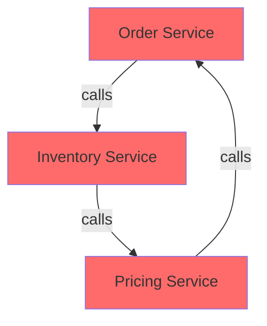
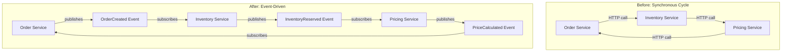
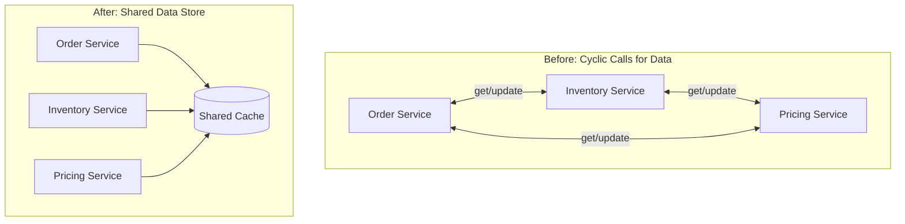
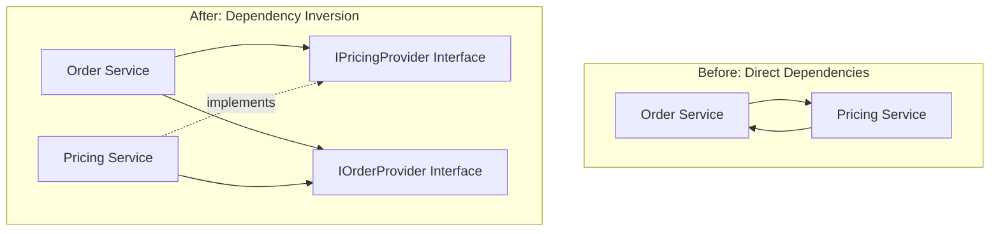
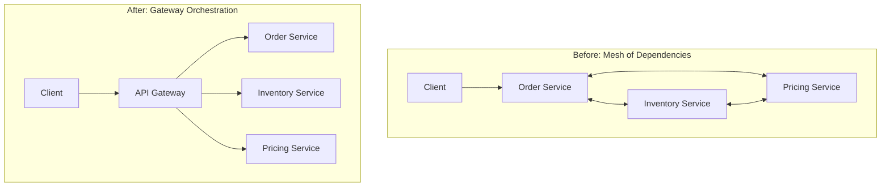
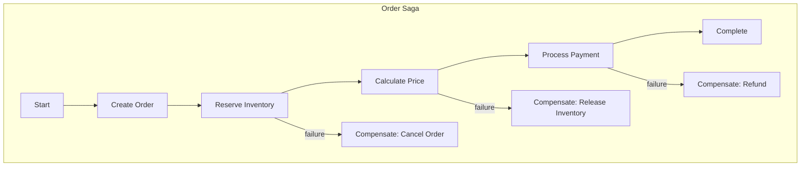

# How to Fix "Service Dependency" Cycle Issues

Author: [nawazdhandala](https://www.github.com/nawazdhandala)

Tags: Microservices, Service Dependencies, Circular Dependencies, Architecture, Design Patterns, Dependency Management, Software Engineering

Description: A practical guide to detecting, understanding, and resolving circular service dependency cycles in microservices architectures with proven patterns and techniques.

---

> Circular dependencies between services create tight coupling, deployment nightmares, and cascading failures. This guide shows you how to identify dependency cycles and refactor them using proven architectural patterns.

Service dependency cycles occur when Service A depends on Service B, which depends on Service C, which depends back on Service A. These cycles create brittle systems that are difficult to deploy, test, and maintain.

---

## Understanding Dependency Cycles

A dependency cycle creates a closed loop where services cannot function independently:



This creates several problems:

- **Deployment complexity**: You cannot deploy services independently
- **Testing difficulty**: Unit testing requires mocking the entire cycle
- **Cascading failures**: One service failure brings down the entire cycle
- **Startup ordering**: Services cannot start without each other

---

## Detecting Dependency Cycles

### Dependency Graph Analysis

Build a dependency graph from your service configurations and analyze it for cycles:

```python
# dependency_analyzer.py
from collections import defaultdict
from typing import Dict, List, Set, Tuple

class DependencyAnalyzer:
    """Analyzes service dependencies to detect cycles"""

    def __init__(self):
        # Adjacency list representation of the dependency graph
        self.graph: Dict[str, List[str]] = defaultdict(list)

    def add_dependency(self, service: str, depends_on: str):
        """Add a dependency relationship: service depends on depends_on"""
        self.graph[service].append(depends_on)
        # Ensure the dependent service exists in graph
        if depends_on not in self.graph:
            self.graph[depends_on] = []

    def find_all_cycles(self) -> List[List[str]]:
        """Find all cycles in the dependency graph using DFS"""
        cycles = []
        visited = set()
        rec_stack = []  # Current recursion path
        rec_set = set()  # Fast lookup for recursion stack

        def dfs(node: str) -> None:
            visited.add(node)
            rec_stack.append(node)
            rec_set.add(node)

            for neighbor in self.graph[node]:
                if neighbor not in visited:
                    dfs(neighbor)
                elif neighbor in rec_set:
                    # Found a cycle - extract it
                    cycle_start = rec_stack.index(neighbor)
                    cycle = rec_stack[cycle_start:] + [neighbor]
                    cycles.append(cycle)

            rec_stack.pop()
            rec_set.remove(node)

        # Run DFS from each unvisited node
        for node in list(self.graph.keys()):
            if node not in visited:
                dfs(node)

        return cycles

    def get_dependency_depth(self, service: str) -> Dict[str, int]:
        """Calculate the depth of each dependency from a service"""
        depths = {service: 0}
        queue = [service]

        while queue:
            current = queue.pop(0)
            current_depth = depths[current]

            for dep in self.graph[current]:
                if dep not in depths:
                    depths[dep] = current_depth + 1
                    queue.append(dep)

        return depths


# Example usage
analyzer = DependencyAnalyzer()

# Add service dependencies from configuration
dependencies = [
    ("order-service", "inventory-service"),
    ("order-service", "user-service"),
    ("inventory-service", "pricing-service"),
    ("pricing-service", "order-service"),  # Creates a cycle
    ("user-service", "auth-service"),
    ("payment-service", "order-service"),
]

for service, depends_on in dependencies:
    analyzer.add_dependency(service, depends_on)

# Find cycles
cycles = analyzer.find_all_cycles()

if cycles:
    print("Dependency cycles detected:")
    for cycle in cycles:
        print(f"  {' -> '.join(cycle)}")
else:
    print("No dependency cycles found")
```

### Runtime Detection with OpenTelemetry

Detect cycles at runtime by analyzing trace data:

```python
# cycle_detector_middleware.py
from opentelemetry import trace
from opentelemetry.propagate import extract, inject
from collections import defaultdict
import json

tracer = trace.get_tracer(__name__)

class CycleDetectorMiddleware:
    """Middleware that detects service call cycles at runtime"""

    def __init__(self, service_name: str):
        self.service_name = service_name

    def extract_call_chain(self, headers: dict) -> list:
        """Extract the service call chain from headers"""
        chain_header = headers.get("x-service-call-chain", "[]")
        try:
            return json.loads(chain_header)
        except json.JSONDecodeError:
            return []

    def check_for_cycle(self, call_chain: list) -> bool:
        """Check if adding current service creates a cycle"""
        return self.service_name in call_chain

    async def __call__(self, request, call_next):
        # Extract call chain from incoming request
        call_chain = self.extract_call_chain(dict(request.headers))

        # Check for cycle
        if self.check_for_cycle(call_chain):
            with tracer.start_as_current_span("cycle_detected") as span:
                span.set_attribute("cycle.detected", True)
                span.set_attribute("cycle.chain", json.dumps(call_chain + [self.service_name]))

                # Log the cycle for analysis
                print(f"CYCLE DETECTED: {' -> '.join(call_chain)} -> {self.service_name}")

                # You can either:
                # 1. Return an error to break the cycle
                # 2. Allow it but log for later analysis
                # 3. Implement circuit breaker behavior

        # Add current service to chain for downstream calls
        call_chain.append(self.service_name)

        # Store for outgoing requests
        request.state.call_chain = call_chain

        response = await call_next(request)
        return response


def inject_call_chain(headers: dict, call_chain: list):
    """Inject call chain into outgoing request headers"""
    headers["x-service-call-chain"] = json.dumps(call_chain)
```

---

## Pattern 1: Event-Driven Decoupling

Replace synchronous calls with asynchronous events to break cycles:



### Implementation

```python
# events.py
from dataclasses import dataclass, asdict
from datetime import datetime
from typing import Optional
import json

@dataclass
class Event:
    """Base event class"""
    event_id: str
    event_type: str
    timestamp: str
    correlation_id: str

    def to_json(self) -> str:
        return json.dumps(asdict(self))

    @classmethod
    def from_json(cls, data: str):
        return cls(**json.loads(data))


@dataclass
class OrderCreatedEvent(Event):
    """Published when a new order is created"""
    order_id: str
    customer_id: str
    items: list

    def __init__(self, order_id: str, customer_id: str, items: list,
                 correlation_id: str, event_id: str = None):
        super().__init__(
            event_id=event_id or f"evt-{order_id}",
            event_type="order.created",
            timestamp=datetime.utcnow().isoformat(),
            correlation_id=correlation_id
        )
        self.order_id = order_id
        self.customer_id = customer_id
        self.items = items


@dataclass
class InventoryReservedEvent(Event):
    """Published when inventory is reserved for an order"""
    order_id: str
    reserved_items: list
    warehouse_id: str


@dataclass
class PriceCalculatedEvent(Event):
    """Published when pricing is calculated"""
    order_id: str
    total_price: float
    currency: str
    discounts_applied: list
```

```python
# order_service.py
import redis
import json
from opentelemetry import trace
from opentelemetry.propagate import inject

tracer = trace.get_tracer(__name__)
redis_client = redis.Redis(host='localhost', port=6379)

class OrderService:
    """Order service using event-driven architecture"""

    def __init__(self):
        self.pubsub = redis_client.pubsub()

    def create_order(self, customer_id: str, items: list) -> dict:
        """Create order and publish event instead of calling services directly"""

        with tracer.start_as_current_span("create_order") as span:
            order_id = generate_order_id()
            correlation_id = span.get_span_context().trace_id

            span.set_attribute("order.id", order_id)
            span.set_attribute("customer.id", customer_id)

            # Save order in pending state
            order = {
                "order_id": order_id,
                "customer_id": customer_id,
                "items": items,
                "status": "pending_inventory",
                "correlation_id": str(correlation_id)
            }

            with tracer.start_as_current_span("save_order"):
                save_order_to_db(order)

            # Publish event instead of calling inventory service directly
            with tracer.start_as_current_span("publish_order_created"):
                event = OrderCreatedEvent(
                    order_id=order_id,
                    customer_id=customer_id,
                    items=items,
                    correlation_id=str(correlation_id)
                )

                # Include trace context in event for distributed tracing
                carrier = {}
                inject(carrier)

                message = {
                    "event": event.to_json(),
                    "trace_context": carrier
                }

                redis_client.publish("order.events", json.dumps(message))

            return {"order_id": order_id, "status": "processing"}

    def handle_price_calculated(self, event: PriceCalculatedEvent):
        """Handle price calculation completion - no cycle needed"""

        with tracer.start_as_current_span("handle_price_calculated") as span:
            span.set_attribute("order.id", event.order_id)
            span.set_attribute("price.total", event.total_price)

            # Update order with final price
            update_order_price(event.order_id, event.total_price)

            # Order is now ready for payment
            update_order_status(event.order_id, "ready_for_payment")
```

```python
# inventory_service.py
import redis
import json
from opentelemetry import trace
from opentelemetry.propagate import extract

tracer = trace.get_tracer(__name__)
redis_client = redis.Redis(host='localhost', port=6379)

class InventoryService:
    """Inventory service that reacts to events"""

    def __init__(self):
        self.pubsub = redis_client.pubsub()
        self.pubsub.subscribe("order.events")

    def start_listening(self):
        """Listen for order events"""
        for message in self.pubsub.listen():
            if message["type"] == "message":
                self.handle_message(message["data"])

    def handle_message(self, data: bytes):
        """Process incoming messages"""
        message = json.loads(data)
        event_data = json.loads(message["event"])
        trace_context = message.get("trace_context", {})

        # Continue the trace from the original request
        parent_context = extract(trace_context)

        if event_data["event_type"] == "order.created":
            self.handle_order_created(event_data, parent_context)

    def handle_order_created(self, event_data: dict, parent_context):
        """Reserve inventory when order is created"""

        with tracer.start_as_current_span(
            "handle_order_created",
            context=parent_context
        ) as span:
            order_id = event_data["order_id"]
            items = event_data["items"]

            span.set_attribute("order.id", order_id)

            # Reserve inventory
            with tracer.start_as_current_span("reserve_inventory"):
                reserved = []
                for item in items:
                    if reserve_item(item["sku"], item["quantity"]):
                        reserved.append(item)

            # Publish inventory reserved event
            # Pricing service will pick this up
            event = InventoryReservedEvent(
                event_id=f"evt-inv-{order_id}",
                event_type="inventory.reserved",
                timestamp=datetime.utcnow().isoformat(),
                correlation_id=event_data["correlation_id"],
                order_id=order_id,
                reserved_items=reserved,
                warehouse_id="warehouse-1"
            )

            carrier = {}
            inject(carrier)

            redis_client.publish("inventory.events", json.dumps({
                "event": event.to_json(),
                "trace_context": carrier
            }))
```

---

## Pattern 2: Shared Data Store

Extract shared state into a common data store to eliminate cross-service calls:



### Implementation

```python
# shared_state.py
import redis
import json
from typing import Optional, Any
from opentelemetry import trace

tracer = trace.get_tracer(__name__)

class SharedStateStore:
    """Shared state store that eliminates cross-service calls"""

    def __init__(self, redis_client: redis.Redis):
        self.redis = redis_client
        self.default_ttl = 3600  # 1 hour

    def get_order_context(self, order_id: str) -> Optional[dict]:
        """Get complete order context needed by all services"""

        with tracer.start_as_current_span("get_order_context") as span:
            span.set_attribute("order.id", order_id)

            data = self.redis.get(f"order:context:{order_id}")
            if data:
                return json.loads(data)
            return None

    def update_order_context(self, order_id: str, updates: dict) -> dict:
        """Update order context atomically"""

        with tracer.start_as_current_span("update_order_context") as span:
            span.set_attribute("order.id", order_id)

            # Use Redis transaction for atomic update
            pipe = self.redis.pipeline()

            key = f"order:context:{order_id}"

            # Get current state
            current = self.redis.get(key)
            context = json.loads(current) if current else {}

            # Merge updates
            context.update(updates)
            context["last_updated"] = datetime.utcnow().isoformat()

            # Save atomically
            pipe.set(key, json.dumps(context))
            pipe.expire(key, self.default_ttl)
            pipe.execute()

            return context

    def get_pricing_data(self, sku: str) -> Optional[dict]:
        """Get pricing data without calling pricing service"""

        data = self.redis.get(f"pricing:{sku}")
        if data:
            return json.loads(data)
        return None

    def get_inventory_data(self, sku: str) -> Optional[dict]:
        """Get inventory data without calling inventory service"""

        data = self.redis.get(f"inventory:{sku}")
        if data:
            return json.loads(data)
        return None


# Usage in services
shared_state = SharedStateStore(redis.Redis())

class OrderServiceWithSharedState:
    """Order service using shared state instead of direct calls"""

    def __init__(self):
        self.state = shared_state

    def create_order(self, customer_id: str, items: list) -> dict:
        with tracer.start_as_current_span("create_order") as span:
            order_id = generate_order_id()

            # Get pricing and inventory from shared store
            # No need to call other services
            enriched_items = []
            total_price = 0

            for item in items:
                pricing = self.state.get_pricing_data(item["sku"])
                inventory = self.state.get_inventory_data(item["sku"])

                if pricing and inventory:
                    item_price = pricing["price"] * item["quantity"]
                    enriched_items.append({
                        **item,
                        "unit_price": pricing["price"],
                        "total_price": item_price,
                        "available_quantity": inventory["available"]
                    })
                    total_price += item_price

            # Create order context for other services
            self.state.update_order_context(order_id, {
                "order_id": order_id,
                "customer_id": customer_id,
                "items": enriched_items,
                "total_price": total_price,
                "status": "created"
            })

            return {"order_id": order_id, "total": total_price}
```

---

## Pattern 3: Dependency Inversion with Interfaces

Introduce abstraction layers to invert dependencies:



### Implementation

```python
# interfaces.py
from abc import ABC, abstractmethod
from typing import List, Optional

class IPricingProvider(ABC):
    """Interface for pricing operations"""

    @abstractmethod
    def get_price(self, sku: str) -> float:
        pass

    @abstractmethod
    def calculate_discount(self, items: List[dict], customer_id: str) -> float:
        pass


class IOrderDataProvider(ABC):
    """Interface for order data access"""

    @abstractmethod
    def get_order(self, order_id: str) -> Optional[dict]:
        pass

    @abstractmethod
    def get_customer_order_history(self, customer_id: str) -> List[dict]:
        pass


class IInventoryProvider(ABC):
    """Interface for inventory operations"""

    @abstractmethod
    def check_availability(self, sku: str, quantity: int) -> bool:
        pass

    @abstractmethod
    def reserve(self, sku: str, quantity: int, order_id: str) -> bool:
        pass
```

```python
# order_service_refactored.py
from interfaces import IPricingProvider, IInventoryProvider
from opentelemetry import trace

tracer = trace.get_tracer(__name__)

class OrderService:
    """Order service with injected dependencies - no cycles possible"""

    def __init__(
        self,
        pricing_provider: IPricingProvider,
        inventory_provider: IInventoryProvider
    ):
        # Dependencies are injected, not created
        self.pricing = pricing_provider
        self.inventory = inventory_provider

    def create_order(self, customer_id: str, items: list) -> dict:
        with tracer.start_as_current_span("create_order") as span:
            order_id = generate_order_id()
            span.set_attribute("order.id", order_id)

            validated_items = []
            total = 0

            for item in items:
                # Use interface - actual implementation is injected
                if self.inventory.check_availability(item["sku"], item["quantity"]):
                    price = self.pricing.get_price(item["sku"])
                    item_total = price * item["quantity"]

                    validated_items.append({
                        **item,
                        "unit_price": price,
                        "total": item_total
                    })
                    total += item_total

            # Apply discounts using interface
            discount = self.pricing.calculate_discount(validated_items, customer_id)
            total -= discount

            # Reserve inventory
            for item in validated_items:
                self.inventory.reserve(item["sku"], item["quantity"], order_id)

            order = {
                "order_id": order_id,
                "items": validated_items,
                "subtotal": total + discount,
                "discount": discount,
                "total": total
            }

            save_order(order)

            return order
```

```python
# pricing_service_refactored.py
from interfaces import IPricingProvider, IOrderDataProvider
from opentelemetry import trace

tracer = trace.get_tracer(__name__)

class PricingService(IPricingProvider):
    """Pricing service that implements interface and uses order data provider"""

    def __init__(self, order_data_provider: IOrderDataProvider):
        # Depends on interface, not concrete OrderService
        self.order_data = order_data_provider

    def get_price(self, sku: str) -> float:
        with tracer.start_as_current_span("get_price") as span:
            span.set_attribute("product.sku", sku)
            return fetch_base_price(sku)

    def calculate_discount(self, items: list, customer_id: str) -> float:
        with tracer.start_as_current_span("calculate_discount") as span:
            # Get order history through interface - not direct call
            history = self.order_data.get_customer_order_history(customer_id)

            # Calculate loyalty discount based on history
            order_count = len(history)

            if order_count > 100:
                discount_rate = 0.15
            elif order_count > 50:
                discount_rate = 0.10
            elif order_count > 10:
                discount_rate = 0.05
            else:
                discount_rate = 0

            total = sum(item["total"] for item in items)
            discount = total * discount_rate

            span.set_attribute("discount.rate", discount_rate)
            span.set_attribute("discount.amount", discount)

            return discount


# Adapter for order data without creating cycle
class OrderDataAdapter(IOrderDataProvider):
    """Adapter that provides order data through shared database"""

    def __init__(self, db_connection):
        self.db = db_connection

    def get_order(self, order_id: str) -> Optional[dict]:
        # Read directly from shared database
        return self.db.query("SELECT * FROM orders WHERE id = ?", order_id)

    def get_customer_order_history(self, customer_id: str) -> list:
        # Read directly from shared database
        return self.db.query(
            "SELECT * FROM orders WHERE customer_id = ? ORDER BY created_at DESC",
            customer_id
        )
```

---

## Pattern 4: API Gateway Orchestration

Move orchestration logic to an API gateway to eliminate service-to-service cycles:



### Implementation

```python
# api_gateway.py
from fastapi import FastAPI, HTTPException
import httpx
from opentelemetry import trace
from opentelemetry.propagate import inject

tracer = trace.get_tracer(__name__)

app = FastAPI()

# Service URLs
SERVICES = {
    "order": "http://order-service:8001",
    "inventory": "http://inventory-service:8002",
    "pricing": "http://pricing-service:8003"
}

class ServiceClient:
    """HTTP client for calling downstream services"""

    def __init__(self, base_url: str):
        self.base_url = base_url

    async def call(self, method: str, path: str, **kwargs) -> dict:
        headers = kwargs.pop("headers", {})
        inject(headers)  # Propagate trace context

        async with httpx.AsyncClient() as client:
            response = await client.request(
                method,
                f"{self.base_url}{path}",
                headers=headers,
                **kwargs
            )
            response.raise_for_status()
            return response.json()


order_client = ServiceClient(SERVICES["order"])
inventory_client = ServiceClient(SERVICES["inventory"])
pricing_client = ServiceClient(SERVICES["pricing"])


@app.post("/api/orders")
async def create_order(request: dict):
    """
    Orchestrate order creation - gateway handles all coordination
    Individual services have no knowledge of each other
    """

    with tracer.start_as_current_span("gateway.create_order") as span:
        customer_id = request["customer_id"]
        items = request["items"]

        span.set_attribute("customer.id", customer_id)
        span.set_attribute("items.count", len(items))

        # Step 1: Check inventory for all items
        with tracer.start_as_current_span("check_inventory"):
            availability = []
            for item in items:
                result = await inventory_client.call(
                    "GET",
                    f"/api/inventory/{item['sku']}"
                )
                availability.append({
                    "sku": item["sku"],
                    "requested": item["quantity"],
                    "available": result["available"],
                    "sufficient": result["available"] >= item["quantity"]
                })

            # Verify all items are available
            unavailable = [a for a in availability if not a["sufficient"]]
            if unavailable:
                raise HTTPException(
                    status_code=400,
                    detail={"error": "insufficient_inventory", "items": unavailable}
                )

        # Step 2: Get pricing for all items
        with tracer.start_as_current_span("get_pricing"):
            priced_items = []
            for item in items:
                pricing = await pricing_client.call(
                    "GET",
                    f"/api/pricing/{item['sku']}",
                    params={"customer_id": customer_id}
                )
                priced_items.append({
                    **item,
                    "unit_price": pricing["price"],
                    "discount": pricing.get("discount", 0),
                    "total": (pricing["price"] - pricing.get("discount", 0)) * item["quantity"]
                })

        # Step 3: Reserve inventory
        with tracer.start_as_current_span("reserve_inventory"):
            for item in items:
                await inventory_client.call(
                    "POST",
                    "/api/inventory/reserve",
                    json={"sku": item["sku"], "quantity": item["quantity"]}
                )

        # Step 4: Create order
        with tracer.start_as_current_span("create_order_record"):
            order = await order_client.call(
                "POST",
                "/api/orders",
                json={
                    "customer_id": customer_id,
                    "items": priced_items,
                    "total": sum(i["total"] for i in priced_items)
                }
            )

        span.set_attribute("order.id", order["order_id"])

        return order
```

---

## Pattern 5: Saga Pattern for Complex Workflows

Use sagas to coordinate multi-service operations without direct dependencies:



### Implementation

```python
# saga.py
from dataclasses import dataclass, field
from typing import Callable, List, Optional
from enum import Enum
import asyncio
from opentelemetry import trace

tracer = trace.get_tracer(__name__)

class SagaStatus(Enum):
    PENDING = "pending"
    RUNNING = "running"
    COMPLETED = "completed"
    COMPENSATING = "compensating"
    FAILED = "failed"


@dataclass
class SagaStep:
    """A single step in a saga with its compensation"""
    name: str
    action: Callable
    compensation: Callable
    result: Optional[dict] = None
    completed: bool = False


@dataclass
class Saga:
    """Saga coordinator that handles distributed transactions"""
    saga_id: str
    steps: List[SagaStep] = field(default_factory=list)
    status: SagaStatus = SagaStatus.PENDING
    context: dict = field(default_factory=dict)

    def add_step(self, name: str, action: Callable, compensation: Callable):
        """Add a step to the saga"""
        self.steps.append(SagaStep(name=name, action=action, compensation=compensation))
        return self

    async def execute(self) -> dict:
        """Execute the saga steps in order"""

        with tracer.start_as_current_span(f"saga.{self.saga_id}") as span:
            self.status = SagaStatus.RUNNING
            span.set_attribute("saga.id", self.saga_id)

            completed_steps = []

            try:
                for step in self.steps:
                    with tracer.start_as_current_span(f"saga.step.{step.name}") as step_span:
                        step_span.set_attribute("step.name", step.name)

                        # Execute the step
                        result = await step.action(self.context)
                        step.result = result
                        step.completed = True
                        completed_steps.append(step)

                        # Update context with step result
                        self.context[step.name] = result

                        step_span.set_attribute("step.status", "completed")

                self.status = SagaStatus.COMPLETED
                span.set_attribute("saga.status", "completed")

                return {"status": "completed", "context": self.context}

            except Exception as e:
                span.record_exception(e)
                span.set_attribute("saga.status", "compensating")

                # Compensation: rollback completed steps in reverse order
                await self._compensate(completed_steps, span)

                self.status = SagaStatus.FAILED
                raise

    async def _compensate(self, completed_steps: List[SagaStep], parent_span):
        """Execute compensation for completed steps in reverse order"""

        self.status = SagaStatus.COMPENSATING

        for step in reversed(completed_steps):
            with tracer.start_as_current_span(f"saga.compensate.{step.name}") as span:
                try:
                    await step.compensation(self.context, step.result)
                    span.set_attribute("compensation.status", "completed")
                except Exception as comp_error:
                    # Log but continue compensating other steps
                    span.record_exception(comp_error)
                    span.set_attribute("compensation.status", "failed")


# Order saga implementation
class OrderSaga:
    """Saga for order creation workflow"""

    def __init__(self, order_service, inventory_service, pricing_service, payment_service):
        self.order_svc = order_service
        self.inventory_svc = inventory_service
        self.pricing_svc = pricing_service
        self.payment_svc = payment_service

    async def create_order(self, customer_id: str, items: list) -> dict:
        """Execute the order creation saga"""

        saga = Saga(saga_id=f"order-{generate_id()}")
        saga.context = {
            "customer_id": customer_id,
            "items": items
        }

        # Step 1: Create order record
        saga.add_step(
            name="create_order",
            action=self._create_order,
            compensation=self._cancel_order
        )

        # Step 2: Reserve inventory
        saga.add_step(
            name="reserve_inventory",
            action=self._reserve_inventory,
            compensation=self._release_inventory
        )

        # Step 3: Calculate pricing
        saga.add_step(
            name="calculate_price",
            action=self._calculate_price,
            compensation=self._void_pricing  # Usually no-op
        )

        # Step 4: Process payment
        saga.add_step(
            name="process_payment",
            action=self._process_payment,
            compensation=self._refund_payment
        )

        return await saga.execute()

    async def _create_order(self, context: dict) -> dict:
        """Create order in pending state"""
        return await self.order_svc.create_pending_order(
            context["customer_id"],
            context["items"]
        )

    async def _cancel_order(self, context: dict, result: dict):
        """Cancel the pending order"""
        await self.order_svc.cancel_order(result["order_id"])

    async def _reserve_inventory(self, context: dict) -> dict:
        """Reserve inventory for order items"""
        order_id = context["create_order"]["order_id"]
        reservations = []

        for item in context["items"]:
            reservation = await self.inventory_svc.reserve(
                sku=item["sku"],
                quantity=item["quantity"],
                order_id=order_id
            )
            reservations.append(reservation)

        return {"reservations": reservations}

    async def _release_inventory(self, context: dict, result: dict):
        """Release inventory reservations"""
        for reservation in result["reservations"]:
            await self.inventory_svc.release(reservation["reservation_id"])

    async def _calculate_price(self, context: dict) -> dict:
        """Calculate final pricing"""
        return await self.pricing_svc.calculate(
            items=context["items"],
            customer_id=context["customer_id"]
        )

    async def _void_pricing(self, context: dict, result: dict):
        """Pricing calculation has no side effects to compensate"""
        pass

    async def _process_payment(self, context: dict) -> dict:
        """Process payment"""
        pricing = context["calculate_price"]
        order_id = context["create_order"]["order_id"]

        return await self.payment_svc.charge(
            order_id=order_id,
            amount=pricing["total"],
            customer_id=context["customer_id"]
        )

    async def _refund_payment(self, context: dict, result: dict):
        """Refund the payment"""
        await self.payment_svc.refund(result["payment_id"])
```

---

## Monitoring for Dependency Issues

Set up alerts to detect emerging dependency problems:

```python
# dependency_metrics.py
from prometheus_client import Counter, Histogram, Gauge
from opentelemetry import trace

tracer = trace.get_tracer(__name__)

# Metrics for dependency monitoring
service_calls = Counter(
    'service_calls_total',
    'Total service-to-service calls',
    ['caller', 'callee', 'method']
)

call_depth = Histogram(
    'service_call_depth',
    'Depth of service call chains',
    ['entry_service'],
    buckets=[1, 2, 3, 4, 5, 6, 7, 8, 9, 10]
)

cycle_detections = Counter(
    'dependency_cycle_detections_total',
    'Number of detected dependency cycles',
    ['cycle_path']
)

active_call_chains = Gauge(
    'active_call_chains',
    'Currently active call chains',
    ['entry_point']
)


class DependencyMonitor:
    """Monitor service dependencies for health issues"""

    def __init__(self, service_name: str):
        self.service_name = service_name

    def record_outgoing_call(self, target_service: str, method: str):
        """Record an outgoing service call"""
        service_calls.labels(
            caller=self.service_name,
            callee=target_service,
            method=method
        ).inc()

    def record_call_chain_depth(self, depth: int, entry_service: str):
        """Record the depth of a call chain"""
        call_depth.labels(entry_service=entry_service).observe(depth)

        # Alert if depth is concerning
        if depth > 5:
            with tracer.start_as_current_span("deep_call_chain_alert") as span:
                span.set_attribute("call_chain.depth", depth)
                span.set_attribute("entry_service", entry_service)

    def record_cycle_detected(self, cycle_path: list):
        """Record a detected dependency cycle"""
        path_str = " -> ".join(cycle_path)
        cycle_detections.labels(cycle_path=path_str).inc()
```

---

## Best Practices Summary

1. **Analyze dependencies regularly**: Run dependency analysis as part of CI/CD
2. **Prefer events over synchronous calls**: Async communication naturally prevents cycles
3. **Use shared data stores**: Avoid calling services just to read data
4. **Invert dependencies with interfaces**: Depend on abstractions, not implementations
5. **Orchestrate at boundaries**: API gateways can coordinate without creating service coupling
6. **Implement sagas for workflows**: Handle multi-service transactions without tight coupling
7. **Monitor dependency patterns**: Track call depths and detect cycles early

---

## Conclusion

Service dependency cycles are architectural debts that compound over time. The key strategies to prevent and resolve them:

- **Event-driven architecture** breaks synchronous cycles
- **Shared data stores** eliminate data-fetching dependencies
- **Dependency inversion** allows services to depend on abstractions
- **Gateway orchestration** moves coordination to the edge
- **Saga pattern** handles workflows without coupling

Address cycles early before they become deeply embedded in your system.

---

*Need visibility into your service dependencies? [OneUptime](https://oneuptime.com) provides service maps, dependency graphs, and alerting to help you identify and resolve architectural issues before they cause outages.*

**Related Reading:**
- [How to Implement Distributed Tracing in Python Microservices](https://oneuptime.com/blog/post/2025-01-06-python-distributed-tracing-microservices/view)
- [What is SLA, SLI and SLO's?](https://oneuptime.com/blog/post/2023-06-12-sli-sla-slo/view)
