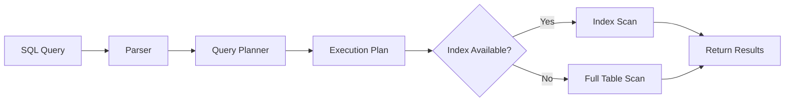
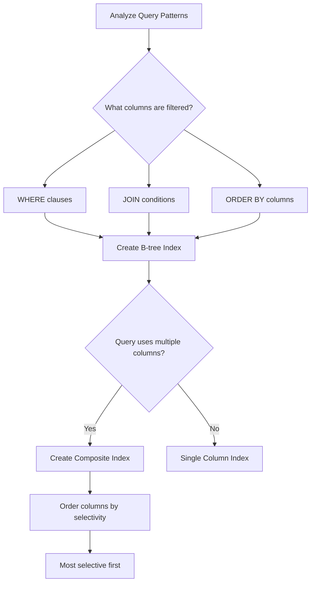

# How to Fix "Slow Database Queries" Issues

Author: [nawazdhandala](https://www.github.com/nawazdhandala)

Tags: Database, Performance, SQL, PostgreSQL, MySQL, Optimization, Backend

Description: Learn how to identify, diagnose, and fix slow database queries using query analysis, indexing strategies, and optimization techniques.

---

Slow database queries are one of the most common performance bottlenecks in web applications. A single poorly optimized query can bring your entire application to its knees, especially under load. This guide walks you through identifying slow queries, understanding why they are slow, and implementing fixes that will dramatically improve your database performance.

## Understanding Query Performance

Before diving into fixes, it helps to understand how databases execute queries. When you send a query, the database creates an execution plan that determines how it will retrieve data.



A full table scan reads every row in the table, which becomes exponentially slower as your data grows. Index scans, on the other hand, use pre-built data structures to find rows quickly.

## Identifying Slow Queries

### Enable Slow Query Logging

**PostgreSQL:**

```sql
-- Check current settings
SHOW log_min_duration_statement;

-- Log queries taking more than 200ms
ALTER SYSTEM SET log_min_duration_statement = 200;

-- Apply changes
SELECT pg_reload_conf();
```

**MySQL:**

```sql
-- Enable slow query log
SET GLOBAL slow_query_log = 'ON';

-- Set threshold to 200ms (0.2 seconds)
SET GLOBAL long_query_time = 0.2;

-- Check log location
SHOW VARIABLES LIKE 'slow_query_log_file';
```

### Monitor Active Queries

**PostgreSQL - Find currently running slow queries:**

```sql
-- Find queries running longer than 5 seconds
SELECT
    pid,
    now() - pg_stat_activity.query_start AS duration,
    query,
    state
FROM pg_stat_activity
WHERE (now() - pg_stat_activity.query_start) > interval '5 seconds'
AND state != 'idle'
ORDER BY duration DESC;
```

**MySQL - Show process list:**

```sql
-- Show all running queries with execution time
SELECT
    id,
    user,
    host,
    db,
    command,
    time AS seconds_running,
    state,
    LEFT(info, 100) AS query_preview
FROM information_schema.processlist
WHERE command != 'Sleep'
AND time > 5
ORDER BY time DESC;
```

## Analyzing Query Execution Plans

The execution plan tells you exactly how the database processes your query. Learning to read these plans is essential for optimization.

### PostgreSQL EXPLAIN ANALYZE

```sql
-- Always use ANALYZE to get actual execution times
EXPLAIN (ANALYZE, BUFFERS, FORMAT TEXT)
SELECT u.name, COUNT(o.id) as order_count
FROM users u
LEFT JOIN orders o ON u.id = o.user_id
WHERE u.created_at > '2024-01-01'
GROUP BY u.id, u.name
ORDER BY order_count DESC
LIMIT 100;
```

**Key metrics to look for:**

| Metric | Good Value | Warning Sign |
|--------|-----------|--------------|
| Seq Scan | Small tables only | Large tables (>10k rows) |
| Nested Loop | Few iterations | Many iterations on large sets |
| Sort | In memory | On disk (sort method: external) |
| Buffers | Low shared hit | High read count |

### MySQL EXPLAIN

```sql
-- Use EXPLAIN ANALYZE for actual execution statistics
EXPLAIN ANALYZE
SELECT u.name, COUNT(o.id) as order_count
FROM users u
LEFT JOIN orders o ON u.id = o.user_id
WHERE u.created_at > '2024-01-01'
GROUP BY u.id, u.name
ORDER BY order_count DESC
LIMIT 100;
```

## Common Slow Query Patterns and Fixes

### 1. Missing Indexes

The most common cause of slow queries is missing indexes on columns used in WHERE, JOIN, and ORDER BY clauses.

```sql
-- Slow: Full table scan on large orders table
SELECT * FROM orders WHERE customer_email = 'user@example.com';

-- Check if index exists (PostgreSQL)
SELECT indexname, indexdef
FROM pg_indexes
WHERE tablename = 'orders';

-- Create the missing index
CREATE INDEX CONCURRENTLY idx_orders_customer_email
ON orders(customer_email);

-- For frequently filtered columns, consider partial indexes
CREATE INDEX CONCURRENTLY idx_orders_pending
ON orders(created_at)
WHERE status = 'pending';
```

### 2. N+1 Query Problem

This happens when you query a list and then make a separate query for each item.

```python
# BAD: N+1 queries - one query per user
users = db.query("SELECT * FROM users LIMIT 100")
for user in users:
    # This runs 100 separate queries!
    orders = db.query(f"SELECT * FROM orders WHERE user_id = {user.id}")
    user.orders = orders

# GOOD: Single query with JOIN
users_with_orders = db.query("""
    SELECT u.*,
           json_agg(o.*) as orders
    FROM users u
    LEFT JOIN orders o ON u.id = o.user_id
    GROUP BY u.id
    LIMIT 100
""")
```

### 3. Inefficient JOINs

```sql
-- Slow: Joining large tables without proper indexes
SELECT p.name, c.name as category
FROM products p
JOIN categories c ON p.category_name = c.name  -- String comparison is slow
WHERE p.price > 100;

-- Better: Use integer foreign keys with indexes
ALTER TABLE products ADD COLUMN category_id INTEGER;
CREATE INDEX idx_products_category_id ON products(category_id);

SELECT p.name, c.name as category
FROM products p
JOIN categories c ON p.category_id = c.id  -- Integer comparison with index
WHERE p.price > 100;
```

### 4. SELECT * Anti-pattern

```sql
-- Slow: Fetches all columns, including large TEXT/BLOB fields
SELECT * FROM articles WHERE published = true;

-- Better: Select only needed columns
SELECT id, title, summary, published_at
FROM articles
WHERE published = true;

-- Even better: Use a covering index
CREATE INDEX idx_articles_published_covering
ON articles(published)
INCLUDE (id, title, summary, published_at);
```

### 5. Functions on Indexed Columns

```sql
-- Slow: Function prevents index usage
SELECT * FROM users WHERE LOWER(email) = 'user@example.com';

-- Better: Create a functional index
CREATE INDEX idx_users_email_lower ON users(LOWER(email));

-- Or normalize data on insert
-- Store emails in lowercase and compare directly
SELECT * FROM users WHERE email = 'user@example.com';
```

## Query Optimization Techniques

### Use LIMIT with OFFSET Carefully

```sql
-- Slow: OFFSET scans and discards rows
SELECT * FROM products ORDER BY id LIMIT 20 OFFSET 10000;

-- Better: Keyset pagination (cursor-based)
SELECT * FROM products
WHERE id > 10000  -- Last seen ID from previous page
ORDER BY id
LIMIT 20;
```

### Optimize COUNT Queries

```sql
-- Slow: Counts every matching row
SELECT COUNT(*) FROM orders WHERE status = 'completed';

-- Better for estimates: Use statistics
SELECT reltuples AS estimate
FROM pg_class
WHERE relname = 'orders';

-- Or maintain a separate counter table for exact counts
-- that gets updated via triggers
```

### Batch Large Updates

```sql
-- Slow: Updates millions of rows in one transaction
UPDATE orders SET archived = true WHERE created_at < '2023-01-01';

-- Better: Batch updates to avoid long locks
DO $$
DECLARE
    batch_size INTEGER := 10000;
    affected INTEGER;
BEGIN
    LOOP
        UPDATE orders
        SET archived = true
        WHERE id IN (
            SELECT id FROM orders
            WHERE created_at < '2023-01-01'
            AND archived = false
            LIMIT batch_size
        );

        GET DIAGNOSTICS affected = ROW_COUNT;

        -- Commit each batch
        COMMIT;

        -- Exit when no more rows to update
        EXIT WHEN affected = 0;

        -- Brief pause to reduce lock contention
        PERFORM pg_sleep(0.1);
    END LOOP;
END $$;
```

## Index Strategy Best Practices



### Composite Index Guidelines

```sql
-- For a query like:
SELECT * FROM orders
WHERE status = 'pending'
AND customer_id = 123
ORDER BY created_at DESC;

-- Create composite index with correct column order
-- 1. Equality conditions first (status, customer_id)
-- 2. Range/ORDER BY last (created_at)
CREATE INDEX idx_orders_status_customer_created
ON orders(status, customer_id, created_at DESC);
```

## Monitoring and Prevention

Set up continuous monitoring to catch slow queries before they impact users:

```python
# Example: Log slow queries in your application
import time
import logging

class QueryTimer:
    def __init__(self, threshold_ms=200):
        self.threshold_ms = threshold_ms
        self.logger = logging.getLogger('slow_queries')

    def execute(self, cursor, query, params=None):
        start = time.time()
        cursor.execute(query, params)
        duration_ms = (time.time() - start) * 1000

        if duration_ms > self.threshold_ms:
            self.logger.warning(
                f"Slow query ({duration_ms:.0f}ms): {query[:200]}"
            )

        return cursor

# Usage
timer = QueryTimer(threshold_ms=200)
timer.execute(cursor, "SELECT * FROM users WHERE email = %s", ['user@example.com'])
```

## Summary

Fixing slow database queries follows a systematic approach:

1. **Identify** slow queries using logging and monitoring
2. **Analyze** execution plans to understand the bottleneck
3. **Add indexes** for frequently filtered and joined columns
4. **Rewrite queries** to avoid anti-patterns like SELECT * and N+1
5. **Monitor continuously** to catch regressions early

The biggest performance gains usually come from proper indexing. A single well-designed index can transform a query from taking seconds to milliseconds. Start with the slowest queries in your logs and work your way through them systematically.
