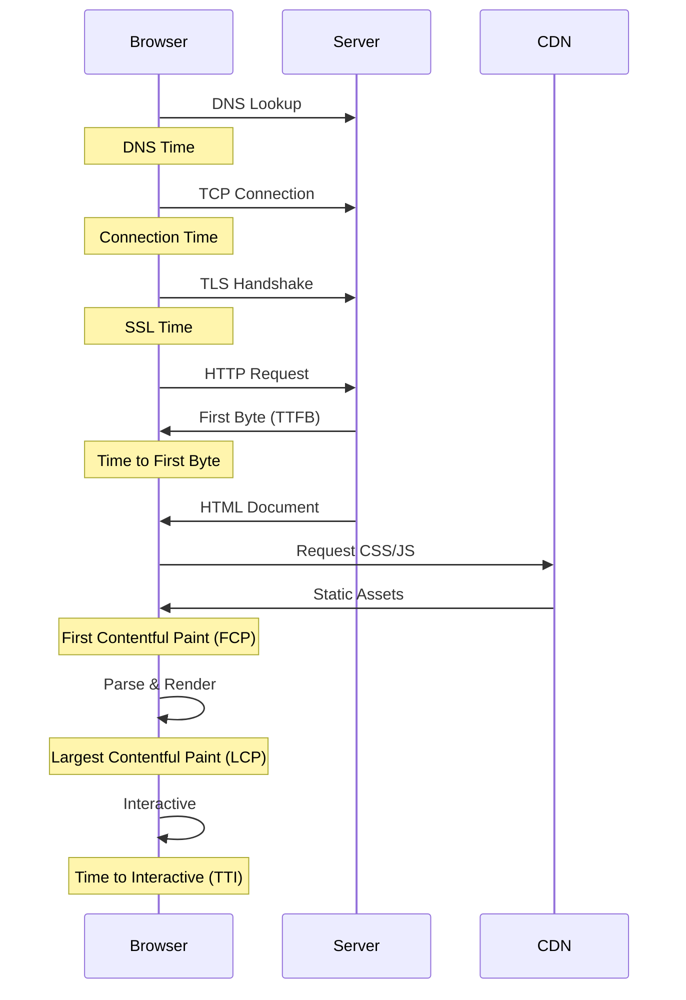
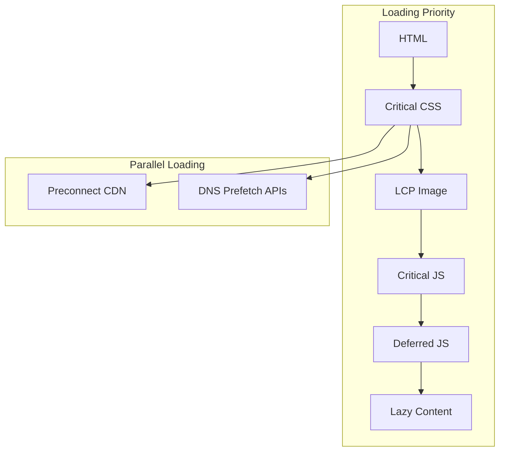

# How to Fix 'Slow Page Load' Performance Issues

Author: [nawazdhandala](https://www.github.com/nawazdhandala)

Tags: Performance, Web, Frontend, JavaScript, CSS, Core Web Vitals, Page Speed

Description: A practical guide to diagnosing and fixing slow page load times with actionable techniques for improving Core Web Vitals.

---

Slow page loads hurt user experience and SEO rankings. Google uses Core Web Vitals as a ranking factor, and users expect pages to load in under 3 seconds. In this guide, we will cover practical techniques to diagnose and fix slow page load issues.

## Understanding Page Load Metrics

Before fixing performance issues, you need to understand what to measure:



### Core Web Vitals Explained

| Metric | Good | Needs Work | Poor | What It Measures |
|--------|------|------------|------|------------------|
| LCP (Largest Contentful Paint) | < 2.5s | 2.5s - 4s | > 4s | Loading performance |
| FID (First Input Delay) | < 100ms | 100ms - 300ms | > 300ms | Interactivity |
| CLS (Cumulative Layout Shift) | < 0.1 | 0.1 - 0.25 | > 0.25 | Visual stability |
| INP (Interaction to Next Paint) | < 200ms | 200ms - 500ms | > 500ms | Responsiveness |

## Step 1: Measure Current Performance

### Browser DevTools

```javascript
// performance-timing.js
// Measure key performance metrics in the browser

function measurePerformance() {
    // Wait for page to fully load
    window.addEventListener('load', () => {
        setTimeout(() => {
            const timing = performance.timing;
            const navigation = performance.getEntriesByType('navigation')[0];

            const metrics = {
                // DNS lookup time
                dns: timing.domainLookupEnd - timing.domainLookupStart,

                // TCP connection time
                tcp: timing.connectEnd - timing.connectStart,

                // Time to First Byte
                ttfb: timing.responseStart - timing.requestStart,

                // DOM Content Loaded
                domContentLoaded: timing.domContentLoadedEventEnd - timing.navigationStart,

                // Full page load
                pageLoad: timing.loadEventEnd - timing.navigationStart,

                // DOM Interactive
                domInteractive: timing.domInteractive - timing.navigationStart
            };

            console.table(metrics);

            // Send to analytics
            sendToAnalytics(metrics);
        }, 0);
    });
}

function sendToAnalytics(metrics) {
    // Send metrics to your monitoring service
    fetch('/api/metrics', {
        method: 'POST',
        headers: { 'Content-Type': 'application/json' },
        body: JSON.stringify({
            type: 'page-performance',
            url: window.location.href,
            metrics: metrics,
            timestamp: Date.now()
        })
    });
}

// Measure Core Web Vitals
function measureCoreWebVitals() {
    // LCP - Largest Contentful Paint
    new PerformanceObserver((list) => {
        const entries = list.getEntries();
        const lastEntry = entries[entries.length - 1];
        console.log('LCP:', lastEntry.startTime);
    }).observe({ type: 'largest-contentful-paint', buffered: true });

    // CLS - Cumulative Layout Shift
    let clsValue = 0;
    new PerformanceObserver((list) => {
        for (const entry of list.getEntries()) {
            if (!entry.hadRecentInput) {
                clsValue += entry.value;
            }
        }
        console.log('CLS:', clsValue);
    }).observe({ type: 'layout-shift', buffered: true });

    // FID - First Input Delay
    new PerformanceObserver((list) => {
        const entry = list.getEntries()[0];
        console.log('FID:', entry.processingStart - entry.startTime);
    }).observe({ type: 'first-input', buffered: true });
}
```

### Lighthouse Audit

```bash
# Run Lighthouse from command line
npx lighthouse https://example.com \
    --output=json \
    --output-path=./lighthouse-report.json \
    --chrome-flags="--headless"

# Run with specific categories
npx lighthouse https://example.com \
    --only-categories=performance \
    --output=html \
    --view
```

## Step 2: Optimize Server Response Time (TTFB)

### Enable Compression

```nginx
# nginx.conf - Enable gzip compression
http {
    # Enable gzip
    gzip on;
    gzip_vary on;
    gzip_proxied any;
    gzip_comp_level 6;
    gzip_min_length 1000;

    # Compress these MIME types
    gzip_types
        text/plain
        text/css
        text/javascript
        application/javascript
        application/json
        application/xml
        image/svg+xml;

    # Enable Brotli (if module installed)
    brotli on;
    brotli_comp_level 6;
    brotli_types
        text/plain
        text/css
        application/javascript
        application/json;
}
```

### Server-Side Caching

```python
# server_caching.py
# Flask example with response caching

from flask import Flask, make_response
from functools import wraps
import hashlib

app = Flask(__name__)

def cache_response(max_age=300):
    """Decorator to add caching headers to responses."""
    def decorator(func):
        @wraps(func)
        def wrapper(*args, **kwargs):
            response = make_response(func(*args, **kwargs))

            # Generate ETag from response content
            etag = hashlib.md5(response.data).hexdigest()

            # Set caching headers
            response.headers['Cache-Control'] = f'public, max-age={max_age}'
            response.headers['ETag'] = etag

            return response
        return wrapper
    return decorator

@app.route('/api/products')
@cache_response(max_age=3600)  # Cache for 1 hour
def get_products():
    products = fetch_products_from_db()
    return jsonify(products)
```

## Step 3: Optimize Critical Rendering Path

### Inline Critical CSS

```html
<!-- index.html -->
<!-- Inline critical CSS for above-the-fold content -->
<head>
    <style>
        /* Critical CSS - only styles needed for initial render */
        body {
            margin: 0;
            font-family: -apple-system, BlinkMacSystemFont, sans-serif;
        }
        .header {
            background: #1a1a2e;
            color: white;
            padding: 1rem;
        }
        .hero {
            min-height: 400px;
            display: flex;
            align-items: center;
        }
    </style>

    <!-- Load full CSS asynchronously -->
    <link rel="preload" href="/css/styles.css" as="style"
          onload="this.onload=null;this.rel='stylesheet'">
    <noscript>
        <link rel="stylesheet" href="/css/styles.css">
    </noscript>
</head>
```

### Defer Non-Critical JavaScript

```html
<!-- Proper script loading strategies -->
<head>
    <!-- Preload critical resources -->
    <link rel="preload" href="/js/critical.js" as="script">
    <link rel="preconnect" href="https://fonts.googleapis.com">
    <link rel="dns-prefetch" href="https://analytics.example.com">
</head>

<body>
    <!-- Content here -->

    <!-- Critical JS loads first -->
    <script src="/js/critical.js"></script>

    <!-- Defer non-critical scripts -->
    <script defer src="/js/analytics.js"></script>
    <script defer src="/js/chat-widget.js"></script>

    <!-- Async for independent scripts -->
    <script async src="/js/ads.js"></script>
</body>
```

### Resource Loading Strategy



## Step 4: Optimize Images

Images are often the largest resources on a page.

### Responsive Images

```html
<!-- Use srcset for responsive images -->


<!-- Use picture element for art direction -->
<picture>
    <source
        media="(max-width: 600px)"
        srcset="/images/hero-mobile.webp"
        type="image/webp">
    <source
        media="(max-width: 600px)"
        srcset="/images/hero-mobile.jpg">
    <source
        srcset="/images/hero-desktop.webp"
        type="image/webp">
    
</picture>
```

### Image Optimization Script

```javascript
// image-optimization.js
// Build script to optimize images

const sharp = require('sharp');
const glob = require('glob');
const path = require('path');

async function optimizeImages() {
    const images = glob.sync('./src/images/**/*.{jpg,jpeg,png}');

    for (const imagePath of images) {
        const filename = path.basename(imagePath, path.extname(imagePath));
        const outputDir = path.dirname(imagePath).replace('src', 'dist');

        // Generate multiple sizes
        const sizes = [400, 800, 1200, 1600];

        for (const width of sizes) {
            // WebP version
            await sharp(imagePath)
                .resize(width)
                .webp({ quality: 80 })
                .toFile(`${outputDir}/${filename}-${width}.webp`);

            // JPEG fallback
            await sharp(imagePath)
                .resize(width)
                .jpeg({ quality: 80, progressive: true })
                .toFile(`${outputDir}/${filename}-${width}.jpg`);
        }

        console.log(`Optimized: ${imagePath}`);
    }
}

optimizeImages();
```

## Step 5: Lazy Loading

### Lazy Load Images

```javascript
// lazy-load.js
// Native lazy loading with fallback

document.addEventListener('DOMContentLoaded', () => {
    // Check for native lazy loading support
    if ('loading' in HTMLImageElement.prototype) {
        // Browser supports native lazy loading
        const images = document.querySelectorAll('img[data-src]');
        images.forEach(img => {
            img.src = img.dataset.src;
        });
    } else {
        // Fallback to Intersection Observer
        const imageObserver = new IntersectionObserver((entries, observer) => {
            entries.forEach(entry => {
                if (entry.isIntersecting) {
                    const img = entry.target;
                    img.src = img.dataset.src;
                    img.removeAttribute('data-src');
                    observer.unobserve(img);
                }
            });
        }, {
            rootMargin: '50px 0px',  // Start loading 50px before visible
            threshold: 0.01
        });

        document.querySelectorAll('img[data-src]').forEach(img => {
            imageObserver.observe(img);
        });
    }
});
```

### Lazy Load Components

```javascript
// lazy-components.js
// React example of lazy loading components

import React, { Suspense, lazy } from 'react';

// Lazy load heavy components
const HeavyChart = lazy(() => import('./components/HeavyChart'));
const CommentSection = lazy(() => import('./components/CommentSection'));

function ProductPage() {
    return (
        <div>
            {/* Critical content loads immediately */}
            <ProductHeader />
            <ProductDescription />

            {/* Heavy components load on demand */}
            <Suspense fallback={<div className="skeleton">Loading chart...</div>}>
                <HeavyChart />
            </Suspense>

            {/* Load comments only when scrolled into view */}
            <LazySection>
                <Suspense fallback={<div className="skeleton">Loading comments...</div>}>
                    <CommentSection />
                </Suspense>
            </LazySection>
        </div>
    );
}

// Component that loads children when visible
function LazySection({ children }) {
    const [isVisible, setIsVisible] = React.useState(false);
    const ref = React.useRef();

    React.useEffect(() => {
        const observer = new IntersectionObserver(([entry]) => {
            if (entry.isIntersecting) {
                setIsVisible(true);
                observer.disconnect();
            }
        });

        if (ref.current) {
            observer.observe(ref.current);
        }

        return () => observer.disconnect();
    }, []);

    return (
        <div ref={ref}>
            {isVisible ? children : <div style={{ minHeight: '200px' }} />}
        </div>
    );
}
```

## Step 6: Fix Cumulative Layout Shift (CLS)

### Reserve Space for Dynamic Content

```css
/* Reserve space to prevent layout shift */

/* Images - always specify dimensions */
img {
    width: 100%;
    height: auto;
    aspect-ratio: 16 / 9;  /* Modern browsers */
}

/* Ads - reserve space */
.ad-container {
    min-height: 250px;
    background: #f0f0f0;
}

/* Fonts - use font-display */
@font-face {
    font-family: 'CustomFont';
    src: url('/fonts/custom.woff2') format('woff2');
    font-display: swap;  /* Show fallback immediately, swap when loaded */
}

/* Skeleton screens for dynamic content */
.skeleton {
    background: linear-gradient(
        90deg,
        #f0f0f0 25%,
        #e0e0e0 50%,
        #f0f0f0 75%
    );
    background-size: 200% 100%;
    animation: skeleton-loading 1.5s infinite;
}

@keyframes skeleton-loading {
    0% { background-position: 200% 0; }
    100% { background-position: -200% 0; }
}
```

## Performance Budget

Set and enforce performance budgets:

```javascript
// performance-budget.js
// Webpack plugin to enforce budgets

module.exports = {
    performance: {
        maxAssetSize: 250000,        // 250 KB per asset
        maxEntrypointSize: 500000,   // 500 KB for entry point
        hints: 'error',              // Fail build if exceeded
        assetFilter: (assetFilename) => {
            // Only check JS and CSS
            return /\.(js|css)$/.test(assetFilename);
        }
    }
};
```

## Quick Wins Checklist

Apply these optimizations for immediate improvements:

1. **Enable compression** - Gzip or Brotli
2. **Add caching headers** - Cache static assets for 1 year
3. **Use a CDN** - Serve assets from edge locations
4. **Optimize images** - WebP format, responsive sizes
5. **Defer non-critical JS** - Use defer or async attributes
6. **Inline critical CSS** - First 14KB should render above-fold
7. **Preconnect to origins** - DNS prefetch third-party domains
8. **Set image dimensions** - Prevent layout shift
9. **Use font-display: swap** - Show text immediately
10. **Lazy load below-fold** - Images, videos, heavy components

---

*OneUptime provides real user monitoring (RUM) to track page load performance across all your users. Set up alerts for Core Web Vitals degradation and track performance over time.*
