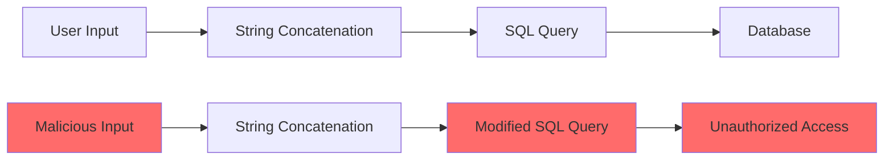
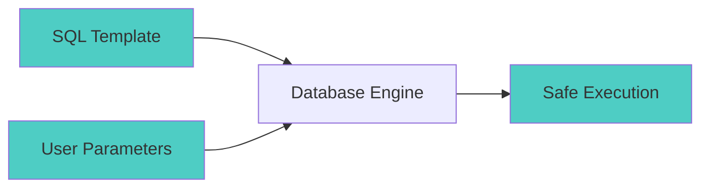

# How to Fix "SQL Injection" Vulnerabilities

Author: [nawazdhandala](https://www.github.com/nawazdhandala)

Tags: Security, SQL Injection, Database, Web Security, OWASP, Backend

Description: Learn how to identify and fix SQL injection vulnerabilities using parameterized queries, input validation, and secure coding practices.

---

SQL injection remains one of the most dangerous and prevalent web application vulnerabilities. According to OWASP, it consistently ranks in the top 10 security risks. An attacker who exploits SQL injection can read sensitive data, modify or delete records, execute administrative operations, and in some cases, gain complete control over the database server. This guide will walk you through identifying vulnerable code and implementing proper fixes across multiple programming languages.

## Understanding SQL Injection

SQL injection occurs when user-supplied data is incorporated into SQL queries without proper sanitization or parameterization. The attacker can manipulate the query structure by injecting SQL syntax through input fields.

Consider this vulnerable flow:



When user input is directly concatenated into queries, an attacker can break out of the intended query context and execute arbitrary SQL.

## Common Vulnerable Patterns

### Vulnerable Code in Python

```python
# VULNERABLE - Never do this!
def get_user(username):
    # Direct string concatenation allows SQL injection
    query = "SELECT * FROM users WHERE username = '" + username + "'"
    cursor.execute(query)
    return cursor.fetchone()

# If username is: ' OR '1'='1
# The query becomes: SELECT * FROM users WHERE username = '' OR '1'='1'
# This returns all users!
```

### Vulnerable Code in Node.js

```javascript
// VULNERABLE - Never do this!
async function getUser(username) {
    // Template literals are just as dangerous as concatenation
    const query = `SELECT * FROM users WHERE username = '${username}'`;
    const result = await pool.query(query);
    return result.rows[0];
}

// An attacker can input: admin'--
// Query becomes: SELECT * FROM users WHERE username = 'admin'--'
// The comment (--) ignores the rest of the query
```

### Vulnerable Code in Java

```java
// VULNERABLE - Never do this!
public User getUser(String username) throws SQLException {
    // String concatenation in SQL is dangerous
    String query = "SELECT * FROM users WHERE username = '" + username + "'";
    Statement stmt = connection.createStatement();
    ResultSet rs = stmt.executeQuery(query);
    // ...
}
```

## The Fix: Parameterized Queries

Parameterized queries (also called prepared statements) separate the SQL code from the data. The database treats user input as data only, never as part of the SQL command.



### Fixed Python Code

```python
# SECURE - Using parameterized queries with psycopg2
import psycopg2

def get_user(username):
    # Use %s placeholder - psycopg2 handles escaping
    query = "SELECT * FROM users WHERE username = %s"
    cursor.execute(query, (username,))  # Pass parameters as tuple
    return cursor.fetchone()

# SECURE - Using SQLAlchemy ORM (even better)
from sqlalchemy import select
from sqlalchemy.orm import Session

def get_user_orm(session: Session, username: str):
    # ORM automatically uses parameterized queries
    stmt = select(User).where(User.username == username)
    return session.execute(stmt).scalar_one_or_none()

# SECURE - Using SQLAlchemy Core with text()
from sqlalchemy import text

def get_user_text(connection, username: str):
    # Named parameters with text() function
    query = text("SELECT * FROM users WHERE username = :username")
    result = connection.execute(query, {"username": username})
    return result.fetchone()
```

### Fixed Node.js Code

```javascript
// SECURE - Using parameterized queries with pg (node-postgres)
async function getUser(username) {
    // Use $1, $2, etc. for parameters
    const query = 'SELECT * FROM users WHERE username = $1';
    const result = await pool.query(query, [username]);
    return result.rows[0];
}

// SECURE - Using mysql2 with placeholders
async function getUserMySQL(username) {
    // Use ? for parameters in MySQL
    const query = 'SELECT * FROM users WHERE username = ?';
    const [rows] = await connection.execute(query, [username]);
    return rows[0];
}

// SECURE - Using Prisma ORM
import { PrismaClient } from '@prisma/client';
const prisma = new PrismaClient();

async function getUserPrisma(username) {
    // Prisma handles parameterization automatically
    return await prisma.user.findUnique({
        where: { username: username }
    });
}

// SECURE - Using Knex.js query builder
async function getUserKnex(username) {
    // Query builders use parameterized queries internally
    return await knex('users')
        .where('username', username)
        .first();
}
```

### Fixed Java Code

```java
// SECURE - Using PreparedStatement
public User getUser(String username) throws SQLException {
    // Use ? placeholders for parameters
    String query = "SELECT * FROM users WHERE username = ?";

    try (PreparedStatement pstmt = connection.prepareStatement(query)) {
        pstmt.setString(1, username);  // Set parameter by index

        try (ResultSet rs = pstmt.executeQuery()) {
            if (rs.next()) {
                return mapResultSetToUser(rs);
            }
        }
    }
    return null;
}

// SECURE - Using JPA/Hibernate with named parameters
@Repository
public class UserRepository {
    @PersistenceContext
    private EntityManager entityManager;

    public User findByUsername(String username) {
        // JPQL with named parameter
        String jpql = "SELECT u FROM User u WHERE u.username = :username";
        return entityManager.createQuery(jpql, User.class)
            .setParameter("username", username)
            .getSingleResult();
    }
}

// SECURE - Using Spring Data JPA
public interface UserRepository extends JpaRepository<User, Long> {
    // Spring Data generates safe parameterized queries
    Optional<User> findByUsername(String username);

    // Custom query with named parameter
    @Query("SELECT u FROM User u WHERE u.email = :email")
    Optional<User> findByEmail(@Param("email") String email);
}
```

### Fixed Go Code

```go
// SECURE - Using database/sql with parameterized queries
func getUser(db *sql.DB, username string) (*User, error) {
    // Use $1, $2 for PostgreSQL or ? for MySQL
    query := "SELECT id, username, email FROM users WHERE username = $1"

    var user User
    err := db.QueryRow(query, username).Scan(&user.ID, &user.Username, &user.Email)
    if err != nil {
        return nil, err
    }
    return &user, nil
}

// SECURE - Using sqlx with named parameters
func getUserNamed(db *sqlx.DB, username string) (*User, error) {
    query := "SELECT * FROM users WHERE username = :username"

    var user User
    rows, err := db.NamedQuery(query, map[string]interface{}{
        "username": username,
    })
    if err != nil {
        return nil, err
    }
    defer rows.Close()

    if rows.Next() {
        err = rows.StructScan(&user)
        return &user, err
    }
    return nil, sql.ErrNoRows
}

// SECURE - Using GORM
func getUserGORM(db *gorm.DB, username string) (*User, error) {
    var user User
    // GORM uses parameterized queries internally
    result := db.Where("username = ?", username).First(&user)
    return &user, result.Error
}
```

## Handling Dynamic Queries

Sometimes you need to build dynamic queries with variable column names or table names. These cannot be parameterized directly.

### Safe Dynamic Column Selection

```python
# SECURE - Whitelist allowed columns
ALLOWED_COLUMNS = {'id', 'username', 'email', 'created_at'}
ALLOWED_SORT_DIRECTIONS = {'ASC', 'DESC'}

def get_users_sorted(sort_column: str, sort_direction: str):
    # Validate against whitelist
    if sort_column not in ALLOWED_COLUMNS:
        raise ValueError(f"Invalid sort column: {sort_column}")
    if sort_direction.upper() not in ALLOWED_SORT_DIRECTIONS:
        raise ValueError(f"Invalid sort direction: {sort_direction}")

    # Safe to use validated values in query
    query = f"SELECT * FROM users ORDER BY {sort_column} {sort_direction.upper()}"
    cursor.execute(query)
    return cursor.fetchall()
```

### Safe Dynamic Table Names in Node.js

```javascript
// SECURE - Whitelist allowed tables
const ALLOWED_TABLES = new Set(['users', 'orders', 'products']);

async function getRecords(tableName, id) {
    // Validate table name against whitelist
    if (!ALLOWED_TABLES.has(tableName)) {
        throw new Error(`Invalid table name: ${tableName}`);
    }

    // Table name is validated, id is parameterized
    const query = `SELECT * FROM ${tableName} WHERE id = $1`;
    const result = await pool.query(query, [id]);
    return result.rows;
}
```

## Additional Security Layers

### Input Validation

While parameterized queries are the primary defense, input validation adds another layer of protection.

```python
import re

def validate_username(username: str) -> bool:
    """Validate username format before database query."""
    # Only allow alphanumeric characters and underscores
    # Length between 3 and 30 characters
    pattern = r'^[a-zA-Z0-9_]{3,30}$'
    return bool(re.match(pattern, username))

def get_user_validated(username: str):
    if not validate_username(username):
        raise ValueError("Invalid username format")

    query = "SELECT * FROM users WHERE username = %s"
    cursor.execute(query, (username,))
    return cursor.fetchone()
```

### Principle of Least Privilege

Configure your database user with minimal required permissions.

```sql
-- Create a restricted user for the web application
CREATE USER 'webapp'@'localhost' IDENTIFIED BY 'secure_password';

-- Grant only necessary permissions
GRANT SELECT, INSERT, UPDATE ON myapp.users TO 'webapp'@'localhost';
GRANT SELECT, INSERT ON myapp.orders TO 'webapp'@'localhost';

-- Never grant these to application users:
-- GRANT DROP, ALTER, CREATE, DELETE, TRUNCATE
-- GRANT FILE, PROCESS, SUPER
```

### Stored Procedures

Stored procedures can provide an additional layer of abstraction, though they must also use parameterization internally.

```sql
-- PostgreSQL stored procedure with parameterized query
CREATE OR REPLACE FUNCTION get_user_by_username(p_username VARCHAR)
RETURNS TABLE (id INT, username VARCHAR, email VARCHAR) AS $$
BEGIN
    -- Parameters are automatically safe in PL/pgSQL
    RETURN QUERY SELECT u.id, u.username, u.email
                 FROM users u
                 WHERE u.username = p_username;
END;
$$ LANGUAGE plpgsql;

-- Call from application
-- SELECT * FROM get_user_by_username($1)
```

## Testing for SQL Injection

Regularly test your application for SQL injection vulnerabilities.

```python
# Common SQL injection test payloads
test_payloads = [
    "' OR '1'='1",
    "' OR '1'='1'--",
    "'; DROP TABLE users;--",
    "' UNION SELECT username, password FROM users--",
    "1; UPDATE users SET password='hacked'",
    "admin'--",
    "' OR 1=1#",
]

# Use these with security testing tools like sqlmap or manual testing
# Never test on production databases!
```

## Security Checklist

Before deploying your application, verify these security measures:

1. All database queries use parameterized statements
2. No string concatenation or interpolation in SQL queries
3. Dynamic identifiers (table/column names) are validated against whitelists
4. Database user has minimal required permissions
5. Input validation is implemented as an additional layer
6. Error messages do not expose database structure
7. Web Application Firewall (WAF) rules are configured
8. Regular security audits and penetration testing are scheduled

## Conclusion

SQL injection is a serious vulnerability, but it is also one of the easiest to prevent. By consistently using parameterized queries and following the practices outlined in this guide, you can eliminate SQL injection from your applications. Remember that parameterized queries are not optional - they should be your default approach for every database interaction.

Make security a habit, not an afterthought. Review your existing code for vulnerable patterns, update legacy applications to use parameterized queries, and ensure all developers on your team understand why direct string concatenation in SQL is never acceptable.
