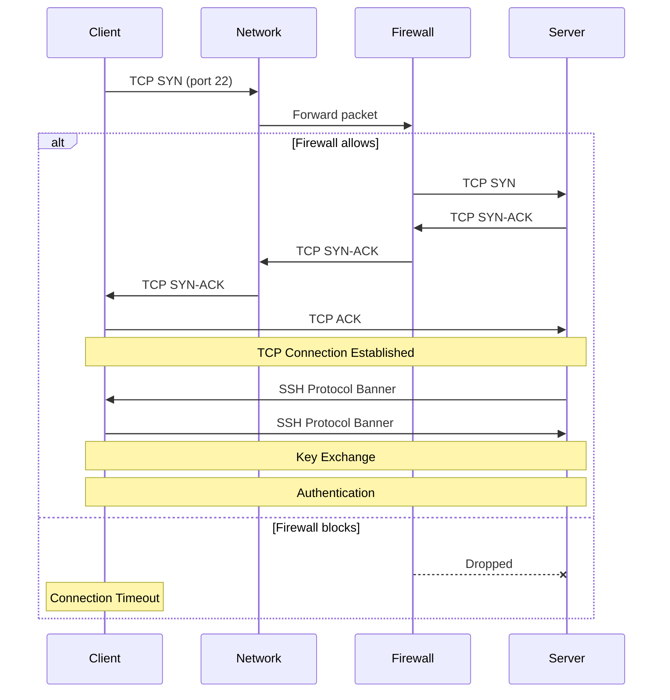
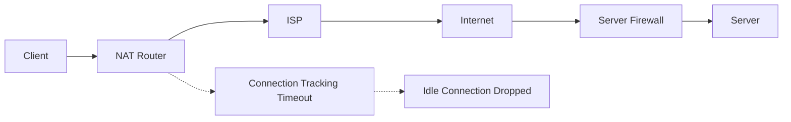
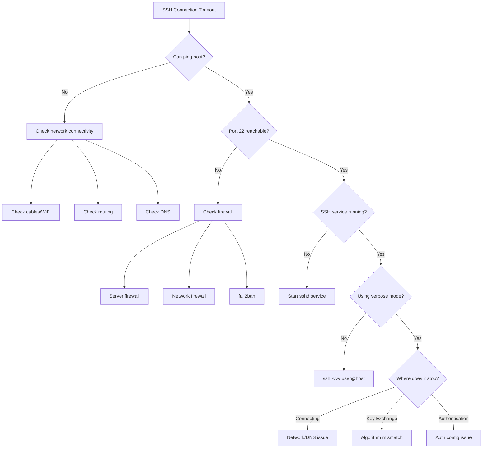

# How to Fix "SSH Connection Timeout" Errors

Author: [nawazdhandala](https://www.github.com/nawazdhandala)

Tags: Linux, SSH, Networking, Troubleshooting, System Administration, Security

Description: Learn how to diagnose and fix SSH connection timeout errors including network issues, firewall rules, and server configuration problems.

---

SSH connection timeouts are frustrating because they can stem from many different causes: network issues, firewall rules, server configuration, or client settings. This guide provides a systematic approach to diagnose and fix SSH connection timeouts.

## Understanding SSH Connection Flow



## Common SSH Timeout Error Messages

```text
ssh: connect to host example.com port 22: Connection timed out
ssh: connect to host example.com port 22: No route to host
ssh: connect to host example.com port 22: Connection refused
Connection closed by remote host
Connection reset by peer
```

## Step-by-Step Diagnosis

### Step 1: Check Basic Connectivity

```bash
# Ping the server
ping -c 4 example.com

# If ping works, try traceroute
traceroute example.com

# Check if port 22 is reachable
nc -zv example.com 22 -w 5

# Or use telnet
telnet example.com 22
```

### Step 2: Check SSH with Verbose Output

```bash
# Single verbose
ssh -v user@example.com

# More verbose (shows packet-level details)
ssh -vv user@example.com

# Maximum verbosity
ssh -vvv user@example.com
```

Analyze the output:
- Stops at "Connecting to..." = Network/firewall issue
- Stops at "SSH2_MSG_KEXINIT" = Key exchange problem
- Stops at "Authentications that can continue" = Auth issue

### Step 3: Check DNS Resolution

```bash
# Verify hostname resolves correctly
nslookup example.com
dig example.com

# Try connecting with IP directly
ssh -v user@192.168.1.100
```

## Client-Side Fixes

### Increase Connection Timeout

```bash
# Specify longer connection timeout
ssh -o ConnectTimeout=30 user@example.com

# Combined with server alive settings
ssh -o ConnectTimeout=30 -o ServerAliveInterval=60 user@example.com
```

### Configure SSH Client

Edit `~/.ssh/config`:

```bash
# ~/.ssh/config

# Global settings
Host *
    ConnectTimeout 30
    ServerAliveInterval 60
    ServerAliveCountMax 3
    TCPKeepAlive yes

# Specific host configuration
Host myserver
    HostName example.com
    User admin
    Port 22
    ConnectTimeout 60
    ServerAliveInterval 30
```

### Fix Known Hosts Issues

```bash
# If host key changed, remove old entry
ssh-keygen -R example.com

# Skip host key verification (temporary, not recommended for production)
ssh -o StrictHostKeyChecking=no -o UserKnownHostsFile=/dev/null user@example.com
```

### Check SSH Agent

```bash
# Start SSH agent
eval $(ssh-agent)

# Add your key
ssh-add ~/.ssh/id_rsa

# List loaded keys
ssh-add -l
```

## Server-Side Fixes

### Check SSH Service Status

```bash
# Check if SSH daemon is running
sudo systemctl status sshd

# Start SSH if stopped
sudo systemctl start sshd

# Enable on boot
sudo systemctl enable sshd

# Check SSH is listening
sudo ss -tlnp | grep 22
sudo netstat -tlnp | grep 22
```

### Check SSH Configuration

```bash
# Test SSH config for errors
sudo sshd -t

# View current configuration
sudo sshd -T

# Check main config file
sudo cat /etc/ssh/sshd_config | grep -v "^#" | grep -v "^$"
```

### Key SSH Configuration Options

```bash
# /etc/ssh/sshd_config

# Listen on specific address (0.0.0.0 for all)
ListenAddress 0.0.0.0

# Port (default 22)
Port 22

# Connection settings
LoginGraceTime 60
MaxStartups 10:30:100
ClientAliveInterval 300
ClientAliveCountMax 3
TCPKeepAlive yes

# Authentication settings
MaxAuthTries 6
PasswordAuthentication yes
PubkeyAuthentication yes

# Logging (increase for debugging)
LogLevel DEBUG3
```

After changes:

```bash
# Restart SSH service
sudo systemctl restart sshd
```

### Check Server Firewall

```bash
# Check firewalld status
sudo firewall-cmd --list-all

# Allow SSH
sudo firewall-cmd --permanent --add-service=ssh
sudo firewall-cmd --reload

# Check iptables rules
sudo iptables -L -n | grep 22

# Allow SSH with iptables
sudo iptables -A INPUT -p tcp --dport 22 -j ACCEPT

# Check UFW status
sudo ufw status

# Allow SSH with UFW
sudo ufw allow ssh
sudo ufw allow 22/tcp
```

### Check SELinux

```bash
# Check SELinux status
getenforce

# Check if SSH is blocked by SELinux
sudo ausearch -m avc -ts recent | grep ssh

# If SSH port changed, update SELinux
sudo semanage port -a -t ssh_port_t -p tcp 2222
```

### Check TCP Wrappers

```bash
# Check hosts.allow
cat /etc/hosts.allow

# Check hosts.deny
cat /etc/hosts.deny

# Add SSH access
echo "sshd: ALL" >> /etc/hosts.allow
```

## Network-Level Troubleshooting

### MTU Issues

```bash
# Check current MTU
ip link show eth0

# Test with smaller packets
ping -M do -s 1400 example.com

# Temporarily reduce MTU
sudo ip link set eth0 mtu 1400

# Permanent MTU change (varies by distro)
# Edit /etc/network/interfaces or NetworkManager connection
```

### Check for NAT/Router Issues



```bash
# Keep connection alive through NAT
ssh -o ServerAliveInterval=30 -o ServerAliveCountMax=3 user@example.com
```

### Check for Rate Limiting

```bash
# Check fail2ban status
sudo fail2ban-client status sshd

# Unban an IP
sudo fail2ban-client set sshd unbanip 192.168.1.100

# Check iptables for rate limits
sudo iptables -L -n | grep -i limit
```

## Advanced Debugging

### Capture SSH Traffic

```bash
# On client
sudo tcpdump -i eth0 -nn host example.com and port 22

# On server
sudo tcpdump -i eth0 -nn port 22
```

### Debug SSH on Server Side

```bash
# Run SSH in debug mode on alternate port
sudo /usr/sbin/sshd -d -p 2222

# Connect to debug instance
ssh -p 2222 user@example.com
```

### Check System Logs

```bash
# View SSH authentication log
sudo tail -f /var/log/auth.log        # Debian/Ubuntu
sudo tail -f /var/log/secure          # RHEL/CentOS

# Check system messages
sudo journalctl -u sshd -f

# Search for SSH errors
sudo journalctl -u sshd --since "1 hour ago" | grep -i error
```

## Specific Timeout Scenarios

### Timeout During Key Exchange

```bash
# Problem: Stuck at "SSH2_MSG_KEXINIT"
# Solution: Try different key exchange algorithms

ssh -o KexAlgorithms=curve25519-sha256 user@example.com

# Or specify cipher
ssh -c aes128-ctr user@example.com
```

### Timeout on Password Prompt

```bash
# Server may be doing DNS lookup on client IP
# On server, disable DNS lookup
# Add to /etc/ssh/sshd_config:
UseDNS no

# Restart SSH
sudo systemctl restart sshd
```

### Intermittent Timeouts

```bash
# Keep connection alive
# Client config (~/.ssh/config):
Host *
    ServerAliveInterval 60
    ServerAliveCountMax 3

# Server config (/etc/ssh/sshd_config):
ClientAliveInterval 60
ClientAliveCountMax 3
TCPKeepAlive yes
```

### Timeout After Idle Period

```bash
# Prevent NAT timeout
# Client side: send keepalive packets
ssh -o ServerAliveInterval=30 user@example.com

# Server side: configure client alive
# /etc/ssh/sshd_config
ClientAliveInterval 60
ClientAliveCountMax 3
```

## SSH Timeout Troubleshooting Flowchart



## Quick Fixes Summary

```bash
# Test connectivity
nc -zv host 22 -w 5

# SSH with longer timeout
ssh -o ConnectTimeout=60 user@host

# SSH with keepalive
ssh -o ServerAliveInterval=60 user@host

# Debug SSH connection
ssh -vvv user@host

# Check server SSH status
sudo systemctl status sshd

# Check firewall
sudo firewall-cmd --list-all

# View SSH logs
sudo journalctl -u sshd -f

# Check if IP is banned
sudo fail2ban-client status sshd

# Remove known hosts entry
ssh-keygen -R hostname
```

## Permanent Configuration

### Client Configuration

```bash
# ~/.ssh/config
Host *
    ConnectTimeout 30
    ServerAliveInterval 60
    ServerAliveCountMax 3
    TCPKeepAlive yes

Host problem-server
    HostName 192.168.1.100
    User admin
    Port 22
    ConnectTimeout 60
    ServerAliveInterval 30
    IdentityFile ~/.ssh/special_key
```

### Server Configuration

```bash
# /etc/ssh/sshd_config additions
LoginGraceTime 60
MaxStartups 10:30:100
ClientAliveInterval 300
ClientAliveCountMax 3
TCPKeepAlive yes
UseDNS no
```

## Prevention Checklist

1. **Monitor SSH service**: Set up alerts for SSH service failures
2. **Use connection pooling**: Configure ControlMaster in SSH config
3. **Keep software updated**: SSH vulnerabilities can cause issues
4. **Document firewall rules**: Know what is allowed and why
5. **Implement fail2ban carefully**: Ensure legitimate IPs are whitelisted
6. **Use keepalive settings**: Both client and server side
7. **Monitor logs**: Watch for patterns in failures

---

SSH connection timeouts are almost always caused by one of three things: network connectivity issues, firewall rules blocking traffic, or server configuration problems. Start with the basics (ping, port check, SSH verbose mode), and work through the layers systematically. Most timeouts resolve once you identify which layer is causing the problem.
