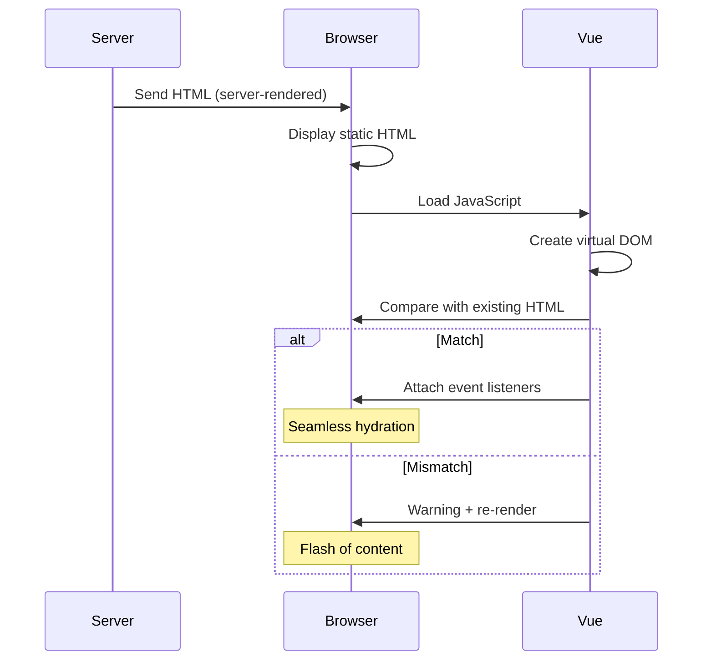
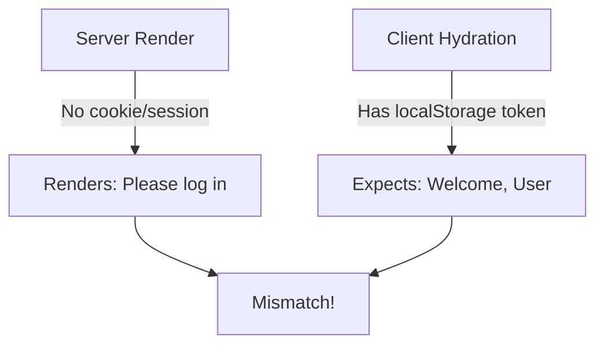

# How to Fix "SSR Hydration" Mismatch in Nuxt

Author: [nawazdhandala](https://www.github.com/nawazdhandala)

Tags: Nuxt, Vue, SSR, Hydration, Server-Side Rendering, Performance, Debugging

Description: Diagnose and resolve Nuxt SSR hydration mismatch errors caused by client-server HTML differences, timing issues, and browser-only code.

---

Hydration is the process where Vue takes over the server-rendered HTML and makes it interactive on the client. When the client-side virtual DOM does not match the server-rendered HTML, Vue throws a hydration mismatch warning. These mismatches can cause visual glitches, broken interactivity, or full page re-renders.

## Understanding Hydration



## Common Causes and Solutions

### 1. Client-Only Values (Date, Random)

The most common cause is using values that differ between server and client.

**Problem:**

```vue
<template>
  <div>
    <!-- Different on server vs client -->
    <p>Current time: {{ new Date().toLocaleTimeString() }}</p>
    <p>Random ID: {{ Math.random() }}</p>
  </div>
</template>
```

**Solution: Use Client-Only Rendering**

```vue
<template>
  <div>
    <!-- Only renders on client -->
    <ClientOnly>
      <p>Current time: {{ currentTime }}</p>
      <template #fallback>
        <p>Loading time...</p>
      </template>
    </ClientOnly>
  </div>
</template>

<script setup>
const currentTime = ref('');

onMounted(() => {
  currentTime.value = new Date().toLocaleTimeString();
});
</script>
```

**Solution: Defer Until Mounted**

```vue
<script setup>
import { ref, onMounted } from 'vue';

// Initialize with stable value
const randomId = ref('loading');

// Set dynamic value only on client
onMounted(() => {
  randomId.value = crypto.randomUUID();
});
</script>

<template>
  <div :data-id="randomId">
    Content with client-generated ID
  </div>
</template>
```

### 2. Browser-Only APIs

Accessing browser APIs during SSR causes errors or different output.

**Problem:**

```vue
<script setup>
// window does not exist on server
const screenWidth = window.innerWidth;
const storedUser = localStorage.getItem('user');
</script>
```

**Solution: Check for Client Environment**

```vue
<script setup>
import { ref, onMounted } from 'vue';

const screenWidth = ref(0);
const storedUser = ref(null);

onMounted(() => {
  // Safe to access browser APIs here
  screenWidth.value = window.innerWidth;
  storedUser.value = JSON.parse(localStorage.getItem('user') || 'null');
});
</script>
```

**Solution: Use Nuxt's useNuxtApp**

```vue
<script setup>
const nuxtApp = useNuxtApp();

// Only runs on client
if (process.client) {
  const width = window.innerWidth;
}

// Or use onMounted
onMounted(() => {
  // Client-side only
});
</script>
```

### 3. Conditional Rendering Differences

Different conditions on server vs client cause mismatches.

**Problem:**

```vue
<template>
  <!-- User auth state may differ between server and client -->
  <div v-if="isLoggedIn">
    Welcome, {{ user.name }}
  </div>
  <div v-else>
    Please log in
  </div>
</template>
```



**Solution: Consistent State Initialization**

```vue
<script setup>
// Use Nuxt's useCookie for SSR-compatible auth
const token = useCookie('auth-token');
const { data: user } = await useFetch('/api/user', {
  headers: token.value ? { Authorization: `Bearer ${token.value}` } : {}
});

const isLoggedIn = computed(() => !!user.value);
</script>

<template>
  <div v-if="isLoggedIn">
    Welcome, {{ user.name }}
  </div>
  <div v-else>
    Please log in
  </div>
</template>
```

**Solution: Client-Only Auth Check**

```vue
<script setup>
const isHydrated = ref(false);
const isLoggedIn = ref(false);

onMounted(() => {
  isHydrated.value = true;
  isLoggedIn.value = checkAuthStatus();
});
</script>

<template>
  <!-- Show loading state until hydrated -->
  <div v-if="!isHydrated">
    Loading...
  </div>
  <div v-else-if="isLoggedIn">
    Welcome back!
  </div>
  <div v-else>
    Please log in
  </div>
</template>
```

### 4. Third-Party Libraries

Some libraries manipulate the DOM directly, causing mismatches.

**Problem:**

```vue
<script setup>
import SomeLibrary from 'some-dom-library';

// Library modifies DOM on import
SomeLibrary.init();
</script>
```

**Solution: Dynamic Import on Client Only**

```vue
<script setup>
let library = null;

onMounted(async () => {
  // Only import on client
  const module = await import('some-dom-library');
  library = module.default;
  library.init();
});
</script>
```

**Solution: Use Nuxt Plugin with Client Mode**

```typescript
// plugins/dom-library.client.ts
export default defineNuxtPlugin(() => {
  // .client.ts files only run on client
  import('some-dom-library').then((module) => {
    module.default.init();
  });
});
```

### 5. Different HTML Structure

Whitespace or structural differences cause mismatches.

**Problem:**

```vue
<template>
  <!-- Extra whitespace can cause issues -->
  <ul>
    <li v-for="item in items" :key="item.id">
      {{ item.name }}
    </li>
  </ul>
</template>
```

**Solution: Use Consistent Formatting**

```vue
<template>
  <ul><li
    v-for="item in items"
    :key="item.id"
  >{{ item.name }}</li></ul>
</template>
```

Or configure your linter to handle whitespace consistently.

### 6. Invalid HTML Nesting

Invalid HTML causes browsers to restructure the DOM.

**Problem:**

```vue
<template>
  <!-- Invalid: p cannot contain div -->
  <p>
    <div>This causes restructuring</div>
  </p>

  <!-- Invalid: table structure -->
  <table>
    <div>Wrong element here</div>
  </table>
</template>
```

**Solution: Use Valid HTML Structure**

```vue
<template>
  <div>
    <div>Content in div</div>
  </div>

  <table>
    <tbody>
      <tr>
        <td>Proper table structure</td>
      </tr>
    </tbody>
  </table>
</template>
```

### 7. Teleport Components

Teleport content may not exist during SSR.

**Problem:**

```vue
<template>
  <Teleport to="#modal-root">
    <div class="modal">Content</div>
  </Teleport>
</template>
```

**Solution: Client-Only Teleport**

```vue
<template>
  <ClientOnly>
    <Teleport to="#modal-root">
      <div class="modal">Content</div>
    </Teleport>
  </ClientOnly>
</template>
```

**Solution: Defer Teleport**

```vue
<template>
  <Teleport to="#modal-root" :disabled="!isMounted">
    <div class="modal">Content</div>
  </Teleport>
</template>

<script setup>
const isMounted = ref(false);
onMounted(() => {
  isMounted.value = true;
});
</script>
```

## Debugging Hydration Mismatches

### Enable Detailed Warnings

```typescript
// nuxt.config.ts
export default defineNuxtConfig({
  vue: {
    compilerOptions: {
      // Shows which element caused the mismatch
      isCustomElement: (tag) => false
    }
  }
});
```

### Log Server vs Client HTML

```vue
<script setup>
const containerRef = ref(null);

onMounted(() => {
  // Log the actual DOM after mount
  console.log('Client HTML:', containerRef.value?.innerHTML);
});

if (process.server) {
  onServerPrefetch(() => {
    // Would need different approach to log server HTML
    console.log('Server rendering component');
  });
}
</script>

<template>
  <div ref="containerRef">
    <!-- Content -->
  </div>
</template>
```

### Use Vue DevTools

Vue DevTools highlights hydration mismatches in the component tree. Look for components marked with warnings.

## Creating Hydration-Safe Components

### Composable for Hydration State

```typescript
// composables/useHydration.ts
export function useHydration() {
  const isHydrated = ref(false);

  onMounted(() => {
    isHydrated.value = true;
  });

  return { isHydrated };
}
```

```vue
<script setup>
const { isHydrated } = useHydration();
</script>

<template>
  <!-- Static content for SSR -->
  <div v-if="!isHydrated" class="skeleton">
    Loading...
  </div>

  <!-- Dynamic content after hydration -->
  <div v-else>
    {{ dynamicContent }}
  </div>
</template>
```

### Safe Storage Access

```typescript
// composables/useStorage.ts
export function useStorage<T>(key: string, defaultValue: T) {
  const data = ref<T>(defaultValue);

  onMounted(() => {
    const stored = localStorage.getItem(key);
    if (stored) {
      try {
        data.value = JSON.parse(stored);
      } catch {
        data.value = defaultValue;
      }
    }
  });

  watch(data, (newValue) => {
    localStorage.setItem(key, JSON.stringify(newValue));
  }, { deep: true });

  return data;
}
```

```vue
<script setup>
// Will use defaultValue during SSR, then load from storage
const preferences = useStorage('user-prefs', { theme: 'light' });
</script>
```

### Stable Keys for Lists

```vue
<script setup>
// Use stable IDs, not array indices
const items = ref([
  { id: 'item-1', name: 'First' },
  { id: 'item-2', name: 'Second' }
]);
</script>

<template>
  <!-- Good: stable key -->
  <div v-for="item in items" :key="item.id">
    {{ item.name }}
  </div>

  <!-- Bad: index as key can cause issues -->
  <!-- <div v-for="(item, index) in items" :key="index"> -->
</template>
```

## Nuxt-Specific Solutions

### useState for SSR-Safe State

```vue
<script setup>
// useState is SSR-compatible
const counter = useState('counter', () => 0);

// This state is shared between server and client
function increment() {
  counter.value++;
}
</script>

<template>
  <button @click="increment">
    Count: {{ counter }}
  </button>
</template>
```

### useCookie for Auth State

```vue
<script setup>
// Cookies work on both server and client
const token = useCookie('auth-token');

const isAuthenticated = computed(() => !!token.value);
</script>

<template>
  <nav>
    <template v-if="isAuthenticated">
      <a href="/dashboard">Dashboard</a>
    </template>
    <template v-else>
      <a href="/login">Login</a>
    </template>
  </nav>
</template>
```

### useAsyncData for Data Fetching

```vue
<script setup>
// Fetched on server, reused on client
const { data: posts, pending, error } = await useAsyncData(
  'posts',
  () => $fetch('/api/posts')
);
</script>

<template>
  <div v-if="pending">Loading...</div>
  <div v-else-if="error">Error: {{ error.message }}</div>
  <ul v-else>
    <li v-for="post in posts" :key="post.id">
      {{ post.title }}
    </li>
  </ul>
</template>
```

## Summary

| Cause | Solution |
|-------|----------|
| Date/time values | Use ClientOnly or onMounted |
| Browser APIs | Check process.client or use onMounted |
| Auth state differences | Use useCookie or server-consistent state |
| Third-party DOM libs | Dynamic import with .client.ts |
| Invalid HTML | Fix nesting issues |
| Teleport targets | Use ClientOnly wrapper |
| Random values | Generate on client only |

Hydration mismatches are a common challenge in SSR applications. The key is ensuring that the server-rendered HTML matches what Vue expects to create on the client. Use Nuxt's built-in composables like useState, useCookie, and useAsyncData for SSR-compatible state management, and defer browser-specific code to onMounted or ClientOnly components.
