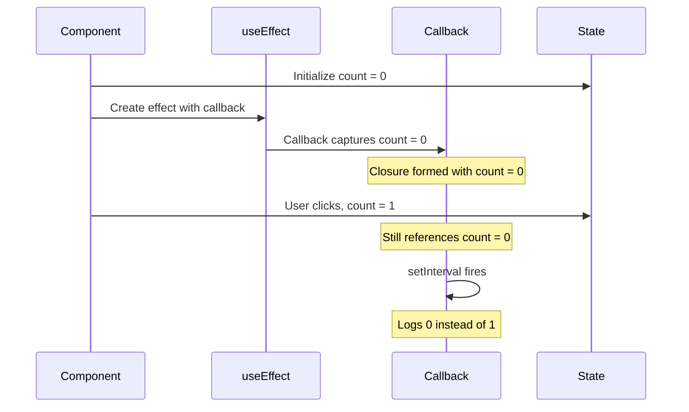
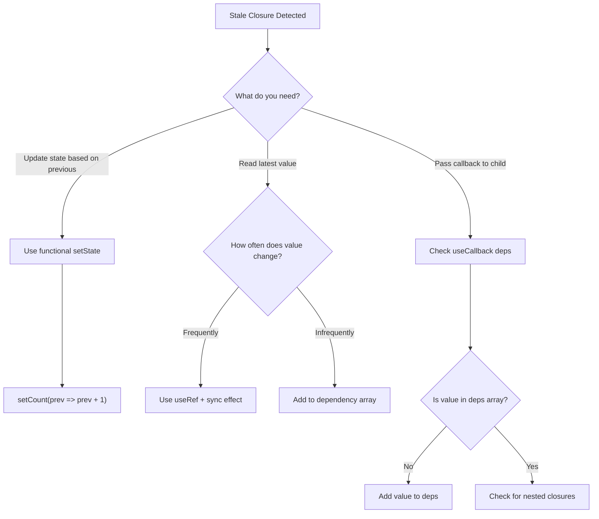

# How to Fix "Stale Closure" Issues in React Hooks

Author: [nawazdhandala](https://www.github.com/nawazdhandala)

Tags: React, Hooks, JavaScript, Closures, useState, useEffect, useCallback, Debugging

Description: Learn how to identify and fix stale closure issues in React hooks that cause components to reference outdated state values.

---

Stale closures are one of the most common bugs in React applications using hooks. They occur when a function captures an old value of a variable and continues to reference that outdated value. This guide will help you understand why stale closures happen and how to fix them.

## What Is a Stale Closure?

A closure is a function that remembers variables from its outer scope. In React hooks, this becomes problematic when a callback captures a state value at creation time but continues to use that old value after state updates.

```typescript
import React, { useState, useEffect } from 'react';

function StaleClosureExample(): React.ReactElement {
  const [count, setCount] = useState(0);

  useEffect(() => {
    // This callback captures count = 0 when the effect first runs
    const intervalId = setInterval(() => {
      // BUG: count is always 0 here due to stale closure
      console.log('Current count:', count);
    }, 1000);

    return () => clearInterval(intervalId);
  }, []); // Empty dependency array means this effect runs once

  return (
    <div>
      <p>Count: {count}</p>
      <button onClick={() => setCount(count + 1)}>Increment</button>
    </div>
  );
}

export default StaleClosureExample;
```

## Understanding Why Stale Closures Happen



## Solution 1: Add Dependencies to useEffect

Include all referenced values in the dependency array. This causes the effect to re-run when values change.

```typescript
import React, { useState, useEffect } from 'react';

function FixedWithDependencies(): React.ReactElement {
  const [count, setCount] = useState(0);

  useEffect(() => {
    const intervalId = setInterval(() => {
      console.log('Current count:', count);
    }, 1000);

    return () => clearInterval(intervalId);
  }, [count]); // count is now a dependency

  return (
    <div>
      <p>Count: {count}</p>
      <button onClick={() => setCount(count + 1)}>Increment</button>
    </div>
  );
}

export default FixedWithDependencies;
```

## Solution 2: Use Functional State Updates

When updating state based on previous value, use the functional form of setState.

```typescript
import React, { useState, useEffect } from 'react';

function FixedWithFunctionalUpdate(): React.ReactElement {
  const [count, setCount] = useState(0);

  useEffect(() => {
    const intervalId = setInterval(() => {
      // Functional update receives current state value
      setCount((prevCount) => {
        console.log('Previous count:', prevCount);
        return prevCount + 1;
      });
    }, 1000);

    return () => clearInterval(intervalId);
  }, []); // Empty deps is fine - no external values needed

  return (
    <div>
      <p>Count: {count}</p>
      <button onClick={() => setCount((prev) => prev + 1)}>Increment</button>
    </div>
  );
}

export default FixedWithFunctionalUpdate;
```

## Solution 3: Use useRef for Mutable Values

When you need to read the latest state value inside a callback, use a ref.

```typescript
import React, { useState, useEffect, useRef } from 'react';

function FixedWithRef(): React.ReactElement {
  const [count, setCount] = useState(0);
  const countRef = useRef(count);

  // Keep the ref synchronized with state
  useEffect(() => {
    countRef.current = count;
  }, [count]);

  useEffect(() => {
    const intervalId = setInterval(() => {
      // Read from ref - always gets the latest value
      console.log('Current count from ref:', countRef.current);
    }, 1000);

    return () => clearInterval(intervalId);
  }, []); // Empty deps - ref.current always has latest value

  return (
    <div>
      <p>Count: {count}</p>
      <button onClick={() => setCount(count + 1)}>Increment</button>
    </div>
  );
}

export default FixedWithRef;
```

## Custom Hook for Latest Value

```typescript
import React, { useState, useEffect, useRef } from 'react';

function useLatest<T>(value: T): React.MutableRefObject<T> {
  const ref = useRef(value);

  useEffect(() => {
    ref.current = value;
  }, [value]);

  return ref;
}

function ComponentWithCustomHook(): React.ReactElement {
  const [count, setCount] = useState(0);
  const latestCount = useLatest(count);

  useEffect(() => {
    const intervalId = setInterval(() => {
      console.log('Count:', latestCount.current);
    }, 1000);

    return () => clearInterval(intervalId);
  }, []);

  return (
    <div>
      <p>Count: {count}</p>
      <button onClick={() => setCount((c) => c + 1)}>Increment</button>
    </div>
  );
}

export { useLatest };
export default ComponentWithCustomHook;
```

## Decision Flow for Fixing Stale Closures



## Summary

| Problem | Solution | When to Use |
|---------|----------|-------------|
| Updating state in callbacks | Functional state updates | When new state depends only on previous state |
| Reading latest value | useRef + sync effect | When you need to read current value |
| Missing dependencies | Add to dependency array | When effect should re-run on value change |
| Reusable pattern | Custom useLatest hook | When you have many values to track |

Stale closures are a fundamental JavaScript behavior that becomes problematic in React. Use the ESLint exhaustive-deps rule to catch missing dependencies early.
