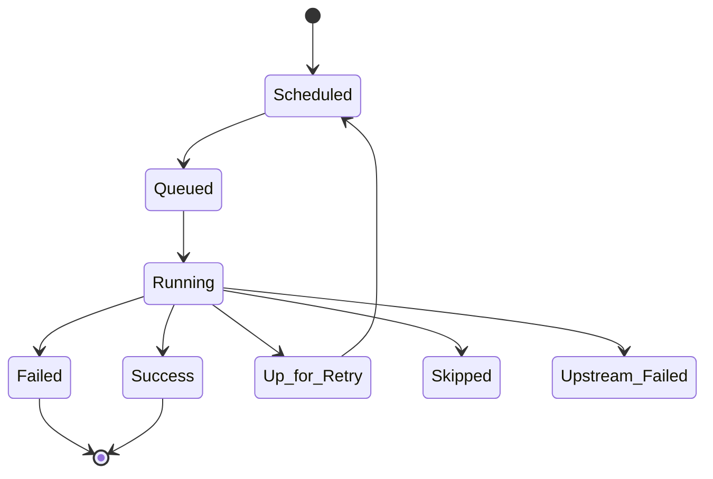

# How to Fix "Task Failed" Airflow Errors

Author: [nawazdhandala](https://www.github.com/nawazdhandala)

Tags: Apache Airflow, Debugging, Task Failures, Troubleshooting, Data Pipelines, Error Handling

Description: A practical guide to diagnosing and fixing common Apache Airflow task failures including dependency issues, resource constraints, and timeout errors.

---

When an Airflow task fails, it can bring your entire pipeline to a halt. Understanding how to quickly diagnose and fix these failures is essential for maintaining reliable data workflows. This guide covers the most common Airflow task failure scenarios and their solutions.

## Understanding Task States



## Diagnosing Task Failures

### Step 1: Check the Logs

```bash
# View task logs from CLI
airflow tasks logs <dag_id> <task_id> <execution_date>

# Example
airflow tasks logs sales_etl extract 2026-01-24

# View logs with attempt number
airflow tasks logs sales_etl extract 2026-01-24 --try-number 2
```

### Step 2: Check Task Instance Details

```python
# In Airflow UI: Browse > Task Instances
# Look for:
# - State: What happened to the task
# - Try Number: How many attempts were made
# - Duration: How long it ran
# - Log: Detailed execution logs

# Via CLI
airflow tasks state <dag_id> <task_id> <execution_date>
```

### Step 3: Common Error Patterns

```python
# Connection refused
# "Connection to database timed out"
# "Unable to connect to host"
# Solution: Check connection settings, network, credentials

# Permission denied
# "Permission denied: '/path/to/file'"
# Solution: Check file permissions, user context

# Out of memory
# "MemoryError" or "Killed"
# Solution: Increase worker resources, optimize task

# Timeout
# "Task timed out after 300 seconds"
# Solution: Increase timeout, optimize task, or split into smaller tasks

# Import error
# "ModuleNotFoundError: No module named 'xxx'"
# Solution: Install missing package, check Python environment
```

## Fixing Common Task Failures

### Connection Failures

```python
from airflow.hooks.base import BaseHook
from airflow.exceptions import AirflowException
import time

def connect_with_retry(conn_id, max_retries=3):
    """Connect to external service with retry logic."""
    last_exception = None

    for attempt in range(max_retries):
        try:
            conn = BaseHook.get_connection(conn_id)
            # Test the connection
            test_connection(conn)
            return conn
        except Exception as e:
            last_exception = e
            wait_time = 2 ** attempt  # Exponential backoff
            print(f"Connection attempt {attempt + 1} failed: {e}")
            print(f"Retrying in {wait_time} seconds...")
            time.sleep(wait_time)

    raise AirflowException(f"Failed to connect after {max_retries} attempts: {last_exception}")

# Use in task
def my_task(**context):
    conn = connect_with_retry('my_database')
    # Use connection
```

### Verify Connection Before Task Runs

```python
from airflow.sensors.base import BaseSensorOperator
from airflow.utils.decorators import apply_defaults

class ConnectionSensor(BaseSensorOperator):
    """Sensor that waits for a connection to be available."""

    @apply_defaults
    def __init__(self, conn_id, *args, **kwargs):
        super().__init__(*args, **kwargs)
        self.conn_id = conn_id

    def poke(self, context):
        try:
            conn = BaseHook.get_connection(self.conn_id)
            # Test connection is valid
            return True
        except Exception as e:
            self.log.warning(f"Connection not ready: {e}")
            return False

# Use in DAG
with DAG('connection_check_dag', ...) as dag:

    wait_for_db = ConnectionSensor(
        task_id='wait_for_db',
        conn_id='warehouse_db',
        timeout=300,
        poke_interval=30,
        mode='poke',
    )

    process_data = PythonOperator(
        task_id='process_data',
        python_callable=process_function,
    )

    wait_for_db >> process_data
```

### Timeout Failures

```python
# Task-level timeout
slow_task = PythonOperator(
    task_id='slow_task',
    python_callable=long_running_function,
    execution_timeout=timedelta(hours=2),  # Kill if exceeds 2 hours
)

# DAG-level timeout
with DAG(
    dag_id='timeout_dag',
    dagrun_timeout=timedelta(hours=4),  # Entire DAG run timeout
    ...
) as dag:
    pass

# Handle timeout gracefully in code
import signal

class TimeoutError(Exception):
    pass

def timeout_handler(signum, frame):
    raise TimeoutError("Task timed out")

def task_with_timeout(**context):
    # Set timeout for this function
    signal.signal(signal.SIGALRM, timeout_handler)
    signal.alarm(300)  # 5 minutes

    try:
        result = long_running_operation()
        signal.alarm(0)  # Cancel the alarm
        return result
    except TimeoutError:
        # Clean up and raise
        cleanup_partial_work()
        raise
```

### Memory Failures

```python
# Process data in chunks to avoid memory issues
def process_large_file(**context):
    """Process large file in memory-efficient chunks."""
    chunk_size = 10000
    input_file = '/data/large_file.csv'

    for chunk_df in pd.read_csv(input_file, chunksize=chunk_size):
        process_chunk(chunk_df)

        # Explicitly free memory
        del chunk_df
        gc.collect()

    return "Processing complete"

# Use generators instead of loading all data
def stream_records(query):
    """Stream records instead of loading all at once."""
    connection = get_database_connection()
    cursor = connection.cursor('server_side_cursor')
    cursor.execute(query)

    while True:
        rows = cursor.fetchmany(1000)
        if not rows:
            break
        yield from rows

    cursor.close()

def memory_efficient_task(**context):
    for record in stream_records("SELECT * FROM large_table"):
        process_record(record)
```

### Dependency Failures

```python
# Check if upstream data exists before processing
from airflow.sensors.filesystem import FileSensor
from airflow.providers.amazon.aws.sensors.s3 import S3KeySensor

with DAG('dependency_check_dag', ...) as dag:

    # Wait for file to exist
    wait_for_file = FileSensor(
        task_id='wait_for_file',
        filepath='/data/input/{{ ds }}/data.csv',
        poke_interval=60,
        timeout=3600,
    )

    # Wait for S3 object
    wait_for_s3 = S3KeySensor(
        task_id='wait_for_s3',
        bucket_key='data/{{ ds }}/output.parquet',
        bucket_name='my-bucket',
        poke_interval=60,
        timeout=3600,
    )

    process = PythonOperator(
        task_id='process',
        python_callable=process_data,
    )

    [wait_for_file, wait_for_s3] >> process
```

### Import and Environment Failures

```python
# Check imports at task runtime, not DAG parse time
def task_with_imports(**context):
    # Import inside task function
    try:
        import pandas as pd
        import numpy as np
    except ImportError as e:
        raise AirflowException(f"Missing required package: {e}")

    # Now use the imports
    df = pd.DataFrame()

# Create virtualenv for isolated dependencies
from airflow.operators.python import PythonVirtualenvOperator

virtualenv_task = PythonVirtualenvOperator(
    task_id='virtualenv_task',
    python_callable=my_function,
    requirements=['pandas==2.0.0', 'numpy==1.24.0'],
    system_site_packages=False,
)
```

## Implementing Robust Error Handling

### Retry Configuration

```python
default_args = {
    'retries': 3,
    'retry_delay': timedelta(minutes=5),
    'retry_exponential_backoff': True,
    'max_retry_delay': timedelta(hours=1),
}

# Different retry settings for different failure types
def should_retry(exception):
    """Determine if exception is retryable."""
    retryable_exceptions = (
        ConnectionError,
        TimeoutError,
        IOError,
    )
    return isinstance(exception, retryable_exceptions)

# Custom retry logic in task
def task_with_custom_retry(**context):
    retryable_errors = (ConnectionError, TimeoutError)
    max_attempts = 3

    for attempt in range(max_attempts):
        try:
            return execute_operation()
        except retryable_errors as e:
            if attempt == max_attempts - 1:
                raise
            wait = 2 ** attempt * 60  # Exponential backoff
            print(f"Attempt {attempt + 1} failed, retrying in {wait}s: {e}")
            time.sleep(wait)
        except Exception as e:
            # Non-retryable error, fail immediately
            raise AirflowException(f"Non-retryable error: {e}")
```

### Failure Callbacks

```python
def task_failure_callback(context):
    """Handle task failure."""
    dag_id = context['dag'].dag_id
    task_id = context['task_instance'].task_id
    execution_date = context['execution_date']
    exception = context.get('exception')

    # Send alert
    message = f"""
    Task Failed!
    DAG: {dag_id}
    Task: {task_id}
    Execution Date: {execution_date}
    Error: {exception}
    """
    send_slack_alert(message)

    # Log to monitoring system
    log_failure_metric(dag_id, task_id)

def dag_failure_callback(context):
    """Handle DAG failure."""
    send_pagerduty_alert(
        f"DAG {context['dag'].dag_id} failed"
    )

with DAG(
    dag_id='callbacks_dag',
    on_failure_callback=dag_failure_callback,
    ...
) as dag:

    task = PythonOperator(
        task_id='task',
        python_callable=my_function,
        on_failure_callback=task_failure_callback,
    )
```

### Dead Letter Queue Pattern

```python
def process_with_dlq(**context):
    """Process records, sending failures to dead letter queue."""
    records = get_records()
    success_count = 0
    failure_count = 0

    for record in records:
        try:
            process_record(record)
            success_count += 1
        except Exception as e:
            # Send to dead letter queue instead of failing task
            send_to_dlq(record, str(e))
            failure_count += 1

    # Push metrics for monitoring
    context['ti'].xcom_push(key='success_count', value=success_count)
    context['ti'].xcom_push(key='failure_count', value=failure_count)

    # Fail task if too many failures
    failure_rate = failure_count / (success_count + failure_count)
    if failure_rate > 0.1:  # More than 10% failures
        raise AirflowException(
            f"Too many failures: {failure_count}/{success_count + failure_count}"
        )

    return f"Processed {success_count} records, {failure_count} sent to DLQ"
```

## Debugging Strategies

### Run Task Locally

```bash
# Test task without scheduler
airflow tasks test <dag_id> <task_id> <execution_date>

# Example
airflow tasks test sales_etl extract 2026-01-24

# With verbose output
airflow tasks test sales_etl extract 2026-01-24 -v
```

### Debug Mode in DAG

```python
# Add debug mode for local testing
DEBUG = os.getenv('AIRFLOW_DEBUG', 'false').lower() == 'true'

def my_task(**context):
    if DEBUG:
        print("Debug mode enabled")
        print(f"Context: {context}")
        print(f"Execution date: {context['ds']}")

    # Regular task logic
    result = process_data()

    if DEBUG:
        print(f"Result: {result}")

    return result
```

### Check Scheduler and Worker Logs

```bash
# Scheduler logs
tail -f $AIRFLOW_HOME/logs/scheduler/latest/scheduler.log

# Worker logs (Celery)
tail -f $AIRFLOW_HOME/logs/worker/latest/worker.log

# Check for common issues
grep -i "error\|exception\|failed" $AIRFLOW_HOME/logs/scheduler/latest/*.log
```

## Monitoring Task Health

```python
# Add task-level metrics
from airflow.models import Variable
import time

def instrumented_task(**context):
    """Task with built-in monitoring."""
    start_time = time.time()
    task_id = context['task_instance'].task_id

    try:
        result = execute_main_logic()

        # Record success metric
        duration = time.time() - start_time
        record_metric(f'airflow.task.{task_id}.duration', duration)
        record_metric(f'airflow.task.{task_id}.success', 1)

        return result
    except Exception as e:
        # Record failure metric
        record_metric(f'airflow.task.{task_id}.failure', 1)
        raise

# SLA monitoring
with DAG(
    dag_id='sla_monitored_dag',
    sla_miss_callback=sla_alert_function,
    ...
) as dag:

    critical_task = PythonOperator(
        task_id='critical_task',
        python_callable=critical_function,
        sla=timedelta(hours=1),  # Alert if not complete within 1 hour
    )
```

## Prevention Checklist

1. **Add appropriate timeouts** to all tasks
2. **Configure retries** with exponential backoff
3. **Use sensors** to wait for dependencies
4. **Implement failure callbacks** for alerting
5. **Process data in chunks** to avoid memory issues
6. **Test tasks locally** before deployment
7. **Monitor task duration trends** to catch degradation early
8. **Use dead letter queues** for partial failures

---

Airflow task failures are inevitable, but with proper error handling, retry logic, and monitoring, you can minimize their impact. The key is to make failures visible (through alerts and logging), recoverable (through retries and idempotent operations), and debuggable (through detailed logs and metrics). Start with the logs, identify the failure pattern, and apply the appropriate fix from this guide.
