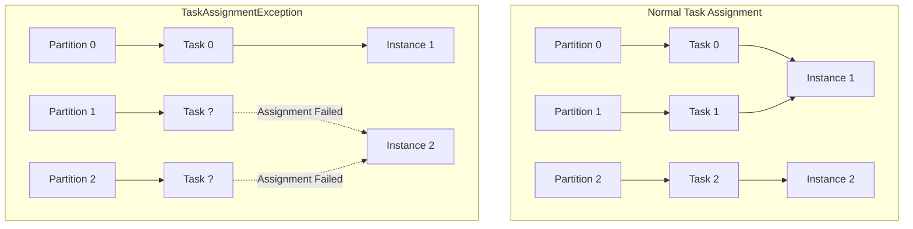
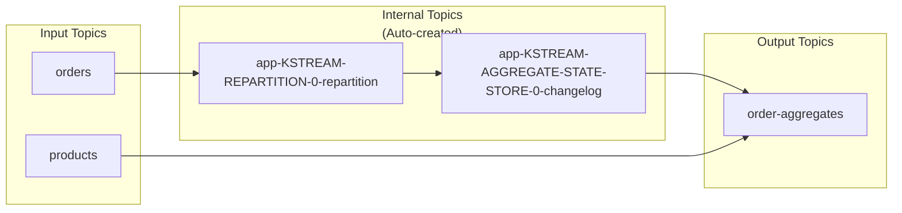
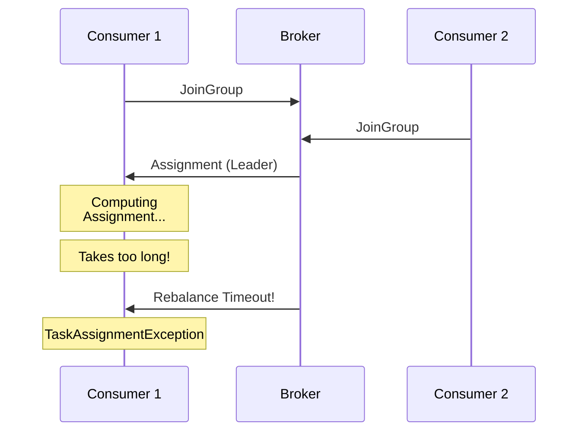
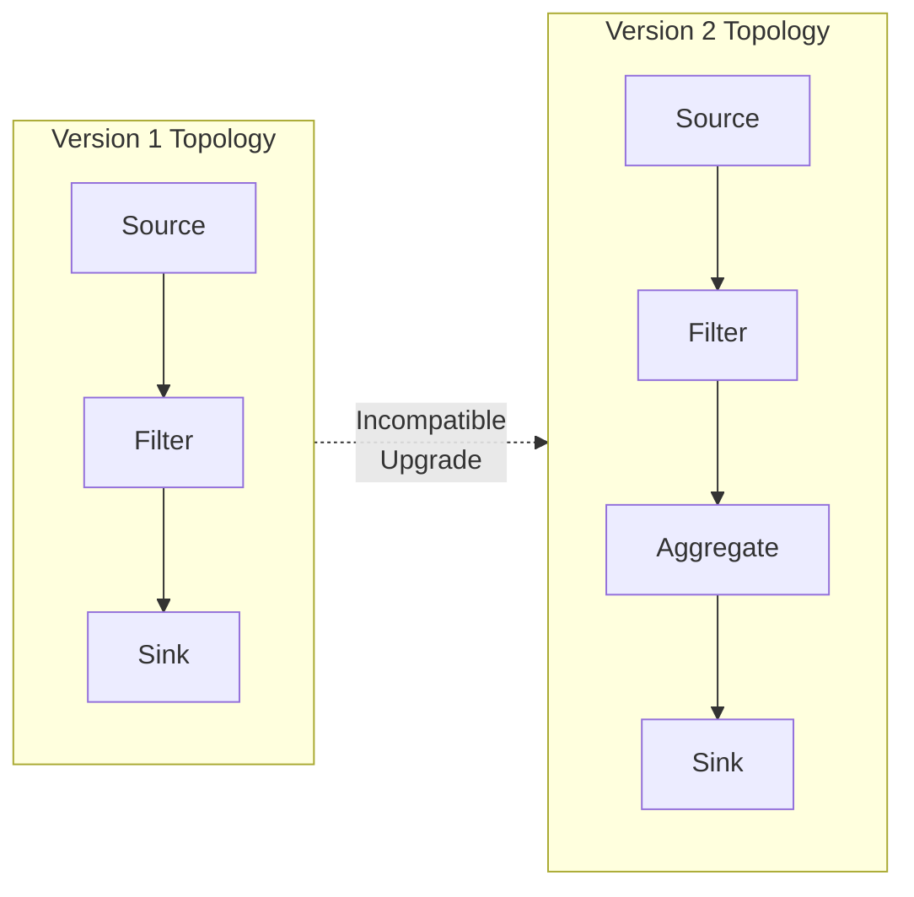

# How to Fix 'TaskAssignmentException' in Kafka Streams

Author: [nawazdhandala](https://www.github.com/nawazdhandala)

Tags: Apache Kafka, Kafka Streams, TaskAssignmentException, Stream Processing, Debugging, Java, Troubleshooting

Description: Learn how to diagnose and fix TaskAssignmentException errors in Kafka Streams applications, including partition assignment issues and rebalancing problems.

---

The `TaskAssignmentException` in Kafka Streams occurs when the stream processing application fails to properly assign partitions to tasks during rebalancing. This error can cause application restarts, processing delays, and data inconsistencies. This guide covers the root causes and practical solutions.

## Understanding the Exception



### Common Error Messages

```
org.apache.kafka.streams.errors.TaskAssignmentException:
    Task assignment failed due to following errors:
    - assigned partitions [topic-0, topic-1] have mismatched task ids

org.apache.kafka.streams.errors.TaskAssignmentException:
    Topic not found: internal-changelog-topic

org.apache.kafka.streams.errors.TaskAssignmentException:
    Standby task assignment failed: insufficient instances available
```

## Root Causes and Solutions

### Cause 1: Application ID Mismatch

Different application instances using different `application.id` values will not coordinate properly and cause assignment failures.

```java
// WRONG: Hardcoded unique IDs per instance
Properties props = new Properties();
props.put(StreamsConfig.APPLICATION_ID_CONFIG, "my-app-" + UUID.randomUUID());

// CORRECT: Same application ID across all instances
Properties props = new Properties();
props.put(StreamsConfig.APPLICATION_ID_CONFIG, "my-streams-app");

// The APPLICATION_ID_CONFIG is used for:
// 1. Consumer group coordination
// 2. Internal topic naming (changelogs, repartition topics)
// 3. State store directory naming
```

Verify all instances share the same application ID:

```bash
# List consumer groups to check application IDs
kafka-consumer-groups.sh --bootstrap-server localhost:9092 --list | grep streams

# Check members of a specific streams application
kafka-consumer-groups.sh --bootstrap-server localhost:9092 \
    --describe --group my-streams-app
```

### Cause 2: Internal Topic Issues

Kafka Streams creates internal topics for changelogs and repartitioning. Missing or misconfigured topics cause assignment failures.



**Solution: Verify internal topics exist and have correct configuration:**

```bash
# List all topics for your application
kafka-topics.sh --bootstrap-server localhost:9092 --list \
    | grep "my-streams-app"

# Check internal topic configuration
kafka-topics.sh --bootstrap-server localhost:9092 \
    --describe --topic my-streams-app-KSTREAM-AGGREGATE-STATE-STORE-0-changelog

# If topics are missing or misconfigured, reset the application
kafka-streams-application-reset.sh \
    --application-id my-streams-app \
    --bootstrap-servers localhost:9092 \
    --input-topics orders,products \
    --intermediate-topics my-streams-app-KSTREAM-REPARTITION-0-repartition
```

**Configure internal topic settings in your application:**

```java
Properties props = new Properties();
props.put(StreamsConfig.APPLICATION_ID_CONFIG, "my-streams-app");
props.put(StreamsConfig.BOOTSTRAP_SERVERS_CONFIG, "localhost:9092");

// Configure replication for internal topics
// Should match your cluster's replication factor
props.put(StreamsConfig.REPLICATION_FACTOR_CONFIG, 3);

// Topology optimization reduces unnecessary repartitioning
props.put(StreamsConfig.TOPOLOGY_OPTIMIZATION_CONFIG, StreamsConfig.OPTIMIZE);

// Configure default topic settings via admin client
Map<String, String> topicConfigs = new HashMap<>();
topicConfigs.put(TopicConfig.CLEANUP_POLICY_CONFIG, TopicConfig.CLEANUP_POLICY_COMPACT);
topicConfigs.put(TopicConfig.RETENTION_MS_CONFIG, "-1");  // Keep forever for changelogs
props.put(StreamsConfig.topicPrefix("changelog."), topicConfigs);
```

### Cause 3: Partition Count Mismatch

When input topics have different partition counts, repartitioning issues can cause task assignment failures.

```java
// Example: Joining topics with different partition counts
StreamsBuilder builder = new StreamsBuilder();

// orders topic has 10 partitions
KStream<String, Order> orders = builder.stream("orders");

// products topic has 5 partitions - MISMATCH!
KTable<String, Product> products = builder.table("products");

// This join requires repartitioning
KStream<String, EnrichedOrder> enriched = orders.join(
    products,
    (order, product) -> new EnrichedOrder(order, product),
    Joined.with(Serdes.String(), orderSerde, productSerde)
);
```

**Solution: Ensure consistent partition counts:**

```bash
# Check partition counts
kafka-topics.sh --bootstrap-server localhost:9092 \
    --describe --topic orders | grep PartitionCount

kafka-topics.sh --bootstrap-server localhost:9092 \
    --describe --topic products | grep PartitionCount

# Add partitions to match (cannot reduce partitions)
kafka-topics.sh --bootstrap-server localhost:9092 \
    --alter --topic products --partitions 10
```

**Or handle in code with explicit repartitioning:**

```java
// Explicitly repartition to ensure co-partitioning
StreamsBuilder builder = new StreamsBuilder();

KStream<String, Order> orders = builder.stream("orders");
KTable<String, Product> products = builder.table("products");

// Repartition orders by product ID before joining
KStream<String, Order> repartitionedOrders = orders
    .selectKey((key, order) -> order.getProductId())
    .repartition(Repartitioned.with(Serdes.String(), orderSerde)
        .withName("orders-by-product")
        .withNumberOfPartitions(10));

KStream<String, EnrichedOrder> enriched = repartitionedOrders.join(
    products,
    (order, product) -> new EnrichedOrder(order, product)
);
```

### Cause 4: Rebalancing Timeouts

Long-running rebalances can exceed timeout limits, causing task assignment failures.



**Solution: Tune rebalancing timeouts:**

```java
Properties props = new Properties();
props.put(StreamsConfig.APPLICATION_ID_CONFIG, "my-streams-app");

// Increase session timeout for long initializations
// Default: 10000 (10 seconds)
props.put(ConsumerConfig.SESSION_TIMEOUT_MS_CONFIG, 30000);

// Increase max poll interval for slow processing
// Default: 300000 (5 minutes)
props.put(ConsumerConfig.MAX_POLL_INTERVAL_MS_CONFIG, 600000);

// Heartbeat interval should be 1/3 of session timeout
props.put(ConsumerConfig.HEARTBEAT_INTERVAL_MS_CONFIG, 10000);

// Increase rebalance timeout for large state restoration
// Default: 60000 (1 minute)
props.put(StreamsConfig.consumerPrefix(ConsumerConfig.MAX_POLL_INTERVAL_MS_CONFIG), 900000);
```

### Cause 5: State Store Restoration Failures

Large state stores take time to restore, which can cause assignment timeouts.

```java
// Configure state restoration behavior
Properties props = new Properties();

// Limit number of records restored in each poll
// Lower values give more frequent heartbeats
props.put(StreamsConfig.consumerPrefix(ConsumerConfig.MAX_POLL_RECORDS_CONFIG), 100);

// Use standby replicas to speed up failover
// Keeps warm copies of state on other instances
props.put(StreamsConfig.NUM_STANDBY_REPLICAS_CONFIG, 1);

// Configure state directory with fast storage
props.put(StreamsConfig.STATE_DIR_CONFIG, "/ssd/kafka-streams");

// Enable state store caching to reduce changelog traffic
props.put(StreamsConfig.CACHE_MAX_BYTES_BUFFERING_CONFIG, 100 * 1024 * 1024);  // 100MB
```

**Monitor state restoration progress:**

```java
// Add a state restoration listener
KafkaStreams streams = new KafkaStreams(topology, props);

streams.setGlobalStateRestoreListener(new StateRestoreListener() {
    @Override
    public void onRestoreStart(TopicPartition partition, String storeName,
                               long startingOffset, long endingOffset) {
        log.info("Starting restore for {} store {}: {} to {}",
            partition, storeName, startingOffset, endingOffset);
    }

    @Override
    public void onBatchRestored(TopicPartition partition, String storeName,
                                long batchEndOffset, long numRestored) {
        log.info("Restored {} records for {} store {}",
            numRestored, partition, storeName);
    }

    @Override
    public void onRestoreEnd(TopicPartition partition, String storeName,
                             long totalRestored) {
        log.info("Completed restore for {} store {}: {} records",
            partition, storeName, totalRestored);
    }
});
```

### Cause 6: Topology Changes Between Deployments

Changing the stream topology without resetting can cause incompatible task assignments.



**Solution: Reset application when topology changes:**

```bash
# Stop all application instances first

# Reset the streams application
kafka-streams-application-reset.sh \
    --application-id my-streams-app \
    --bootstrap-servers localhost:9092 \
    --input-topics orders \
    --to-earliest

# For more aggressive reset (deletes internal topics)
kafka-streams-application-reset.sh \
    --application-id my-streams-app \
    --bootstrap-servers localhost:9092 \
    --input-topics orders \
    --to-earliest \
    --force
```

**Or handle programmatically:**

```java
public class StreamsApp {
    public static void main(String[] args) {
        Properties props = buildProperties();
        Topology topology = buildTopology();

        KafkaStreams streams = new KafkaStreams(topology, props);

        // Clean up local state on startup if needed
        if (args.length > 0 && args[0].equals("--reset")) {
            streams.cleanUp();
            log.info("Cleaned up local state directory");
        }

        streams.start();

        Runtime.getRuntime().addShutdownHook(new Thread(streams::close));
    }
}
```

## Handling TaskAssignmentException Gracefully

Implement proper exception handling to recover from assignment failures:

```java
public class ResilientStreamsApp {
    private static final Logger log = LoggerFactory.getLogger(ResilientStreamsApp.class);
    private static final int MAX_RETRIES = 5;
    private static final Duration RETRY_DELAY = Duration.ofSeconds(30);

    public static void main(String[] args) {
        int retryCount = 0;

        while (retryCount < MAX_RETRIES) {
            try {
                runStreamsApp();
                break;  // Exit loop on clean shutdown
            } catch (StreamsException e) {
                if (e.getCause() instanceof TaskAssignmentException) {
                    retryCount++;
                    log.warn("TaskAssignmentException caught, attempt {} of {}",
                        retryCount, MAX_RETRIES, e);

                    if (retryCount < MAX_RETRIES) {
                        log.info("Waiting {} before retry", RETRY_DELAY);
                        sleep(RETRY_DELAY);
                    }
                } else {
                    throw e;  // Re-throw other exceptions
                }
            }
        }

        if (retryCount >= MAX_RETRIES) {
            log.error("Max retries exceeded, exiting");
            System.exit(1);
        }
    }

    private static void runStreamsApp() {
        Properties props = buildProperties();
        Topology topology = buildTopology();

        KafkaStreams streams = new KafkaStreams(topology, props);

        // Set up state listener to detect issues early
        streams.setStateListener((newState, oldState) -> {
            log.info("State changed from {} to {}", oldState, newState);

            if (newState == KafkaStreams.State.ERROR) {
                log.error("Streams entered ERROR state");
            }
        });

        // Set up uncaught exception handler
        streams.setUncaughtExceptionHandler(exception -> {
            log.error("Uncaught exception in streams", exception);

            if (exception instanceof TaskAssignmentException) {
                // Try to recover by replacing the thread
                return StreamsUncaughtExceptionHandler.StreamThreadExceptionResponse.REPLACE_THREAD;
            }

            // For other exceptions, shutdown the client
            return StreamsUncaughtExceptionHandler.StreamThreadExceptionResponse.SHUTDOWN_CLIENT;
        });

        streams.start();

        // Wait for streams to finish
        Runtime.getRuntime().addShutdownHook(new Thread(() -> {
            log.info("Shutdown hook triggered");
            streams.close(Duration.ofSeconds(30));
        }));
    }

    private static void sleep(Duration duration) {
        try {
            Thread.sleep(duration.toMillis());
        } catch (InterruptedException e) {
            Thread.currentThread().interrupt();
        }
    }
}
```

## Diagnostic Commands

Use these commands to diagnose task assignment issues:

```bash
# Check consumer group state and assignments
kafka-consumer-groups.sh --bootstrap-server localhost:9092 \
    --describe --group my-streams-app --state

# Check lag for all partitions
kafka-consumer-groups.sh --bootstrap-server localhost:9092 \
    --describe --group my-streams-app

# List all consumer group members
kafka-consumer-groups.sh --bootstrap-server localhost:9092 \
    --describe --group my-streams-app --members --verbose

# Check internal topic health
kafka-topics.sh --bootstrap-server localhost:9092 \
    --describe --topic my-streams-app-KSTREAM-AGGREGATE-STATE-STORE-0-changelog

# Check broker logs for rebalancing issues
grep -i "rebalance\|assignment\|task" /var/log/kafka/server.log | tail -100
```

## Monitoring Task Assignments

Set up monitoring to detect assignment issues early:

```java
// Expose Kafka Streams metrics via JMX
Properties props = new Properties();
props.put(StreamsConfig.METRICS_RECORDING_LEVEL_CONFIG, "DEBUG");

// Create streams with metrics reporters
KafkaStreams streams = new KafkaStreams(topology, props);

// Access metrics programmatically
for (Metric metric : streams.metrics().values()) {
    if (metric.metricName().name().contains("task")) {
        log.info("Metric {}: {}", metric.metricName(), metric.metricValue());
    }
}
```

Key metrics to monitor:

| Metric | Description | Alert Threshold |
|--------|-------------|-----------------|
| `task-created-rate` | Rate of task creation | Sudden spikes |
| `task-closed-rate` | Rate of task closure | Sudden spikes |
| `rebalance-total` | Total rebalances | Frequent rebalances |
| `rebalance-latency-avg` | Average rebalance time | > 60 seconds |
| `restoration-rate` | State restoration rate | Prolonged restoration |

## Best Practices

1. **Use consistent application IDs** - Same ID across all instances
2. **Pre-create topics** - Create input topics with correct partition counts before starting
3. **Configure adequate timeouts** - Allow time for state restoration
4. **Use standby replicas** - Speeds up failover and reduces rebalancing time
5. **Monitor rebalancing** - Track rebalance frequency and duration
6. **Test topology changes** - Validate in staging before production
7. **Implement graceful shutdown** - Allow in-flight processing to complete
8. **Use incremental cooperative rebalancing** - Reduces stop-the-world rebalancing

```java
// Enable cooperative rebalancing (Kafka 2.4+)
Properties props = new Properties();
props.put(StreamsConfig.UPGRADE_FROM_CONFIG, StreamsConfig.UPGRADE_FROM_24);
props.put(ConsumerConfig.PARTITION_ASSIGNMENT_STRATEGY_CONFIG,
    CooperativeStickyAssignor.class.getName());
```

---

TaskAssignmentException errors often indicate configuration mismatches or infrastructure issues rather than application bugs. Start by verifying consistent configuration across instances, checking internal topic health, and ensuring adequate timeout settings. With proper monitoring and graceful error handling, your Kafka Streams applications can recover automatically from most assignment failures.
