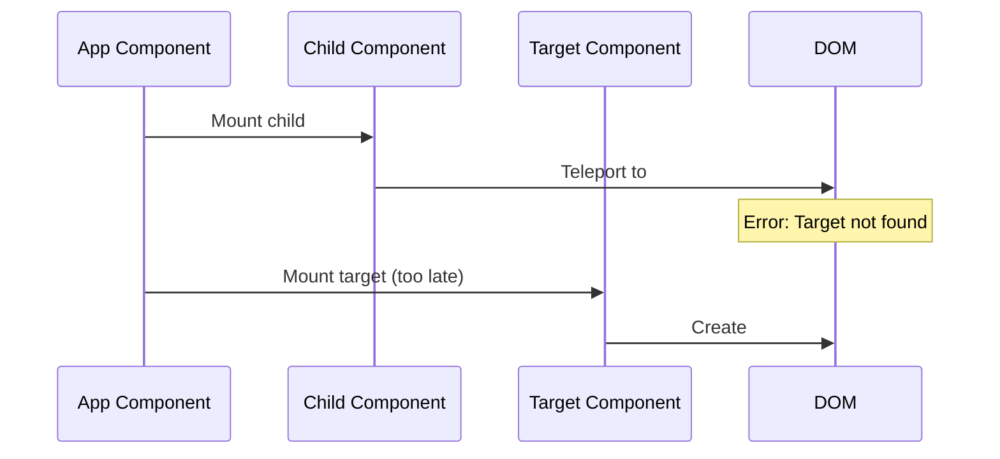
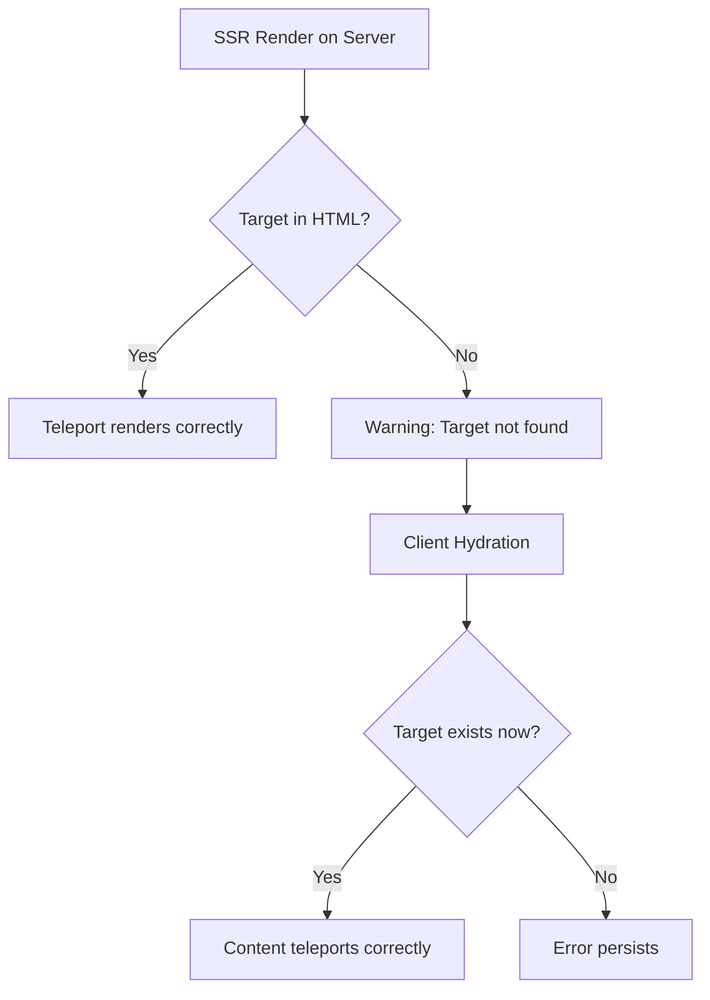

# How to Fix 'Teleport Target Not Found' Errors

Author: [nawazdhandala](https://www.github.com/nawazdhandala)

Tags: Vue, Vue3, Teleport, Components, Frontend, JavaScript, Debugging

Description: Resolve Vue 3 Teleport target not found errors by understanding mounting order, dynamic targets, and SSR considerations.

---

Vue 3's Teleport component lets you render content in a different part of the DOM tree, which is useful for modals, tooltips, and notifications. However, you may encounter the "Teleport target not found" warning when the target element does not exist at render time.

## Understanding Teleport

Teleport moves content to a specified DOM element:

```vue
<!-- Modal content teleported to body -->
<Teleport to="body">
  <div class="modal">
    Modal content here
  </div>
</Teleport>
```

The error occurs when the `to` target does not exist in the DOM when the Teleport component renders.

## Common Causes and Solutions

### 1. Target Element Missing from HTML

The most common cause is forgetting to add the target element to your HTML.

**Problem:**

```vue
<template>
  <!-- This fails if #modal-container does not exist -->
  <Teleport to="#modal-container">
    <div class="modal">Content</div>
  </Teleport>
</template>
```

**Solution:**

Add the target element to your `index.html`:

```html
<!DOCTYPE html>
<html>
<head>
  <title>My App</title>
</head>
<body>
  <div id="app"></div>
  <!-- Add teleport targets here -->
  <div id="modal-container"></div>
  <div id="notification-container"></div>
</body>
</html>
```

### 2. Mounting Order Issues

When the target is another Vue component, it may not be mounted yet.



**Problem:**

```vue
<!-- App.vue -->
<template>
  <ChildComponent />
  <TeleportTarget />  <!-- Mounted after ChildComponent -->
</template>
```

```vue
<!-- ChildComponent.vue -->
<template>
  <Teleport to="#teleport-target">
    <!-- Target does not exist yet -->
    <div>Teleported content</div>
  </Teleport>
</template>
```

**Solution: Use Deferred Teleport (Vue 3.5+)**

Vue 3.5 introduced the `defer` prop that waits for the target:

```vue
<template>
  <!-- Waits for target after current render cycle -->
  <Teleport to="#teleport-target" defer>
    <div>Teleported content</div>
  </Teleport>
</template>
```

**Solution: Conditional Rendering**

For Vue versions before 3.5, use conditional rendering:

```vue
<script setup>
import { ref, onMounted } from 'vue';

const targetReady = ref(false);

onMounted(() => {
  // Check if target exists after mount
  if (document.querySelector('#teleport-target')) {
    targetReady.value = true;
  }
});
</script>

<template>
  <Teleport v-if="targetReady" to="#teleport-target">
    <div>Teleported content</div>
  </Teleport>
</template>
```

### 3. Dynamic Teleport Targets

When the target selector is dynamic, ensure the element exists before rendering.

**Problem:**

```vue
<script setup>
import { ref } from 'vue';

const targetId = ref('container-1');

function changeTarget() {
  // Target might not exist yet
  targetId.value = 'container-2';
}
</script>

<template>
  <Teleport :to="`#${targetId}`">
    <div>Dynamic teleport</div>
  </Teleport>
</template>
```

**Solution:**

```vue
<script setup>
import { ref, computed, nextTick } from 'vue';

const targetId = ref('container-1');
const isTargetReady = ref(true);

async function changeTarget(newId) {
  // Disable teleport during transition
  isTargetReady.value = false;
  targetId.value = newId;

  await nextTick();

  // Verify target exists
  if (document.querySelector(`#${newId}`)) {
    isTargetReady.value = true;
  } else {
    console.error(`Teleport target #${newId} not found`);
  }
}
</script>

<template>
  <Teleport v-if="isTargetReady" :to="`#${targetId}`">
    <div>Dynamic teleport</div>
  </Teleport>
</template>
```

### 4. Disabled State for Fallback

Use the `disabled` prop to keep content in place when the target is unavailable:

```vue
<script setup>
import { ref, onMounted } from 'vue';

const targetExists = ref(false);

onMounted(() => {
  targetExists.value = !!document.querySelector('#modal-root');
});
</script>

<template>
  <!-- When disabled, content renders in place -->
  <Teleport to="#modal-root" :disabled="!targetExists">
    <div class="modal">
      This renders here if #modal-root is missing
    </div>
  </Teleport>
</template>
```

## SSR Hydration Considerations

In server-side rendering, the target might not exist during initial render.



**Solution for Nuxt:**

```vue
<script setup>
// Only teleport on client side
const isMounted = ref(false);

onMounted(() => {
  isMounted.value = true;
});
</script>

<template>
  <ClientOnly>
    <Teleport to="body">
      <div class="modal">SSR-safe modal</div>
    </Teleport>
  </ClientOnly>
</template>
```

**Solution for Generic Vue SSR:**

```vue
<script setup>
import { ref, onMounted } from 'vue';

const isClient = ref(false);

onMounted(() => {
  isClient.value = true;
});
</script>

<template>
  <Teleport v-if="isClient" to="#notification-area">
    <div class="notification">Client-only notification</div>
  </Teleport>
</template>
```

## Creating a Safe Teleport Wrapper

Build a reusable component that handles all edge cases:

```vue
<!-- SafeTeleport.vue -->
<script setup>
import { ref, onMounted, watch, nextTick } from 'vue';

const props = defineProps({
  to: {
    type: String,
    required: true
  },
  disabled: {
    type: Boolean,
    default: false
  },
  fallbackInPlace: {
    type: Boolean,
    default: true
  }
});

const emit = defineEmits(['target-missing']);

const targetReady = ref(false);
const shouldDisable = ref(false);

async function checkTarget() {
  await nextTick();

  const targetElement = document.querySelector(props.to);

  if (targetElement) {
    targetReady.value = true;
    shouldDisable.value = false;
  } else {
    targetReady.value = props.fallbackInPlace;
    shouldDisable.value = true;
    emit('target-missing', props.to);
  }
}

onMounted(checkTarget);

watch(() => props.to, checkTarget);
</script>

<template>
  <Teleport
    v-if="targetReady"
    :to="to"
    :disabled="disabled || shouldDisable"
  >
    <slot />
  </Teleport>
</template>
```

Usage:

```vue
<script setup>
function handleMissingTarget(selector) {
  console.warn(`Teleport target ${selector} not found, rendering in place`);
}
</script>

<template>
  <SafeTeleport
    to="#modal-root"
    @target-missing="handleMissingTarget"
  >
    <MyModal />
  </SafeTeleport>
</template>
```

## Multiple Teleports to Same Target

When multiple components teleport to the same target, they append in order:

```vue
<!-- Component A -->
<Teleport to="#notifications">
  <div>First notification</div>
</Teleport>

<!-- Component B -->
<Teleport to="#notifications">
  <div>Second notification</div>
</Teleport>
```

Results in:

```html
<div id="notifications">
  <div>First notification</div>
  <div>Second notification</div>
</div>
```

## Debugging Tips

### Check Target Existence

```javascript
// In browser console or component
function debugTeleportTarget(selector) {
  const target = document.querySelector(selector);

  if (!target) {
    console.error(`Teleport target "${selector}" not found`);
    console.log('Available IDs:',
      [...document.querySelectorAll('[id]')].map(el => el.id)
    );
    return false;
  }

  console.log('Target found:', target);
  return true;
}
```

### Vue DevTools

Vue DevTools shows teleported content with a "Teleport" badge. Check that:

1. The Teleport component is rendered
2. The target selector matches an existing element
3. The disabled prop is not preventing teleportation

## Summary

| Issue | Solution |
|-------|----------|
| Target missing from HTML | Add element to index.html |
| Target not mounted yet | Use `defer` prop (Vue 3.5+) or conditional rendering |
| Dynamic target changes | Verify target exists before switching |
| SSR hydration | Use client-only rendering |
| Graceful fallback | Use `disabled` prop for in-place rendering |

The Teleport component is powerful for managing DOM placement, but it requires the target element to exist at render time. Using the `defer` prop in Vue 3.5+ or implementing conditional rendering ensures your teleported content always has a valid destination.
