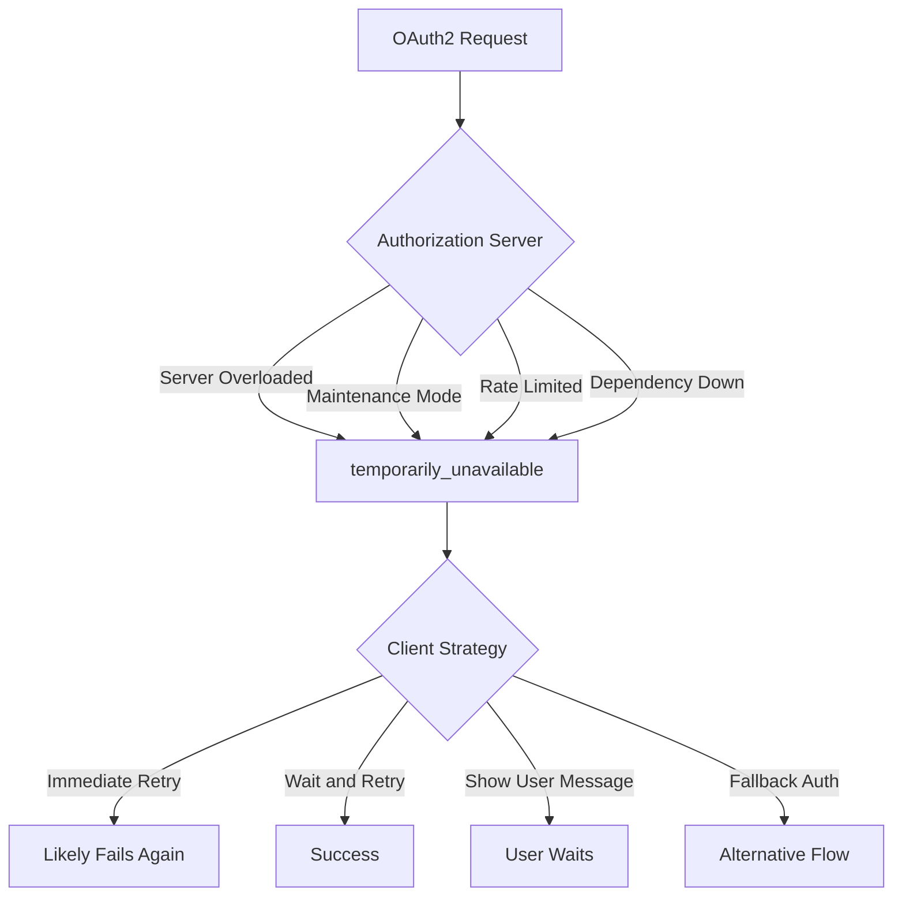
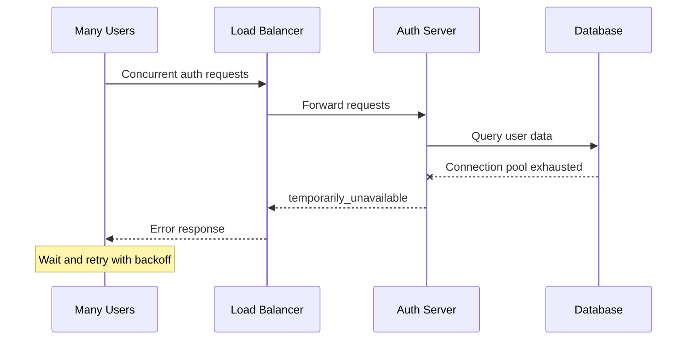
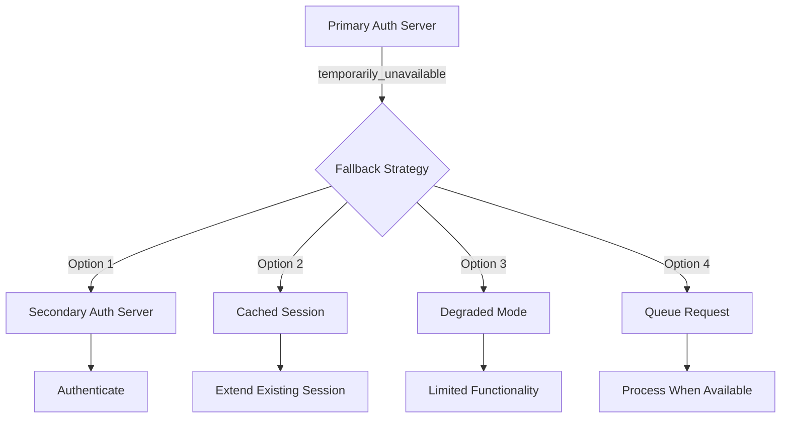

# How to Fix "Temporarily Unavailable" OAuth2 Errors

Author: [nawazdhandala](https://www.github.com/nawazdhandala)

Tags: OAuth2, Authentication, Troubleshooting, Error Handling, Availability, Retry Logic, Resilience

Description: A practical guide to handling the "temporarily_unavailable" OAuth2 error, including retry strategies, fallback mechanisms, and building resilient authentication flows.

---

The "temporarily_unavailable" error in OAuth2 indicates that the authorization server is currently unable to handle the request due to temporary overloading or maintenance. Unlike permanent errors, this is recoverable with the right approach.

## Understanding the Error



### Standard Error Response

```json
{
  "error": "temporarily_unavailable",
  "error_description": "The authorization server is currently unable to handle the request due to a temporary overloading or maintenance of the server."
}
```

## Common Causes

### 1. Server Overload During Peak Traffic



### 2. Planned Maintenance Windows

```javascript
// Auth server response during maintenance
const maintenanceResponse = {
    error: 'temporarily_unavailable',
    error_description: 'Scheduled maintenance in progress. Expected completion: 2024-01-15T03:00:00Z',
    retry_after: 3600, // Retry after 1 hour
};
```

### 3. Rate Limiting

```javascript
// Some servers return temporarily_unavailable instead of 429
// Check for rate limit headers
function checkRateLimitHeaders(response) {
    return {
        remaining: response.headers.get('X-RateLimit-Remaining'),
        limit: response.headers.get('X-RateLimit-Limit'),
        reset: response.headers.get('X-RateLimit-Reset'),
        retryAfter: response.headers.get('Retry-After'),
    };
}
```

## Implementation: Robust Retry Handler

```javascript
class OAuth2RetryHandler {
    constructor(options = {}) {
        this.maxRetries = options.maxRetries || 5;
        this.baseDelay = options.baseDelay || 1000; // 1 second
        this.maxDelay = options.maxDelay || 60000; // 1 minute
        this.jitterFactor = options.jitterFactor || 0.25;
    }

    async executeWithRetry(operation, context = {}) {
        let lastError;
        let retryCount = 0;

        while (retryCount < this.maxRetries) {
            try {
                const result = await operation();

                // Log successful recovery if this was a retry
                if (retryCount > 0) {
                    console.log(`Operation succeeded after ${retryCount} retries`, context);
                }

                return result;
            } catch (error) {
                lastError = error;

                // Check if error is retryable
                const retryInfo = this.analyzeError(error);

                if (!retryInfo.shouldRetry) {
                    throw error;
                }

                retryCount++;

                if (retryCount >= this.maxRetries) {
                    console.error(`Max retries (${this.maxRetries}) exceeded`, { context, error });
                    break;
                }

                // Calculate delay
                const delay = retryInfo.retryAfter || this.calculateDelay(retryCount);

                console.log(`Retry ${retryCount}/${this.maxRetries} in ${delay}ms`, {
                    context,
                    error: error.message,
                });

                await this.sleep(delay);
            }
        }

        throw lastError;
    }

    analyzeError(error) {
        const result = {
            shouldRetry: false,
            retryAfter: null,
            reason: null,
        };

        // Check for temporarily_unavailable error
        if (error.error === 'temporarily_unavailable') {
            result.shouldRetry = true;
            result.reason = 'temporarily_unavailable';

            // Check for retry-after hint
            if (error.retry_after) {
                result.retryAfter = error.retry_after * 1000;
            }
        }

        // Check HTTP status codes
        if (error.status) {
            switch (error.status) {
                case 503: // Service Unavailable
                    result.shouldRetry = true;
                    result.reason = 'service_unavailable';
                    break;
                case 502: // Bad Gateway
                    result.shouldRetry = true;
                    result.reason = 'bad_gateway';
                    break;
                case 504: // Gateway Timeout
                    result.shouldRetry = true;
                    result.reason = 'gateway_timeout';
                    break;
                case 429: // Too Many Requests
                    result.shouldRetry = true;
                    result.reason = 'rate_limited';
                    if (error.retryAfter) {
                        result.retryAfter = parseInt(error.retryAfter, 10) * 1000;
                    }
                    break;
            }
        }

        // Check for network errors
        if (error.name === 'TypeError' && error.message.includes('fetch')) {
            result.shouldRetry = true;
            result.reason = 'network_error';
        }

        return result;
    }

    calculateDelay(attempt) {
        // Exponential backoff with jitter
        const exponentialDelay = this.baseDelay * Math.pow(2, attempt - 1);
        const jitter = exponentialDelay * this.jitterFactor * Math.random();
        return Math.min(exponentialDelay + jitter, this.maxDelay);
    }

    sleep(ms) {
        return new Promise(resolve => setTimeout(resolve, ms));
    }
}

// Usage
const retryHandler = new OAuth2RetryHandler({
    maxRetries: 5,
    baseDelay: 1000,
    maxDelay: 60000,
});

async function authenticateWithRetry(code, codeVerifier) {
    return retryHandler.executeWithRetry(
        () => oauth.exchangeCodeForToken(code, codeVerifier),
        { operation: 'token_exchange' }
    );
}
```

## User Experience During Unavailability

### Show Informative UI

```javascript
class AuthUIManager {
    constructor() {
        this.retryCount = 0;
        this.maxVisibleRetries = 3;
    }

    showRetrying(attempt, maxAttempts, estimatedWait) {
        this.retryCount = attempt;

        if (attempt <= this.maxVisibleRetries) {
            // Show subtle retry indicator
            this.showMessage({
                type: 'info',
                title: 'Connecting...',
                message: `Authentication service is busy. Retrying automatically (${attempt}/${maxAttempts})`,
                showSpinner: true,
            });
        } else {
            // After several retries, give user more options
            this.showMessage({
                type: 'warning',
                title: 'Service Temporarily Unavailable',
                message: 'The authentication service is experiencing high demand.',
                actions: [
                    { label: 'Keep Waiting', action: () => this.continueWaiting() },
                    { label: 'Try Later', action: () => this.cancelAuth() },
                ],
                estimatedWait: estimatedWait,
            });
        }
    }

    showSuccess() {
        if (this.retryCount > 0) {
            this.showMessage({
                type: 'success',
                title: 'Connected',
                message: 'Authentication successful.',
                duration: 2000,
            });
        }
    }

    showFinalError(error) {
        this.showMessage({
            type: 'error',
            title: 'Unable to Connect',
            message: 'The authentication service is currently unavailable. Please try again later.',
            actions: [
                { label: 'Retry', action: () => this.retryAuth() },
                { label: 'Contact Support', action: () => this.showSupport() },
            ],
            details: error.message,
        });
    }

    showMessage(config) {
        // Implementation depends on your UI framework
        console.log('UI Message:', config);
    }

    continueWaiting() {
        console.log('User chose to continue waiting');
    }

    cancelAuth() {
        window.location.href = '/';
    }

    retryAuth() {
        window.location.reload();
    }

    showSupport() {
        window.open('/support', '_blank');
    }
}

// Integrate with retry handler
const authUI = new AuthUIManager();

async function authenticateWithUI(code, codeVerifier) {
    let attempt = 0;

    const result = await retryHandler.executeWithRetry(
        async () => {
            attempt++;
            authUI.showRetrying(attempt, retryHandler.maxRetries, retryHandler.calculateDelay(attempt));
            return oauth.exchangeCodeForToken(code, codeVerifier);
        },
        { operation: 'token_exchange' }
    );

    authUI.showSuccess();
    return result;
}
```

## Fallback Authentication Strategies



### Multi-Region Fallback

```javascript
class MultiRegionOAuth2Client {
    constructor(config) {
        this.regions = config.regions; // Array of auth endpoints
        this.currentRegionIndex = 0;
    }

    async authenticate(params) {
        let lastError;

        for (let i = 0; i < this.regions.length; i++) {
            const region = this.regions[(this.currentRegionIndex + i) % this.regions.length];

            try {
                const result = await this.authenticateWithRegion(region, params);

                // Update preferred region on success
                this.currentRegionIndex = (this.currentRegionIndex + i) % this.regions.length;

                return result;
            } catch (error) {
                lastError = error;

                // Only failover for temporary errors
                if (!this.isTemporaryError(error)) {
                    throw error;
                }

                console.log(`Region ${region.name} unavailable, trying next region`);
            }
        }

        throw lastError;
    }

    async authenticateWithRegion(region, params) {
        const response = await fetch(region.tokenEndpoint, {
            method: 'POST',
            headers: {
                'Content-Type': 'application/x-www-form-urlencoded',
            },
            body: new URLSearchParams(params).toString(),
        });

        if (!response.ok) {
            const error = await response.json().catch(() => ({}));
            const err = new Error(error.error_description || error.error || 'Auth failed');
            err.status = response.status;
            err.error = error.error;
            throw err;
        }

        return response.json();
    }

    isTemporaryError(error) {
        return error.error === 'temporarily_unavailable' ||
               error.status === 503 ||
               error.status === 502 ||
               error.status === 504;
    }
}

// Configuration
const multiRegionClient = new MultiRegionOAuth2Client({
    regions: [
        {
            name: 'us-east',
            tokenEndpoint: 'https://auth-us-east.example.com/oauth/token',
        },
        {
            name: 'us-west',
            tokenEndpoint: 'https://auth-us-west.example.com/oauth/token',
        },
        {
            name: 'eu-west',
            tokenEndpoint: 'https://auth-eu-west.example.com/oauth/token',
        },
    ],
});
```

## Proactive Health Checks

```javascript
class OAuth2ProactiveHealthCheck {
    constructor(config) {
        this.healthEndpoint = config.healthEndpoint;
        this.checkInterval = config.checkInterval || 30000; // 30 seconds
        this.listeners = [];
        this.lastStatus = null;
        this.checkTimer = null;
    }

    start() {
        this.performCheck();
        this.checkTimer = setInterval(() => this.performCheck(), this.checkInterval);
    }

    stop() {
        if (this.checkTimer) {
            clearInterval(this.checkTimer);
            this.checkTimer = null;
        }
    }

    async performCheck() {
        try {
            const controller = new AbortController();
            const timeout = setTimeout(() => controller.abort(), 5000);

            const response = await fetch(this.healthEndpoint, {
                method: 'GET',
                signal: controller.signal,
            });

            clearTimeout(timeout);

            const status = {
                available: response.ok,
                statusCode: response.status,
                timestamp: Date.now(),
            };

            if (response.ok) {
                const data = await response.json();
                status.details = data;
            }

            this.updateStatus(status);
        } catch (error) {
            this.updateStatus({
                available: false,
                error: error.message,
                timestamp: Date.now(),
            });
        }
    }

    updateStatus(status) {
        const previousStatus = this.lastStatus;
        this.lastStatus = status;

        // Notify listeners of status change
        if (previousStatus?.available !== status.available) {
            this.notifyListeners(status, previousStatus);
        }
    }

    notifyListeners(newStatus, oldStatus) {
        for (const listener of this.listeners) {
            try {
                listener(newStatus, oldStatus);
            } catch (error) {
                console.error('Health check listener error:', error);
            }
        }
    }

    onStatusChange(listener) {
        this.listeners.push(listener);
        return () => {
            this.listeners = this.listeners.filter(l => l !== listener);
        };
    }

    isAvailable() {
        return this.lastStatus?.available ?? true;
    }
}

// Usage
const healthCheck = new OAuth2ProactiveHealthCheck({
    healthEndpoint: 'https://auth.example.com/health',
    checkInterval: 30000,
});

healthCheck.onStatusChange((newStatus, oldStatus) => {
    if (!newStatus.available) {
        console.warn('Auth server became unavailable');
        // Proactively notify users or adjust UI
    } else if (oldStatus && !oldStatus.available) {
        console.log('Auth server is available again');
    }
});

healthCheck.start();
```

## Summary

Handling "temporarily_unavailable" OAuth2 errors requires:

1. Implement exponential backoff retry with jitter
2. Provide clear user feedback during retries
3. Consider multi-region or fallback authentication
4. Use session grace periods for existing users
5. Monitor error rates and alert on patterns
6. Proactively check auth server health

These errors are by definition temporary. A resilient implementation handles them transparently in most cases, only involving the user when absolutely necessary.
