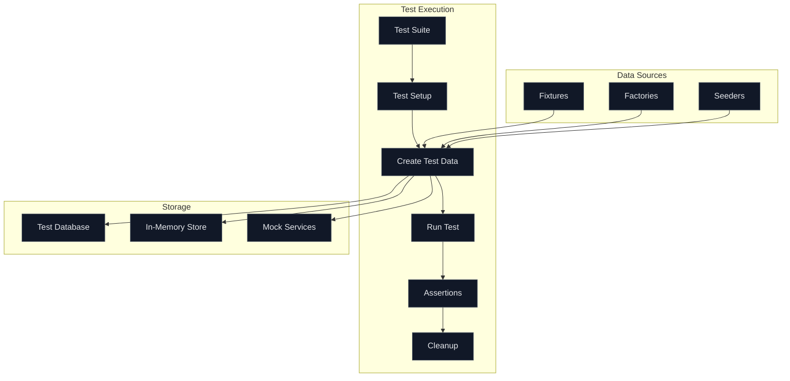
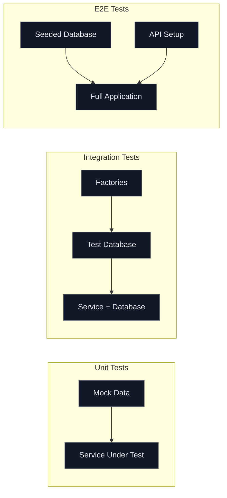

# How to Fix 'Test Data' Management Issues

Author: [nawazdhandala](https://www.github.com/nawazdhandala)

Tags: Testing, Test Data, Fixtures, Database, Quality Assurance, CI/CD, Test Automation, Data Management

Description: Learn how to solve common test data management problems including data isolation, seeding strategies, and cleanup patterns for reliable automated tests.

---

Test data management is one of the most overlooked aspects of building reliable test suites. When tests share data or depend on specific database states, you end up with flaky tests, mysterious failures, and debugging nightmares. This guide covers practical solutions to the most common test data problems.

## Common Test Data Problems

Before diving into solutions, let's identify what typically goes wrong:

- Tests depend on data created by other tests
- Database state accumulates across test runs
- Tests fail when run in different order
- Production data leaks into test environments
- Test data setup is slow and duplicated
- Cleaning up test data is incomplete or forgotten

## Test Data Architecture

A solid test data strategy separates concerns clearly:



## Strategy 1: Database Transactions for Isolation

The cleanest approach wraps each test in a database transaction that rolls back after the test completes:

```typescript
// test/helpers/database.ts
import { Pool, PoolClient } from 'pg';

let pool: Pool;
let client: PoolClient;

export async function setupTestDatabase() {
  pool = new Pool({
    connectionString: process.env.TEST_DATABASE_URL,
  });
}

export async function beginTransaction() {
  client = await pool.connect();
  await client.query('BEGIN');
  return client;
}

export async function rollbackTransaction() {
  await client.query('ROLLBACK');
  client.release();
}

export async function teardownTestDatabase() {
  await pool.end();
}
```

Use this in your test setup:

```typescript
// test/users.test.ts
import { describe, beforeAll, beforeEach, afterEach, afterAll, it, expect } from 'vitest';
import { setupTestDatabase, beginTransaction, rollbackTransaction, teardownTestDatabase } from './helpers/database';

describe('User Service', () => {
  beforeAll(async () => {
    await setupTestDatabase();
  });

  beforeEach(async () => {
    await beginTransaction();
  });

  afterEach(async () => {
    // All changes are rolled back - database returns to original state
    await rollbackTransaction();
  });

  afterAll(async () => {
    await teardownTestDatabase();
  });

  it('should create a user', async () => {
    const user = await userService.create({
      email: 'test@example.com',
      name: 'Test User',
    });

    expect(user.id).toBeDefined();
    expect(user.email).toBe('test@example.com');
    // This user will be rolled back after the test
  });
});
```

## Strategy 2: Factory Functions

Factories create test data with sensible defaults while allowing overrides:

```typescript
// test/factories/user.factory.ts
import { faker } from '@faker-js/faker';
import { User, UserRole } from '../../src/types';
import { db } from '../../src/database';

interface UserOverrides {
  email?: string;
  name?: string;
  role?: UserRole;
  isActive?: boolean;
}

// Generate user data without saving to database
export function buildUser(overrides: UserOverrides = {}): Omit<User, 'id' | 'createdAt'> {
  return {
    email: overrides.email ?? faker.internet.email(),
    name: overrides.name ?? faker.person.fullName(),
    role: overrides.role ?? 'user',
    isActive: overrides.isActive ?? true,
  };
}

// Create user and save to database
export async function createUser(overrides: UserOverrides = {}): Promise<User> {
  const userData = buildUser(overrides);

  const result = await db.query(
    `INSERT INTO users (email, name, role, is_active)
     VALUES ($1, $2, $3, $4)
     RETURNING *`,
    [userData.email, userData.name, userData.role, userData.isActive]
  );

  return result.rows[0];
}

// Create multiple users
export async function createUsers(count: number, overrides: UserOverrides = {}): Promise<User[]> {
  const users: User[] = [];
  for (let i = 0; i < count; i++) {
    users.push(await createUser(overrides));
  }
  return users;
}
```

Using factories in tests:

```typescript
// test/permissions.test.ts
import { createUser } from './factories/user.factory';
import { createProject } from './factories/project.factory';

describe('Permission Service', () => {
  it('should allow admin to delete project', async () => {
    // Create specific data needed for this test
    const admin = await createUser({ role: 'admin' });
    const project = await createProject({ ownerId: admin.id });

    const result = await permissionService.canDelete(admin.id, project.id);

    expect(result).toBe(true);
  });

  it('should deny regular user from deleting others project', async () => {
    const owner = await createUser();
    const otherUser = await createUser();
    const project = await createProject({ ownerId: owner.id });

    const result = await permissionService.canDelete(otherUser.id, project.id);

    expect(result).toBe(false);
  });
});
```

## Strategy 3: Fixture Files

For complex or large test datasets, use fixture files:

```typescript
// test/fixtures/products.fixture.ts
export const productFixtures = {
  basicProduct: {
    name: 'Test Product',
    price: 29.99,
    sku: 'TEST-001',
    inventory: 100,
  },

  outOfStockProduct: {
    name: 'Sold Out Item',
    price: 49.99,
    sku: 'TEST-002',
    inventory: 0,
  },

  discountedProduct: {
    name: 'Sale Item',
    price: 99.99,
    discountPercent: 20,
    sku: 'TEST-003',
    inventory: 50,
  },
};

// test/fixtures/orders.fixture.ts
export const orderFixtures = {
  pendingOrder: {
    status: 'pending',
    items: [
      { sku: 'TEST-001', quantity: 2 },
    ],
    total: 59.98,
  },

  completedOrder: {
    status: 'completed',
    items: [
      { sku: 'TEST-001', quantity: 1 },
      { sku: 'TEST-003', quantity: 1 },
    ],
    total: 109.98,
    completedAt: new Date('2024-01-15'),
  },
};
```

Load fixtures dynamically:

```typescript
// test/helpers/fixtures.ts
import { db } from '../../src/database';

export async function loadFixture(tableName: string, data: Record<string, unknown>) {
  const columns = Object.keys(data);
  const values = Object.values(data);
  const placeholders = columns.map((_, i) => `$${i + 1}`);

  const result = await db.query(
    `INSERT INTO ${tableName} (${columns.join(', ')})
     VALUES (${placeholders.join(', ')})
     RETURNING *`,
    values
  );

  return result.rows[0];
}

export async function loadFixtures(tableName: string, fixtures: Record<string, unknown>[]) {
  return Promise.all(fixtures.map(f => loadFixture(tableName, f)));
}
```

## Strategy 4: Database Seeding

For integration tests that need a complete dataset:

```typescript
// test/seed/index.ts
import { db } from '../../src/database';
import { createUser } from '../factories/user.factory';
import { createProduct } from '../factories/product.factory';

export async function seedTestDatabase() {
  // Clear existing data
  await db.query('TRUNCATE users, products, orders CASCADE');

  // Create base users
  const admin = await createUser({
    email: 'admin@test.com',
    role: 'admin',
  });

  const customer = await createUser({
    email: 'customer@test.com',
    role: 'user',
  });

  // Create products
  const products = await Promise.all([
    createProduct({ name: 'Widget A', price: 10.00 }),
    createProduct({ name: 'Widget B', price: 20.00 }),
    createProduct({ name: 'Widget C', price: 30.00 }),
  ]);

  return { admin, customer, products };
}

export async function clearTestDatabase() {
  await db.query('TRUNCATE users, products, orders CASCADE');
}
```

## Strategy 5: Test Data Builders

For complex objects with many relationships:

```typescript
// test/builders/order.builder.ts
import { Order, OrderItem, User, Product } from '../../src/types';
import { createUser } from '../factories/user.factory';
import { createProduct } from '../factories/product.factory';
import { db } from '../../src/database';

export class OrderBuilder {
  private customer: User | null = null;
  private items: { product: Product; quantity: number }[] = [];
  private status: string = 'pending';

  async withCustomer(overrides = {}) {
    this.customer = await createUser(overrides);
    return this;
  }

  async withItem(quantity: number = 1, productOverrides = {}) {
    const product = await createProduct(productOverrides);
    this.items.push({ product, quantity });
    return this;
  }

  withStatus(status: string) {
    this.status = status;
    return this;
  }

  async build(): Promise<Order> {
    if (!this.customer) {
      this.customer = await createUser();
    }

    if (this.items.length === 0) {
      await this.withItem();
    }

    // Calculate total
    const total = this.items.reduce(
      (sum, item) => sum + item.product.price * item.quantity,
      0
    );

    // Create order
    const orderResult = await db.query(
      `INSERT INTO orders (customer_id, status, total)
       VALUES ($1, $2, $3)
       RETURNING *`,
      [this.customer.id, this.status, total]
    );

    const order = orderResult.rows[0];

    // Create order items
    for (const item of this.items) {
      await db.query(
        `INSERT INTO order_items (order_id, product_id, quantity, price)
         VALUES ($1, $2, $3, $4)`,
        [order.id, item.product.id, item.quantity, item.product.price]
      );
    }

    return { ...order, customer: this.customer, items: this.items };
  }
}

// Usage in tests
it('should calculate shipping for heavy orders', async () => {
  const order = await new OrderBuilder()
    .withStatus('confirmed')
    .withItem(5, { weight: 10 })  // 5 heavy items
    .withItem(2, { weight: 1 })   // 2 light items
    .build();

  const shipping = await shippingService.calculate(order.id);

  expect(shipping.cost).toBeGreaterThan(10);
});
```

## Test Data Flow

Here's how data flows through different test types:



## Cleanup Strategies

Proper cleanup prevents data leakage between tests:

```typescript
// test/helpers/cleanup.ts
import { db } from '../../src/database';

// Clean specific tables in dependency order
export async function cleanupTables(...tables: string[]) {
  for (const table of tables) {
    await db.query(`DELETE FROM ${table}`);
  }
}

// Reset sequences after cleanup
export async function resetSequences(...tables: string[]) {
  for (const table of tables) {
    await db.query(`ALTER SEQUENCE ${table}_id_seq RESTART WITH 1`);
  }
}

// Full cleanup with cascade
export async function fullCleanup() {
  const tables = ['order_items', 'orders', 'products', 'users'];
  await db.query(`TRUNCATE ${tables.join(', ')} CASCADE`);
}
```

## Best Practices

1. **Each test creates its own data** - Never depend on data from other tests
2. **Use transactions for isolation** - Rollback after each test for clean state
3. **Factories over fixtures** - Factories are more flexible and generate unique data
4. **Minimize database calls** - Use in-memory data for unit tests
5. **Clean up in afterEach** - Don't leave data for the next test to deal with
6. **Use meaningful test data** - Names like "test@example.com" are better than "asdf@qwer.com"
7. **Separate test database** - Never run tests against production or staging data
8. **Version control fixtures** - Keep fixture files in your repository

## Common Pitfalls to Avoid

- Sharing mutable data between tests
- Hardcoding IDs that might not exist
- Not handling async cleanup properly
- Using real external services without mocking
- Ignoring database constraints in test data

Good test data management makes the difference between a test suite you trust and one you fight with daily. Invest the time to set up proper data isolation, use factories for flexibility, and always clean up after your tests. Your future self will thank you when debugging test failures at 2 AM.
