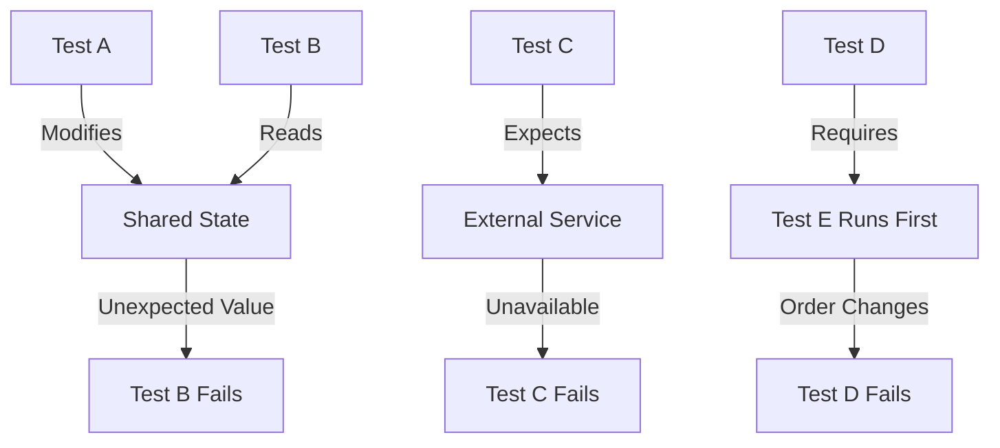

# How to Fix "Test Dependency" Issues

Author: [nawazdhandala](https://www.github.com/nawazdhandala)

Tags: Testing, Dependencies, Test Isolation, Fixtures, Mocking, Flaky Tests, Python, JavaScript

Description: Learn how to identify and fix test dependency issues that cause flaky tests, including test order dependencies, shared state problems, and external service dependencies.

---

> Test dependencies are one of the most frustrating sources of flaky tests. A test that passes in isolation but fails when run with other tests indicates a dependency problem that needs to be addressed.

Test dependency issues occur when tests rely on shared state, specific execution order, or external services. This guide shows you how to identify and fix these problems.

---

## Understanding Test Dependencies



---

## Type 1: Test Order Dependencies

Tests that pass in one order but fail in another.

### Problem: Tests Rely on Execution Order

```python
# test_order_dependent.py
# BAD: These tests depend on execution order

# Global state that persists between tests
user_count = 0

def test_create_first_user():
    global user_count
    user_count += 1
    assert user_count == 1  # Passes if run first


def test_create_second_user():
    global user_count
    user_count += 1
    assert user_count == 2  # Fails if run before test_create_first_user
```

### Solution: Isolate Each Test

```python
# test_isolated.py
# GOOD: Each test is independent

import pytest

@pytest.fixture
def user_counter():
    """Fresh counter for each test."""
    return {"count": 0}


def test_create_first_user(user_counter):
    user_counter["count"] += 1
    assert user_counter["count"] == 1  # Always passes


def test_create_second_user(user_counter):
    user_counter["count"] += 1
    assert user_counter["count"] == 1  # Always passes (fresh counter)
```

### Detecting Order Dependencies

```bash
# Run tests in random order to detect dependencies
pytest --random-order

# Or use pytest-randomly
pip install pytest-randomly
pytest  # Automatically randomizes order

# Run specific test in isolation
pytest test_module.py::test_specific_function -v
```

---

## Type 2: Shared State Dependencies

Tests that modify shared state (database, files, globals).

### Problem: Database State Leaks Between Tests

```python
# test_database_leak.py
# BAD: Tests modify shared database

def test_create_user():
    # Creates a user but doesn't clean up
    db.users.insert({"email": "test@example.com"})
    assert db.users.count() == 1


def test_user_count():
    # Fails if test_create_user ran first
    # because user already exists
    assert db.users.count() == 0
```

### Solution: Use Fixtures with Cleanup

```python
# test_database_isolated.py
# GOOD: Each test gets clean database state

import pytest

@pytest.fixture(autouse=True)
def clean_database():
    """Clean database before and after each test."""
    # Setup: ensure clean state
    db.users.delete_many({})
    db.orders.delete_many({})

    yield  # Test runs here

    # Teardown: clean up after test
    db.users.delete_many({})
    db.orders.delete_many({})


def test_create_user():
    db.users.insert({"email": "test@example.com"})
    assert db.users.count() == 1


def test_user_count():
    # Always starts with empty database
    assert db.users.count() == 0
```

### Solution: Use Transactions for Isolation

```python
# test_with_transactions.py
# BETTER: Use transactions that rollback

import pytest
from sqlalchemy import create_engine
from sqlalchemy.orm import sessionmaker

@pytest.fixture
def db_session():
    """Create a database session with automatic rollback."""
    engine = create_engine("postgresql://localhost/test_db")
    Session = sessionmaker(bind=engine)
    session = Session()

    # Start a transaction
    session.begin_nested()

    yield session

    # Rollback everything - database unchanged
    session.rollback()
    session.close()


def test_create_user(db_session):
    user = User(email="test@example.com")
    db_session.add(user)
    db_session.flush()  # Write to DB within transaction

    assert db_session.query(User).count() == 1
    # Transaction will be rolled back after test


def test_another_user(db_session):
    # Clean database - previous test rolled back
    assert db_session.query(User).count() == 0
```

---

## Type 3: External Service Dependencies

Tests that depend on external APIs, databases, or services.

### Problem: Tests Fail When Service is Unavailable

```python
# test_external_dependency.py
# BAD: Test requires real external service

def test_fetch_weather():
    # Fails if API is down, rate limited, or network unavailable
    response = requests.get("https://api.weather.com/current")
    data = response.json()
    assert "temperature" in data
```

### Solution: Mock External Services

```python
# test_mocked_service.py
# GOOD: Mock external dependencies

import pytest
from unittest.mock import patch, Mock

@pytest.fixture
def mock_weather_api():
    """Mock the weather API responses."""
    with patch('app.services.requests.get') as mock_get:
        mock_response = Mock()
        mock_response.json.return_value = {
            "temperature": 72,
            "conditions": "sunny"
        }
        mock_response.status_code = 200
        mock_get.return_value = mock_response
        yield mock_get


def test_fetch_weather(mock_weather_api):
    from app.services import get_weather

    result = get_weather("New York")

    assert result["temperature"] == 72
    mock_weather_api.assert_called_once()


def test_weather_api_error():
    """Test handling of API errors."""
    with patch('app.services.requests.get') as mock_get:
        mock_get.side_effect = requests.Timeout("Connection timed out")

        from app.services import get_weather

        with pytest.raises(WeatherServiceError):
            get_weather("New York")
```

### Solution: Use Test Containers for Integration Tests

```python
# test_with_containers.py
# For tests that NEED real services

import pytest
import testcontainers.postgres

@pytest.fixture(scope="session")
def postgres_container():
    """Start a real PostgreSQL container for integration tests."""
    with testcontainers.postgres.PostgresContainer("postgres:15") as postgres:
        yield postgres


@pytest.fixture
def db_connection(postgres_container):
    """Get connection to test database."""
    import psycopg2

    conn = psycopg2.connect(
        host=postgres_container.get_container_host_ip(),
        port=postgres_container.get_exposed_port(5432),
        user="test",
        password="test",
        database="test"
    )
    yield conn
    conn.close()
```

---

## Type 4: File System Dependencies

Tests that read or write files.

### Problem: Tests Share File System

```python
# test_file_dependency.py
# BAD: Tests share files

def test_write_config():
    with open("/tmp/config.json", "w") as f:
        f.write('{"debug": true}')

    # Verify file exists
    assert os.path.exists("/tmp/config.json")


def test_read_config():
    # Fails if run before test_write_config
    with open("/tmp/config.json") as f:
        config = json.load(f)
    assert config["debug"] is True
```

### Solution: Use Temporary Directories

```python
# test_file_isolated.py
# GOOD: Each test gets its own temp directory

import pytest
import tempfile
import os

@pytest.fixture
def temp_dir():
    """Create a temporary directory for each test."""
    with tempfile.TemporaryDirectory() as tmpdir:
        yield tmpdir
    # Directory automatically cleaned up


def test_write_config(temp_dir):
    config_path = os.path.join(temp_dir, "config.json")

    with open(config_path, "w") as f:
        json.dump({"debug": True}, f)

    assert os.path.exists(config_path)


def test_read_config(temp_dir):
    config_path = os.path.join(temp_dir, "config.json")

    # Create the file this test needs
    with open(config_path, "w") as f:
        json.dump({"debug": True}, f)

    with open(config_path) as f:
        config = json.load(f)

    assert config["debug"] is True
```

---

## JavaScript Test Dependencies

```javascript
// test/user.test.js
// Handling dependencies in JavaScript tests

const { beforeEach, afterEach, describe, it } = require('mocha');
const sinon = require('sinon');
const chai = require('chai');
const { expect } = chai;

describe('UserService', () => {
    let sandbox;
    let mockDb;

    beforeEach(() => {
        // Create fresh sandbox for each test
        sandbox = sinon.createSandbox();

        // Mock database
        mockDb = {
            users: [],
            insert: function(user) {
                this.users.push(user);
                return user;
            },
            findById: function(id) {
                return this.users.find(u => u.id === id);
            },
            clear: function() {
                this.users = [];
            }
        };

        // Inject mock
        sandbox.stub(require('../src/db'), 'getConnection').returns(mockDb);
    });

    afterEach(() => {
        // Restore all stubs and mocks
        sandbox.restore();
        mockDb.clear();
    });

    it('creates a user', async () => {
        const userService = require('../src/userService');

        const user = await userService.create({
            email: 'test@example.com'
        });

        expect(user.email).to.equal('test@example.com');
        expect(mockDb.users).to.have.length(1);
    });

    it('starts with empty database', async () => {
        // Fresh mockDb for this test
        expect(mockDb.users).to.have.length(0);
    });
});
```

---

## Detecting Dependency Issues

### Run Tests in Random Order

```bash
# Python with pytest-randomly
pip install pytest-randomly
pytest --randomly-seed=12345

# JavaScript with mocha
npm install mocha-random-order
mocha --require mocha-random-order
```

### Run Tests in Isolation

```bash
# Run each test file separately
for file in tests/test_*.py; do
    pytest "$file" -v
done

# Compare results with full suite
pytest tests/ -v
```

### Check for Shared State

```python
# conftest.py
# Add debugging to detect shared state

import pytest

# Track what each test modifies
_test_modifications = {}

@pytest.fixture(autouse=True)
def track_modifications(request):
    """Track database modifications for debugging."""
    initial_count = db.users.count()

    yield

    final_count = db.users.count()
    if final_count != initial_count:
        _test_modifications[request.node.name] = {
            "before": initial_count,
            "after": final_count
        }
        print(f"WARNING: {request.node.name} modified database: {initial_count} -> {final_count}")
```

---

## Best Practices Summary

| Practice | Why |
|----------|-----|
| Use fixtures with cleanup | Ensures clean state for each test |
| Mock external services | Tests run without network |
| Use transactions | Fast isolation without data cleanup |
| Use temp directories | No file system conflicts |
| Run tests randomly | Detects order dependencies |
| Run tests in parallel | Detects shared state issues |

---

## Quick Fix Checklist

1. Can the test run in isolation? (`pytest test_file.py::test_name`)
2. Does the test clean up after itself?
3. Does the test set up its own preconditions?
4. Are external services mocked?
5. Are file paths unique per test?
6. Does the test modify global state?

---

*Need to monitor test stability and catch flaky tests? [OneUptime](https://oneuptime.com) provides CI/CD monitoring with test result tracking and trend analysis.*

**Related Reading:**
- [How to Fix "Assertion" Failures in Tests](/blog/post/2026-01-24-fix-assertion-failures-tests/view)
- [How to Configure pytest for Python Testing](/blog/post/2026-01-24-configure-pytest-python-testing/view)
