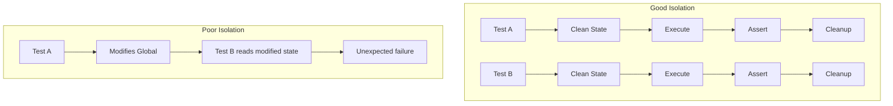

# How to Fix "Test Isolation" Issues

Author: [nawazdhandala](https://github.com/nawazdhandala)

Tags: Testing, Test Isolation, Unit Tests, Integration Tests, Debugging

Description: Learn how to identify and fix test isolation issues that cause tests to pass or fail depending on execution order or shared state.

---

Test isolation problems are among the most frustrating debugging challenges. Your tests pass when run individually but fail when run together. Or worse, they fail randomly depending on which tests ran first. This guide shows you how to identify isolation issues and implement proper test boundaries.

## What Is Test Isolation?

Test isolation means each test runs independently without being affected by other tests. When isolation breaks down, you get order-dependent tests that are unreliable and difficult to maintain.



## Common Isolation Problems and Solutions

### 1. Global State Pollution

The most common isolation issue is tests modifying global state that affects other tests.

**Problem: Global variable modified by test**

```javascript
// src/config.js
let config = {
  apiUrl: 'https://api.example.com',
  timeout: 5000
};

module.exports = { config };

// tests/api.test.js - PROBLEM
const { config } = require('../src/config');

describe('API Client', () => {
  it('should use staging API', () => {
    // Modifies global config
    config.apiUrl = 'https://staging.example.com';
    const client = new ApiClient(config);
    expect(client.baseUrl).toBe('https://staging.example.com');
  });

  it('should use production API', () => {
    // FAILS: config.apiUrl is still 'staging' from previous test
    const client = new ApiClient(config);
    expect(client.baseUrl).toBe('https://api.example.com');
  });
});
```

**Solution: Save and restore original state**

```javascript
describe('API Client', () => {
  let originalConfig;

  beforeEach(() => {
    // Save original state
    originalConfig = { ...config };
  });

  afterEach(() => {
    // Restore original state
    Object.assign(config, originalConfig);
  });

  it('should use staging API', () => {
    config.apiUrl = 'https://staging.example.com';
    const client = new ApiClient(config);
    expect(client.baseUrl).toBe('https://staging.example.com');
  });

  it('should use production API', () => {
    // PASSES: config was restored to original
    const client = new ApiClient(config);
    expect(client.baseUrl).toBe('https://api.example.com');
  });
});
```

**Better solution: Avoid global mutable state entirely**

```javascript
// src/config.js - Immutable config factory
function createConfig(overrides = {}) {
  return Object.freeze({
    apiUrl: 'https://api.example.com',
    timeout: 5000,
    ...overrides
  });
}

module.exports = { createConfig };

// tests/api.test.js
it('should use staging API', () => {
  const config = createConfig({ apiUrl: 'https://staging.example.com' });
  const client = new ApiClient(config);
  expect(client.baseUrl).toBe('https://staging.example.com');
});
```

### 2. Database State Leakage

Tests that write to a shared database affect each other.

**Problem: Test data persists between tests**

```javascript
describe('User Repository', () => {
  it('should create user', async () => {
    await userRepo.create({ email: 'test@example.com', name: 'Test' });
    const user = await userRepo.findByEmail('test@example.com');
    expect(user).toBeDefined();
  });

  it('should return null for non-existent user', async () => {
    // FAILS: User from previous test still exists
    const user = await userRepo.findByEmail('nonexistent@example.com');
    expect(user).toBeNull();
    // Actually checking wrong email, but database state is polluted
  });

  it('should enforce unique email', async () => {
    // FAILS: test@example.com already exists from first test
    await expect(userRepo.create({ email: 'test@example.com', name: 'Another' }))
      .rejects.toThrow('unique constraint');
  });
});
```

**Solution: Clean database between tests**

```javascript
describe('User Repository', () => {
  // Clean before each test
  beforeEach(async () => {
    // Delete in correct order respecting foreign keys
    await db.query('DELETE FROM orders');
    await db.query('DELETE FROM users');
  });

  it('should create user', async () => {
    await userRepo.create({ email: 'test@example.com', name: 'Test' });
    const user = await userRepo.findByEmail('test@example.com');
    expect(user).toBeDefined();
  });

  it('should return null for non-existent user', async () => {
    // PASSES: Database was cleaned
    const user = await userRepo.findByEmail('nonexistent@example.com');
    expect(user).toBeNull();
  });
});
```

**Better solution: Use transactions with rollback**

```javascript
describe('User Repository', () => {
  let client;

  beforeEach(async () => {
    // Start transaction
    client = await pool.connect();
    await client.query('BEGIN');

    // Pass transaction client to repository
    userRepo = new UserRepository(client);
  });

  afterEach(async () => {
    // Rollback all changes
    await client.query('ROLLBACK');
    client.release();
  });

  // Each test runs in its own transaction that gets rolled back
  it('should create user', async () => {
    await userRepo.create({ email: 'test@example.com', name: 'Test' });
    const user = await userRepo.findByEmail('test@example.com');
    expect(user).toBeDefined();
    // After test, ROLLBACK removes this user
  });
});
```

### 3. Timer and Date Dependencies

Tests that depend on real time cause intermittent failures.

**Problem: Test uses real system time**

```javascript
describe('Token Expiry', () => {
  it('should create token expiring in 1 hour', () => {
    const token = createToken({ userId: '123' });
    const expectedExpiry = new Date(Date.now() + 3600000);

    // FLAKY: Milliseconds might differ
    expect(token.expiresAt).toEqual(expectedExpiry);
  });

  it('should detect expired token', async () => {
    const token = createToken({ userId: '123', expiresIn: 100 });

    // Wait for expiry (slow and fragile)
    await new Promise(resolve => setTimeout(resolve, 150));

    expect(isExpired(token)).toBe(true);
  });
});
```

**Solution: Mock the system clock**

```javascript
describe('Token Expiry', () => {
  const NOW = new Date('2026-01-24T12:00:00Z');

  beforeEach(() => {
    jest.useFakeTimers();
    jest.setSystemTime(NOW);
  });

  afterEach(() => {
    jest.useRealTimers();
  });

  it('should create token expiring in 1 hour', () => {
    const token = createToken({ userId: '123' });

    // Exact match because time is controlled
    expect(token.expiresAt).toEqual(new Date('2026-01-24T13:00:00Z'));
  });

  it('should detect expired token', () => {
    const token = createToken({ userId: '123', expiresIn: 3600000 }); // 1 hour

    // Not expired yet
    expect(isExpired(token)).toBe(false);

    // Advance time past expiry
    jest.advanceTimersByTime(3600001);

    // Now expired
    expect(isExpired(token)).toBe(true);
  });
});
```

### 4. Singleton Instance Pollution

Singletons maintain state across tests unless explicitly reset.

**Problem: Singleton accumulates state**

```javascript
// src/cache.js
class Cache {
  constructor() {
    if (Cache.instance) return Cache.instance;
    this.data = new Map();
    Cache.instance = this;
  }

  set(key, value) { this.data.set(key, value); }
  get(key) { return this.data.get(key); }
}

module.exports = new Cache();

// tests/cache.test.js
const cache = require('../src/cache');

describe('Cache', () => {
  it('should store values', () => {
    cache.set('key1', 'value1');
    expect(cache.get('key1')).toBe('value1');
  });

  it('should return undefined for missing keys', () => {
    // FAILS if run after previous test: key1 still exists
    expect(cache.get('key1')).toBeUndefined();
  });
});
```

**Solution: Add reset method and use in tests**

```javascript
// src/cache.js
class Cache {
  constructor() {
    if (Cache.instance) return Cache.instance;
    this.data = new Map();
    Cache.instance = this;
  }

  set(key, value) { this.data.set(key, value); }
  get(key) { return this.data.get(key); }

  // Reset method for testing
  clear() { this.data.clear(); }

  // Full reset including singleton (use carefully)
  static resetInstance() {
    if (Cache.instance) {
      Cache.instance.data.clear();
    }
    Cache.instance = null;
  }
}

// tests/cache.test.js
describe('Cache', () => {
  beforeEach(() => {
    cache.clear();  // Reset state before each test
  });

  it('should store values', () => {
    cache.set('key1', 'value1');
    expect(cache.get('key1')).toBe('value1');
  });

  it('should return undefined for missing keys', () => {
    // PASSES: Cache was cleared
    expect(cache.get('key1')).toBeUndefined();
  });
});
```

### 5. Environment Variable Pollution

Tests that modify environment variables affect other tests.

**Problem: Environment variable persists**

```javascript
describe('Config Loading', () => {
  it('should use custom port from env', () => {
    process.env.PORT = '8080';
    const config = loadConfig();
    expect(config.port).toBe(8080);
  });

  it('should use default port', () => {
    // FAILS: PORT is still '8080' from previous test
    const config = loadConfig();
    expect(config.port).toBe(3000);  // Expected default
  });
});
```

**Solution: Save and restore environment**

```javascript
describe('Config Loading', () => {
  const originalEnv = { ...process.env };

  afterEach(() => {
    // Restore original environment
    process.env = { ...originalEnv };
  });

  it('should use custom port from env', () => {
    process.env.PORT = '8080';
    const config = loadConfig();
    expect(config.port).toBe(8080);
  });

  it('should use default port', () => {
    delete process.env.PORT;  // Ensure it is not set
    const config = loadConfig();
    expect(config.port).toBe(3000);  // PASSES
  });
});
```

### 6. Module Cache Pollution

Node.js caches required modules, which can cause isolation issues.

**Problem: Module state persists**

```javascript
// src/counter.js
let count = 0;

module.exports = {
  increment() { return ++count; },
  getCount() { return count; }
};

// tests/counter.test.js
const counter = require('../src/counter');

describe('Counter', () => {
  it('should increment', () => {
    expect(counter.increment()).toBe(1);
  });

  it('should start at zero', () => {
    // FAILS: count is 1 from previous test
    expect(counter.getCount()).toBe(0);
  });
});
```

**Solution: Reset module cache or add reset function**

```javascript
describe('Counter', () => {
  beforeEach(() => {
    // Clear module from cache to get fresh instance
    jest.resetModules();
  });

  it('should increment', () => {
    const counter = require('../src/counter');
    expect(counter.increment()).toBe(1);
  });

  it('should start at zero', () => {
    const counter = require('../src/counter');
    // PASSES: Fresh module instance
    expect(counter.getCount()).toBe(0);
  });
});
```

## Detecting Isolation Issues

### Run Tests in Random Order

```javascript
// jest.config.js
module.exports = {
  // Randomize test order to expose isolation issues
  randomize: true,

  // Or use a seed for reproducible ordering
  // randomize: true,
  // seed: 12345
};
```

### Run Tests in Isolation

```bash
# Run each test file in a separate process
jest --runInBand --detectOpenHandles

# Run a single test to see if it passes alone
jest --testNamePattern="should start at zero"

# Run with verbose output to see execution order
jest --verbose
```

### Add Isolation Checks

```javascript
// tests/setup.js
let globalStateSnapshot;

beforeAll(() => {
  // Capture initial state
  globalStateSnapshot = {
    env: { ...process.env },
    // Add other global state as needed
  };
});

afterEach(() => {
  // Check for environment pollution
  const envDiff = Object.keys(process.env)
    .filter(key => process.env[key] !== globalStateSnapshot.env[key]);

  if (envDiff.length > 0) {
    console.warn(`Warning: Environment modified by test: ${envDiff.join(', ')}`);
  }
});
```

## Summary

| Issue | Solution |
|-------|----------|
| Global state modification | Save/restore or use immutable patterns |
| Database pollution | Clean data or use transactions |
| Time dependencies | Mock the system clock |
| Singleton state | Add and call reset methods |
| Environment variables | Save/restore process.env |
| Module cache | Use jest.resetModules() |

Test isolation is fundamental to reliable tests. When each test runs independently, you can trust your test results and refactor with confidence. The extra effort to maintain isolation pays off in reduced debugging time and a more maintainable test suite.
