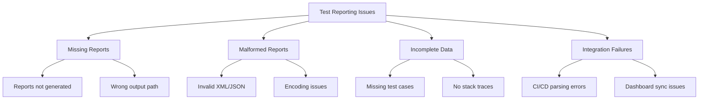

# How to Fix 'Test Reporting' Issues

Author: [nawazdhandala](https://www.github.com/nawazdhandala)

Tags: Testing, Test Reporting, CI/CD, JUnit, Jest, Pytest, Test Automation

Description: A comprehensive guide to diagnosing and fixing common test reporting issues across different testing frameworks and CI/CD systems.

---

Test reports are the bridge between your test runs and your team's visibility into code quality. When reporting breaks, you lose insight into what's passing, what's failing, and why. This guide covers the most common test reporting issues and how to fix them across popular testing frameworks and CI/CD platforms.

## Common Test Reporting Problems

Before diving into solutions, let's understand the typical issues you might encounter:



## Fixing JUnit XML Report Issues

JUnit XML is the de facto standard for test reporting. Most CI/CD systems expect this format, but generating valid reports can be tricky.

### Jest Configuration

Jest requires explicit configuration to generate JUnit reports. The most common issue is not installing or configuring the reporter correctly.

```javascript
// jest.config.js
module.exports = {
  // Enable JUnit reporter alongside default reporter
  reporters: [
    'default',
    [
      'jest-junit',
      {
        // Output directory for the report
        outputDirectory: './reports/junit',
        // Output filename
        outputName: 'junit.xml',
        // Include full test suite path in report
        suiteNameTemplate: '{filepath}',
        // Include test title in report
        classNameTemplate: '{classname}',
        // Include error messages
        ancestorSeparator: ' > ',
        // Use suite name instead of file path
        usePathForSuiteName: true,
        // Include console output in report
        includeConsoleOutput: true,
        // Include short console output
        includeShortConsoleOutput: false,
        // Report test file path
        reportTestSuiteErrors: true
      }
    ]
  ],

  // Ensure tests complete before report generation
  testResultsProcessor: 'jest-junit'
};
```

Install the required package:

```bash
npm install --save-dev jest-junit
```

### Fixing Missing Stack Traces

If your JUnit reports show failures but no stack traces, the issue is usually in the reporter configuration or error handling in your tests.

```javascript
// jest.config.js - enable verbose error reporting
module.exports = {
  reporters: [
    'default',
    [
      'jest-junit',
      {
        outputDirectory: './reports',
        outputName: 'junit.xml',
        // Include full error stack traces
        addFileAttribute: true,
        // Don't strip ANSI codes from output
        noStackTrace: false,
        // Include error cause chain
        reportTestSuiteErrors: true
      }
    ]
  ],

  // Enable verbose mode for more details
  verbose: true,

  // Don't bail early - report all failures
  bail: false
};
```

### Pytest JUnit XML Issues

Pytest's built-in JUnit reporter sometimes produces incomplete reports. Here's how to configure it properly.

```bash
# Basic JUnit XML output
pytest --junitxml=reports/junit.xml

# With additional metadata
pytest --junitxml=reports/junit.xml \
  -o junit_suite_name=my_test_suite \
  -o junit_logging=all \
  -o junit_log_passing_tests=true \
  -o junit_duration_report=call
```

For more control, use pytest.ini or pyproject.toml:

```ini
# pytest.ini
[pytest]
# JUnit report configuration
junit_suite_name = my_project
junit_logging = all
junit_log_passing_tests = true
junit_duration_report = call
junit_family = xunit2

# Generate report even if tests fail
addopts = --junitxml=reports/junit.xml -v
```

### Fixing XML Encoding Issues

Special characters in test names or output can break XML reports. Here's how to handle encoding properly.

```python
# conftest.py - sanitize test output for XML
import pytest
import re

def sanitize_for_xml(text):
    """Remove characters that are invalid in XML 1.0"""
    if text is None:
        return ''
    # Remove control characters except tab, newline, carriage return
    return re.sub(r'[\x00-\x08\x0b\x0c\x0e-\x1f\x7f]', '', str(text))

@pytest.hookimpl(tryfirst=True)
def pytest_runtest_makereport(item, call):
    """Sanitize error messages for XML compatibility"""
    if call.excinfo is not None:
        # Sanitize exception message
        if hasattr(call.excinfo, 'value'):
            original_str = str(call.excinfo.value)
            sanitized = sanitize_for_xml(original_str)
            if original_str != sanitized:
                # Log warning about sanitization
                print(f"Warning: Sanitized test output for XML compatibility")
```

## Fixing CI/CD Integration Issues

### GitHub Actions

GitHub Actions can parse JUnit reports natively. Common issues include wrong paths and missing artifact uploads.

```yaml
# .github/workflows/test.yaml
name: Tests

on: [push, pull_request]

jobs:
  test:
    runs-on: ubuntu-latest

    steps:
      - uses: actions/checkout@v4

      - name: Setup Node.js
        uses: actions/setup-node@v4
        with:
          node-version: '20'

      - name: Install dependencies
        run: npm ci

      - name: Run tests
        # Continue even if tests fail so we can upload reports
        continue-on-error: true
        run: npm test -- --ci --reporters=default --reporters=jest-junit
        env:
          JEST_JUNIT_OUTPUT_DIR: ./reports
          JEST_JUNIT_OUTPUT_NAME: junit.xml

      - name: Upload test results
        # Always upload, even if tests failed
        if: always()
        uses: actions/upload-artifact@v4
        with:
          name: test-results
          path: reports/junit.xml
          retention-days: 30

      - name: Publish test report
        if: always()
        uses: mikepenz/action-junit-report@v4
        with:
          report_paths: 'reports/junit.xml'
          fail_on_failure: true
          include_passed: true
          detailed_summary: true
```

### GitLab CI

GitLab requires specific artifact configuration to display test reports in merge requests.

```yaml
# .gitlab-ci.yml
test:
  stage: test
  image: node:20

  script:
    - npm ci
    - npm test -- --ci --reporters=default --reporters=jest-junit

  artifacts:
    # Reports section tells GitLab how to interpret artifacts
    reports:
      junit: reports/junit.xml
    # Also keep raw artifacts for debugging
    paths:
      - reports/
    # Keep artifacts even when tests fail
    when: always
    expire_in: 1 week

  # Don't fail the job on test failures
  # (let the report show what failed)
  allow_failure: false
```

### Jenkins

Jenkins requires the JUnit plugin and proper post-build configuration.

```groovy
// Jenkinsfile
pipeline {
    agent any

    stages {
        stage('Test') {
            steps {
                sh 'npm ci'
                // Use catchError to continue pipeline even if tests fail
                catchError(buildResult: 'UNSTABLE', stageResult: 'FAILURE') {
                    sh 'npm test -- --ci --reporters=default --reporters=jest-junit'
                }
            }
        }
    }

    post {
        always {
            // Publish JUnit results
            junit(
                testResults: 'reports/junit.xml',
                allowEmptyResults: true,
                skipPublishingChecks: false
            )

            // Archive reports for later viewing
            archiveArtifacts(
                artifacts: 'reports/**/*',
                allowEmptyArchive: true
            )
        }
    }
}
```

## Fixing Report Aggregation Issues

When running tests in parallel or across multiple projects, aggregating reports can be challenging.

### Merging Multiple JUnit Files

```python
#!/usr/bin/env python3
# merge_junit.py - combine multiple JUnit XML files
import xml.etree.ElementTree as ET
import sys
from pathlib import Path

def merge_junit_reports(input_files, output_file):
    """Merge multiple JUnit XML files into one"""

    # Create root element for combined report
    combined = ET.Element('testsuites')

    total_tests = 0
    total_failures = 0
    total_errors = 0
    total_time = 0.0

    for input_file in input_files:
        try:
            tree = ET.parse(input_file)
            root = tree.getroot()

            # Handle both <testsuites> and <testsuite> root elements
            if root.tag == 'testsuites':
                suites = root.findall('testsuite')
            else:
                suites = [root]

            for suite in suites:
                # Update totals
                total_tests += int(suite.get('tests', 0))
                total_failures += int(suite.get('failures', 0))
                total_errors += int(suite.get('errors', 0))
                total_time += float(suite.get('time', 0))

                # Add suite to combined report
                combined.append(suite)

        except ET.ParseError as e:
            print(f"Warning: Could not parse {input_file}: {e}")
            continue

    # Set totals on root element
    combined.set('tests', str(total_tests))
    combined.set('failures', str(total_failures))
    combined.set('errors', str(total_errors))
    combined.set('time', str(total_time))

    # Write combined report
    tree = ET.ElementTree(combined)
    tree.write(output_file, encoding='utf-8', xml_declaration=True)
    print(f"Merged {len(input_files)} reports into {output_file}")

if __name__ == '__main__':
    input_files = list(Path('reports').glob('**/junit*.xml'))
    merge_junit_reports(input_files, 'reports/combined-junit.xml')
```

### Handling Parallel Test Execution

When tests run in parallel, ensure each worker writes to a unique file:

```javascript
// jest.config.js for parallel execution
module.exports = {
  reporters: [
    'default',
    [
      'jest-junit',
      {
        // Use worker ID in filename to avoid conflicts
        outputDirectory: './reports',
        outputName: `junit-${process.env.JEST_WORKER_ID || 'main'}.xml`,
        usePathForSuiteName: true
      }
    ]
  ],

  // Limit parallelism if reports are getting corrupted
  maxWorkers: 4
};
```

## Debugging Report Generation

When reports aren't being generated at all, use these debugging techniques:

```bash
# Check if report file exists
ls -la reports/

# Validate XML syntax
xmllint --noout reports/junit.xml

# Pretty print XML for inspection
xmllint --format reports/junit.xml

# Check for encoding issues
file reports/junit.xml

# Search for invalid characters
grep -P '[^\x09\x0A\x0D\x20-\x7E]' reports/junit.xml
```

### Adding Debug Logging

```javascript
// jest.config.js with debug logging
module.exports = {
  reporters: [
    'default',
    [
      'jest-junit',
      {
        outputDirectory: './reports',
        outputName: 'junit.xml',
        // Enable debug output
        testCasePropertiesFile: 'test-case-properties.json',
        testCasePropertiesDirectory: './reports'
      }
    ]
  ],

  // Add custom reporter for debugging
  setupFilesAfterEnv: ['./jest.setup.js']
};
```

```javascript
// jest.setup.js - debug test execution
afterEach(() => {
  const testName = expect.getState().currentTestName;
  console.log(`Completed: ${testName}`);
});

afterAll(() => {
  console.log('All tests completed - report should be generated');
});
```

## Best Practices for Reliable Test Reporting

1. **Always use `if: always()`** in CI/CD pipelines to upload reports even when tests fail.

2. **Set unique filenames** when running parallel tests to avoid file conflicts.

3. **Validate reports** as part of your pipeline to catch malformed XML early.

4. **Keep reports as artifacts** for debugging failed pipelines.

5. **Use standard formats** like JUnit XML for maximum compatibility.

6. **Include timestamps** in report filenames for historical comparison.

```yaml
# Example: reliable reporting in GitHub Actions
- name: Run tests
  continue-on-error: true
  id: test
  run: npm test

- name: Validate report
  if: always()
  run: |
    if [ -f reports/junit.xml ]; then
      xmllint --noout reports/junit.xml || echo "Invalid XML"
    else
      echo "Report not generated"
      exit 1
    fi

- name: Upload report
  if: always()
  uses: actions/upload-artifact@v4
  with:
    name: test-report-${{ github.run_id }}
    path: reports/
```

---

Test reporting issues are frustrating, but they're almost always configuration problems. Start by verifying your reporter is installed correctly, check file paths, and ensure your CI/CD system knows where to find the reports. With proper configuration, you'll have reliable visibility into your test results across every pipeline run.
