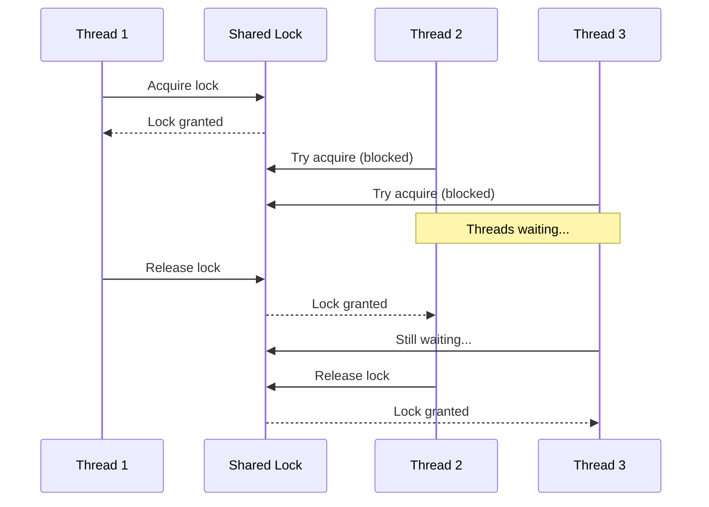
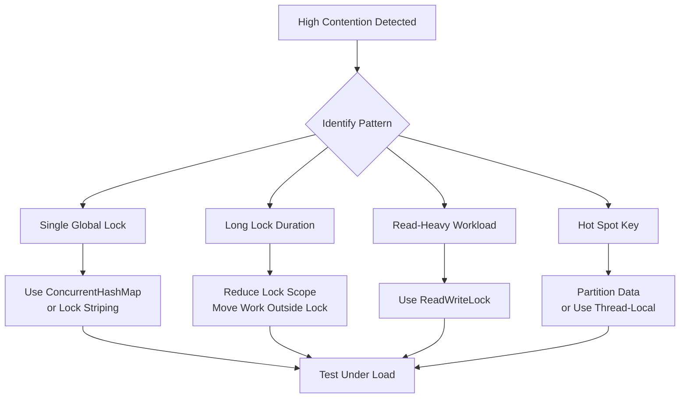

# How to Fix 'Thread Contention' Issues

Author: [nawazdhandala](https://www.github.com/nawazdhandala)

Tags: Concurrency, Threading, Performance, Java, Go, Python, Backend, Debugging

Description: Learn how to identify and fix thread contention issues that cause performance degradation in multi-threaded applications.

---

Thread contention occurs when multiple threads compete for the same shared resource, forcing some threads to wait while others hold locks. This waiting time adds up quickly under load, turning your multi-threaded application into what effectively becomes a single-threaded bottleneck. This guide covers how to identify contention issues, common patterns that cause them, and practical fixes for different languages.

## Understanding Thread Contention

When threads compete for a lock, only one can proceed while others wait. The more threads waiting, the worse the performance.



## Identifying Contention Issues

### Signs of Thread Contention

- **High CPU usage but low throughput** - Threads are busy acquiring locks, not doing work
- **Response time increases with load** - Linear degradation as threads pile up
- **Thread dumps show waiting threads** - Many threads blocked on the same lock
- **Lock wait time metrics are high** - If you are measuring lock acquisition time

### Java Thread Dump Analysis

```bash
# Get thread dump from running Java process
jstack <pid> > threaddump.txt

# Or trigger from within the JVM
kill -3 <pid>
```

Look for patterns like this in the dump:

```
"http-thread-42" BLOCKED
  waiting to lock <0x00000007aaf85e90> (a java.util.HashMap)
  at com.example.CacheService.get(CacheService.java:45)
  - blocked by "http-thread-17"

"http-thread-17" RUNNABLE
  at com.example.CacheService.put(CacheService.java:52)
  - locked <0x00000007aaf85e90>
```

Multiple threads blocked on the same object indicates contention.

### Go Mutex Profiling

```go
import (
    "net/http"
    _ "net/http/pprof"
    "runtime"
)

func main() {
    // Enable mutex profiling
    runtime.SetMutexProfileFraction(1)

    // Enable block profiling
    runtime.SetBlockProfileRate(1)

    // Start pprof server
    go func() {
        http.ListenAndServe("localhost:6060", nil)
    }()

    // Your application code...
}
```

Then analyze with:

```bash
# View mutex contention
go tool pprof http://localhost:6060/debug/pprof/mutex

# View blocking profile
go tool pprof http://localhost:6060/debug/pprof/block
```

## Common Contention Patterns and Fixes

### 1. Global Lock Anti-Pattern

The most common mistake is using a single lock for all operations.

**Java - Before (Single Lock):**

```java
public class UserCache {
    private final Map<String, User> cache = new HashMap<>();

    // BAD: Single lock for entire cache
    public synchronized User get(String userId) {
        return cache.get(userId);
    }

    public synchronized void put(String userId, User user) {
        cache.put(userId, user);
    }
}
```

**Java - After (Concurrent Data Structure):**

```java
import java.util.concurrent.ConcurrentHashMap;

public class UserCache {
    // GOOD: ConcurrentHashMap uses fine-grained locking
    private final ConcurrentHashMap<String, User> cache = new ConcurrentHashMap<>();

    public User get(String userId) {
        return cache.get(userId);  // No explicit locking needed
    }

    public void put(String userId, User user) {
        cache.put(userId, user);  // Lock-free for different keys
    }

    // For atomic compute operations
    public User getOrCompute(String userId) {
        return cache.computeIfAbsent(userId, this::loadFromDatabase);
    }
}
```

### 2. Lock Striping

When you need more control than ConcurrentHashMap provides, use lock striping to reduce contention.

```java
public class StripedCache<K, V> {
    private static final int STRIPE_COUNT = 16;
    private final Object[] locks = new Object[STRIPE_COUNT];
    private final Map<K, V>[] maps;

    @SuppressWarnings("unchecked")
    public StripedCache() {
        maps = new HashMap[STRIPE_COUNT];
        for (int i = 0; i < STRIPE_COUNT; i++) {
            locks[i] = new Object();
            maps[i] = new HashMap<>();
        }
    }

    private int stripeIndex(K key) {
        // Spread keys across stripes
        return Math.abs(key.hashCode() % STRIPE_COUNT);
    }

    public V get(K key) {
        int stripe = stripeIndex(key);
        synchronized (locks[stripe]) {  // Only lock one stripe
            return maps[stripe].get(key);
        }
    }

    public void put(K key, V value) {
        int stripe = stripeIndex(key);
        synchronized (locks[stripe]) {  // Different keys may use different locks
            maps[stripe].put(key, value);
        }
    }
}
```

### 3. Read-Write Lock Pattern

When reads vastly outnumber writes, use a read-write lock.

**Go Example:**

```go
package main

import (
    "sync"
)

type Cache struct {
    mu    sync.RWMutex  // Read-write mutex
    items map[string]interface{}
}

func NewCache() *Cache {
    return &Cache{
        items: make(map[string]interface{}),
    }
}

// Multiple readers can proceed concurrently
func (c *Cache) Get(key string) (interface{}, bool) {
    c.mu.RLock()  // Read lock - doesn't block other readers
    defer c.mu.RUnlock()

    val, ok := c.items[key]
    return val, ok
}

// Writers get exclusive access
func (c *Cache) Set(key string, value interface{}) {
    c.mu.Lock()  // Write lock - blocks all other access
    defer c.mu.Unlock()

    c.items[key] = value
}

// Batch read with single lock acquisition
func (c *Cache) GetMany(keys []string) map[string]interface{} {
    c.mu.RLock()
    defer c.mu.RUnlock()

    result := make(map[string]interface{})
    for _, key := range keys {
        if val, ok := c.items[key]; ok {
            result[key] = val
        }
    }
    return result
}
```

### 4. Lock-Free Data Structures

For maximum throughput, use atomic operations instead of locks.

**Java AtomicReference:**

```java
import java.util.concurrent.atomic.AtomicReference;

public class LockFreeStack<T> {
    private final AtomicReference<Node<T>> top = new AtomicReference<>();

    private static class Node<T> {
        final T value;
        final Node<T> next;

        Node(T value, Node<T> next) {
            this.value = value;
            this.next = next;
        }
    }

    public void push(T value) {
        Node<T> newNode = new Node<>(value, null);
        Node<T> current;
        do {
            current = top.get();
            newNode = new Node<>(value, current);
        } while (!top.compareAndSet(current, newNode));  // Atomic CAS
    }

    public T pop() {
        Node<T> current;
        Node<T> next;
        do {
            current = top.get();
            if (current == null) return null;
            next = current.next;
        } while (!top.compareAndSet(current, next));
        return current.value;
    }
}
```

**Go Atomic Operations:**

```go
package main

import (
    "sync/atomic"
)

type Counter struct {
    value int64
}

// Lock-free increment
func (c *Counter) Increment() int64 {
    return atomic.AddInt64(&c.value, 1)
}

// Lock-free read
func (c *Counter) Get() int64 {
    return atomic.LoadInt64(&c.value)
}

// Compare and swap for conditional updates
func (c *Counter) CompareAndSwap(expected, new int64) bool {
    return atomic.CompareAndSwapInt64(&c.value, expected, new)
}
```

### 5. Reducing Lock Scope

Hold locks for the minimum time necessary.

**Python - Before (Lock Held Too Long):**

```python
import threading

class DataProcessor:
    def __init__(self):
        self.lock = threading.Lock()
        self.results = {}

    def process(self, data_id, data):
        with self.lock:  # BAD: Lock held during expensive operation
            result = self.expensive_computation(data)  # Slow!
            self.results[data_id] = result
        return result
```

**Python - After (Minimal Lock Scope):**

```python
import threading

class DataProcessor:
    def __init__(self):
        self.lock = threading.Lock()
        self.results = {}

    def process(self, data_id, data):
        # Do expensive work OUTSIDE the lock
        result = self.expensive_computation(data)

        # Only lock for the brief dictionary update
        with self.lock:
            self.results[data_id] = result

        return result
```

### 6. Thread-Local Storage

Eliminate contention entirely by giving each thread its own copy.

**Java ThreadLocal:**

```java
public class DateFormatter {
    // BAD: SimpleDateFormat is not thread-safe, single lock
    // private static final SimpleDateFormat formatter = new SimpleDateFormat("yyyy-MM-dd");
    // private static final Object lock = new Object();

    // GOOD: Each thread gets its own formatter
    private static final ThreadLocal<SimpleDateFormat> formatter =
        ThreadLocal.withInitial(() -> new SimpleDateFormat("yyyy-MM-dd"));

    public String format(Date date) {
        return formatter.get().format(date);  // No lock needed
    }
}
```

**Go Context Pattern:**

```go
package main

import (
    "context"
)

type contextKey string

const requestIDKey contextKey = "requestID"

// Pass request-specific data through context instead of shared state
func HandleRequest(ctx context.Context, data []byte) {
    requestID := ctx.Value(requestIDKey).(string)

    // Each request has its own context, no contention
    processWithID(requestID, data)
}
```

## Contention Visualization



## Measuring Improvement

Track these metrics before and after fixes:

```java
import java.util.concurrent.atomic.LongAdder;

public class LockMetrics {
    private final LongAdder lockAcquisitions = new LongAdder();
    private final LongAdder totalWaitTimeNanos = new LongAdder();

    public void recordLockAcquisition(long waitTimeNanos) {
        lockAcquisitions.increment();
        totalWaitTimeNanos.add(waitTimeNanos);
    }

    public double getAverageWaitTimeMs() {
        long acquisitions = lockAcquisitions.sum();
        if (acquisitions == 0) return 0;
        return (totalWaitTimeNanos.sum() / acquisitions) / 1_000_000.0;
    }

    public long getTotalAcquisitions() {
        return lockAcquisitions.sum();
    }
}
```

## Summary

Thread contention fixes follow a hierarchy of approaches:

1. **Eliminate sharing** - Use thread-local storage or message passing
2. **Use concurrent data structures** - ConcurrentHashMap, ConcurrentLinkedQueue
3. **Apply lock striping** - Divide data across multiple locks
4. **Use read-write locks** - When reads dominate writes
5. **Reduce lock scope** - Hold locks for the minimum time
6. **Consider lock-free algorithms** - Atomic operations for hot paths

The best fix depends on your access patterns. Profile first to identify the actual bottleneck, then apply the appropriate technique. Even small improvements in lock contention can yield dramatic throughput gains under high load.
