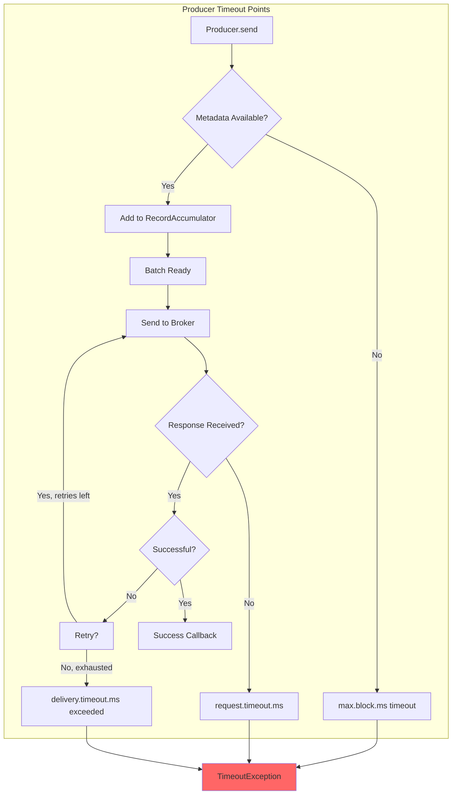
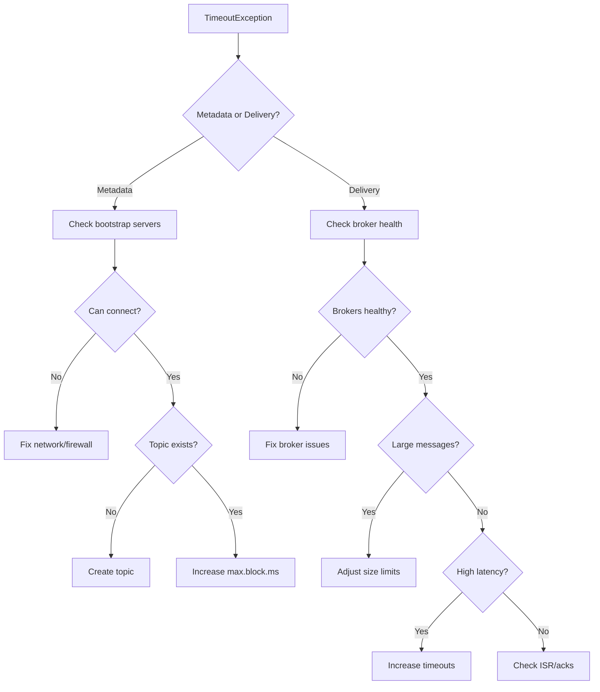

# How to Fix "TimeoutException" in Kafka Producer

Author: [nawazdhandala](https://www.github.com/nawazdhandala)

Tags: Kafka, Apache Kafka, Troubleshooting, Producer, Timeout, Java, Performance, Networking

Description: A practical guide to diagnosing and fixing TimeoutException errors in Apache Kafka producers, including configuration tuning, network troubleshooting, and best practices for reliable message delivery.

---

> The `TimeoutException` is one of the most frustrating errors when working with Apache Kafka producers. It can occur during metadata fetches, message sends, or transaction commits, and the root cause is not always obvious. This guide will help you systematically diagnose and fix timeout issues in your Kafka producer applications.

Understanding the different types of timeouts and their causes is essential for building reliable Kafka-based applications that handle failures gracefully.

---

## Understanding Kafka Producer Timeouts



### Types of Timeout Exceptions

| Timeout Type | Configuration | Default | Triggers When |
|-------------|---------------|---------|---------------|
| Metadata fetch | `max.block.ms` | 60000ms | Cannot fetch topic metadata |
| Request | `request.timeout.ms` | 30000ms | Broker does not respond in time |
| Delivery | `delivery.timeout.ms` | 120000ms | Total time for send including retries |

---

## Production-Ready Configuration

```java
import org.apache.kafka.clients.producer.KafkaProducer;
import org.apache.kafka.clients.producer.ProducerConfig;
import org.apache.kafka.common.serialization.StringSerializer;

import java.util.Properties;

public class RobustKafkaProducerConfig {

    public static Properties createConfig() {
        Properties props = new Properties();

        // Connection settings
        props.put(ProducerConfig.BOOTSTRAP_SERVERS_CONFIG,
                  "kafka1:9092,kafka2:9092,kafka3:9092");
        props.put(ProducerConfig.CLIENT_ID_CONFIG, "robust-producer");

        // Serialization
        props.put(ProducerConfig.KEY_SERIALIZER_CLASS_CONFIG,
                  StringSerializer.class.getName());
        props.put(ProducerConfig.VALUE_SERIALIZER_CLASS_CONFIG,
                  StringSerializer.class.getName());

        // TIMEOUT CONFIGURATION
        // 1. Metadata timeout - how long to wait for initial metadata
        props.put(ProducerConfig.MAX_BLOCK_MS_CONFIG, 120000); // 2 minutes

        // 2. Request timeout - how long to wait for broker response
        props.put(ProducerConfig.REQUEST_TIMEOUT_MS_CONFIG, 60000); // 1 minute

        // 3. Delivery timeout - total time including retries
        props.put(ProducerConfig.DELIVERY_TIMEOUT_MS_CONFIG, 300000); // 5 minutes

        // RETRY CONFIGURATION
        props.put(ProducerConfig.RETRIES_CONFIG, 10);
        props.put(ProducerConfig.RETRY_BACKOFF_MS_CONFIG, 500);

        // Enable idempotent producer for safe retries
        props.put(ProducerConfig.ENABLE_IDEMPOTENCE_CONFIG, true);

        // BATCHING CONFIGURATION
        props.put(ProducerConfig.LINGER_MS_CONFIG, 10);
        props.put(ProducerConfig.BATCH_SIZE_CONFIG, 64 * 1024); // 64KB

        // RELIABILITY CONFIGURATION
        props.put(ProducerConfig.ACKS_CONFIG, "all");
        props.put(ProducerConfig.COMPRESSION_TYPE_CONFIG, "lz4");

        return props;
    }
}
```

---

## Troubleshooting Checklist



---

## Best Practices Summary

1. **Always specify multiple bootstrap servers** for redundancy
2. **Set delivery.timeout.ms appropriately** based on your latency requirements
3. **Enable idempotent producer** to safely retry without duplicates
4. **Monitor producer metrics** for early warning signs
5. **Implement circuit breaker pattern** for graceful degradation
6. **Use async sends with callbacks** for better throughput
7. **Pre-fetch metadata** during application startup

---

## Conclusion

TimeoutException in Kafka producers can stem from various causes including network issues, broker overload, and misconfiguration. The key to fixing these issues is systematic diagnosis starting with identifying the timeout type, followed by targeted configuration changes.

---

*Need to monitor your Kafka producers for timeout issues? [OneUptime](https://oneuptime.com) provides comprehensive monitoring for Apache Kafka, including producer latency metrics, error rate tracking, and automated alerting.*
